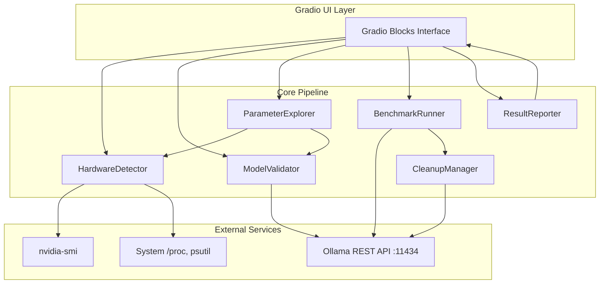
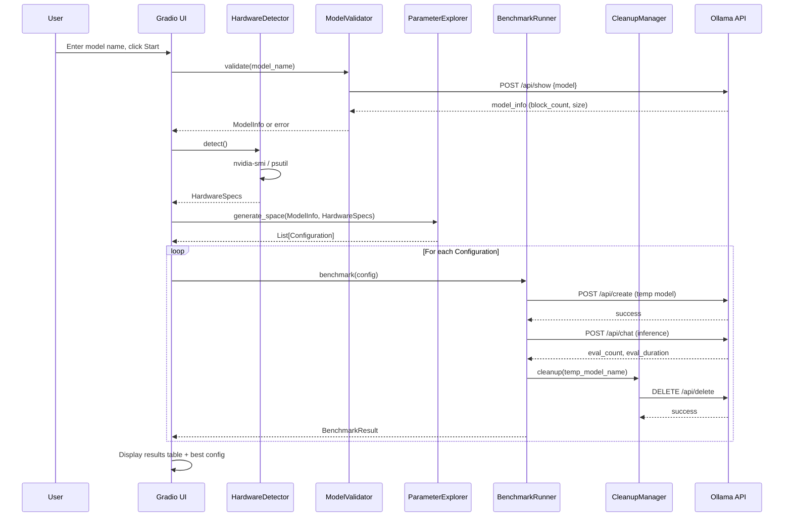

# Design Document: Ollama Model Optimizer

## Overview

The Ollama Model Optimizer is a single-file Python application that uses Gradio for its UI and interacts with the local Ollama service via its REST API (`http://localhost:11434`). The application orchestrates a benchmarking pipeline: detect hardware → validate model → compute parameter space → iterate configurations (create variant, benchmark, cleanup) → report results.

Key design decisions:
- **Single-process, sequential benchmarking**: Configurations are tested one at a time to avoid GPU contention and ensure accurate measurements.
- **Ollama REST API over CLI**: Use the HTTP API (`/api/show`, `/api/chat`, `/api/tags`, `/api/create`, `/api/delete`) for structured JSON responses rather than parsing CLI text output.
- **Subprocess for hardware detection**: Use `nvidia-smi` via subprocess for GPU/VRAM detection (no heavy dependencies like PyTorch), and `psutil` for RAM/CPU.
- **Gradio Blocks with custom CSS**: Dark theme with green text achieved via `gr.themes.Base()` customization and CSS overrides.

## Architecture



### Data Flow



## Components and Interfaces

### 1. HardwareDetector

Responsible for detecting local hardware capabilities.

```python
@dataclass
class HardwareSpecs:
    gpu_present: bool
    gpu_name: str | None
    vram_mb: int          # 0 if no GPU
    ram_mb: int
    cpu_model: str
    cpu_cores: int

class HardwareDetector:
    def detect(self) -> HardwareSpecs:
        """Detect hardware specs. Falls back to conservative defaults on failure."""
        ...
```

**Implementation approach:**
- GPU detection: Parse `nvidia-smi --query-gpu=name,memory.total --format=csv,noheader,nounits` via subprocess. If the command fails, assume no GPU.
- RAM: Use `psutil.virtual_memory().total`.
- CPU: Use `platform.processor()` and `os.cpu_count()`.

### 2. ModelValidator

Validates the target model exists and extracts metadata needed for parameter space calculation.

```python
@dataclass
class ModelInfo:
    name: str
    block_count: int       # Number of layers (from model_info)
    size_bytes: int        # Model file size
    parameter_size: str    # e.g., "7B", "13B"
    quantization: str      # e.g., "Q4_K_M"
    family: str            # e.g., "llama", "gemma3"

class ModelValidator:
    def __init__(self, ollama_base_url: str = "http://localhost:11434"):
        ...

    def validate(self, model_name: str) -> ModelInfo:
        """
        Validate model exists and return metadata.
        Raises ModelNotFoundError if model doesn't exist.
        For GGUF file paths, checks file existence.
        """
        ...

    def _validate_ollama_model(self, model_name: str) -> ModelInfo:
        """Query POST /api/show to get model details."""
        ...

    def _validate_gguf_file(self, file_path: str) -> ModelInfo:
        """Check file exists and is readable."""
        ...
```

**Implementation approach:**
- For named models: `POST /api/show {"name": model_name}` returns `model_info` with `block_count`, `parameter_size`, etc.
- For GGUF paths: Check `os.path.isfile()` and readability. Block count may need to be estimated or queried after `ollama create`.

### 3. ParameterExplorer

Generates the parameter space constrained by hardware.

```python
@dataclass
class Configuration:
    num_gpu: int
    num_ctx: int

class ParameterExplorer:
    # Context length test values (powers of 2 starting from minimum)
    MIN_CONTEXT: int = 2048
    CONTEXT_STEPS: list[int] = [2048, 4096, 8192, 16384, 32768]

    def generate_space(
        self, model_info: ModelInfo, hardware: HardwareSpecs
    ) -> list[Configuration]:
        """
        Generate configurations that fit within hardware constraints.
        """
        ...

    def _max_num_gpu(self, model_info: ModelInfo, hardware: HardwareSpecs) -> int:
        """
        Calculate max feasible num_gpu layers based on VRAM.
        Heuristic: each layer ≈ model_size_bytes / block_count.
        Reserve ~500MB VRAM for context and overhead.
        """
        ...

    def _max_context_length(self, hardware: HardwareSpecs, num_gpu: int) -> int:
        """
        Calculate max context length given remaining VRAM after layer offload.
        """
        ...

    def _generate_num_gpu_steps(self, max_gpu: int) -> list[int]:
        """
        Generate num_gpu test values: 0, 25%, 50%, 75%, 100% of max.
        Always includes 0 (CPU-only) and max.
        """
        ...
```

**Design rationale:**
- VRAM estimation uses a simple heuristic: `layer_size ≈ model_size / block_count`. This is approximate but sufficient for bounding the search space.
- Context length values use powers of 2 (standard for LLMs) capped by available memory.
- The num_gpu range is sampled at intervals rather than testing every value, keeping benchmark time reasonable.

### 4. BenchmarkRunner

Creates temporary model variants and measures throughput.

```python
@dataclass
class BenchmarkResult:
    config: Configuration
    tokens_per_second: float
    success: bool
    error_message: str | None

class BenchmarkRunner:
    TEMP_MODEL_PREFIX: str = "optim-temp-"
    BENCHMARK_PROMPT: str = "Write a detailed explanation of how computers work."

    def __init__(self, ollama_base_url: str = "http://localhost:11434"):
        ...

    def benchmark(
        self, model_name: str, config: Configuration, run_id: str
    ) -> BenchmarkResult:
        """
        Create temp variant, run inference, measure tokens/sec, cleanup.
        """
        ...

    def _generate_modelfile(
        self, base_model: str, config: Configuration
    ) -> str:
        """
        Generate Modelfile content:
        FROM {base_model}
        PARAMETER num_gpu {config.num_gpu}
        PARAMETER num_ctx {config.num_ctx}
        """
        ...

    def _create_model(self, temp_name: str, modelfile: str) -> bool:
        """POST /api/create with modelfile content."""
        ...

    def _run_inference(self, model_name: str) -> tuple[int, int]:
        """
        POST /api/chat with benchmark prompt.
        Returns (eval_count, eval_duration_ns).
        """
        ...

    def _calculate_tokens_per_second(
        self, eval_count: int, eval_duration_ns: int
    ) -> float:
        """tokens_per_second = eval_count / (eval_duration_ns / 1e9)"""
        ...
```

**Design rationale:**
- Temporary model names use a prefix + UUID to avoid collisions.
- The benchmark prompt is fixed across all runs for fair comparison.
- Tokens/second is calculated from `eval_count / (eval_duration / 1e9)` — these fields are returned directly by the Ollama API in nanoseconds.

### 5. CleanupManager

Ensures temporary models are removed.

```python
class CleanupManager:
    def __init__(self, ollama_base_url: str = "http://localhost:11434"):
        self._active_temps: list[str] = []

    def register(self, temp_model_name: str) -> None:
        """Track a temporary model for cleanup."""
        ...

    def cleanup(self, temp_model_name: str) -> bool:
        """DELETE /api/delete. Returns True if successful."""
        ...

    def cleanup_all(self) -> list[str]:
        """Attempt to delete all registered temp models. Returns list of failures."""
        ...
```

**Design rationale:**
- Maintains a registry of active temp models so interrupted runs can still clean up.
- Called after each benchmark iteration (not batched at end) to satisfy the "at most one temp model" constraint.

### 6. ResultReporter

Formats and presents results.

```python
@dataclass
class OptimizationReport:
    best_config: Configuration
    best_tokens_per_second: float
    all_results: list[BenchmarkResult]
    modelfile_content: str

class ResultReporter:
    def generate_report(
        self, results: list[BenchmarkResult], model_name: str
    ) -> OptimizationReport:
        """Identify best config and generate report."""
        ...

    def format_modelfile(self, model_name: str, config: Configuration) -> str:
        """Generate the Modelfile content for the optimal configuration."""
        ...

    def format_results_table(
        self, results: list[BenchmarkResult]
    ) -> list[list[str]]:
        """Format results as rows for Gradio Dataframe display."""
        ...
```

### 7. Gradio UI (app.py)

```python
def create_ui() -> gr.Blocks:
    """
    Build the Gradio Blocks interface with:
    - Dark theme + green text CSS
    - Model input field
    - Start button
    - Hardware specs display
    - Progress log (streaming updates)
    - Results table
    - Optimal config display with Modelfile
    """
    ...
```

**Theming approach:**
- Use `gr.themes.Base()` with dark color overrides for `background_fill_primary`, `body_background_fill`, etc.
- Apply custom CSS for green text: `body { color: #00ff88; }` and component-specific selectors.

## Data Models

### Core Data Structures

```python
from dataclasses import dataclass, field
from enum import Enum

class BenchmarkStatus(Enum):
    PENDING = "pending"
    RUNNING = "running"
    SUCCESS = "success"
    FAILED = "failed"
    SKIPPED = "skipped"

@dataclass
class HardwareSpecs:
    gpu_present: bool
    gpu_name: str | None = None
    vram_mb: int = 0
    ram_mb: int = 0
    cpu_model: str = "Unknown"
    cpu_cores: int = 1

@dataclass
class ModelInfo:
    name: str
    block_count: int
    size_bytes: int
    parameter_size: str
    quantization: str
    family: str

@dataclass
class Configuration:
    num_gpu: int
    num_ctx: int

@dataclass
class BenchmarkResult:
    config: Configuration
    tokens_per_second: float = 0.0
    status: BenchmarkStatus = BenchmarkStatus.PENDING
    error_message: str | None = None

@dataclass
class OptimizationReport:
    model_name: str
    hardware: HardwareSpecs
    best_config: Configuration
    best_tokens_per_second: float
    all_results: list[BenchmarkResult] = field(default_factory=list)
    modelfile_content: str = ""
```

### Ollama API Interactions

| Endpoint | Method | Purpose |
|----------|--------|---------|
| `/api/tags` | GET | List local models for validation |
| `/api/show` | POST | Get model metadata (block_count, size) |
| `/api/create` | POST | Create temporary model variant from Modelfile |
| `/api/chat` | POST | Run inference benchmark (returns eval_count, eval_duration) |
| `/api/delete` | DELETE | Remove temporary model variant |

### Modelfile Template

```
FROM {base_model}
PARAMETER num_gpu {num_gpu}
PARAMETER num_ctx {num_ctx}
```


## Correctness Properties

*A property is a characteristic or behavior that should hold true across all valid executions of a system — essentially, a formal statement about what the system should do. Properties serve as the bridge between human-readable specifications and machine-verifiable correctness guarantees.*

### Property 1: Hardware detection failure returns conservative defaults

*For any* component failure during hardware detection (GPU, RAM, or CPU), the returned `HardwareSpecs` SHALL contain conservative default values: `gpu_present=False`, `vram_mb=0`, `ram_mb=4096`, `cpu_cores=1`.

**Validates: Requirements 2.6**

### Property 2: VRAM parsing correctness

*For any* valid nvidia-smi CSV output string containing a GPU name and memory value in MiB, the parser SHALL extract the correct integer VRAM value in megabytes.

**Validates: Requirements 2.2**

### Property 3: No-GPU parameter constraint

*For any* `HardwareSpecs` where `gpu_present` is `False`, all `Configuration` objects generated by the `ParameterExplorer` SHALL have `num_gpu` equal to 0.

**Validates: Requirements 3.1**

### Property 4: Hardware-constrained parameter space validity

*For any* valid `ModelInfo` and `HardwareSpecs`, every `Configuration` generated by `ParameterExplorer` SHALL satisfy: (a) `num_gpu` is between 0 and `model_info.block_count` inclusive, (b) `num_ctx` is at least 2048, and (c) the estimated memory usage for the configuration does not exceed available hardware resources (VRAM for GPU layers + context, RAM for remaining layers).

**Validates: Requirements 3.2, 3.3, 3.4, 3.5**

### Property 5: Modelfile generation correctness

*For any* valid model name and `Configuration`, the generated Modelfile string SHALL contain a `FROM {model_name}` line, a `PARAMETER num_gpu {config.num_gpu}` line, and a `PARAMETER num_ctx {config.num_ctx}` line, and parsing these lines back SHALL recover the original configuration values.

**Validates: Requirements 4.1, 6.4**

### Property 6: Tokens per second calculation

*For any* positive `eval_count` and positive `eval_duration_ns`, the calculated `tokens_per_second` SHALL equal `eval_count / (eval_duration_ns / 1_000_000_000)` and SHALL be a positive finite number.

**Validates: Requirements 4.3**

### Property 7: Failed inference records zero throughput

*For any* configuration where inference fails (raises an exception or returns an error), the recorded `BenchmarkResult` SHALL have `tokens_per_second` equal to 0.0 and `status` equal to `FAILED`.

**Validates: Requirements 4.6**

### Property 8: Optimal configuration identification

*For any* non-empty list of `BenchmarkResult` objects with at least one successful result, the `ResultReporter` SHALL identify the configuration with the strictly highest `tokens_per_second` value as the best, and the generated report SHALL contain every tested configuration in the results table.

**Validates: Requirements 6.1, 6.3**

## Error Handling

### Error Categories and Responses

| Error | Component | Response |
|-------|-----------|----------|
| Ollama not running | ModelValidator | Display error: "Cannot connect to Ollama. Ensure it's running on localhost:11434" |
| Model not found | ModelValidator | Display error: "Model '{name}' not found. Run `ollama pull {name}` first" |
| GGUF file not found | ModelValidator | Display error: "File not found: {path}" |
| nvidia-smi not available | HardwareDetector | Assume no GPU, continue with CPU-only configs |
| psutil not installed | HardwareDetector | Fall back to `/proc/meminfo` parsing on Linux, or report default 4GB |
| `ollama create` fails | BenchmarkRunner | Log warning, skip configuration, continue to next |
| Inference timeout | BenchmarkRunner | Record 0 tokens/sec, log timeout, continue to next |
| Inference OOM | BenchmarkRunner | Record 0 tokens/sec, log OOM, continue to next |
| `ollama rm` fails | CleanupManager | Log warning, add to retry list, continue |
| Process interrupted (SIGINT) | CleanupManager | Trigger `cleanup_all()` via signal handler before exit |
| All configurations fail | ResultReporter | Display message: "No successful benchmarks. Try a smaller model or check hardware." |

### Signal Handling

```python
import signal
import atexit

def setup_cleanup_handlers(cleanup_manager: CleanupManager):
    """Register cleanup on exit and interrupt."""
    def handler(signum, frame):
        cleanup_manager.cleanup_all()
        sys.exit(1)

    signal.signal(signal.SIGINT, handler)
    signal.signal(signal.SIGTERM, handler)
    atexit.register(cleanup_manager.cleanup_all)
```

### HTTP Request Resilience

All Ollama API calls use:
- Connection timeout: 10 seconds
- Read timeout: 300 seconds (inference can be slow for large contexts)
- Single retry on connection errors
- Structured error responses parsed from JSON

## Testing Strategy

### Property-Based Testing

**Library:** [Hypothesis](https://hypothesis.readthedocs.io/) (Python's standard PBT library)

**Configuration:** Minimum 100 examples per property test.

**Tag format:** `# Feature: ollama-model-optimizer, Property {N}: {title}`

Property-based tests will cover:
- `ParameterExplorer.generate_space()` — Properties 3, 4
- `HardwareDetector.detect()` with mocked subprocess — Properties 1, 2
- `BenchmarkRunner._generate_modelfile()` — Property 5
- `BenchmarkRunner._calculate_tokens_per_second()` — Property 6
- `BenchmarkRunner.benchmark()` with mocked API — Property 7
- `ResultReporter.generate_report()` — Property 8

### Unit Tests (Example-Based)

- Model validation with mocked API responses (found, not found, GGUF path)
- UI component existence checks
- Error message formatting
- Edge cases: empty results list, single configuration, all configs fail

### Integration Tests

- End-to-end benchmark with a small model (manual/CI with Ollama available)
- Cleanup verification after interruption
- API error handling with mocked HTTP responses

### Test Structure

```
tests/
├── test_hardware_detector.py    # Properties 1, 2 + integration mocks
├── test_parameter_explorer.py   # Properties 3, 4
├── test_benchmark_runner.py     # Properties 5, 6, 7
├── test_result_reporter.py      # Property 8
├── test_model_validator.py      # Example-based + integration
└── test_cleanup_manager.py      # Example-based + integration
```

### Dependencies

```
# requirements.txt
gradio>=4.0
psutil>=5.9
requests>=2.28
hypothesis>=6.0  # dev dependency for testing
pytest>=7.0      # dev dependency
```
