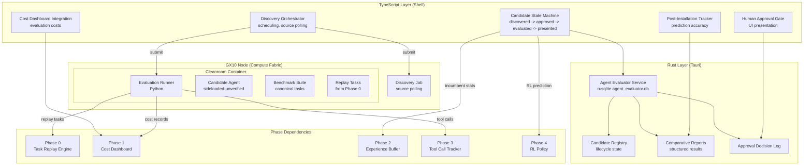

# Design Document: Agent Evaluator (NA2)

## Overview

The Agent Evaluator (NA2) is Phase 5 of the ResonantOS vNext improvement plan — a background compute agent that discovers, sandboxes, benchmarks, and presents candidate agent add-ons for human approval. It operates entirely as background ComputeJobs on the GX10 node, never consuming context window tokens or degrading interactive responsiveness.

The system is split across three layers:

- **TypeScript orchestration layer** (`src/core/agent-evaluator.ts`): Manages discovery scheduling, candidate state machine, human approval gate presentation, and post-installation tracking. Communicates with the Rust layer via IPC and submits ComputeJobs to the Compute Fabric.
- **Rust persistence layer** (`src-tauri/src/agent_evaluator_service.rs`): Owns the evaluation database (`agent_evaluator.db`), candidate lifecycle state, comparative reports, and approval decisions. Exposes IPC commands for the TypeScript layer.
- **Python evaluation runner** (`training/agent_evaluator/`): Runs inside cleanroom containers on the GX10 node. Executes benchmark suites against candidate agents, captures metrics, produces Logician_Execution_Artifacts, and feeds tool calls to the Phase 3 Tool Call Tracker.

The system enforces a strict **human-in-the-loop** requirement — no candidate agent is ever installed without explicit user approval. All candidates start as "sideloaded-unverified" provenance tier regardless of claims.

### Key Design Decisions

1. **TypeScript orchestration, Rust persistence, Python execution**: The orchestration logic (scheduling, state machine, UI presentation) lives in TypeScript where it integrates with the existing shell UI. Persistence uses the established rusqlite pattern. Benchmark execution runs in Python for compatibility with the agent SDK and ML evaluation tooling.

2. **Cleanroom container isolation**: Candidate agents run in containers with `ComputeNetworkMode: "none"`, no access to secrets, archives, or credentials. This matches the Compute Fabric's existing cleanroom-container-job infrastructure.

3. **Task Replay Engine integration for fair comparison**: Rather than synthetic benchmarks alone, the system replays real historical tasks from Phase 0 against both candidate and incumbent agents under identical conditions.

4. **Phase 4 RL Policy for production prediction**: The Unified RL Policy provides a forward-looking estimate of how a candidate would perform in the production routing mix, adding predictive value beyond raw benchmark scores.

5. **Circuit breaker for discovery polling**: Matches the Phase 2/3 pattern. After 5 consecutive source fetch failures, discovery is disabled for a cooldown period (default 1 hour).

6. **Trust tier progression for NA2 itself**: NA2 starts at "addon" trust (requires human confirmation for all actions). After 30 days of accurate predictions, it earns "trusted" status (can auto-configure discovery sources, but installation approval always required).

7. **Stratified task sampling**: Replay tasks are selected using stratified sampling across task types, difficulty levels, and recency to ensure representative coverage without requiring exhaustive replay.

8. **Structured verdict classification**: The three-tier verdict system (promising/comparable/inferior) provides a clear signal without requiring users to interpret raw metrics.

## Architecture




## Components and Interfaces

### 1. TypeScript Orchestration Layer (`agent-evaluator.ts`)

```typescript
// src/core/agent-evaluator.ts

import { invoke } from "@tauri-apps/api/core";

// --- Discovery Types ---

export interface DiscoverySource {
  id: string;
  type: "github-trending" | "community-registry" | "rss-feed" | "manual-suggestion";
  url: string;
  enabled: boolean;
  pollingFrequencyHours: number;    // default: 24
  lastPolledAt: string | null;
  categoryFilters: string[];
}

export interface DiscoveryCandidate {
  id: string;
  name: string;
  sourceUrl: string;
  sourceType: DiscoverySource["type"];
  discoveryScore: number;           // 0.0-1.0
  scoreBreakdown: DiscoveryScoreBreakdown;
  category: string;
  manifestCapabilities: string[];
  estimatedEvalCost: EvalCostEstimate;
  status: CandidateStatus;
  discoveredAt: string;
  version: string;
  manifestId: string;
}

export interface DiscoveryScoreBreakdown {
  communityActivity: number;        // 0.0-1.0 (stars, forks, recent commits)
  documentationQuality: number;     // 0.0-1.0 (README, API docs, examples)
  manifestCompatibility: number;    // 0.0-1.0 (SDK V0 schema validation)
}

export type CandidateStatus =
  | "discovered"
  | "pending-review"
  | "approved-for-testing"
  | "testing-in-progress"
  | "evaluation-complete"
  | "presented-for-approval"
  | "approved-for-install"
  | "rejected"
  | "deferred"
  | "installed";

export interface EvalCostEstimate {
  computeTimeMinutes: number;
  estimatedTokens: number;
  estimatedCostUsd: number;
}

// --- Benchmark Types ---

export interface BenchmarkSuite {
  id: string;
  name: string;
  category: string;
  tasks: BenchmarkTask[];
  createdAt: string;
  updatedAt: string;
}

export interface BenchmarkTask {
  id: string;
  description: string;
  category: string;
  difficulty: "easy" | "medium" | "hard";
  expectedArtifacts: string[];
  timeoutSeconds: number;
}

export interface BenchmarkRun {
  id: string;
  candidateId: string;
  suiteId: string;
  status: "running" | "completed" | "failed" | "timed-out";
  startedAt: string;
  completedAt: string | null;
  taskResults: BenchmarkTaskResult[];
}

export interface BenchmarkTaskResult {
  taskId: string;
  logicianScore: number;            // 0.0-1.0
  durationMs: number;
  promptTokens: number;
  completionTokens: number;
  toolCalls: number;
  efficiencyRatio: number;          // from Phase 3
  status: "passed" | "failed" | "timed-out";
}

// --- Comparative Report Types ---

export interface ComparativeReport {
  id: string;
  candidateId: string;
  candidateName: string;
  incumbentAgentIds: string[];
  evaluationTimestamp: string;
  replayTaskSetIds: string[];
  sandboxConfig: SandboxConfig;
  perTaskDeltas: TaskDelta[];
  aggregateScores: AggregateScores;
  candidateVerdict: CandidateVerdict;
  productionPrediction: ProductionPrediction | null;
  securityAssessment: SecurityAssessment;
}

export interface TaskDelta {
  taskId: string;
  qualityDelta: number;             // candidate - incumbent logician score
  costDelta: number;                // candidate - incumbent tokens (negative = cheaper)
  speedDelta: number;               // candidate - incumbent duration (negative = faster)
  efficiencyDelta: number;          // candidate - incumbent efficiency ratio
}

export interface AggregateScores {
  avgQualityDelta: number;
  avgCostDelta: number;
  avgSpeedDelta: number;
  avgEfficiencyDelta: number;
  betterDimensions: number;         // count of dimensions where candidate is better
  worseDimensions: number;
}

export type CandidateVerdict = "promising" | "comparable" | "inferior";

export interface ProductionPrediction {
  predictedPerformance: number;     // 0.0-1.0
  confidenceScore: number;          // from Phase 4 RL Policy
  available: boolean;
}

export interface SecurityAssessment {
  manifestCapabilities: string[];
  provenanceTier: "sideloaded-unverified";
  resourceRequirements: ResourceRequirements;
  securityViolations: SecurityViolation[];
}

export interface ResourceRequirements {
  cpuCores: number;
  memoryMb: number;
  diskMb: number;
  networkRequired: boolean;
}

export interface SecurityViolation {
  type: "secret-access" | "network-access" | "archive-access" | "memory-access";
  description: string;
  timestamp: string;
}

// --- Sandbox Types ---

export interface SandboxConfig {
  cpuCores: number;                 // default: 2
  memoryCapMb: number;              // default: 4096
  diskQuotaMb: number;              // default: 10240
  maxWallClockSeconds: number;      // default: 3600
  networkMode: "none" | "loopback-only";
}

// --- Approval Types ---

export type ApprovalDecision = "approve" | "reject" | "defer";

export interface ApprovalRecord {
  id: string;
  candidateId: string;
  decision: ApprovalDecision;
  decidedAt: string;
  comparativeReportId: string;
  notes: string | null;
}

// --- Cleanup Types ---

export type CleanupPolicy = "delete-on-success" | "retain-for-review";

export interface CleanupConfig {
  policy: CleanupPolicy;
  retentionDays: number;            // default: 30
  maxConcurrentJobs: number;        // default: 2
}

// --- Core Functions ---

export const discoverCandidates = (source: DiscoverySource): Promise<DiscoveryCandidate[]> =>
  invoke("agent_evaluator_discover", { source });

export const approveCandidateForTesting = (candidateId: string): Promise<void> =>
  invoke("agent_evaluator_approve_testing", { candidateId });

export const rejectCandidate = (candidateId: string): Promise<void> =>
  invoke("agent_evaluator_reject", { candidateId });

export const deferCandidate = (candidateId: string): Promise<void> =>
  invoke("agent_evaluator_defer", { candidateId });

export const submitEvaluationJob = (candidateId: string, sandboxConfig: SandboxConfig): Promise<string> =>
  invoke("agent_evaluator_submit_eval", { candidateId, sandboxConfig });

export const getComparativeReport = (candidateId: string): Promise<ComparativeReport | null> =>
  invoke("agent_evaluator_get_report", { candidateId });

export const submitApprovalDecision = (candidateId: string, decision: ApprovalDecision): Promise<void> =>
  invoke("agent_evaluator_approve_install", { candidateId, decision });

export const getEvaluationHistory = (filters: {
  timeRange?: { from: string; to: string };
  verdict?: CandidateVerdict;
  decision?: ApprovalDecision;
  category?: string;
  limit?: number;
}): Promise<DiscoveryCandidate[]> =>
  invoke("agent_evaluator_query_history", { filters });

export const getPostInstallPerformance = (candidateId: string): Promise<{
  predictedScore: number;
  actualScore: number;
  deviationPercent: number;
  daysTracked: number;
}> => invoke("agent_evaluator_post_install_perf", { candidateId });
```

### 2. Verdict Computation (`agent-evaluator-verdict.ts`)

```typescript
// src/core/agent-evaluator-verdict.ts

import type { TaskDelta, AggregateScores, CandidateVerdict } from "./agent-evaluator";

const COMPARABLE_THRESHOLD = 0.10; // within 10%

export const computeVerdict = (deltas: TaskDelta[]): {
  verdict: CandidateVerdict;
  aggregateScores: AggregateScores;
} => {
  const avgQuality = average(deltas.map(d => d.qualityDelta));
  const avgCost = average(deltas.map(d => d.costDelta));
  const avgSpeed = average(deltas.map(d => d.speedDelta));
  const avgEfficiency = average(deltas.map(d => d.efficiencyDelta));

  // "better" means: higher quality, fewer tokens (negative cost), shorter duration (negative speed), higher efficiency
  let betterCount = 0;
  let worseCount = 0;

  if (avgQuality > COMPARABLE_THRESHOLD) betterCount++;
  else if (avgQuality < -COMPARABLE_THRESHOLD) worseCount++;

  if (avgCost < -COMPARABLE_THRESHOLD) betterCount++;    // negative = cheaper
  else if (avgCost > COMPARABLE_THRESHOLD) worseCount++;

  if (avgSpeed < -COMPARABLE_THRESHOLD) betterCount++;   // negative = faster
  else if (avgSpeed > COMPARABLE_THRESHOLD) worseCount++;

  if (avgEfficiency > COMPARABLE_THRESHOLD) betterCount++;
  else if (avgEfficiency < -COMPARABLE_THRESHOLD) worseCount++;

  let verdict: CandidateVerdict;
  if (betterCount >= 2) verdict = "promising";
  else if (worseCount >= 2) verdict = "inferior";
  else verdict = "comparable";

  return {
    verdict,
    aggregateScores: {
      avgQualityDelta: avgQuality,
      avgCostDelta: avgCost,
      avgSpeedDelta: avgSpeed,
      avgEfficiencyDelta: avgEfficiency,
      betterDimensions: betterCount,
      worseDimensions: worseCount,
    },
  };
};

const average = (values: number[]): number =>
  values.length === 0 ? 0 : values.reduce((a, b) => a + b, 0) / values.length;
```


### 3. Rust Persistence Layer (`agent_evaluator_service.rs`)

```rust
// src-tauri/src/agent_evaluator_service.rs

use rusqlite::Connection;
use serde::{Deserialize, Serialize};

/// A discovery candidate record.
#[derive(Debug, Clone, Serialize, Deserialize)]
#[serde(rename_all = "camelCase")]
pub struct CandidateRecord {
    pub id: String,
    pub name: String,
    pub source_url: String,
    pub source_type: String,
    pub discovery_score: f64,
    pub score_breakdown_json: String,
    pub category: String,
    pub manifest_capabilities_json: String,
    pub estimated_eval_cost_json: String,
    pub status: String,
    pub discovered_at: String,
    pub version: String,
    pub manifest_id: String,
    pub updated_at: String,
}

/// A comparative report record.
#[derive(Debug, Clone, Serialize, Deserialize)]
#[serde(rename_all = "camelCase")]
pub struct ComparativeReportRecord {
    pub id: String,
    pub candidate_id: String,
    pub candidate_name: String,
    pub incumbent_agent_ids_json: String,
    pub evaluation_timestamp: String,
    pub replay_task_set_ids_json: String,
    pub sandbox_config_json: String,
    pub per_task_deltas_json: String,
    pub aggregate_scores_json: String,
    pub candidate_verdict: String,
    pub production_prediction_json: Option<String>,
    pub security_assessment_json: String,
}

/// An approval decision record.
#[derive(Debug, Clone, Serialize, Deserialize)]
#[serde(rename_all = "camelCase")]
pub struct ApprovalRecord {
    pub id: String,
    pub candidate_id: String,
    pub decision: String,
    pub decided_at: String,
    pub comparative_report_id: String,
    pub notes: Option<String>,
}

/// Evaluation job record.
#[derive(Debug, Clone, Serialize, Deserialize)]
#[serde(rename_all = "camelCase")]
pub struct EvaluationJobRecord {
    pub id: String,
    pub candidate_id: String,
    pub compute_job_id: String,
    pub status: String,             // "submitted" | "running" | "completed" | "failed" | "timed-out"
    pub sandbox_config_json: String,
    pub submitted_at: String,
    pub started_at: Option<String>,
    pub completed_at: Option<String>,
    pub error_message: Option<String>,
    pub benchmark_results_json: Option<String>,
}

/// Post-installation performance tracking.
#[derive(Debug, Clone, Serialize, Deserialize)]
#[serde(rename_all = "camelCase")]
pub struct PostInstallTracking {
    pub candidate_id: String,
    pub installed_at: String,
    pub predicted_score: f64,
    pub actual_scores_json: String,  // daily logician scores
    pub deviation_flagged: bool,
    pub deviation_flagged_at: Option<String>,
    pub days_tracked: u32,
}

/// NA2 trust tier state.
#[derive(Debug, Clone, Serialize, Deserialize)]
#[serde(rename_all = "camelCase")]
pub struct NA2TrustTierState {
    pub current_tier: String,
    pub promoted_at: Option<String>,
    pub validation_started_at: String,
    pub consecutive_days_accurate: u32,
    pub consecutive_days_inaccurate: u32,
}

/// Circuit breaker for discovery polling.
#[derive(Debug, Clone, Serialize, Deserialize)]
#[serde(rename_all = "camelCase")]
pub struct DiscoveryCircuitBreaker {
    pub consecutive_failures: u32,
    pub is_open: bool,
    pub last_failure_at: Option<String>,
    pub cooldown_ends_at: Option<String>,
    pub cooldown_secs: u64,         // default: 3600 (1 hour)
    pub failure_threshold: u32,     // default: 5
}

pub fn initialize_agent_evaluator_db(connection: &Connection) -> Result<(), String> { /* ... */ }

// Candidate CRUD
pub fn insert_candidate(conn: &Connection, candidate: &CandidateRecord) -> Result<(), String> { /* ... */ }
pub fn update_candidate_status(conn: &Connection, id: &str, status: &str) -> Result<(), String> { /* ... */ }
pub fn query_candidates(conn: &Connection, status: Option<&str>, category: Option<&str>, limit: Option<u32>) -> Result<Vec<CandidateRecord>, String> { /* ... */ }
pub fn is_previously_rejected(conn: &Connection, source_url: &str, manifest_id: &str) -> Result<bool, String> { /* ... */ }

// Comparative reports
pub fn insert_comparative_report(conn: &Connection, report: &ComparativeReportRecord) -> Result<(), String> { /* ... */ }
pub fn query_report_by_candidate(conn: &Connection, candidate_id: &str) -> Result<Option<ComparativeReportRecord>, String> { /* ... */ }

// Approval decisions
pub fn insert_approval_decision(conn: &Connection, record: &ApprovalRecord) -> Result<(), String> { /* ... */ }
pub fn query_approval_history(conn: &Connection, limit: u32) -> Result<Vec<ApprovalRecord>, String> { /* ... */ }

// Evaluation jobs
pub fn insert_evaluation_job(conn: &Connection, job: &EvaluationJobRecord) -> Result<(), String> { /* ... */ }
pub fn update_evaluation_job_status(conn: &Connection, id: &str, status: &str, results: Option<&str>) -> Result<(), String> { /* ... */ }
pub fn count_active_evaluation_jobs(conn: &Connection) -> Result<u32, String> { /* ... */ }

// Post-installation tracking
pub fn insert_post_install_tracking(conn: &Connection, tracking: &PostInstallTracking) -> Result<(), String> { /* ... */ }
pub fn update_post_install_scores(conn: &Connection, candidate_id: &str, daily_score: f64) -> Result<(), String> { /* ... */ }
pub fn flag_deviation(conn: &Connection, candidate_id: &str) -> Result<(), String> { /* ... */ }

// Cleanup
pub fn cleanup_expired_artifacts(conn: &Connection, retention_days: u32) -> Result<u32, String> { /* ... */ }
pub fn get_storage_usage(conn: &Connection) -> Result<u64, String> { /* ... */ }

/// IPC commands
#[tauri::command]
pub fn agent_evaluator_discover(source: serde_json::Value) -> Result<Vec<CandidateRecord>, String> { /* ... */ }

#[tauri::command]
pub fn agent_evaluator_approve_testing(candidate_id: String) -> Result<(), String> { /* ... */ }

#[tauri::command]
pub fn agent_evaluator_reject(candidate_id: String) -> Result<(), String> { /* ... */ }

#[tauri::command]
pub fn agent_evaluator_defer(candidate_id: String) -> Result<(), String> { /* ... */ }

#[tauri::command]
pub fn agent_evaluator_submit_eval(candidate_id: String, sandbox_config: serde_json::Value) -> Result<String, String> { /* ... */ }

#[tauri::command]
pub fn agent_evaluator_get_report(candidate_id: String) -> Result<Option<ComparativeReportRecord>, String> { /* ... */ }

#[tauri::command]
pub fn agent_evaluator_approve_install(candidate_id: String, decision: String) -> Result<(), String> { /* ... */ }

#[tauri::command]
pub fn agent_evaluator_query_history(filters: serde_json::Value) -> Result<Vec<CandidateRecord>, String> { /* ... */ }

#[tauri::command]
pub fn agent_evaluator_post_install_perf(candidate_id: String) -> Result<serde_json::Value, String> { /* ... */ }
```


## Data Models

### Agent Evaluator Schema (`agent_evaluator.db`)

```sql
-- Discovery candidates
CREATE TABLE IF NOT EXISTS candidates (
    id TEXT PRIMARY KEY,
    name TEXT NOT NULL,
    source_url TEXT NOT NULL,
    source_type TEXT NOT NULL,
    discovery_score REAL NOT NULL,
    score_breakdown_json TEXT NOT NULL,
    category TEXT NOT NULL,
    manifest_capabilities_json TEXT NOT NULL,
    estimated_eval_cost_json TEXT NOT NULL,
    status TEXT NOT NULL DEFAULT 'discovered',
    discovered_at TEXT NOT NULL,
    version TEXT NOT NULL,
    manifest_id TEXT NOT NULL,
    updated_at TEXT NOT NULL
);

-- Comparative reports
CREATE TABLE IF NOT EXISTS comparative_reports (
    id TEXT PRIMARY KEY,
    candidate_id TEXT NOT NULL REFERENCES candidates(id),
    candidate_name TEXT NOT NULL,
    incumbent_agent_ids_json TEXT NOT NULL,
    evaluation_timestamp TEXT NOT NULL,
    replay_task_set_ids_json TEXT NOT NULL,
    sandbox_config_json TEXT NOT NULL,
    per_task_deltas_json TEXT NOT NULL,
    aggregate_scores_json TEXT NOT NULL,
    candidate_verdict TEXT NOT NULL,
    production_prediction_json TEXT,
    security_assessment_json TEXT NOT NULL
);

-- Approval decisions
CREATE TABLE IF NOT EXISTS approval_decisions (
    id TEXT PRIMARY KEY,
    candidate_id TEXT NOT NULL REFERENCES candidates(id),
    decision TEXT NOT NULL,
    decided_at TEXT NOT NULL,
    comparative_report_id TEXT NOT NULL REFERENCES comparative_reports(id),
    notes TEXT
);

-- Evaluation jobs
CREATE TABLE IF NOT EXISTS evaluation_jobs (
    id TEXT PRIMARY KEY,
    candidate_id TEXT NOT NULL REFERENCES candidates(id),
    compute_job_id TEXT NOT NULL,
    status TEXT NOT NULL DEFAULT 'submitted',
    sandbox_config_json TEXT NOT NULL,
    submitted_at TEXT NOT NULL,
    started_at TEXT,
    completed_at TEXT,
    error_message TEXT,
    benchmark_results_json TEXT
);

-- Discovery sources configuration
CREATE TABLE IF NOT EXISTS discovery_sources (
    id TEXT PRIMARY KEY,
    type TEXT NOT NULL,
    url TEXT NOT NULL,
    enabled INTEGER NOT NULL DEFAULT 1,
    polling_frequency_hours INTEGER NOT NULL DEFAULT 24,
    last_polled_at TEXT,
    category_filters_json TEXT NOT NULL DEFAULT '[]'
);

-- Benchmark suites
CREATE TABLE IF NOT EXISTS benchmark_suites (
    id TEXT PRIMARY KEY,
    name TEXT NOT NULL,
    category TEXT NOT NULL,
    tasks_json TEXT NOT NULL,
    created_at TEXT NOT NULL,
    updated_at TEXT NOT NULL
);

-- Post-installation performance tracking
CREATE TABLE IF NOT EXISTS post_install_tracking (
    candidate_id TEXT PRIMARY KEY REFERENCES candidates(id),
    installed_at TEXT NOT NULL,
    predicted_score REAL NOT NULL,
    actual_scores_json TEXT NOT NULL DEFAULT '[]',
    deviation_flagged INTEGER NOT NULL DEFAULT 0,
    deviation_flagged_at TEXT,
    days_tracked INTEGER NOT NULL DEFAULT 0
);

-- NA2 trust tier state (singleton)
CREATE TABLE IF NOT EXISTS na2_trust_tier (
    id TEXT PRIMARY KEY DEFAULT 'singleton',
    current_tier TEXT NOT NULL DEFAULT 'addon',
    promoted_at TEXT,
    validation_started_at TEXT NOT NULL,
    consecutive_days_accurate INTEGER NOT NULL DEFAULT 0,
    consecutive_days_inaccurate INTEGER NOT NULL DEFAULT 0
);

-- Discovery circuit breaker (singleton)
CREATE TABLE IF NOT EXISTS discovery_circuit_breaker (
    id TEXT PRIMARY KEY DEFAULT 'singleton',
    consecutive_failures INTEGER NOT NULL DEFAULT 0,
    is_open INTEGER NOT NULL DEFAULT 0,
    last_failure_at TEXT,
    cooldown_ends_at TEXT,
    cooldown_secs INTEGER NOT NULL DEFAULT 3600,
    failure_threshold INTEGER NOT NULL DEFAULT 5
);

-- Indexes
CREATE INDEX IF NOT EXISTS idx_candidates_status ON candidates(status);
CREATE INDEX IF NOT EXISTS idx_candidates_category ON candidates(category);
CREATE INDEX IF NOT EXISTS idx_candidates_discovered_at ON candidates(discovered_at);
CREATE INDEX IF NOT EXISTS idx_candidates_manifest_id ON candidates(manifest_id);
CREATE INDEX IF NOT EXISTS idx_reports_candidate ON comparative_reports(candidate_id);
CREATE INDEX IF NOT EXISTS idx_approvals_candidate ON approval_decisions(candidate_id);
CREATE INDEX IF NOT EXISTS idx_eval_jobs_candidate ON evaluation_jobs(candidate_id);
CREATE INDEX IF NOT EXISTS idx_eval_jobs_status ON evaluation_jobs(status);
```

### Behavioral Contract Registration

The Agent Evaluator registers contracts as JSON files in `src/core/backtest-contracts/`:

- `contract-evaluator-no-auto-install.json` — No candidate installed without human approval
- `contract-evaluator-network-isolation.json` — All sandboxes enforce ComputeNetworkMode "none" or "loopback-only"
- `contract-evaluator-provenance-unverified.json` — All candidates receive provenanceTier "sideloaded-unverified"
- `contract-evaluator-valid-deltas.json` — Comparative reports contain valid deltas for all tasks
- `contract-evaluator-correct-verdict.json` — Verdicts correctly classified based on delta thresholds
- `contract-evaluator-cleanroom-policy.json` — Evaluation jobs submitted with correct cleanroom workspace policies
- `contract-evaluator-no-secret-access.json` — Sandbox provides no access to secrets or production data
- `contract-evaluator-zero-tokens.json` — Evaluation adds zero tokens to agent prompts
- `contract-evaluator-circuit-breaker.json` — Circuit breaker activates after 5 consecutive failures
- `contract-evaluator-logician-artifacts.json` — Logician artifacts produced for all evaluation activities
- `contract-evaluator-cost-attribution.json` — Cost records written for all evaluation compute costs
- `contract-evaluator-cleanup-policy.json` — Sandbox cleanup occurs per configured policy

## Correctness Properties

### Property 1: Human approval gate enforcement

*For any* candidate agent at any point in its lifecycle, installation SHALL occur if and only if an `ApprovalRecord` with `decision == "approve"` exists for that candidate. No code path SHALL bypass this check.

**Validates: Requirements 2.1, 7.1**

### Property 2: Provenance tier enforcement

*For any* candidate agent installed through the Agent Evaluator, the `provenanceTier` SHALL be exactly "sideloaded-unverified" and `trustTier` SHALL be exactly "addon", regardless of any claims in the candidate's manifest.

**Validates: Requirements 3.4, 7.4, 8.3, 10.5**

### Property 3: Network isolation enforcement

*For any* `EvaluationJob` submitted to the Compute Fabric, the `ComputeNetworkMode` SHALL be "none" or "loopback-only". No evaluation job SHALL permit external network access.

**Validates: Requirements 3.2, 8.5**

### Property 4: Verdict classification correctness

*For any* set of `TaskDelta` values, `computeVerdict` SHALL return "promising" when better on 2+ dimensions, "comparable" when all dimensions within 10%, and "inferior" when worse on 2+ dimensions. "Better" means: higher quality delta, negative cost delta, negative speed delta, or higher efficiency delta.

**Validates: Requirements 6.2, 6.3**

### Property 5: Discovery score bounds

*For any* `DiscoveryCandidate`, the `discoveryScore` SHALL be in [0.0, 1.0] and SHALL equal the weighted average of `communityActivity`, `documentationQuality`, and `manifestCompatibility` (each in [0.0, 1.0]).

**Validates: Requirements 1.3**

### Property 6: Concurrent job limit enforcement

*For any* state of the system, the count of `EvaluationJob` records with status "running" SHALL not exceed `maxConcurrentJobs` (default 2).

**Validates: Requirements 11.5**

### Property 7: Cleanup policy enforcement

*For any* evaluation with `CleanupPolicy == "delete-on-success"` that completes without errors, sandbox artifacts SHALL be deleted within 5 minutes. For `"retain-for-review"`, artifacts SHALL be retained for exactly `retentionDays` before automatic cleanup.

**Validates: Requirements 11.1, 11.2, 11.3**

### Property 8: Rejected candidate suppression

*For any* candidate previously rejected (same source_url or manifest_id), `discoverCandidates` SHALL suppress the candidate from results unless the version has changed significantly (major version bump).

**Validates: Requirements 2.6**

### Property 9: Post-installation deviation detection

*For any* approved candidate tracked for 7+ days, when the actual production logician score deviates by more than 20% from the benchmark prediction for 7 consecutive days, the system SHALL flag the deviation.

**Validates: Requirements 15.4**

### Property 10: NA2 trust tier promotion criteria

*For any* NA2 trust tier state, promotion from "addon" to "trusted" SHALL occur if and only if `consecutive_days_accurate >= 30`. Demotion SHALL occur if and only if `consecutive_days_inaccurate >= 7` after promotion.

**Validates: Requirements 10.3, 10.6**

### Property 11: Replay task stratification

*For any* `Replay_Task_Set` selected for evaluation, the tasks SHALL be distributed across at least 2 task types, at least 2 difficulty levels, and include tasks from the most recent 30 days.

**Validates: Requirements 5.4**

### Property 12: Security violation logging

*For any* restricted resource access attempt by a candidate agent during sandbox execution, the attempt SHALL be denied, logged as a `SecurityViolation`, and included in the `SecurityAssessment`.

**Validates: Requirements 8.6**

### Property 13: Cost attribution completeness

*For any* completed evaluation job, a `Cost_Attribution_Record` SHALL be written to the Phase 1 Cost Dashboard with `consumerId` set to the Agent Evaluator's identifier and accurate compute time and token counts.

**Validates: Requirements 9.5**

### Property 14: Graceful degradation

*If* the Agent Evaluator service is unavailable, *then* manual add-on management via `sideloadManifest` SHALL continue to function without error, and existing installed agents SHALL operate without degradation.

**Validates: Requirements 13.1, 13.2**
