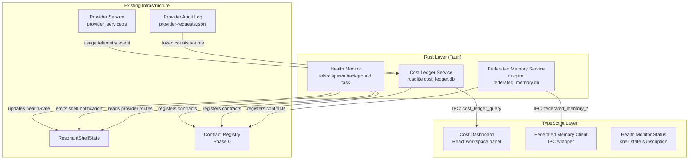

# Design Document: Data Infrastructure

## Overview

Data Infrastructure delivers three foundational services for ResonantOS vNext Phase 1:

1. **Health Monitor** — A Rust tokio background task that periodically probes provider routes and compute nodes, updating `RuntimeNodeHealthState` in the shell state and pre-warming fallback routes on degradation.
2. **Cost Dashboard** — A React workspace panel backed by a rusqlite `cost_ledger.db` that displays token consumption, provider costs, and projected monthly spend per agent and task type.
3. **Federated Memory** — A rusqlite-backed fact store with Tauri IPC commands for trusted-agent read/write, enforcing access control, TTL eviction, and a 50-record cap.

All three components operate on background threads separate from the Tauri main thread, produce zero LLM prompt cost, and degrade gracefully to current behavior on failure. Each registers behavioral contracts in the Phase 0 Contract Registry.

## Architecture



### Key Design Decisions

1. **Tokio background task for Health Monitor**: Uses `tokio::spawn` with `tokio::time::interval` rather than a separate OS process. This integrates naturally with the existing Tauri async runtime, avoids IPC overhead for state updates, and allows the watchdog to restart the loop in-process.

2. **Separate rusqlite databases**: Cost Ledger and Federated Memory each get their own `.db` file in the Tauri app data directory. This avoids schema coupling, allows independent backup/migration, and matches the existing `archive_service.rs` pattern.

3. **Event-driven cost recording**: The provider service emits a Tauri event (`cost-record-created`) after each API call completes. The Cost Ledger service listens for this event and writes asynchronously, never blocking the provider call path.

4. **Pre-aggregated views for dashboard performance**: The Cost Ledger maintains materialized aggregation rows (daily/weekly totals per agent) updated on each insert. The dashboard reads these directly, achieving <200ms render without computing aggregates at query time.

5. **Access control at the IPC boundary**: Federated Memory commands validate the `agent_id` parameter against the hardcoded `Trusted_Agent_Set` before any database operation. No capability grant system needed — the trust boundary is the IPC command itself.

6. **Graceful degradation via Option/fallback patterns**: All three services return `Result<T, String>` from IPC commands. The TypeScript layer treats errors as "service unavailable" and falls back to current behavior (stale health state, empty cost view, no facts).

## Components and Interfaces

### 1. Health Monitor (`health_monitor.rs`)

```rust
// src-tauri/src/health_monitor.rs

use std::collections::HashMap;
use std::sync::Arc;
use std::time::Duration;

use serde::{Deserialize, Serialize};
use tokio::sync::RwLock;
use tokio::time;

/// Configuration for the health monitor probe loop.
#[derive(Debug, Clone, Deserialize)]
#[serde(rename_all = "camelCase")]
pub struct HealthMonitorConfig {
    pub cloud_interval_secs: u64,       // default: 60
    pub lan_interval_secs: u64,         // default: 30
    pub probe_timeout_secs: u64,        // default: 5
    pub consecutive_failures_unavailable: u32, // default: 3
    pub latency_spike_multiplier: f64,  // default: 2.0
    pub rolling_window_size: usize,     // default: 10
}

/// Per-route probe state maintained by the monitor.
#[derive(Debug, Clone, Serialize)]
#[serde(rename_all = "camelCase")]
pub struct RouteProbeState {
    pub runtime_node_id: String,
    pub provider_profile_id: String,
    pub health_state: String, // "ready" | "degraded" | "unavailable"
    pub consecutive_failures: u32,
    pub rolling_latencies_ms: Vec<u64>,
    pub rolling_average_ms: f64,
    pub last_probe_at: String,
    pub last_degradation_event: Option<DegradationEvent>,
}

/// Emitted when degradation is detected.
#[derive(Debug, Clone, Serialize)]
#[serde(rename_all = "camelCase")]
pub struct DegradationEvent {
    pub provider_profile_id: String,
    pub runtime_node_id: String,
    pub severity: String, // "latency-spike" | "error-response" | "unavailable"
    pub detected_at: String,
    pub fallback_route_id: Option<String>,
    pub pre_warm_status: String, // "initiated" | "confirmed" | "failed"
}

/// Shared state for the health monitor, accessible from IPC commands.
pub type HealthMonitorState = Arc<RwLock<HashMap<String, RouteProbeState>>>;

/// Start the health monitor background loop.
/// Called once during Tauri app setup.
pub fn start_health_monitor(
    app_handle: tauri::AppHandle,
    config: HealthMonitorConfig,
) -> HealthMonitorState { /* ... */ }

/// IPC command: query current health monitor state.
#[tauri::command]
pub fn health_monitor_status(
    state: tauri::State<'_, HealthMonitorState>,
) -> Result<Vec<RouteProbeState>, String> { /* ... */ }
```

**Probe execution flow**:
1. Read `runtimeNodes` from shell state (via `read_runtime_state_value`)
2. For each node, issue `reqwest::get` to health endpoint with configured timeout
3. Record latency, update `rolling_latencies_ms` ring buffer
4. Compute rolling average; detect degradation conditions
5. Update `RuntimeNodeHealthState` in shell state via `save_runtime_state`
6. If degradation detected, emit `shell-notification` event and initiate fallback pre-warm

**Watchdog**: A secondary `tokio::spawn` task monitors the probe loop. If no probe completes within `3 × interval`, it cancels and restarts the loop, logging the recovery event.

### 2. Cost Ledger Service (`cost_ledger_service.rs`)

```rust
// src-tauri/src/cost_ledger_service.rs

use rusqlite::{params, Connection};
use serde::{Deserialize, Serialize};

/// A single cost record written after each provider API call.
#[derive(Debug, Clone, Serialize, Deserialize)]
#[serde(rename_all = "camelCase")]
pub struct CostRecord {
    pub id: String,
    pub recorded_at: String,
    pub agent_id: String,
    pub task_type: String,          // DelegationTaskType
    pub provider_id: String,
    pub model: String,
    pub cost_posture: String,       // ProviderCostPosture
    pub prompt_tokens: u32,
    pub completion_tokens: u32,
    pub total_tokens: u32,
    pub estimated_cost_usd: f64,    // derived from cost_posture + token count
    pub duration_ms: Option<u32>,
}

/// Pre-aggregated daily summary for fast dashboard queries.
#[derive(Debug, Clone, Serialize)]
#[serde(rename_all = "camelCase")]
pub struct CostAggregation {
    pub period: String,             // "2026-06-15" or "2026-W24"
    pub period_type: String,        // "day" | "week"
    pub agent_id: String,
    pub task_type: String,
    pub total_prompt_tokens: u64,
    pub total_completion_tokens: u64,
    pub total_tokens: u64,
    pub total_estimated_cost_usd: f64,
    pub record_count: u32,
}

/// Projected monthly spend based on 7-day rolling average.
#[derive(Debug, Clone, Serialize)]
#[serde(rename_all = "camelCase")]
pub struct CostProjection {
    pub daily_average_usd: f64,
    pub projected_monthly_usd: f64,
    pub rolling_window_days: u32,
    pub computed_at: String,
}

/// Query parameters for the cost dashboard.
#[derive(Debug, Deserialize)]
#[serde(rename_all = "camelCase")]
pub struct CostLedgerQuery {
    pub period_type: Option<String>,    // "day" | "week"
    pub agent_id: Option<String>,
    pub task_type: Option<String>,
    pub from_date: Option<String>,
    pub to_date: Option<String>,
    pub limit: Option<u32>,
}

/// Dashboard response combining aggregations and projection.
#[derive(Debug, Serialize)]
#[serde(rename_all = "camelCase")]
pub struct CostDashboardData {
    pub aggregations: Vec<CostAggregation>,
    pub projection: CostProjection,
    pub recent_records: Vec<CostRecord>,
}

pub fn initialize_cost_ledger_db(connection: &Connection) -> Result<(), String> { /* ... */ }
pub fn record_cost_entry(connection: &Connection, record: &CostRecord) -> Result<(), String> { /* ... */ }
pub fn query_cost_dashboard(connection: &Connection, query: &CostLedgerQuery) -> Result<CostDashboardData, String> { /* ... */ }

/// IPC commands
#[tauri::command]
pub fn cost_ledger_record(record: CostRecord) -> Result<(), String> { /* ... */ }

#[tauri::command]
pub fn cost_ledger_query(query: CostLedgerQuery) -> Result<CostDashboardData, String> { /* ... */ }

#[tauri::command]
pub fn cost_ledger_projection() -> Result<CostProjection, String> { /* ... */ }
```

### 3. Cost Dashboard (`CostDashboard.tsx`)

```typescript
// src/modules/settings/CostDashboard.tsx

import type { CostDashboardData, CostProjection, CostAggregation } from "../../core/contracts";

export type CostDashboardProps = {
  data: CostDashboardData | null;
  loading: boolean;
  error: string | null;
  onRefresh: () => void;
  onPeriodChange: (period: "day" | "week") => void;
  onAgentFilter: (agentId: string | null) => void;
};

export function CostDashboard(props: CostDashboardProps): JSX.Element { /* ... */ }
```

The Cost Dashboard is added as a new `SettingsSection` value `"costs"` in the existing `SettingsWorkspace` pattern. It renders:
- Token consumption bar chart by agent (daily/weekly toggle)
- Cost breakdown by `ProviderCostPosture` category
- Projected monthly spend card
- Recent records table with task type classification

### 4. Federated Memory Service (`federated_memory_service.rs`)

```rust
// src-tauri/src/federated_memory_service.rs

use rusqlite::{params, Connection};
use serde::{Deserialize, Serialize};

/// The fixed set of trusted agent identifiers.
pub const TRUSTED_AGENT_SET: &[&str] = &[
    "strategist.core",
    "setup.core",
    "logician.core",
];

/// A single fact record in the federated memory store.
#[derive(Debug, Clone, Serialize, Deserialize)]
#[serde(rename_all = "camelCase")]
pub struct FactRecord {
    pub id: String,
    pub source_agent: String,
    pub timestamp: String,
    pub category: String,       // "system-config" | "provider-state" | "user-preference" | "architecture-decision"
    pub content: String,        // max 200 tokens
    pub confidence: f64,        // 0.0–1.0
    pub ttl_seconds: u64,
}

/// Query parameters for fact retrieval.
#[derive(Debug, Deserialize)]
#[serde(rename_all = "camelCase")]
pub struct FactQuery {
    pub category: Option<String>,
    pub source_agent: Option<String>,
    pub min_confidence: Option<f64>,
    pub max_age_seconds: Option<u64>,
    pub limit: Option<u32>,
}

/// Write request for a new fact.
#[derive(Debug, Deserialize)]
#[serde(rename_all = "camelCase")]
pub struct FactWriteRequest {
    pub agent_id: String,
    pub category: String,
    pub content: String,
    pub confidence: f64,
    pub ttl_seconds: u64,
}

/// Result of a write operation.
#[derive(Debug, Serialize)]
#[serde(rename_all = "camelCase")]
pub struct FactWriteResult {
    pub id: String,
    pub accepted: bool,
    pub error: Option<String>,
    pub evicted_ids: Vec<String>,
}

/// Result of a read-by-id operation.
#[derive(Debug, Deserialize)]
#[serde(rename_all = "camelCase")]
pub struct FactReadByIdRequest {
    pub agent_id: String,
    pub fact_id: String,
}

pub fn initialize_federated_memory_db(connection: &Connection) -> Result<(), String> { /* ... */ }
pub fn validate_trusted_agent(agent_id: &str) -> Result<(), String> { /* ... */ }
pub fn estimate_token_count(content: &str) -> usize { /* ... */ }

/// IPC commands
#[tauri::command]
pub fn federated_memory_write(request: FactWriteRequest) -> Result<FactWriteResult, String> { /* ... */ }

#[tauri::command]
pub fn federated_memory_query(agent_id: String, query: FactQuery) -> Result<Vec<FactRecord>, String> { /* ... */ }

#[tauri::command]
pub fn federated_memory_read_by_id(request: FactReadByIdRequest) -> Result<Option<FactRecord>, String> { /* ... */ }

#[tauri::command]
pub fn federated_memory_status() -> Result<FederatedMemoryStatus, String> { /* ... */ }
```

**Access control enforcement**: Every IPC command checks `agent_id` against `TRUSTED_AGENT_SET` before proceeding. Unauthorized attempts are logged to the provider audit log with event type `"federated-memory-unauthorized"`.

**Token estimation**: Uses a simple heuristic of `content.split_whitespace().count() * 4 / 3` (approximating ~0.75 words per token). Content exceeding 200 tokens is rejected at write time.

**Eviction policy**: When the store reaches 50 records, the service evicts expired-TTL records first (oldest first), then oldest non-expired records if still at capacity.

### 5. TypeScript IPC Client (`data-infrastructure.ts`)

```typescript
// src/core/data-infrastructure.ts

import { invoke } from "@tauri-apps/api/core";
import type { FactRecord, FactQuery, FactWriteRequest, FactWriteResult } from "./contracts";
import type { CostDashboardData, CostLedgerQuery, CostProjection } from "./contracts";
import type { RouteProbeState } from "./contracts";

// Health Monitor
export const queryHealthMonitorStatus = (): Promise<RouteProbeState[]> =>
  invoke("health_monitor_status");

// Cost Ledger
export const queryCostDashboard = (query: CostLedgerQuery): Promise<CostDashboardData> =>
  invoke("cost_ledger_query", { query });

export const queryCostProjection = (): Promise<CostProjection> =>
  invoke("cost_ledger_projection");

// Federated Memory
export const writeFact = (request: FactWriteRequest): Promise<FactWriteResult> =>
  invoke("federated_memory_write", { request });

export const queryFacts = (agentId: string, query: FactQuery): Promise<FactRecord[]> =>
  invoke("federated_memory_query", { agentId, query });

export const readFactById = (agentId: string, factId: string): Promise<FactRecord | null> =>
  invoke("federated_memory_read_by_id", { request: { agentId, factId } });
```

## Data Models

### Cost Ledger Schema (`cost_ledger.db`)

```sql
CREATE TABLE IF NOT EXISTS cost_records (
    id TEXT PRIMARY KEY,
    recorded_at TEXT NOT NULL,
    agent_id TEXT NOT NULL,
    task_type TEXT NOT NULL,
    provider_id TEXT NOT NULL,
    model TEXT NOT NULL,
    cost_posture TEXT NOT NULL,
    prompt_tokens INTEGER NOT NULL DEFAULT 0,
    completion_tokens INTEGER NOT NULL DEFAULT 0,
    total_tokens INTEGER NOT NULL DEFAULT 0,
    estimated_cost_usd REAL NOT NULL DEFAULT 0.0,
    duration_ms INTEGER
);

CREATE TABLE IF NOT EXISTS cost_aggregations (
    period TEXT NOT NULL,
    period_type TEXT NOT NULL,       -- 'day' | 'week'
    agent_id TEXT NOT NULL,
    task_type TEXT NOT NULL,
    total_prompt_tokens INTEGER NOT NULL DEFAULT 0,
    total_completion_tokens INTEGER NOT NULL DEFAULT 0,
    total_tokens INTEGER NOT NULL DEFAULT 0,
    total_estimated_cost_usd REAL NOT NULL DEFAULT 0.0,
    record_count INTEGER NOT NULL DEFAULT 0,
    PRIMARY KEY (period, period_type, agent_id, task_type)
);

CREATE INDEX IF NOT EXISTS idx_cost_records_agent ON cost_records(agent_id);
CREATE INDEX IF NOT EXISTS idx_cost_records_recorded_at ON cost_records(recorded_at);
CREATE INDEX IF NOT EXISTS idx_cost_records_task_type ON cost_records(task_type);
CREATE INDEX IF NOT EXISTS idx_cost_aggregations_period ON cost_aggregations(period, period_type);
```

**Aggregation update**: On each `INSERT` into `cost_records`, an `INSERT OR REPLACE` updates the corresponding `cost_aggregations` row for the current day and ISO week.

**Projection query**:
```sql
SELECT SUM(total_estimated_cost_usd) / 7.0 AS daily_avg
FROM cost_aggregations
WHERE period_type = 'day'
  AND period >= date('now', '-7 days');
```
Projected monthly = `daily_avg × 30.44`.

### Federated Memory Schema (`federated_memory.db`)

```sql
CREATE TABLE IF NOT EXISTS facts (
    id TEXT PRIMARY KEY,
    source_agent TEXT NOT NULL,
    timestamp TEXT NOT NULL,
    category TEXT NOT NULL CHECK(category IN ('system-config', 'provider-state', 'user-preference', 'architecture-decision')),
    content TEXT NOT NULL,
    token_count INTEGER NOT NULL,
    confidence REAL NOT NULL CHECK(confidence >= 0.0 AND confidence <= 1.0),
    ttl_seconds INTEGER NOT NULL,
    expires_at TEXT NOT NULL
);

CREATE TABLE IF NOT EXISTS access_log (
    id INTEGER PRIMARY KEY AUTOINCREMENT,
    timestamp TEXT NOT NULL,
    agent_id TEXT NOT NULL,
    operation TEXT NOT NULL,    -- 'read' | 'write' | 'unauthorized-read' | 'unauthorized-write'
    fact_id TEXT,
    success INTEGER NOT NULL DEFAULT 1
);

CREATE TABLE IF NOT EXISTS trusted_agent_promotions (
    agent_id TEXT PRIMARY KEY,
    promoted_by TEXT NOT NULL,
    promoted_at TEXT NOT NULL,
    validation_period_end TEXT NOT NULL
);

CREATE INDEX IF NOT EXISTS idx_facts_category ON facts(category);
CREATE INDEX IF NOT EXISTS idx_facts_source_agent ON facts(source_agent);
CREATE INDEX IF NOT EXISTS idx_facts_expires_at ON facts(expires_at);
CREATE INDEX IF NOT EXISTS idx_facts_timestamp ON facts(timestamp DESC);
CREATE INDEX IF NOT EXISTS idx_access_log_timestamp ON access_log(timestamp);
```

**Eviction query** (when count reaches 50):
```sql
-- First evict expired records
DELETE FROM facts WHERE expires_at < datetime('now') ORDER BY expires_at ASC LIMIT ?;
-- If still at 50, evict oldest
DELETE FROM facts WHERE id IN (
    SELECT id FROM facts ORDER BY timestamp ASC LIMIT ?
);
```

### Behavioral Contract Registration

Each component registers contracts as JSON files in `src/core/backtest-contracts/`:

- `contract-health-monitor-probe-state-transitions.json`
- `contract-health-monitor-degradation-notification.json`
- `contract-health-monitor-crash-recovery.json`
- `contract-cost-ledger-accurate-persistence.json`
- `contract-cost-ledger-aggregation-correctness.json`
- `contract-cost-ledger-projection-rolling-average.json`
- `contract-federated-memory-access-control.json`
- `contract-federated-memory-store-size-limit.json`
- `contract-federated-memory-content-token-limit.json`
- `contract-federated-memory-query-filtering.json`

## Correctness Properties

*A property is a characteristic or behavior that should hold true across all valid executions of a system — essentially, a formal statement about what the system should do. Properties serve as the bridge between human-readable specifications and machine-verifiable correctness guarantees.*

### Property 1: Health state transitions are correct for probe results

*For any* provider route and *for any* sequence of probe results (success with latency, HTTP error, or timeout), the resulting `RuntimeNodeHealthState` SHALL be:
- `"ready"` if the latest probe succeeded with latency ≤ 2× rolling average
- `"degraded"` if the latest probe returned HTTP status outside 200–299, timed out, or latency exceeded 2× rolling average
- `"unavailable"` if 3 or more consecutive probes failed

**Validates: Requirements 1.2, 1.5, 1.6**

### Property 2: Rolling latency average uses last 10 measurements

*For any* sequence of latency measurements for a provider route, the rolling average SHALL equal the arithmetic mean of the last `min(10, n)` measurements where `n` is the total number of measurements recorded.

**Validates: Requirements 2.5**

### Property 3: Latency spike detection triggers degradation event

*For any* provider route with a rolling average `avg` and *for any* new probe latency `lat`, a `DegradationEvent` with severity `"latency-spike"` SHALL be emitted if and only if `lat > 2 × avg` and `avg > 0`.

**Validates: Requirements 2.3**

### Property 4: Degradation event selects correct fallback from policy chain

*For any* `ProviderFallbackPolicy` chain and *for any* degraded primary route that is a member of that chain, the fallback pre-warm SHALL target the next route in `orderedProviderProfileIds` after the degraded route's provider.

**Validates: Requirements 2.1**

### Property 5: Shell notification contains all required fields on degradation

*For any* `DegradationEvent`, the emitted shell notification SHALL contain non-empty values for `provider_profile_id`, `severity` (one of "latency-spike", "error-response", "unavailable"), and `fallback_route_id` (if a fallback exists in the policy chain).

**Validates: Requirements 2.4**

### Property 6: Cost record persistence round-trip

*For any* valid `CostRecord` (with non-empty agent_id, valid task_type, non-negative token counts), writing to the Cost Ledger and reading back by ID SHALL produce a record where all fields are equal to the original.

**Validates: Requirements 4.2, 4.3**

### Property 7: Cost aggregation correctness

*For any* set of `CostRecord` entries, the `CostAggregation` for a given (period, agent_id, task_type) tuple SHALL have `total_tokens` equal to the sum of `total_tokens` across all records matching that tuple, and `record_count` equal to the count of matching records.

**Validates: Requirements 4.1, 4.4**

### Property 8: Monthly projection uses 7-day rolling average

*For any* set of daily cost totals over the last 7 days, the `projected_monthly_usd` SHALL equal `(sum_of_daily_totals / 7) × 30.44`, and `daily_average_usd` SHALL equal `sum_of_daily_totals / 7`.

**Validates: Requirements 5.3**

### Property 9: Cost posture derivation is deterministic

*For any* `ProviderCostPosture` value and *for any* token count, the `estimated_cost_usd` SHALL be: 0.0 for "free-local", a fixed subscription rate for "subscription", a per-token rate for "paid-api", and a premium per-token rate for "emergency-only".

**Validates: Requirements 5.1**

### Property 10: Fact record storage round-trip preserves all fields

*For any* valid `FactRecord` (content ≤ 200 tokens, confidence in [0.0, 1.0], valid category), writing to Federated Memory and reading back by ID SHALL produce a record where `id`, `source_agent`, `category`, `content`, `confidence`, and `ttl_seconds` are all equal to the original.

**Validates: Requirements 7.1, 9.5**

### Property 11: Store size invariant — never exceeds 50 records

*For any* sequence of write operations to the Federated Memory, the total number of stored `FactRecord` entries SHALL never exceed 50. When at capacity, expired-TTL records are evicted first (oldest expiry first), then oldest non-expired records.

**Validates: Requirements 7.2**

### Property 12: Content exceeding 200 tokens is rejected

*For any* string whose estimated token count exceeds 200, a write to Federated Memory SHALL be rejected with `accepted: false` and a non-empty `error` field, and the store contents SHALL remain unchanged.

**Validates: Requirements 7.4**

### Property 13: Access control enforcement

*For any* agent identifier, Federated Memory read and write operations SHALL succeed if and only if the agent is in the `Trusted_Agent_Set`. For untrusted agents, the operation SHALL be rejected and an `access_log` entry with `operation` containing "unauthorized" SHALL be created.

**Validates: Requirements 8.1, 8.2, 8.3**

### Property 14: Query filtering returns only matching facts

*For any* combination of query filters (category, source_agent, min_confidence, max_age_seconds) and *for any* set of stored facts, every returned `FactRecord` SHALL satisfy all active filter criteria, and the results SHALL be sorted by timestamp descending.

**Validates: Requirements 9.1, 9.2**

## Error Handling

### Health Monitor Errors

- **Probe HTTP timeout**: Mark route as failed for this cycle, increment `consecutive_failures`. Do not crash the probe loop.
- **Probe DNS resolution failure**: Treat as timeout (5s exceeded). Log the DNS error to audit log.
- **Shell state write failure**: Log error, retain probe results in memory for next cycle. Do not block subsequent probes.
- **Watchdog restart**: Log crash event with timestamp to compute audit log. Resume from clean state (all routes re-probed on next cycle).
- **All routes unreachable**: Continue probe loop at configured interval. Do not emit degradation events for every route simultaneously (rate-limit to 1 notification per 5 minutes).

### Cost Ledger Errors

- **Database open failure**: Return error from IPC command. Dashboard shows "Cost data unavailable" message. Provider API calls continue unaffected.
- **Write failure (disk full, corruption)**: Log error, drop the cost record. Never block the provider API call path.
- **Aggregation inconsistency**: If aggregation row doesn't match sum of records (detected on query), recompute from raw records and update aggregation table.
- **Invalid cost posture**: Default to `estimated_cost_usd = 0.0` for unknown postures. Log warning.

### Federated Memory Errors

- **Unauthorized access**: Return structured error `{ accepted: false, error: "Agent '{id}' is not in the Trusted_Agent_Set" }`. Log to `access_log` table.
- **Content too long**: Return `{ accepted: false, error: "Content exceeds 200 token limit (estimated: {n} tokens)" }`. Do not write.
- **Database unavailable**: Return error from IPC command. Calling agents skip fact retrieval and proceed with existing context.
- **Eviction during write**: If eviction fails (database error), reject the write rather than exceeding the 50-record limit.
- **Invalid category**: Return structured error listing valid categories. Do not write.
- **Confidence out of range**: Clamp to [0.0, 1.0] with a warning in the response rather than rejecting.

## Testing Strategy

### Property-Based Tests (Rust: proptest)

The Rust backend uses `proptest` for property-based testing (the standard PBT library for Rust).

**Configuration**: Each property test runs a minimum of 100 iterations via `proptest! { #![proptest_config(ProptestConfig::with_cases(100))] ... }`.

**Tag format**: Each test includes a comment referencing the design property:
```rust
// Feature: data-infrastructure, Property 1: Health state transitions are correct for probe results
```

**Properties to implement**:
1. Health state transitions (Property 1)
2. Rolling latency average (Property 2)
3. Latency spike detection (Property 3)
4. Fallback selection from policy chain (Property 4)
5. Shell notification completeness (Property 5)
6. Cost record round-trip (Property 6)
7. Cost aggregation correctness (Property 7)
8. Monthly projection calculation (Property 8)
9. Cost posture derivation (Property 9)
10. Fact record round-trip (Property 10)
11. Store size invariant (Property 11)
12. Content token limit rejection (Property 12)
13. Access control enforcement (Property 13)
14. Query filtering correctness (Property 14)

### Unit Tests (Rust: cargo test)

- Health Monitor: config parsing, probe result classification, watchdog timeout detection
- Cost Ledger: schema initialization, single record insert/read, aggregation update trigger
- Federated Memory: schema initialization, TTL expiry calculation, token estimation heuristic
- Behavioral contract JSON: schema validation for all 10 registered contracts

### Unit Tests (TypeScript: Vitest)

- Cost Dashboard: component renders with mock data, period toggle, agent filter
- IPC client: error handling when backend unavailable, response parsing
- Shell notification display: degradation event rendering

### Integration Tests

- Health Monitor: end-to-end probe cycle with mocked HTTP (reqwest mock)
- Cost Ledger: provider chat → event emission → cost record written → dashboard query returns it
- Federated Memory: write → query → verify → eviction at capacity
- Cross-component: health degradation → shell notification → dashboard shows degraded route

### Performance Tests

- Cost Dashboard: initial render < 200ms with 10,000 pre-aggregated rows
- Federated Memory: read query < 10ms with 50 records
- Health Monitor: probe cycle completes within configured interval for 20 routes
- Shell responsiveness: main thread event loop latency < 100ms during background operations
