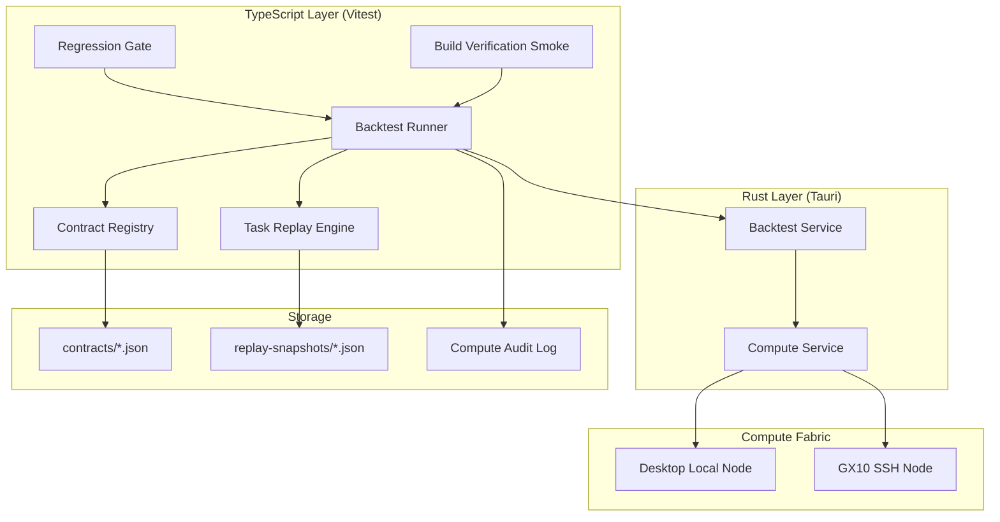

# Design Document: Engineer Backtest Mode

## Overview

Engineer Backtest Mode provides a regression testing foundation for ResonantOS vNext that operates as a background compute job, verifying system-level behavioral contracts, replaying historical delegation tasks, and producing audit-trail-compatible reports in the existing Logician execution artifact format.

The system is split across two layers:
- **TypeScript orchestration layer** (`src/core/backtest.ts`): Owns the contract registry, backtest runner logic, regression gate, task replay engine, and smoke test definitions. Runs in the Vitest test environment and produces `LogicianExecutionArtifact` records.
- **Rust execution layer** (`src-tauri/src/backtest_service.rs`): Extends the existing `compute_service.rs` pattern to execute test suites as `ComputeSafeCommandRequest` jobs on enrolled nodes, managing process isolation and CPU throttling.

The design reuses existing infrastructure wherever possible: `ComputeJob` for scheduling, `ComputeAuditRecord` for audit trail, `LogicianExecutionArtifact` for result reporting, and the `DelegationPacket` schema for replay snapshots.

## Architecture



### Key Design Decisions

1. **TypeScript-first orchestration**: The backtest runner lives in TypeScript because it needs deep access to `ResonantShellState`, `DelegationPacket` validation, provider routing, and the Logician artifact format — all of which are TypeScript-native. The Rust layer only handles process execution and isolation.

2. **Contract Registry as JSON files in-repo**: Contracts are versioned alongside code in `src/core/backtest-contracts/`, making them reviewable in PRs and naturally versioned by git. No database needed.

3. **Replay snapshots in app data**: Stored in the Tauri app data directory (`$APPDATA/backtest/replay-snapshots/`) since they contain execution outputs that may be large and shouldn't bloat the repo.

4. **Reuse of ComputeJob pattern**: Backtest execution is submitted as a `ComputeJob` with `jobType: "safe-command"` and `requiredNodeRoles: ["safe-command-runner"]`, fitting into the existing compute fabric without new job types.

## Components and Interfaces

### 1. Contract Registry

```typescript
// src/core/backtest-contracts.ts

export interface BehavioralContract {
  id: string;
  version: string;
  description: string;
  category: ContractCategory;
  preconditions: ContractPrecondition[];
  expectedOutcome: ContractExpectedOutcome;
  verificationMethod: ContractVerificationMethod;
  referencedComponents: string[];
  createdAt: string;
  updatedAt: string;
}

export type ContractCategory =
  | "provider-routing"
  | "archive-access"
  | "delegation-validation"
  | "recovery-mode"
  | "compute-fabric"
  | "state-normalization";

export interface ContractPrecondition {
  description: string;
  stateSetup?: Partial<ResonantShellState>;
}

export interface ContractExpectedOutcome {
  description: string;
  assertion: "equals" | "contains" | "truthy" | "matches-schema";
  expected?: unknown;
}

export type ContractVerificationMethod =
  | { type: "unit-test"; testFile: string; testName: string }
  | { type: "integration"; ipcCommand: string; payload: Record<string, unknown> }
  | { type: "smoke"; steps: string[] };

export interface ContractRegistryValidationResult {
  valid: boolean;
  errors: ContractValidationError[];
}

export interface ContractValidationError {
  field: string;
  code: string;
  message: string;
}

export const validateBehavioralContract = (
  contract: BehavioralContract,
  state: ResonantShellState,
): ContractRegistryValidationResult => { /* ... */ };

export const loadContractRegistry = (): BehavioralContract[] => { /* ... */ };
```

**Storage location**: `src/resonantos-vnext/src/core/backtest-contracts/`
- One JSON file per contract: `{contract-id}.json`
- Index file: `_registry.json` listing all contract IDs for fast enumeration

### 2. Backtest Runner

```typescript
// src/core/backtest-runner.ts

export interface BacktestRunConfig {
  suites: BacktestSuite[];
  targetNodeId?: string;
  cpuThrottlePercent?: number;
  timeoutMs?: number;
}

export type BacktestSuite =
  | { type: "vitest"; include?: string[] }
  | { type: "cargo-test"; package?: string }
  | { type: "integration"; scenarios: IntegrationScenario[] }
  | { type: "contract-verification"; contractIds?: string[] }
  | { type: "replay"; snapshotIds?: string[] };

export interface IntegrationScenario {
  id: string;
  ipcCommand: string;
  payload: Record<string, unknown>;
  expectedStatus: "passed" | "degraded";
}

export interface BacktestReport {
  id: string;
  startedAt: string;
  completedAt: string;
  targetNodeId: string;
  gitBranch: string;
  gitCommit: string;
  suiteResults: BacktestSuiteResult[];
  aggregateStatus: "passed" | "failed" | "degraded";
  contractsEvaluated: string[];
  passCount: number;
  failCount: number;
  skipCount: number;
  artifacts: LogicianExecutionArtifact[];
}

export interface BacktestSuiteResult {
  suite: BacktestSuite;
  artifact: LogicianExecutionArtifact;
  diagnosticReport?: DiagnosticReport;
}

export interface DiagnosticReport {
  contractId: string;
  expected: string;
  actual: string;
  executionDurationMs: number;
  evidence: Record<string, unknown>;
  stackTrace?: string;
  remediation: string;
}

export const executeBacktest = async (
  config: BacktestRunConfig,
  state: ResonantShellState,
): Promise<BacktestReport> => { /* ... */ };
```

### 3. Task Replay Engine

```typescript
// src/core/backtest-replay.ts

export interface ReplaySnapshot {
  id: string;
  packetId: string;
  capturedAt: string;
  agentVersion: string;
  packet: DelegationPacket;
  executionOutputs: ArtifactReturn;
  verificationResults: Array<{
    requirementId: string;
    status: "passed" | "failed" | "not-run";
    evidence: string;
  }>;
  timingMetadata: {
    totalDurationMs: number;
    verificationDurationMs: number;
  };
}

export interface ReplayResult {
  snapshotId: string;
  baselineAgentVersion: string;
  currentAgentVersion: string;
  driftScore: number;
  structuralSimilarity: number;
  verificationAlignment: number;
  artifactCompleteness: number;
  flaggedAsRegression: boolean;
  comparison: ReplayComparison;
}

export interface ReplayComparison {
  outputDiffs: Array<{ field: string; baseline: unknown; current: unknown }>;
  missingArtifacts: string[];
  newArtifacts: string[];
  verificationMismatches: Array<{
    requirementId: string;
    baselineStatus: string;
    currentStatus: string;
  }>;
}

export const captureReplaySnapshot = (
  packet: DelegationPacket,
  result: ArtifactReturn,
  agentVersion: string,
): ReplaySnapshot => { /* ... */ };

export const replaySnapshot = async (
  snapshot: ReplaySnapshot,
  currentAgentVersion: string,
): Promise<ReplayResult> => { /* ... */ };

export const computeDriftScore = (
  baseline: ArtifactReturn,
  current: ArtifactReturn,
): number => { /* ... */ };
```

**Drift Score Calculation**:
- `structuralSimilarity` (weight 0.4): JSON deep-diff of output structures
- `verificationAlignment` (weight 0.4): Ratio of matching verification statuses
- `artifactCompleteness` (weight 0.2): Ratio of expected artifacts present
- Final score: weighted average, clamped to [0.0, 1.0]

**Storage**: `$APPDATA/resonantos-vnext/backtest/replay-snapshots/{snapshot-id}.json`

### 4. Regression Gate

```typescript
// src/core/backtest-gate.ts

export interface RegressionGateResult {
  passed: boolean;
  report: BacktestReport;
  blockedContracts: DiagnosticReport[];
  artifact: LogicianExecutionArtifact;
}

export const runRegressionGate = async (
  state: ResonantShellState,
): Promise<RegressionGateResult> => { /* ... */ };
```

The regression gate is invoked as a pre-merge hook (git hook or CI step) that:
1. Loads all contracts from the registry
2. Executes the full backtest suite
3. If any contract fails, produces a `DiagnosticReport` and blocks
4. Produces a `LogicianExecutionArtifact` with aggregate status

### 5. Build Verification Smoke Test

```typescript
// src/core/backtest-smoke.ts

export interface SmokeTestStep {
  id: string;
  label: string;
  execute: (state: ResonantShellState) => SmokeStepResult;
}

export interface SmokeStepResult {
  passed: boolean;
  durationMs: number;
  evidence: Record<string, unknown>;
}

export const SMOKE_STEPS: SmokeTestStep[] = [
  { id: "boot-state", label: "Boot ResonantShellState from defaults", execute: /* ... */ },
  { id: "load-manifests", label: "Load registered AddOnManifests", execute: /* ... */ },
  { id: "resolve-route", label: "Resolve provider route", execute: /* ... */ },
  { id: "validate-delegation", label: "Validate delegation pipeline", execute: /* ... */ },
  { id: "state-normalization", label: "Normalize legacy state", execute: /* ... */ },
];

export const runBuildVerificationSmoke = (
  state: ResonantShellState,
): LogicianExecutionArtifact => { /* ... */ };
```

### 6. Rust Backtest Service

```rust
// src-tauri/src/backtest_service.rs

#[derive(Debug, Clone, Deserialize)]
#[serde(rename_all = "camelCase")]
pub struct BacktestExecutionRequest {
    pub job_id: String,
    pub node_id: String,
    pub suite_type: String,  // "vitest" | "cargo-test"
    pub args: Vec<String>,
    pub cpu_limit_percent: Option<u8>,
    pub timeout_ms: Option<u64>,
}

#[derive(Debug, Clone, Serialize)]
#[serde(rename_all = "camelCase")]
pub struct BacktestExecutionResult {
    pub job_id: String,
    pub node_id: String,
    pub suite_type: String,
    pub status: String,
    pub exit_code: Option<i32>,
    pub stdout: String,
    pub stderr: String,
    pub started_at: String,
    pub completed_at: String,
    pub duration_ms: u64,
    pub summary: String,
}
```

The Rust service:
- Extends the existing `compute_service.rs` safe-command pattern
- Adds `vitest` and `cargo` to the allowlist for backtest jobs only
- Uses `nice`/`ionice` (Unix) or process priority (Windows) for CPU throttling
- Supports remote execution via the existing SSH infrastructure to GX10

## Data Models

### Behavioral Contract Schema

```json
{
  "$schema": "behavioral-contract-v1",
  "id": "contract-provider-routing-primary-healthy",
  "version": "1.0.0",
  "description": "Provider routing resolves to primary when healthy",
  "category": "provider-routing",
  "preconditions": [
    {
      "description": "Default state with all providers healthy",
      "stateSetup": {}
    }
  ],
  "expectedOutcome": {
    "description": "resolveProviderRoute returns primary-healthy resolution",
    "assertion": "equals",
    "expected": { "resolutionReason": "primary-healthy" }
  },
  "verificationMethod": {
    "type": "unit-test",
    "testFile": "src/core/policies.test.ts",
    "testName": "resolves a primary provider runtime node when a healthy route exists"
  },
  "referencedComponents": [
    "ResonantShellState.providers",
    "ResonantShellState.runtimeNodes",
    "ResonantShellState.providerRouting"
  ],
  "createdAt": "2026-06-01T00:00:00.000Z",
  "updatedAt": "2026-06-01T00:00:00.000Z"
}
```

### Replay Snapshot Schema

```json
{
  "id": "replay-snap-abc123",
  "packetId": "delegation-1",
  "capturedAt": "2026-06-01T12:00:00.000Z",
  "agentVersion": "0.1.0-alpha.3",
  "packet": { /* full DelegationPacket */ },
  "executionOutputs": { /* full ArtifactReturn */ },
  "verificationResults": [
    { "requirementId": "req-1", "status": "passed", "evidence": "..." }
  ],
  "timingMetadata": {
    "totalDurationMs": 4500,
    "verificationDurationMs": 1200
  }
}
```

### Backtest Report Schema

```json
{
  "id": "backtest-run-xyz789",
  "startedAt": "2026-06-01T12:00:00.000Z",
  "completedAt": "2026-06-01T12:02:30.000Z",
  "targetNodeId": "compute-desktop-local",
  "gitBranch": "feature/new-addon",
  "gitCommit": "abc123def",
  "aggregateStatus": "passed",
  "contractsEvaluated": ["contract-provider-routing-primary-healthy", "..."],
  "passCount": 42,
  "failCount": 0,
  "skipCount": 2,
  "suiteResults": [/* BacktestSuiteResult[] */],
  "artifacts": [/* LogicianExecutionArtifact[] */]
}
```

### ComputeAuditRecord Extension

The backtest system extends the existing `ComputeAuditRecord.event` union with:
- `"backtest-started"` — when a backtest job begins
- `"backtest-completed"` — when a backtest job finishes successfully
- `"backtest-regression-detected"` — when the regression gate blocks a merge

The `metadata` field carries:
```typescript
{
  gitBranch: string;
  gitCommit: string;
  contractsEvaluated: string[];
  passCount: number;
  failCount: number;
  suiteTypes: string[];
}
```


## Correctness Properties

*A property is a characteristic or behavior that should hold true across all valid executions of a system — essentially, a formal statement about what the system should do. Properties serve as the bridge between human-readable specifications and machine-verifiable correctness guarantees.*

### Property 1: Contract validation accepts complete contracts and rejects incomplete ones with descriptive errors

*For any* `BehavioralContract` object, if all required fields (id, description, preconditions, expectedOutcome, verificationMethod) are present and well-formed, validation SHALL return `{ valid: true }`. If any required field is missing or malformed, validation SHALL return `{ valid: false }` with at least one error whose `field` property identifies the violated constraint.

**Validates: Requirements 1.2, 1.5**

### Property 2: Contract component reference validation against state schema

*For any* `BehavioralContract` with `referencedComponents` entries, validation SHALL accept the contract if and only if every referenced component path exists as a key path in the current `ResonantShellState` schema. Invalid references SHALL produce a validation error identifying the unresolved path.

**Validates: Requirements 1.4**

### Property 3: Backtest suite aggregation preserves all results

*For any* sequence of `BacktestSuiteResult` objects (including mixtures of passed, failed, and degraded statuses), the aggregate `BacktestReport` SHALL contain exactly one entry per suite in `suiteResults`, and `passCount + failCount + skipCount` SHALL equal the total test count across all suites.

**Validates: Requirements 2.3**

### Property 4: Regression gate correctly maps aggregate status to artifact

*For any* `BacktestReport`, the `RegressionGateResult.passed` SHALL be `true` if and only if `report.aggregateStatus` is `"passed"`. The produced `LogicianExecutionArtifact.status` SHALL be `"passed"` when all contracts pass, and `"failed"` when any contract fails.

**Validates: Requirements 3.2, 3.4, 3.5**

### Property 5: Diagnostic report contains all required fields on gate failure

*For any* `BacktestReport` with `aggregateStatus === "failed"`, each `DiagnosticReport` in `blockedContracts` SHALL contain non-empty values for `contractId`, `expected`, `actual`, `executionDurationMs`, `evidence`, and `remediation`.

**Validates: Requirements 3.3**

### Property 6: Replay snapshot round-trip preserves delegation packet data

*For any* valid `DelegationPacket` and `ArtifactReturn`, calling `captureReplaySnapshot` and then reading the stored snapshot SHALL produce a `ReplaySnapshot` where `snapshot.packet` deep-equals the original packet and `snapshot.executionOutputs` deep-equals the original `ArtifactReturn`, including all `returnProtocol` fields.

**Validates: Requirements 4.1, 4.5**

### Property 7: Drift score is bounded and identity-preserving

*For any* two `ArtifactReturn` objects, `computeDriftScore(a, b)` SHALL return a value in `[0.0, 1.0]`. *For any* single `ArtifactReturn` object `a`, `computeDriftScore(a, a)` SHALL return `0.0`.

**Validates: Requirements 4.3**

### Property 8: Drift threshold correctly determines regression flagging

*For any* `ReplayResult` with `driftScore` and *for any* threshold value in `(0.0, 1.0]`, `flaggedAsRegression` SHALL be `true` if and only if `driftScore >= threshold`.

**Validates: Requirements 4.4**

### Property 9: Delegation pipeline produces valid output for valid input

*For any* valid delegation input (non-vague mission, verification requirements present, valid task type), the pipeline of `createEngineerDelegationPacket` → `validateDelegationPacket` → `renderDelegationTaskMarkdown` SHALL produce no validation errors and a non-empty markdown string.

**Validates: Requirements 5.3**

### Property 10: Node preference selects remote for full suite when available

*For any* set of enrolled compute nodes where at least one has `nodeId` matching the GX10 remote node and satisfies the `safe-command-runner` role, a full-suite backtest run SHALL select the remote node as `targetNodeId`.

**Validates: Requirements 6.4**

### Property 11: Logician artifact well-formedness for backtest results

*For any* `BacktestSuiteResult`, the produced `LogicianExecutionArtifact` SHALL have: `kind === "script"`, a non-empty `commandRef`, `status` in `["passed", "failed", "degraded"]` matching the suite outcome, `durationMs >= 0` equal to `completedAt - startedAt` in milliseconds, and `evidence` containing numeric fields `testCount`, `passCount`, `failCount`, and `skipCount`.

**Validates: Requirements 7.1, 7.2, 7.3, 7.4**

### Property 12: Integration scenario evidence includes IPC details

*For any* integration scenario `BacktestSuiteResult`, the `LogicianExecutionArtifact.evidence` SHALL contain string field `ipcCommand` and object field `payloadShape`.

**Validates: Requirements 7.5**

### Property 13: Audit record schema conformance

*For any* backtest execution, the produced `ComputeAuditRecord` SHALL have non-empty `id`, `jobId`, `createdAt`, `event` (one of the backtest event types), `detail`, and `metadata` containing `gitBranch` (string), `gitCommit` (string), `contractsEvaluated` (string array), `passCount` (number), and `failCount` (number).

**Validates: Requirements 8.1, 8.3, 8.4, 8.5**

## Error Handling

### Contract Registry Errors
- **Invalid JSON**: Return `ContractRegistryValidationResult` with `valid: false` and error code `"invalid-json"`
- **Missing required fields**: Return structured error per missing field
- **Invalid component reference**: Return error with the unresolved path and available paths
- **Duplicate contract ID**: Reject registration with `"duplicate-id"` error

### Backtest Runner Errors
- **Suite execution timeout**: Cancel the suite, record partial results, produce artifact with status `"failed"` and evidence `{ reason: "timeout", timeoutMs: N }`
- **Node unavailable**: Cancel job gracefully, report partial results for completed suites, produce artifact with status `"degraded"`
- **Process crash**: Capture stderr, produce artifact with status `"failed"` and evidence containing the crash output
- **All suites fail to start**: Produce a single artifact with status `"failed"` and evidence `{ reason: "no-suites-executed" }`

### Task Replay Errors
- **Snapshot not found**: Return error with snapshot ID, do not block other replays
- **Agent execution failure during replay**: Record the failure as a drift (score 1.0) rather than crashing
- **Corrupted snapshot file**: Skip with warning in the report, do not block other replays

### Regression Gate Errors
- **Cannot determine git branch/commit**: Proceed with `"unknown"` values, add warning to report
- **Partial suite failure**: Gate still blocks if any contract fails, reports partial results for informational purposes

## Testing Strategy

### Property-Based Tests (Vitest + fast-check)

The project uses Vitest 3.2. Property-based tests will use `fast-check` (the standard PBT library for TypeScript/Vitest).

**Configuration**: Each property test runs a minimum of 100 iterations.

**Tag format**: Each test includes a comment referencing the design property:
```typescript
// Feature: engineer-backtest-mode, Property 1: Contract validation accepts complete contracts and rejects incomplete ones
```

**Properties to implement**:
1. Contract validation (Property 1)
2. Component reference validation (Property 2)
3. Suite aggregation (Property 3)
4. Gate status mapping (Property 4)
5. Diagnostic report completeness (Property 5)
6. Replay snapshot round-trip (Property 6)
7. Drift score bounds (Property 7)
8. Drift threshold flagging (Property 8)
9. Delegation pipeline (Property 9)
10. Node preference (Property 10)
11. Artifact well-formedness (Property 11)
12. Integration evidence (Property 12)
13. Audit record conformance (Property 13)

### Unit Tests (Vitest)

- Contract registry: loading, saving, listing contracts
- Backtest runner: config parsing, suite type dispatch
- Smoke test: each step in isolation
- Regression gate: merge block/allow decision
- Diagnostic report: formatting and rendering

### Integration Tests

- End-to-end backtest run with mocked Tauri IPC
- Replay snapshot capture and retrieval from filesystem
- Audit record persistence to compute fabric log
- Regression gate invocation from git hook script

### Rust Tests (cargo test)

- `backtest_service.rs`: allowlist enforcement for vitest/cargo commands
- CPU throttle configuration application
- Remote execution request formation for GX10
- Timeout and cancellation behavior
