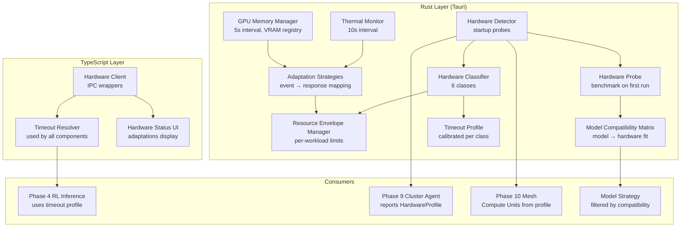

# Design Document: Hardware Stability

## Overview

Hardware Stability is Phase 7 of the ResonantOS vNext improvement plan — a hardware abstraction layer that detects, profiles, classifies, and adapts to the specific capabilities of each machine. It provides the foundational hardware awareness that all subsequent phases (clustering, mesh networking, RL orchestration) depend on.

The system is split across two layers:

- **Rust hardware service** (`src-tauri/src/hardware_service.rs`): Owns hardware detection, profiling, classification, thermal monitoring, GPU memory management, resource envelope enforcement, and the model compatibility matrix. Runs probes at startup, monitors hardware state continuously, and exposes all data via IPC.
- **TypeScript hardware client** (`src/core/hardware.ts`): Provides typed IPC wrappers, timeout profile resolution for all system components, and hardware state subscriptions for the UI layer.

The system is zero-configuration — it auto-detects everything and applies sensible defaults per hardware class. Manual overrides are supported but never required.

### Key Design Decisions

1. **Rust-only detection and monitoring**: Hardware probing requires low-level system calls (sysinfo, NVML, thermal sensors). Rust provides safe access to these via well-maintained crates (`sysinfo`, `nvml-wrapper`, `raw-cpuid`). No TypeScript computation needed.

2. **Classification-driven defaults**: Rather than configuring every timeout individually, the system classifies hardware into one of 6 classes and applies a complete Timeout_Profile per class. This gives correct behavior out of the box for 95% of machines.

3. **Probe-once, monitor-continuously**: Expensive detection (CPU features, GPU model, disk speed) runs once at startup. Cheap monitoring (utilization, temperature, VRAM) runs continuously on background threads.

4. **Resource envelopes with dynamic rebalancing**: Fixed allocations per workload type prevent starvation, but idle resources are temporarily lent to active workloads. This maximizes utilization without risking interactive responsiveness.

5. **Adaptation over failure**: When limits are hit, the system adapts (reduce concurrency, switch models, increase timeouts) rather than failing. The user never sees a crash from resource exhaustion.

## Architecture



## Components and Interfaces

### 1. Hardware Detection and Profiling

```rust
// src-tauri/src/hardware_service.rs

use serde::{Deserialize, Serialize};

#[derive(Debug, Clone, Serialize, Deserialize)]
#[serde(rename_all = "camelCase")]
pub struct HardwareProfile {
    pub node_id: String,
    pub detected_at: String,
    pub hardware_class: HardwareClass,
    pub cpu: CpuProfile,
    pub memory: MemoryProfile,
    pub gpu: Option<GpuProfile>,
    pub storage: StorageProfile,
    pub network: NetworkProfile,
    pub probe_results: Option<ProbeResults>,
}

#[derive(Debug, Clone, Serialize, Deserialize, PartialEq)]
#[serde(rename_all = "kebab-case")]
pub enum HardwareClass {
    GpuWorkstation,
    CpuWorkstation,
    GpuServer,
    CpuServer,
    Embedded,
    ContainerRestricted,
}

#[derive(Debug, Clone, Serialize, Deserialize)]
#[serde(rename_all = "camelCase")]
pub struct CpuProfile {
    pub physical_cores: u32,
    pub logical_cores: u32,
    pub architecture: String,           // "x86_64" | "aarch64"
    pub base_clock_mhz: u32,
    pub has_avx2: bool,
    pub has_avx512: bool,
    pub has_neon: bool,
    pub model_name: String,
}

#[derive(Debug, Clone, Serialize, Deserialize)]
#[serde(rename_all = "camelCase")]
pub struct MemoryProfile {
    pub total_ram_mb: u64,
    pub available_ram_mb: u64,
    pub swap_mb: u64,
    pub ddr_generation: Option<u32>,    // 4 or 5
    pub channels: Option<u32>,
    pub estimated_bandwidth_gbps: Option<f64>,
}

#[derive(Debug, Clone, Serialize, Deserialize)]
#[serde(rename_all = "camelCase")]
pub struct GpuProfile {
    pub model_name: String,
    pub total_vram_mb: u64,
    pub available_vram_mb: u64,
    pub compute_capability: Option<String>,
    pub driver_version: String,
    pub cuda_version: Option<String>,
    pub rocm_version: Option<String>,
    pub metal_support: bool,
    pub vulkan_compute: bool,
}

#[derive(Debug, Clone, Serialize, Deserialize)]
#[serde(rename_all = "camelCase")]
pub struct StorageProfile {
    pub available_space_mb: u64,
    pub storage_type: String,           // "nvme" | "ssd" | "hdd" | "unknown"
    pub sequential_read_mbps: Option<f64>,
    pub sequential_write_mbps: Option<f64>,
}

#[derive(Debug, Clone, Serialize, Deserialize)]
#[serde(rename_all = "camelCase")]
pub struct NetworkProfile {
    pub interfaces: Vec<NetworkInterface>,
    pub lan_bandwidth_mbps: Option<f64>,
    pub internet_connected: bool,
}

#[derive(Debug, Clone, Serialize, Deserialize)]
#[serde(rename_all = "camelCase")]
pub struct NetworkInterface {
    pub name: String,
    pub interface_type: String,         // "ethernet" | "wifi" | "loopback"
    pub speed_mbps: Option<u32>,
}

#[derive(Debug, Clone, Serialize, Deserialize)]
#[serde(rename_all = "camelCase")]
pub struct ProbeResults {
    pub cpu_tokens_per_sec: f64,        // estimated from matrix multiply
    pub gpu_tokens_per_sec: Option<f64>,// from ONNX forward pass
    pub disk_read_mbps: f64,
    pub disk_write_mbps: f64,
    pub memory_bandwidth_gbps: f64,
    pub probed_at: String,
}

/// Detect all hardware capabilities. Completes within 5 seconds.
pub fn detect_hardware() -> Result<HardwareProfile, String> { /* ... */ }

/// Classify hardware into one of 6 classes.
pub fn classify_hardware(profile: &HardwareProfile) -> HardwareClass { /* ... */ }

/// Run performance probes. Completes within 15 seconds.
pub fn run_hardware_probes(profile: &HardwareProfile) -> Result<ProbeResults, String> { /* ... */ }
```

### 2. Timeout Profile and Model Compatibility

```rust
#[derive(Debug, Clone, Serialize, Deserialize)]
#[serde(rename_all = "camelCase")]
pub struct TimeoutProfile {
    pub hardware_class: HardwareClass,
    pub inference_ms: u64,
    pub tool_execution_ms: u64,
    pub health_check_ms: u64,
    pub network_request_ms: u64,
    pub database_query_ms: u64,
    pub compute_job_ms: u64,
}

#[derive(Debug, Clone, Serialize, Deserialize)]
#[serde(rename_all = "camelCase")]
pub struct ModelCompatibilityEntry {
    pub model_id: String,
    pub model_name: String,
    pub parameter_count_b: f64,
    pub quantization: String,           // "f16" | "q8" | "q4" | "q2"
    pub required_vram_mb: u64,
    pub required_ram_mb: u64,
    pub compatibility_class: ModelCompatibilityClass,
    pub estimated_tokens_per_sec: f64,
    pub incompatibility_reason: Option<String>,
}

#[derive(Debug, Clone, Serialize, Deserialize, PartialEq)]
#[serde(rename_all = "kebab-case")]
pub enum ModelCompatibilityClass {
    NativeGpu,
    Offloaded,
    CpuOnly,
    Incompatible,
}

#[derive(Debug, Clone, Serialize, Deserialize)]
#[serde(rename_all = "camelCase")]
pub struct ResourceEnvelope {
    pub workload_type: String,
    pub cpu_percent: u32,
    pub ram_mb: u64,
    pub gpu_percent: Option<u32>,
    pub vram_mb: Option<u64>,
    pub priority: u32,
}

#[derive(Debug, Clone, Serialize, Deserialize, PartialEq)]
#[serde(rename_all = "snake_case")]
pub enum ThermalState {
    Nominal,
    Warm,
    Throttling,
    Critical,
}

#[derive(Debug, Clone, Serialize, Deserialize)]
#[serde(rename_all = "camelCase")]
pub struct HardwareEvent {
    pub event_type: String,
    pub timestamp: String,
    pub details: serde_json::Value,
    pub adaptation_applied: Option<String>,
}

/// Get default timeout profile for a hardware class.
pub fn default_timeout_profile(class: &HardwareClass) -> TimeoutProfile { /* ... */ }

/// Compute model compatibility matrix for current hardware.
pub fn compute_compatibility_matrix(
    profile: &HardwareProfile,
    known_models: &[ModelRequirements],
) -> Vec<ModelCompatibilityEntry> { /* ... */ }

/// IPC commands
#[tauri::command]
pub fn hardware_get_profile() -> Result<HardwareProfile, String> { /* ... */ }

#[tauri::command]
pub fn hardware_get_timeout_profile() -> Result<TimeoutProfile, String> { /* ... */ }

#[tauri::command]
pub fn hardware_get_compatibility_matrix() -> Result<Vec<ModelCompatibilityEntry>, String> { /* ... */ }

#[tauri::command]
pub fn hardware_get_thermal_state() -> Result<ThermalState, String> { /* ... */ }

#[tauri::command]
pub fn hardware_get_resource_utilization() -> Result<ResourceUtilization, String> { /* ... */ }

#[tauri::command]
pub fn hardware_run_probes() -> Result<ProbeResults, String> { /* ... */ }

#[tauri::command]
pub fn hardware_override_class(class: String) -> Result<(), String> { /* ... */ }
```

### 3. TypeScript Client

```typescript
// src/core/hardware.ts

import { invoke } from "@tauri-apps/api/core";

export interface HardwareProfile {
  nodeId: string;
  detectedAt: string;
  hardwareClass: HardwareClass;
  cpu: CpuProfile;
  memory: MemoryProfile;
  gpu: GpuProfile | null;
  storage: StorageProfile;
  network: NetworkProfile;
  probeResults: ProbeResults | null;
}

export type HardwareClass =
  | "gpu-workstation" | "cpu-workstation"
  | "gpu-server" | "cpu-server"
  | "embedded" | "container-restricted";

export interface TimeoutProfile {
  hardwareClass: HardwareClass;
  inferenceMs: number;
  toolExecutionMs: number;
  healthCheckMs: number;
  networkRequestMs: number;
  databaseQueryMs: number;
  computeJobMs: number;
}

export type ModelCompatibilityClass = "native-gpu" | "offloaded" | "cpu-only" | "incompatible";

export interface ModelCompatibilityEntry {
  modelId: string;
  modelName: string;
  parameterCountB: number;
  quantization: string;
  requiredVramMb: number;
  requiredRamMb: number;
  compatibilityClass: ModelCompatibilityClass;
  estimatedTokensPerSec: number;
  incompatibilityReason: string | null;
}

export type ThermalState = "nominal" | "warm" | "throttling" | "critical";

export const getHardwareProfile = (): Promise<HardwareProfile> =>
  invoke("hardware_get_profile");

export const getTimeoutProfile = (): Promise<TimeoutProfile> =>
  invoke("hardware_get_timeout_profile");

export const getCompatibilityMatrix = (): Promise<ModelCompatibilityEntry[]> =>
  invoke("hardware_get_compatibility_matrix");

export const getThermalState = (): Promise<ThermalState> =>
  invoke("hardware_get_thermal_state");

export const runHardwareProbes = (): Promise<ProbeResults> =>
  invoke("hardware_run_probes");

// Timeout resolver used by all system components
export const resolveTimeout = (
  operation: keyof TimeoutProfile,
  profile: TimeoutProfile,
): number => profile[operation] as number;
```

## Correctness Properties

### Property 1: Detection completeness
*For any* supported hardware configuration, `detect_hardware` SHALL populate all required fields in HardwareProfile within 5 seconds.

### Property 2: Classification determinism
*For any* HardwareProfile, `classify_hardware` SHALL return the same HardwareClass when called multiple times with identical input.

### Property 3: Timeout positivity
*For any* TimeoutProfile, all timeout values SHALL be positive integers greater than zero.

### Property 4: Compatibility matrix correctness
*For any* model with required_vram_mb > available_vram_mb AND required_ram_mb > available_ram_mb, the compatibility class SHALL be "incompatible".

### Property 5: Resource envelope sum
*For any* set of ResourceEnvelopes, the sum of cpu_percent across all envelopes SHALL NOT exceed 100, and the sum of gpu_percent SHALL NOT exceed 100.

### Property 6: Thermal state ordering
*For any* temperature reading, the ThermalState SHALL follow strict ordering: nominal < warm < throttling < critical with no gaps.

### Property 7: Adaptation recovery
*For any* adaptation applied due to a HardwareEvent, when the triggering condition clears, the system SHALL restore original state within 30 seconds.

### Property 8: Probe reproducibility
*For any* two consecutive Hardware_Probe runs on idle hardware, results SHALL be within 20% of each other (no wild variance).
