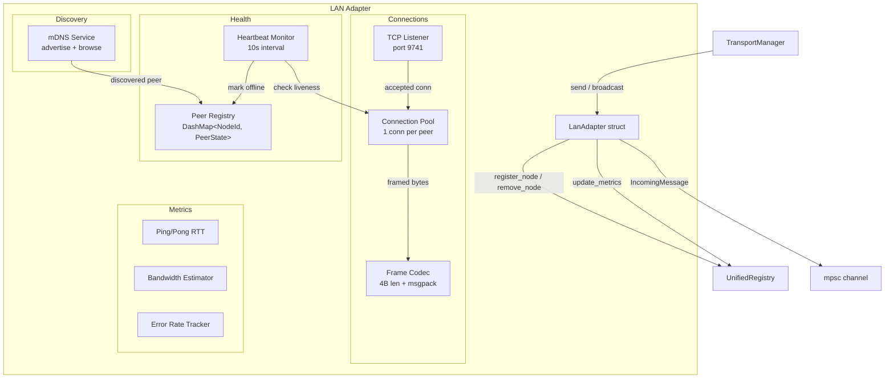
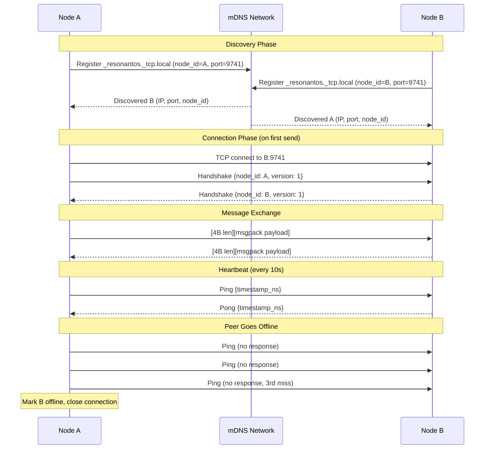
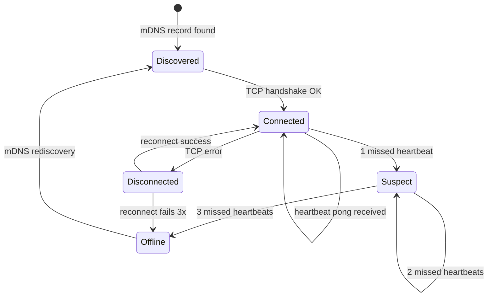

# Design Document: LAN Transport Adapter

## Overview

This design replaces the current stub `transport/adapters/lan.rs` with a production-ready LAN transport adapter. The adapter enables ResonantOS nodes on the same local network to discover each other via mDNS and communicate via TCP with length-prefixed MessagePack framing.

The adapter integrates with the existing transport layer architecture:
- Implements the `MeshTransport` trait (defined in `trait_def.rs`)
- Registers with `TransportManager` for path selection and failover
- Updates `UnifiedRegistry` with peer topology and path metrics

**Key technical choices:**
- `mdns-sd` crate for cross-platform mDNS (Bonjour/Avahi/Windows mDNS)
- `tokio` async TCP for all socket operations
- `rmp-serde` (MessagePack) for wire serialization
- 4-byte big-endian length-prefixed framing
- One TCP connection per peer (connection pool)
- Heartbeat every 10s, offline after 3 missed pings (30s)
- Default port: 9741

## Architecture



### Connection Lifecycle



### Heartbeat State Machine



## Components and Interfaces

### Module Structure

The implementation lives in `src/transport/adapters/lan/` as a subdirectory module:

```
transport/adapters/lan/
├── mod.rs          # LanAdapter struct, MeshTransport impl, public API
├── config.rs       # LanAdapterConfig, constants
├── discovery.rs    # mDNS advertisement and browsing logic
├── connection.rs   # ConnectionPool, TCP connect/accept, handshake
├── codec.rs        # Frame encoding/decoding, MessagePack serialization
├── heartbeat.rs    # HeartbeatMonitor, ping/pong protocol
├── peer.rs         # PeerRegistry, PeerState, PeerInfo
├── metrics.rs      # Bandwidth estimation, error rate tracking
└── tests.rs        # Property-based tests and unit tests
```

### Key Interfaces

```rust
// mod.rs — public API
impl LanAdapter {
    pub async fn new(config: LanAdapterConfig, local_node_id: NodeId) -> Result<Self, LanError>;
    pub async fn start(&self) -> Result<(), LanError>;
    pub fn incoming_messages(&self) -> mpsc::Receiver<IncomingMessage>;
}

// config.rs
pub struct LanAdapterConfig {
    pub listen_port: u16,              // default: 9741
    pub mdns_service_type: String,     // "_resonantos._tcp.local"
    pub heartbeat_interval: Duration,  // 10s
    pub heartbeat_timeout_count: u8,   // 3 missed = offline
    pub connect_timeout: Duration,     // 2s
    pub max_message_size: u64,         // 64MB
    pub idle_keepalive: Duration,      // 60s
    pub stale_peer_timeout: Duration,  // 5 minutes
    pub max_retry_attempts: u8,        // 3
    pub frame_read_timeout: Duration,  // 10s
}

// discovery.rs
pub struct MdnsDiscovery {
    pub async fn start(&self, local_node_id: NodeId, port: u16, hostname: String) -> Result<(), LanError>;
    pub async fn stop(&self) -> Result<(), LanError>;
    pub fn on_peer_discovered(&self) -> mpsc::Receiver<DiscoveredPeerEvent>;
    pub fn on_peer_removed(&self) -> mpsc::Receiver<NodeId>;
}

// connection.rs
pub struct ConnectionPool {
    pub async fn get_or_connect(&self, peer: &PeerInfo) -> Result<Arc<PeerConnection>, LanError>;
    pub async fn send_framed(&self, peer_id: &NodeId, data: &[u8]) -> Result<(), LanError>;
    pub async fn close(&self, peer_id: &NodeId);
    pub async fn close_all(&self);
    pub fn connection_count(&self) -> usize;
}

// codec.rs
pub fn encode_frame(message: &TransportMessage) -> Result<Vec<u8>, LanError>;
pub fn decode_frame(data: &[u8]) -> Result<TransportMessage, LanError>;
pub async fn read_frame(stream: &mut TcpStream) -> Result<Vec<u8>, LanError>;
pub async fn write_frame(stream: &mut TcpStream, data: &[u8]) -> Result<(), LanError>;

// heartbeat.rs
pub struct HeartbeatMonitor {
    pub async fn start(&self, peers: Arc<PeerRegistry>, pool: Arc<ConnectionPool>);
    pub async fn stop(&self);
}

// peer.rs
pub struct PeerRegistry {
    pub fn insert(&self, peer: PeerInfo) -> Option<PeerInfo>;
    pub fn remove(&self, node_id: &NodeId) -> Option<PeerInfo>;
    pub fn get(&self, node_id: &NodeId) -> Option<PeerInfo>;
    pub fn update_address(&self, node_id: &NodeId, new_addr: SocketAddr);
    pub fn mark_offline(&self, node_id: &NodeId);
    pub fn mark_online(&self, node_id: &NodeId);
    pub fn connected_peers(&self) -> Vec<NodeId>;
    pub fn all_peers(&self) -> Vec<PeerInfo>;
    pub fn record_send_result(&self, node_id: &NodeId, success: bool);
    pub fn error_rate(&self, node_id: &NodeId) -> f64;
}
```

## Data Models

```rust
// ─── Configuration ───────────────────────────────────────────────────────────

pub struct LanAdapterConfig {
    pub listen_port: u16,
    pub mdns_service_type: String,
    pub heartbeat_interval: Duration,
    pub heartbeat_timeout_count: u8,
    pub connect_timeout: Duration,
    pub max_message_size: u64,
    pub idle_keepalive: Duration,
    pub stale_peer_timeout: Duration,
    pub max_retry_attempts: u8,
    pub frame_read_timeout: Duration,
}

// ─── Peer State ──────────────────────────────────────────────────────────────

#[derive(Debug, Clone, PartialEq)]
pub enum PeerStatus {
    Discovered,       // Found via mDNS, not yet connected
    Connected,        // TCP handshake complete, healthy
    Suspect,          // 1-2 missed heartbeats
    Offline,          // 3+ missed heartbeats or connection failed
    Disconnected,     // TCP error, attempting reconnect
}

#[derive(Debug, Clone)]
pub struct PeerInfo {
    pub node_id: NodeId,
    pub address: SocketAddr,
    pub hostname: String,
    pub status: PeerStatus,
    pub last_seen_ms: u64,
    pub missed_heartbeats: u8,
    pub last_latency_ms: Option<f64>,
    pub bandwidth_estimate: Option<BandwidthEstimate>,
    pub send_history: VecDeque<bool>,  // last 10 send results (true=success)
}

// ─── Wire Protocol ───────────────────────────────────────────────────────────

/// Handshake message exchanged on TCP connection establishment.
#[derive(Debug, Clone, Serialize, Deserialize)]
pub struct Handshake {
    pub node_id: NodeId,
    pub protocol_version: u8,  // Currently 1
    pub capabilities: u32,     // Bitflags for future extensions
}

/// Internal wire message types (wraps TransportMessage + control messages).
#[derive(Debug, Clone, Serialize, Deserialize)]
pub enum WireMessage {
    /// Regular transport message.
    Data(TransportMessage),
    /// Heartbeat ping with nanosecond timestamp.
    Ping { timestamp_ns: u64 },
    /// Heartbeat pong echoing the original timestamp.
    Pong { timestamp_ns: u64 },
    /// Graceful disconnect notification.
    Goodbye,
}

// ─── Errors ──────────────────────────────────────────────────────────────────

#[derive(Debug, Clone)]
pub enum LanError {
    MdnsRegistrationFailed { reason: String },
    MdnsBrowseFailed { reason: String },
    TcpBindFailed { port: u16, reason: String },
    ConnectionFailed { peer: NodeId, reason: String },
    HandshakeFailed { reason: String },
    FrameTooLarge { size: u64, max: u64 },
    FrameTimeout,
    SerializationError { reason: String },
    DeserializationError { reason: String },
    PeerNotFound { node_id: NodeId },
    Shutdown,
}

// ─── Internal Events ─────────────────────────────────────────────────────────

pub struct DiscoveredPeerEvent {
    pub node_id: NodeId,
    pub address: SocketAddr,
    pub hostname: String,
}
```

## Algorithm Design

### mDNS Discovery Flow

1. **Advertisement**: On `start()`, register `_resonantos._tcp.local` with TXT record `node_id=<uuid>`. Service instance name: `<hostname>._resonantos._tcp.local`.
2. **Browsing**: Continuously browse for `_resonantos._tcp.local`. On discovery:
   - Parse TXT record for `node_id`
   - Filter self (skip if `node_id == local_node_id`)
   - Add to `PeerRegistry` with status `Discovered`
   - Notify `UnifiedRegistry` via `register_node`
3. **Removal**: When mDNS record disappears, begin heartbeat verification (don't immediately remove — mDNS can be flaky).
4. **Retry**: If registration fails, retry with exponential backoff (1s, 2s, 4s), max 3 attempts.

### Connection Lifecycle

1. **Lazy connect**: Connections are established on first `send()` to a peer (not on discovery).
2. **Handshake**: After TCP connect, both sides exchange `Handshake` message (framed). Validates `node_id` matches expected peer.
3. **Bidirectional**: Once connected, either side can send. The first to connect "wins" — if both connect simultaneously, the node with the lower UUID keeps its outgoing connection and the other drops.
4. **Reconnect**: On connection failure, retry 3x with backoff (100ms, 200ms, 400ms). After 3 failures, mark peer as `Disconnected`.

### Heartbeat Protocol

1. Every 10s, send `WireMessage::Ping { timestamp_ns }` to each connected peer.
2. On receiving `Ping`, immediately respond with `Pong` echoing the timestamp.
3. Track `missed_heartbeats` counter per peer:
   - Pong received → reset to 0, update `last_latency_ms`
   - No pong within interval → increment
   - Counter reaches 3 → mark offline, close connection, notify registry
4. RTT = `now_ns - timestamp_ns` from the pong.

### Frame Codec

```
┌──────────────────────────────────────────┐
│  4 bytes (u32 BE)  │  N bytes payload    │
│  message length    │  MessagePack data   │
└──────────────────────────────────────────┘
```

- **Encode**: `rmp_serde::to_vec(&wire_message)` → prepend 4-byte length
- **Decode**: Read 4 bytes → parse as u32 BE → read N bytes → `rmp_serde::from_slice`
- **Max size**: 64MB. Reject frames with length > 67,108,864.
- **Timeout**: If partial frame doesn't complete within 10s, close connection.

### Bandwidth Estimation

- Piggyback on large transfers (>1MB): record `bytes_transferred` and `duration`
- Formula: `bandwidth_mbps = (bytes * 8) / (duration_secs * 1_000_000)`
- Store per-peer with timestamp and confidence (confidence increases with more measurements)
- Initial estimate: 1000 Mbps (gigabit LAN assumption), confidence 0.3

## Integration Points

### With TransportManager

```rust
// Registration (in app startup)
let lan_adapter = LanAdapter::new(LanAdapterConfig::default(), local_node_id).await?;
lan_adapter.start().await?;
transport_manager.register_adapter(Box::new(lan_adapter));
```

The adapter implements `MeshTransport` with ID `"lan"`. The `TransportManager` calls:
- `discover_peers()` → returns all peers in `PeerRegistry` with status `Connected`
- `send(target, message)` → serializes, frames, writes to TCP connection
- `broadcast(message)` → sends to all connected peers
- `health_check()` → reports running state, peer count, error rate
- `shutdown()` → deregisters mDNS, closes all connections, cancels tasks

### With UnifiedRegistry

The adapter updates the registry on:
- **Peer discovered**: `registry.register_node(node_id, hostname, "lan", now)`
- **Peer offline**: `registry.remove_node(&node_id, &"lan")`
- **Latency measured**: `registry.update_metrics(local_id, peer_id, "lan", metrics, now)`
- **Path degraded**: `registry.mark_path_failed(&peer_id, &"lan", now)`
- **Path recovered**: `registry.mark_path_active(&peer_id, &"lan")`

### With Existing Adapters

The LAN adapter coexists with WireGuard and Reticulum adapters. A node may be reachable via multiple transports simultaneously. The `PathSelector` chooses the best path based on latency/bandwidth/reliability — LAN typically wins for same-network peers due to sub-millisecond latency.

## Correctness Properties

*A property is a characteristic or behavior that should hold true across all valid executions of a system — essentially, a formal statement about what the system should do. Properties serve as the bridge between human-readable specifications and machine-verifiable correctness guarantees.*

### Property 1: Serialization Round-Trip

*For any* valid `WireMessage` (including all variants: `Data(TransportMessage)`, `Ping`, `Pong`, `Goodbye`), encoding with `encode_frame` then decoding with `decode_frame` SHALL produce an equivalent message.

**Validates: Requirements 6.1, 6.2, 6.3, 6.6, 7.1, 8.1**

### Property 2: Connection Pool Invariant

*For any* sequence of connection operations (connect, send, disconnect, reconnect) across any number of peers, the connection pool SHALL maintain at most one active TCP connection per peer at any point in time.

**Validates: Requirements 5.1, 5.2**

### Property 3: Broadcast Completeness

*For any* set of peers where some are connected and some are not, calling `broadcast` SHALL send the message to exactly the connected peers and return a count equal to the number of successful sends.

**Validates: Requirements 9.1, 9.2**

### Property 4: Pong Echoes Ping Timestamp

*For any* `Ping` message with an arbitrary `timestamp_ns` value, the corresponding `Pong` response SHALL contain the exact same `timestamp_ns` value.

**Validates: Requirements 10.2**

### Property 5: Bandwidth Calculation

*For any* transfer with `bytes_transferred > 0` and `duration_seconds > 0`, the computed bandwidth SHALL equal `(bytes_transferred * 8) / (duration_seconds * 1_000_000)` Mbps.

**Validates: Requirements 11.1**

### Property 6: Heartbeat Liveness Detection

*For any* peer and any sequence of heartbeat responses (received/missed), the peer SHALL be marked offline if and only if 3 consecutive heartbeats are missed. Receiving any pong resets the counter to 0.

**Validates: Requirements 12.2**

### Property 7: mDNS Record Parsing

*For any* valid mDNS TXT record containing a `node_id` UUID, an IP address, and a port number, the discovery handler SHALL correctly extract all three fields and add the peer to the registry with matching values.

**Validates: Requirements 2.2**

### Property 8: IncomingMessage Metadata

*For any* message received from a peer, the resulting `IncomingMessage` SHALL have `transport_id == "lan"`, `source_node` equal to the sending peer's `node_id`, and a `received_at_ms` timestamp that is non-decreasing relative to previously received messages.

**Validates: Requirements 8.2**

### Property 9: Fault Isolation

*For any* set of connected peers, if one peer's connection fails, all other peers SHALL remain connected and able to send/receive messages without interruption.

**Validates: Requirements 18.1**

### Property 10: Error Rate and Degradation Threshold

*For any* peer and any sequence of send results (success/failure), the reported error rate SHALL equal `failures / total` over the last 10 attempts, and the peer's path SHALL be marked as degraded if and only if the error rate exceeds 50%.

**Validates: Requirements 18.3, 18.4**

### Property 11: Health Report Accuracy

*For any* adapter state (varying number of connected peers, running/stopped, error histories), `health_check()` SHALL report `peers_reachable` equal to the actual count of connected peers, `is_healthy` equal to the running state, and `error_rate_percent` matching the aggregate error rate.

**Validates: Requirements 15.3**

### Property 12: IP Change Updates Peer Registry

*For any* peer that is rediscovered via mDNS with the same `node_id` but a different IP address, the peer registry SHALL update to the new address, and subsequent sends SHALL use the new address.

**Validates: Requirements 13.3**

## Error Handling

### Error Categories and Responses

| Error | Response | Recovery |
|-------|----------|----------|
| mDNS registration failure | Log, retry 3x with backoff | Fall back to manual peer entry |
| TCP bind failure | Set `is_healthy = false` | Report in health_check, no auto-recovery |
| Connection refused | Retry 3x (100ms, 200ms, 400ms) | Mark peer unreachable after 3 failures |
| Connection timeout (2s) | Return `TransportError::Timeout` | Retry on next send |
| Write failure | Reconnect once, retry send | If retry fails, return error |
| Frame too large (>64MB) | Return `TransportError::MessageTooLarge` | Drop message, connection stays open |
| Frame read timeout (10s) | Close connection | Reconnect on next interaction |
| Deserialization failure | Log, discard frame | Continue reading next frame |
| Heartbeat timeout (3 missed) | Mark peer offline | Wait for mDNS rediscovery |
| Network interface change | Re-register mDNS, reconnect | Auto-recovery within 10s |
| Peer error rate >50% | Mark path degraded | Continue monitoring, recover if rate drops |

### Error Isolation Principles

1. **Per-peer isolation**: A failure with one peer never affects connections to other peers.
2. **Subsystem isolation**: mDNS errors don't stop TCP operations; TCP errors don't stop mDNS browsing.
3. **Graceful degradation**: If mDNS is unavailable, manual peer entry still works. If a peer is degraded, it's deprioritized but not removed.
4. **No panics**: All error paths return `Result` or log and continue. The adapter never panics on network errors.

## Testing Strategy

### Property-Based Tests (proptest)

Each correctness property maps to a `proptest` test with minimum 100 iterations:

| Property | Test Approach |
|----------|--------------|
| 1: Round-trip | Generate arbitrary `WireMessage`, encode→decode, assert equality |
| 2: Pool invariant | Generate random op sequences, assert max 1 conn per peer |
| 3: Broadcast | Generate peer sets with random connectivity, assert correct delivery |
| 4: Pong echo | Generate random u64 timestamps, verify echo |
| 5: Bandwidth | Generate random (bytes, duration) pairs, verify formula |
| 6: Heartbeat | Generate hit/miss sequences, verify offline transition |
| 7: mDNS parsing | Generate random valid TXT records, verify extraction |
| 8: IncomingMessage | Generate messages from random peers, verify metadata |
| 9: Fault isolation | Generate peer sets, fail one, verify others unaffected |
| 10: Error rate | Generate success/failure sequences, verify rate and threshold |
| 11: Health accuracy | Generate adapter states, verify health_check output |
| 12: IP change | Generate IP changes, verify registry update |

**Configuration:**
- Library: `proptest` (already in dev-dependencies)
- Minimum iterations: 100 per property
- Tag format: `// Feature: lan-transport-adapter, Property N: <title>`

### Unit Tests

- Handshake protocol exchange (happy path + version mismatch)
- Self-discovery filtering (node_id == local_id → ignore)
- Connection timeout after 2s
- Frame size rejection at 64MB boundary
- Shutdown completes within 2s
- Keepalive sent after 60s idle
- Stale peer cleanup after 5 minutes

### Integration Tests

- Two LanAdapter instances on loopback discovering each other via mDNS
- Message send/receive between two adapters
- Peer goes offline and is detected within 30s
- Network interface change recovery
- Registration with TransportManager and path selection

## Configuration Parameters

| Parameter | Default | Description |
|-----------|---------|-------------|
| `listen_port` | 9741 | TCP listener port |
| `mdns_service_type` | `_resonantos._tcp.local` | mDNS service type for browsing/advertising |
| `heartbeat_interval` | 10s | Time between heartbeat pings |
| `heartbeat_timeout_count` | 3 | Missed pings before marking offline |
| `connect_timeout` | 2s | TCP connection timeout |
| `max_message_size` | 64MB | Maximum frame size |
| `idle_keepalive` | 60s | Send keepalive after this idle duration |
| `stale_peer_timeout` | 5min | Close connections to unreachable peers after this |
| `max_retry_attempts` | 3 | Retry count for connections and mDNS registration |
| `frame_read_timeout` | 10s | Timeout for incomplete frame reads |
| `mdns_retry_backoff_base` | 1s | Base for mDNS registration retry backoff |
| `connect_retry_backoff_base` | 100ms | Base for connection retry backoff |

### New Cargo Dependencies

```toml
[dependencies]
mdns-sd = "0.11"          # Cross-platform mDNS (Bonjour/Avahi/Windows)
rmp-serde = "1"           # MessagePack serialization
# tokio already present with time, sync features
# Need to add: features = ["net", "io-util", "rt-multi-thread"]
```
