# Design Document: Local Cluster

## Overview

Local Cluster is Phase 9 — extending the Compute Fabric to orchestrate multiple heterogeneous LAN machines as a unified compute pool. The system uses mDNS for zero-config discovery, gRPC for inter-node communication, and the Phase 7 HardwareProfile for capability-aware scheduling.

The system is split across three layers:

- **Rust Cluster Orchestrator** (`src-tauri/src/cluster_orchestrator.rs`): Runs on the primary desktop. Handles node discovery, workload placement, model registry, fault detection, and capacity reporting. Exposes IPC commands for the TypeScript layer.
- **Rust Cluster Agent** (`src-tauri/src/cluster_agent.rs`): Runs on each participating node. Reports hardware status, accepts and executes workloads, manages local model loading, and streams utilization metrics to the orchestrator.
- **TypeScript Cluster Client** (`src/core/cluster.ts`): Provides typed IPC wrappers, cluster status subscriptions, and integration with the Cost Dashboard for cluster metrics display.

### Key Design Decisions

1. **gRPC over TLS for LAN communication**: LAN has reliable, low-latency TCP. gRPC provides typed RPCs, bidirectional streaming (for metrics), and mutual TLS authentication. No need for Reticulum's delay-tolerance on LAN.

2. **mDNS for zero-config discovery**: Nodes announce via `_resonantos-cluster._tcp` service type. No manual IP configuration needed. Fallback to manual registration for networks blocking mDNS.

3. **Orchestrator on primary desktop**: Single orchestrator simplifies scheduling (no distributed consensus needed for LAN). If the orchestrator goes offline, agents continue serving in-flight workloads but don't accept new ones.

4. **Model-aware placement**: The orchestrator tracks which models are loaded on which nodes. Inference requests prefer nodes with the model already in memory (avoiding 30s+ cold-start model loads).

5. **Model transfer protocol**: When a node needs a model it doesn't have, it can pull from: (a) the artifact store, (b) peer-to-peer transfer from a node that has it cached (faster for large models on fast LAN).

6. **No tensor parallelism, but pipeline parallelism on fast LAN**: Each model instance runs entirely on one node for the common case. However, on 10GbE+ connections, the system supports optional pipeline parallelism: prefill on GPU node, KV cache transfer, decode on high-RAM node. This enables running models that don't fit on any single machine without the per-token latency penalty of tensor parallelism.

## Architecture

```mermaid
graph TD
    subgraph "Primary Desktop (Orchestrator)"
        CO[Cluster Orchestrator<br/>scheduling, placement]
        NR[Node Registry<br/>profiles, status]
        MR[Model Registry<br/>cluster-wide model index]
        WQ[Workload Queue<br/>pending placements]
        FD[Fault Detector<br/>heartbeat monitoring]
    end

    subgraph "Node A (GPU Workstation)"
        CA1[Cluster Agent]
        M1[Models: qwen-35b, codestral-25b]
        HW1[HardwareProfile: RTX 4090, 64GB RAM]
    end

    subgraph "Node B (CPU Server)"
        CA2[Cluster Agent]
        M2[Models: qwen-7b, phi-3]
        HW2[HardwareProfile: 128GB RAM, no GPU]
    end

    subgraph "Node C (Embedded)"
        CA3[Cluster Agent]
        M3[Models: phi-3-mini]
        HW3[HardwareProfile: 8GB RAM, ARM]
    end

    CO -->|gRPC: SubmitWorkload| CA1
    CO -->|gRPC: SubmitWorkload| CA2
    CO -->|gRPC: SubmitWorkload| CA3
    CA1 -->|gRPC stream: ReportStatus| CO
    CA2 -->|gRPC stream: ReportStatus| CO
    CA3 -->|gRPC stream: ReportStatus| CO
    CO --> NR
    CO --> MR
    CO --> WQ
    FD -->|heartbeat timeout| CO
```



## Components and Interfaces

### 1. Cluster Orchestrator

```rust
// src-tauri/src/cluster_orchestrator.rs

use serde::{Deserialize, Serialize};

#[derive(Debug, Clone, Serialize, Deserialize)]
#[serde(rename_all = "camelCase")]
pub struct ClusterNode {
    pub node_id: String,
    pub display_name: String,
    pub address: String,                    // IP:port
    pub hardware_profile: HardwareProfile,
    pub status: NodeHealth,
    pub loaded_models: Vec<String>,
    pub active_workloads: u32,
    pub cpu_utilization: f64,
    pub ram_utilization: f64,
    pub gpu_utilization: Option<f64>,
    pub vram_utilization: Option<f64>,
    pub last_heartbeat: String,
    pub registered_at: String,
    pub confirmed: bool,                    // user approved this node
}

#[derive(Debug, Clone, Serialize, Deserialize, PartialEq)]
#[serde(rename_all = "kebab-case")]
pub enum NodeHealth {
    Ready,
    Busy,
    Degraded,
    Offline,
}

#[derive(Debug, Clone, Serialize, Deserialize)]
#[serde(rename_all = "camelCase")]
pub struct WorkloadRequest {
    pub id: String,
    pub workload_type: String,              // "inference" | "agent-execution" | "training"
    pub required_model: Option<String>,
    pub min_vram_mb: Option<u64>,
    pub min_ram_mb: Option<u64>,
    pub requires_gpu: bool,
    pub priority: String,                   // "interactive" | "batch" | "background"
    pub timeout_ms: u64,
    pub affinity_node_id: Option<String>,
    pub payload: serde_json::Value,
}

#[derive(Debug, Clone, Serialize, Deserialize)]
#[serde(rename_all = "camelCase")]
pub struct PlacementDecision {
    pub workload_id: String,
    pub target_node_id: String,
    pub reason: String,
    pub estimated_start_ms: u64,
    pub model_already_loaded: bool,
}

#[derive(Debug, Clone, Serialize, Deserialize, PartialEq)]
#[serde(rename_all = "kebab-case")]
pub enum PlacementStrategy {
    BestFit,
    Spread,
    Pack,
}

#[derive(Debug, Clone, Serialize, Deserialize)]
#[serde(rename_all = "camelCase")]
pub struct NodeAffinity {
    pub workload_type: String,
    pub preferred_node_id: String,
    pub weight: f64,                        // 0.0-1.0, how strongly to prefer
}

#[derive(Debug, Clone, Serialize, Deserialize)]
#[serde(rename_all = "camelCase")]
pub struct ClusterCapacity {
    pub total_nodes: u32,
    pub ready_nodes: u32,
    pub total_cpu_cores: u32,
    pub total_ram_mb: u64,
    pub total_vram_mb: u64,
    pub current_cpu_utilization: f64,
    pub current_ram_utilization: f64,
    pub current_gpu_utilization: f64,
    pub active_workloads: u32,
    pub queued_workloads: u32,
    pub loaded_models: Vec<ModelInstance>,
}

#[derive(Debug, Clone, Serialize, Deserialize)]
#[serde(rename_all = "camelCase")]
pub struct ModelInstance {
    pub model_id: String,
    pub node_id: String,
    pub vram_used_mb: u64,
    pub loaded_at: String,
}

/// Place a workload on the best available node.
pub fn place_workload(
    request: &WorkloadRequest,
    nodes: &[ClusterNode],
    strategy: &PlacementStrategy,
    affinities: &[NodeAffinity],
    model_registry: &[ModelInstance],
) -> Result<PlacementDecision, String> { /* ... */ }

/// IPC commands
#[tauri::command]
pub async fn cluster_get_nodes() -> Result<Vec<ClusterNode>, String> { /* ... */ }

#[tauri::command]
pub async fn cluster_get_capacity() -> Result<ClusterCapacity, String> { /* ... */ }

#[tauri::command]
pub async fn cluster_submit_workload(request: serde_json::Value) -> Result<PlacementDecision, String> { /* ... */ }

#[tauri::command]
pub async fn cluster_confirm_node(node_id: String) -> Result<(), String> { /* ... */ }

#[tauri::command]
pub async fn cluster_remove_node(node_id: String) -> Result<(), String> { /* ... */ }

#[tauri::command]
pub async fn cluster_set_strategy(strategy: String) -> Result<(), String> { /* ... */ }

#[tauri::command]
pub async fn cluster_set_affinity(affinity: serde_json::Value) -> Result<(), String> { /* ... */ }

#[tauri::command]
pub async fn cluster_load_model(model_id: String, node_id: String) -> Result<(), String> { /* ... */ }

#[tauri::command]
pub async fn cluster_unload_model(model_id: String, node_id: String) -> Result<(), String> { /* ... */ }
```

### 2. gRPC Protocol Definition

```protobuf
// proto/cluster.proto

syntax = "proto3";
package resonantos.cluster;

service ClusterAgent {
  rpc SubmitWorkload(WorkloadRequest) returns (WorkloadResult);
  rpc CancelWorkload(CancelRequest) returns (CancelResult);
  rpc LoadModel(LoadModelRequest) returns (LoadModelResult);
  rpc UnloadModel(UnloadModelRequest) returns (UnloadModelResult);
  rpc GetStatus(StatusRequest) returns (StatusResponse);
  rpc Ping(PingRequest) returns (PingResponse);
  rpc StreamStatus(StatusRequest) returns (stream StatusUpdate);
  rpc TransferModel(TransferRequest) returns (stream ModelChunk);
}

message WorkloadRequest {
  string id = 1;
  string workload_type = 2;
  string model_id = 3;
  bytes payload = 4;
  uint64 timeout_ms = 5;
  string priority = 6;
}

message WorkloadResult {
  string workload_id = 1;
  bool success = 2;
  bytes result = 3;
  uint64 duration_ms = 4;
  string error = 5;
}

message StatusUpdate {
  string node_id = 1;
  double cpu_utilization = 2;
  double ram_utilization = 3;
  double gpu_utilization = 4;
  double vram_utilization = 5;
  repeated string loaded_models = 6;
  uint32 active_workloads = 7;
  string thermal_state = 8;
  string timestamp = 9;
}

message TransferRequest {
  string model_id = 1;
  string source_node_id = 2;
}

message ModelChunk {
  bytes data = 1;
  uint64 offset = 2;
  uint64 total_size = 3;
  bool is_last = 4;
}
```

## Correctness Properties

### Property 1: Capability gate enforcement
*For any* WorkloadRequest requiring GPU, `place_workload` SHALL never select a node without GPU capability.

### Property 2: Model-aware preference
*For any* inference WorkloadRequest specifying a model, `place_workload` SHALL prefer nodes with that model already loaded over nodes requiring cold-start loading.

### Property 3: Placement speed
*For any* placement decision, `place_workload` SHALL complete within 10 milliseconds.

### Property 4: Fault detection timing
*For any* node that stops sending heartbeats, the orchestrator SHALL detect the failure and transition the node to "offline" within 30 seconds.

### Property 5: Single-machine fallback
*When* all remote nodes are offline, the system SHALL operate identically to a single-machine installation with zero errors.

### Property 6: Cluster secret authentication
*For any* gRPC call between orchestrator and agent, mutual TLS authentication SHALL be enforced. Unauthenticated calls SHALL be rejected.

### Property 7: Resource overcommit prevention
*For any* placement decision, the target node's post-placement resource usage SHALL NOT exceed its Resource_Envelope limits.
