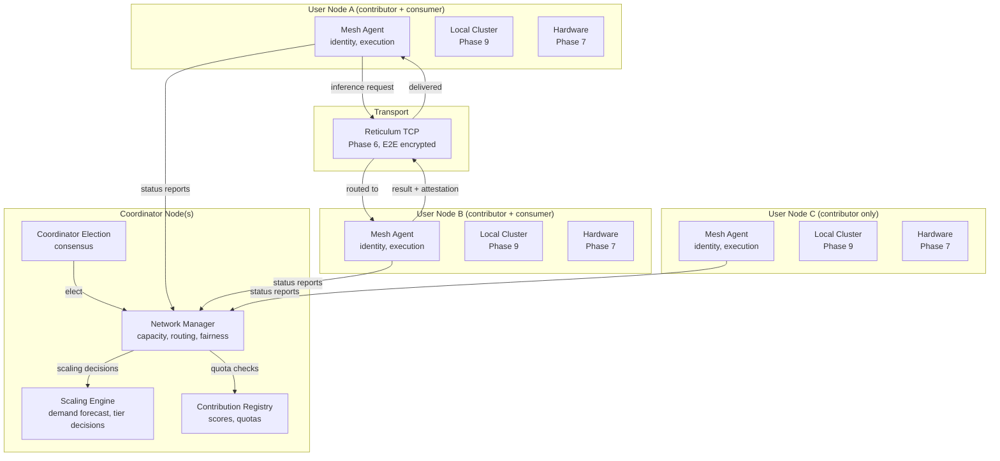

# Design Document: Mesh Compute Network

## Overview

Mesh Compute Network is Phase 10 — extending the Local Cluster across trust boundaries via Reticulum TCP transport, enabling multiple users to pool hardware with fractional-reserve economics and dynamic model scaling.

The system is split across four layers:

- **Rust Network Manager** (`src-tauri/src/mesh_network_manager.rs`): Runs on coordinator nodes. Handles capacity tracking, scaling decisions, fair-share enforcement, request routing, and attestation verification.
- **Rust Mesh Agent** (`src-tauri/src/mesh_agent.rs`): Runs on every participating node. Handles network identity, contribution reporting, workload execution for network requests, and attestation generation.
- **Python Scaling Engine** (`training/mesh_scaling/`): Implements the demand forecasting and scaling decision logic. Runs as a background service on coordinator nodes.
- **TypeScript Mesh Client** (`src/core/mesh-network.ts`): Provides typed IPC wrappers, network status display, contribution tracking UI, and QoS configuration.

### Key Design Decisions

1. **Reticulum TCP for inter-node communication**: Provides end-to-end encryption, identity-based addressing, and works across NATs. LoRa/serial excluded from compute mesh (bandwidth insufficient for inference payloads).

2. **Fractional reserve with adaptive ratio**: The 4:1 default ratio adjusts based on observed demand patterns. The system learns that weekday mornings have higher demand and adjusts reserves accordingly.

3. **Coordinator election via contribution + uptime**: No proof-of-work or stake. Coordinators are elected based on demonstrated reliability (uptime) and contribution (hardware shared). This aligns incentives — the most invested users coordinate.

4. **Compute attestation via response hashing**: After inference, the serving node signs a hash of (request + response + model_id + duration). The requester verifies this matches the received response. Prevents claiming credit without doing work.

5. **Bank-run protection**: When demand exceeds capacity, the system doesn't crash — it degrades gracefully by scaling to lighter models and queuing excess requests. Users can always fall back to local execution.

6. **Model tier scaling as the primary lever**: Rather than complex resource scheduling, the system's main scaling mechanism is switching between model tiers (heavy/medium/light). This is simple, predictable, and maps directly to user-visible quality.

7. **Reticulum path-aware routing**: The orchestrator doesn't maintain a parallel network topology — it queries Reticulum's transport layer for path quality (hop count, link rate, freshness). Reticulum already optimizes paths; we consume its knowledge rather than duplicating it.

8. **Traffic indistinguishability**: All compute traffic uses identical Reticulum packet formats as chat traffic. Packets are padded to standard size buckets. No unencrypted metadata reveals packet purpose. Intermediate nodes cannot distinguish inference requests from LXMF messages.

9. **Minimal coordinator knowledge**: Coordinators see only abstract capability classes and aggregate metrics — never exact hardware specs (fingerprinting risk), per-request contribution data (usage pattern risk), or exact attestation durations (prompt length inference risk).

## Architecture



## Components and Interfaces

### 1. Mesh Network Manager

```rust
// src-tauri/src/mesh_network_manager.rs

use serde::{Deserialize, Serialize};

#[derive(Debug, Clone, Serialize, Deserialize)]
#[serde(rename_all = "camelCase")]
pub struct NetworkState {
    pub capacity_pool_cu: f64,
    pub current_demand_cu: f64,
    pub fractional_reserve_ratio: f64,
    pub active_model_tier: ModelTier,
    pub registered_users: u32,
    pub active_users: u32,
    pub coordinator_nodes: Vec<String>,
    pub total_nodes: u32,
    pub online_nodes: u32,
}

#[derive(Debug, Clone, Serialize, Deserialize, PartialEq)]
#[serde(rename_all = "kebab-case")]
pub enum ModelTier {
    Heavy,      // 35B+, high quality, fewer instances
    Medium,     // 7B-14B, balanced
    Light,      // 1B-3B, high throughput, lower quality
}

#[derive(Debug, Clone, Serialize, Deserialize)]
#[serde(rename_all = "camelCase")]
pub struct ContributionScore {
    pub user_id: String,
    pub compute_hours_contributed: f64,
    pub compute_hours_consumed: f64,
    pub hardware_quality_factor: f64,
    pub score: f64,                         // contributed * quality / consumed
    pub fair_share_quota_cu_per_hour: f64,
    pub quota_remaining_cu: f64,
    pub tier_guarantee: ModelTier,          // minimum tier based on score
}

#[derive(Debug, Clone, Serialize, Deserialize)]
#[serde(rename_all = "camelCase")]
pub struct InferenceRequest {
    pub id: String,
    pub requester_id: String,               // Network_Identity hash
    pub model_tier_requested: ModelTier,
    pub priority: RequestPriority,
    pub payload_encrypted: Vec<u8>,         // E2E encrypted, only serving node decrypts
    pub timestamp: String,
}

#[derive(Debug, Clone, Serialize, Deserialize, PartialEq)]
#[serde(rename_all = "kebab-case")]
pub enum RequestPriority {
    Interactive,
    Batch,
    Preemptible,
}

#[derive(Debug, Clone, Serialize, Deserialize)]
#[serde(rename_all = "camelCase")]
pub struct ComputeAttestation {
    pub request_hash: String,
    pub response_hash: String,
    pub model_id: String,
    pub duration_ms: u64,
    pub node_signature: String,             // Reticulum identity signature
    pub timestamp: String,
}

#[derive(Debug, Clone, Serialize, Deserialize)]
#[serde(rename_all = "camelCase")]
pub struct ScalingDecision {
    pub from_tier: ModelTier,
    pub to_tier: ModelTier,
    pub reason: String,
    pub demand_level_percent: f64,
    pub decided_at: String,
    pub transition_deadline: String,
}

#[derive(Debug, Clone, Serialize, Deserialize)]
#[serde(rename_all = "camelCase")]
pub struct QoSMetrics {
    pub user_id: String,
    pub requests_total: u64,
    pub requests_meeting_latency_target: u64,
    pub latency_target_percent: f64,
    pub avg_quality_tier_received: String,
    pub sla_violations_30d: u32,
}

/// Route an inference request to the best available node.
pub fn route_inference_request(
    request: &InferenceRequest,
    network_state: &NetworkState,
    contribution_scores: &[ContributionScore],
    node_states: &[MeshNodeState],
) -> Result<RoutingDecision, String> { /* ... */ }

/// Verify a compute attestation.
pub fn verify_attestation(
    attestation: &ComputeAttestation,
    original_request_hash: &str,
    received_response_hash: &str,
) -> bool { /* ... */ }

/// IPC commands
#[tauri::command]
pub async fn mesh_get_network_state() -> Result<NetworkState, String> { /* ... */ }

#[tauri::command]
pub async fn mesh_get_contribution() -> Result<ContributionScore, String> { /* ... */ }

#[tauri::command]
pub async fn mesh_submit_inference(request: serde_json::Value) -> Result<serde_json::Value, String> { /* ... */ }

#[tauri::command]
pub async fn mesh_get_qos_metrics() -> Result<QoSMetrics, String> { /* ... */ }

#[tauri::command]
pub async fn mesh_withdraw() -> Result<(), String> { /* ... */ }

#[tauri::command]
pub async fn mesh_set_contribution_mode(mode: String) -> Result<(), String> { /* ... */ }

#[tauri::command]
pub async fn mesh_join_network(invitation: String) -> Result<(), String> { /* ... */ }
```

### 2. Scaling Engine

```python
# training/mesh_scaling/scaling_engine.py

from dataclasses import dataclass
from typing import List
import numpy as np

@dataclass
class DemandForecast:
    predicted_demand_cu: float
    confidence: float
    time_horizon_minutes: int
    recommended_tier: str
    reasoning: str

class ScalingEngine:
    """Predicts demand and recommends model tier scaling decisions."""

    def __init__(self, history_window_hours: int = 168):  # 1 week
        self.demand_history: List[float] = []
        self.time_history: List[str] = []

    def record_demand(self, demand_cu: float, timestamp: str):
        """Record current demand observation."""
        ...

    def forecast_demand(self, horizon_minutes: int = 60) -> DemandForecast:
        """Predict demand for the next horizon using time-series patterns."""
        ...

    def recommend_scaling(self, current_capacity_cu: float,
                          current_demand_cu: float,
                          forecast: DemandForecast) -> str:
        """
        Recommend model tier based on demand/capacity ratio:
        - demand < 50% capacity → "heavy"
        - 50-80% → "medium"  
        - > 80% → "light"
        Uses forecast to anticipate, not just react.
        """
        ...

    def compute_fractional_reserve_ratio(self, 
                                          registered_users: int,
                                          peak_concurrent_observed: int) -> float:
        """Adaptive reserve ratio from observed concurrency patterns."""
        ...
```

## Correctness Properties

### Property 1: Reserve buffer enforcement
*For any* network state, at least 20% of Capacity_Pool SHALL remain unallocated to batch/preemptible workloads.

### Property 2: Scaling threshold correctness
*For any* demand level, the active ModelTier SHALL be: Heavy when demand < 50% capacity, Medium when 50-80%, Light when > 80%.

### Property 3: Fair share proportionality
*For any* two users A and B where ContributionScore_A > ContributionScore_B, FairShareQuota_A SHALL be >= FairShareQuota_B.

### Property 4: Attestation verification
*For any* valid ComputeAttestation (matching request/response hashes, valid signature), `verify_attestation` SHALL return true. For any tampered attestation, it SHALL return false.

### Property 5: Withdrawal immediacy
*For any* withdrawal request, the user's local resources SHALL be fully reclaimed within 30 seconds.

### Property 6: Local priority guarantee
*For any* state of the mesh network, local interactive requests SHALL ALWAYS be served before network workloads on the same hardware.

### Property 7: E2E encryption
*For any* inference request routed through the mesh, the payload content SHALL be readable only by the requesting user and the serving node — no intermediate node (including coordinators) can decrypt it.

### Property 8: QoS latency guarantee
*For any* interactive request from a user within their Fair_Share_Quota, when network demand < 80% capacity, time to first token SHALL be < 5 seconds.
