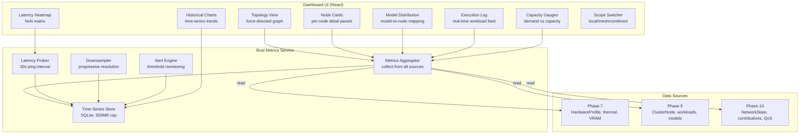

# Design Document: Network Ops Dashboard

## Overview

Network Ops Dashboard is Phase 11 — a unified visual monitoring interface integrated as a view within the MeshChat-compatible UI. Rather than a standalone application, the dashboard is implemented as new tabs/panels within the existing Reticulum community interface (MeshChat), making AI compute capabilities accessible to users already familiar with the mesh ecosystem.

The system is split across two layers:

- **TypeScript/React dashboard components** (`src/modules/network-ops/`): Topology graph, node cards, latency heatmap, model distribution, execution log, capacity gauges, and historical charts. Renders within the existing shell UI and optionally as a MeshChat extension.
- **Rust metrics aggregation service** (`src-tauri/src/network_metrics_service.rs`): Collects, aggregates, and persists time-series metrics from Phase 7 (hardware), Phase 9 (cluster), and Phase 10 (mesh). Exposes IPC commands for the dashboard components. Manages the Historical_Metrics_Store with retention and downsampling.

### Key Design Decisions

1. **MeshChat-compatible integration**: The dashboard is designed as a view that can be embedded in MeshChat (Python/Qt) via a webview panel, or rendered natively in the ResonantOS Tauri shell. Same React components, two hosting contexts.

2. **Dual-scope architecture**: Local Cluster view shows full detail (your machines, your data). Mesh Network view shows public metrics only for non-owned nodes (respecting privacy). Same components, different data scopes.

3. **Passive metric collection**: The dashboard reads existing telemetry (Phase 7 hardware state, Phase 9 cluster status, Phase 10 mesh state). The only active probing is inter-node latency pings (lightweight, 30s interval).

4. **Time-series with progressive downsampling**: Recent data at 1-minute resolution, older data downsampled to 5-minute then 1-hour. Keeps storage bounded at 500MB while retaining 30 days of history.

5. **Force-directed topology graph**: Nodes positioned by a physics simulation (force-directed layout) with connection strength proportional to communication frequency. Gives intuitive spatial representation of network structure.

## Architecture



## Components and Interfaces

### 1. Rust Metrics Service

```rust
// src-tauri/src/network_metrics_service.rs

use serde::{Deserialize, Serialize};

#[derive(Debug, Clone, Serialize, Deserialize)]
#[serde(rename_all = "camelCase")]
pub struct TopologySnapshot {
    pub nodes: Vec<TopologyNode>,
    pub connections: Vec<TopologyConnection>,
    pub timestamp: String,
}

#[derive(Debug, Clone, Serialize, Deserialize)]
#[serde(rename_all = "camelCase")]
pub struct TopologyNode {
    pub node_id: String,
    pub display_name: String,
    pub scope: String,                      // "local" | "mesh"
    pub hardware_class: String,
    pub status: String,                     // "ready" | "busy" | "degraded" | "offline"
    pub cpu_util: f64,
    pub ram_util: f64,
    pub gpu_util: Option<f64>,
    pub vram_util: Option<f64>,
    pub loaded_models: Vec<String>,
    pub active_workloads: u32,
    pub thermal_state: String,
    pub contribution_score: Option<f64>,    // mesh only
}

#[derive(Debug, Clone, Serialize, Deserialize)]
#[serde(rename_all = "camelCase")]
pub struct TopologyConnection {
    pub source_node_id: String,
    pub target_node_id: String,
    pub latency_ms: f64,
    pub bandwidth_mbps: Option<f64>,
    pub connection_type: String,            // "lan-grpc" | "mesh-reticulum"
    pub quality: String,                    // "excellent" | "good" | "fair" | "poor"
}

#[derive(Debug, Clone, Serialize, Deserialize)]
#[serde(rename_all = "camelCase")]
pub struct LatencyMatrix {
    pub node_ids: Vec<String>,
    pub latencies_ms: Vec<Vec<f64>>,        // NxN matrix
    pub measured_at: String,
}

#[derive(Debug, Clone, Serialize, Deserialize)]
#[serde(rename_all = "camelCase")]
pub struct ModelDistribution {
    pub models: Vec<ModelDistributionEntry>,
}

#[derive(Debug, Clone, Serialize, Deserialize)]
#[serde(rename_all = "camelCase")]
pub struct ModelDistributionEntry {
    pub model_id: String,
    pub model_name: String,
    pub instances: Vec<ModelInstanceInfo>,
    pub total_capacity_tps: f64,            // aggregate tokens/sec
}

#[derive(Debug, Clone, Serialize, Deserialize)]
#[serde(rename_all = "camelCase")]
pub struct ModelInstanceInfo {
    pub node_id: String,
    pub node_name: String,
    pub compatibility_class: String,
    pub vram_used_mb: u64,
    pub estimated_tps: f64,
    pub loaded_at: String,
}

#[derive(Debug, Clone, Serialize, Deserialize)]
#[serde(rename_all = "camelCase")]
pub struct ExecutionLogEntry {
    pub id: String,
    pub workload_type: String,
    pub assigned_node: String,
    pub model_used: String,
    pub duration_ms: u64,
    pub status: String,
    pub placement_reason: String,
    pub scope: String,                      // "local" | "mesh"
    pub timestamp: String,
}

#[derive(Debug, Clone, Serialize, Deserialize)]
#[serde(rename_all = "camelCase")]
pub struct CapacityMetrics {
    pub total_capacity_cu: f64,
    pub current_demand_cu: f64,
    pub utilization_percent: f64,
    pub cpu_aggregate: f64,
    pub ram_aggregate: f64,
    pub gpu_aggregate: f64,
    pub vram_aggregate: f64,
    pub active_model_tier: Option<String>,
    pub scaling_state: Option<String>,
    pub forecast_24h: Vec<ForecastPoint>,
}

#[derive(Debug, Clone, Serialize, Deserialize)]
#[serde(rename_all = "camelCase")]
pub struct ForecastPoint {
    pub timestamp: String,
    pub predicted_demand_cu: f64,
    pub confidence: f64,
}

#[derive(Debug, Clone, Serialize, Deserialize)]
#[serde(rename_all = "camelCase")]
pub struct NetworkHealthScore {
    pub score: u32,                         // 0-100
    pub components: HealthScoreComponents,
    pub alerts: Vec<HealthAlert>,
}

#[derive(Debug, Clone, Serialize, Deserialize)]
#[serde(rename_all = "camelCase")]
pub struct HealthScoreComponents {
    pub nodes_online_percent: f64,
    pub avg_latency_vs_baseline: f64,
    pub qos_violation_rate: f64,
    pub thermal_health: f64,
}

#[derive(Debug, Clone, Serialize, Deserialize)]
#[serde(rename_all = "camelCase")]
pub struct HealthAlert {
    pub severity: String,                   // "critical" | "warning" | "info"
    pub message: String,
    pub triggered_at: String,
    pub node_id: Option<String>,
}

#[derive(Debug, Clone, Serialize, Deserialize)]
#[serde(rename_all = "camelCase")]
pub struct TimeSeriesQuery {
    pub metric: String,
    pub node_id: Option<String>,
    pub from_timestamp: String,
    pub to_timestamp: String,
    pub resolution: String,                 // "1min" | "5min" | "1hour"
}

#[derive(Debug, Clone, Serialize, Deserialize)]
#[serde(rename_all = "camelCase")]
pub struct TimeSeriesResult {
    pub metric: String,
    pub points: Vec<TimeSeriesPoint>,
}

#[derive(Debug, Clone, Serialize, Deserialize)]
#[serde(rename_all = "camelCase")]
pub struct TimeSeriesPoint {
    pub timestamp: String,
    pub value: f64,
}

/// IPC commands
#[tauri::command]
pub async fn netops_get_topology(scope: String) -> Result<TopologySnapshot, String> { /* ... */ }

#[tauri::command]
pub async fn netops_get_latency_matrix(scope: String) -> Result<LatencyMatrix, String> { /* ... */ }

#[tauri::command]
pub async fn netops_get_model_distribution(scope: String) -> Result<ModelDistribution, String> { /* ... */ }

#[tauri::command]
pub async fn netops_get_execution_log(limit: u32, scope: String) -> Result<Vec<ExecutionLogEntry>, String> { /* ... */ }

#[tauri::command]
pub async fn netops_get_capacity(scope: String) -> Result<CapacityMetrics, String> { /* ... */ }

#[tauri::command]
pub async fn netops_get_health_score() -> Result<NetworkHealthScore, String> { /* ... */ }

#[tauri::command]
pub async fn netops_query_timeseries(query: TimeSeriesQuery) -> Result<TimeSeriesResult, String> { /* ... */ }

#[tauri::command]
pub async fn netops_export_metrics(from: String, to: String, format: String) -> Result<String, String> { /* ... */ }
```

### 2. TypeScript Dashboard Client

```typescript
// src/core/network-ops.ts

import { invoke } from "@tauri-apps/api/core";

export type DashboardScope = "local" | "mesh" | "combined";

export const getTopology = (scope: DashboardScope): Promise<TopologySnapshot> =>
  invoke("netops_get_topology", { scope });

export const getLatencyMatrix = (scope: DashboardScope): Promise<LatencyMatrix> =>
  invoke("netops_get_latency_matrix", { scope });

export const getModelDistribution = (scope: DashboardScope): Promise<ModelDistribution> =>
  invoke("netops_get_model_distribution", { scope });

export const getExecutionLog = (limit: number, scope: DashboardScope): Promise<ExecutionLogEntry[]> =>
  invoke("netops_get_execution_log", { limit, scope });

export const getCapacity = (scope: DashboardScope): Promise<CapacityMetrics> =>
  invoke("netops_get_capacity", { scope });

export const getHealthScore = (): Promise<NetworkHealthScore> =>
  invoke("netops_get_health_score");

export const queryTimeSeries = (query: TimeSeriesQuery): Promise<TimeSeriesResult> =>
  invoke("netops_query_timeseries", { query });

export const exportMetrics = (from: string, to: string, format: "csv" | "json"): Promise<string> =>
  invoke("netops_export_metrics", { from, to, format });
```

## Data Models

### Metrics Store Schema (`network_metrics.db`)

```sql
-- Time-series metrics (1-minute resolution, 30-day retention)
CREATE TABLE IF NOT EXISTS metrics_1min (
    node_id TEXT NOT NULL,
    metric TEXT NOT NULL,
    value REAL NOT NULL,
    timestamp TEXT NOT NULL,
    PRIMARY KEY (node_id, metric, timestamp)
);

-- Downsampled metrics (5-minute resolution, 90-day retention)
CREATE TABLE IF NOT EXISTS metrics_5min (
    node_id TEXT NOT NULL,
    metric TEXT NOT NULL,
    value_avg REAL NOT NULL,
    value_min REAL NOT NULL,
    value_max REAL NOT NULL,
    timestamp TEXT NOT NULL,
    PRIMARY KEY (node_id, metric, timestamp)
);

-- Downsampled metrics (1-hour resolution, 365-day retention)
CREATE TABLE IF NOT EXISTS metrics_1hour (
    node_id TEXT NOT NULL,
    metric TEXT NOT NULL,
    value_avg REAL NOT NULL,
    value_min REAL NOT NULL,
    value_max REAL NOT NULL,
    timestamp TEXT NOT NULL,
    PRIMARY KEY (node_id, metric, timestamp)
);

-- Latency measurements
CREATE TABLE IF NOT EXISTS latency_probes (
    source_node_id TEXT NOT NULL,
    target_node_id TEXT NOT NULL,
    latency_ms REAL NOT NULL,
    timestamp TEXT NOT NULL
);

-- Execution log (retained 30 days)
CREATE TABLE IF NOT EXISTS execution_log (
    id TEXT PRIMARY KEY,
    workload_type TEXT NOT NULL,
    assigned_node TEXT NOT NULL,
    model_used TEXT NOT NULL,
    duration_ms INTEGER NOT NULL,
    status TEXT NOT NULL,
    placement_reason TEXT NOT NULL,
    scope TEXT NOT NULL,
    timestamp TEXT NOT NULL
);

-- Health alerts
CREATE TABLE IF NOT EXISTS health_alerts (
    id TEXT PRIMARY KEY,
    severity TEXT NOT NULL,
    message TEXT NOT NULL,
    triggered_at TEXT NOT NULL,
    resolved_at TEXT,
    node_id TEXT
);

-- Indexes
CREATE INDEX IF NOT EXISTS idx_metrics_1min_ts ON metrics_1min(timestamp);
CREATE INDEX IF NOT EXISTS idx_metrics_1min_node ON metrics_1min(node_id, metric);
CREATE INDEX IF NOT EXISTS idx_latency_ts ON latency_probes(timestamp);
CREATE INDEX IF NOT EXISTS idx_exec_log_ts ON execution_log(timestamp);
CREATE INDEX IF NOT EXISTS idx_exec_log_node ON execution_log(assigned_node);
CREATE INDEX IF NOT EXISTS idx_alerts_severity ON health_alerts(severity);
```

## Correctness Properties

### Property 1: Topology accuracy
*For any* node in the Phase 9 Node Registry or Phase 10 Network Registry, the topology view SHALL display that node with correct status within 5 seconds of a state change.

### Property 2: Latency measurement validity
*For any* latency probe between two online nodes, the measured value SHALL be within 20% of the actual network round-trip time (no systematic bias).

### Property 3: Privacy enforcement
*For any* non-owned mesh node, the dashboard SHALL display only public metrics (status, model tier, capacity contribution). Internal utilization, workload details, and conversation data SHALL NOT be visible.

### Property 4: Storage bounds
*For any* operational duration, the Historical_Metrics_Store SHALL NOT exceed 500MB. Downsampling and eviction SHALL maintain this bound automatically.

### Property 5: Dashboard resource limits
*For any* state of the dashboard, RAM consumption SHALL be < 50MB when active and < 5MB when hidden. Rendering SHALL maintain 60fps with up to 50 nodes.

### Property 6: Health score determinism
*For any* set of input metrics, the NetworkHealthScore computation SHALL be deterministic (same inputs → same score).
