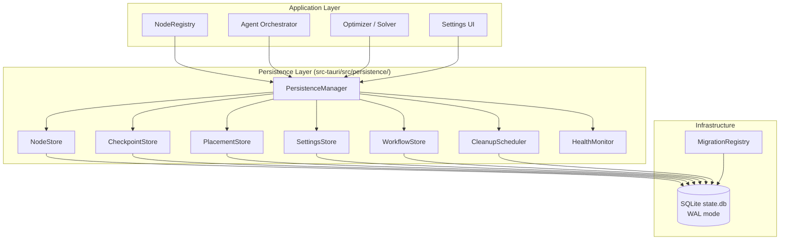
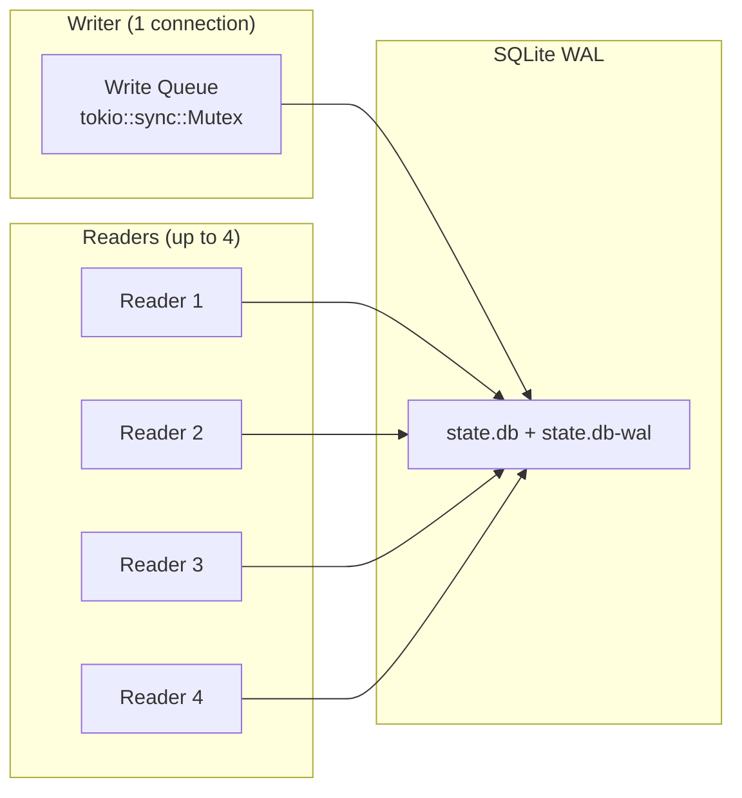

# Design Document: Node Persistence Layer

## Overview

The Node Persistence Layer provides durable SQLite-backed storage for all node state in ResonantOS. Currently, critical state (NodeRegistry entries, WorkflowCheckpoints, PlacementPlans, user settings) is held only in memory and lost on restart. This module introduces a `PersistenceManager` that owns a SQLite connection pool, exposes typed read/write APIs, and integrates with the existing `schema_migration` system for safe schema evolution.

### Design Principles

1. **Single database file**: All persistence state lives in one SQLite file (`state.db`) using WAL mode for concurrent access.
2. **Write-through**: All mutations flow through the PersistenceManager and are immediately persisted — no lazy flushing.
3. **Serialization via JSON**: Complex nested types (capabilities, DAGs, plans) are stored as JSON TEXT columns, leveraging serde for round-trip fidelity.
4. **Graceful degradation**: Database failures never crash the application. Reads return defaults; writes log errors and emit health warnings.
5. **Migration-first schema**: All tables are created via the existing `MigrationRegistry` system, starting at version 100 to avoid conflicts.
6. **Connection pool**: 1 writer + up to 4 readers, with WAL mode enabling concurrent reads during writes.

## Architecture

### High-Level Architecture



### Module Structure

```
src-tauri/src/persistence/
├── mod.rs              # Module declarations, PersistenceManager struct
├── manager.rs          # PersistenceManager initialization, connection pool, health
├── node_store.rs       # CRUD for nodes table
├── checkpoint_store.rs # CRUD for checkpoints table
├── placement_store.rs  # CRUD for placements table
├── settings_store.rs   # CRUD for settings table + in-memory cache
├── workflow_store.rs   # CRUD for workflows table
├── cleanup.rs          # Retention policies, expired data removal, VACUUM
├── migrations.rs       # Migration definitions (v100+)
└── error.rs            # PersistenceError enum
```

### Connection Pool Design



All write operations are serialized through a single `Mutex<Connection>`. Read operations use a pool of up to 4 connections via `tokio::sync::Semaphore`. WAL mode ensures readers never block the writer.

## Components and Interfaces

### PersistenceManager (Public API)

```rust
use std::path::PathBuf;
use std::sync::Arc;
use tokio::sync::Mutex;

/// Central persistence coordinator.
/// Owns the connection pool and exposes typed store accessors.
pub struct PersistenceManager {
    writer: Arc<Mutex<rusqlite::Connection>>,
    reader_pool: Vec<Arc<Mutex<rusqlite::Connection>>>,
    reader_semaphore: Arc<tokio::sync::Semaphore>,
    db_path: PathBuf,
    health: Arc<Mutex<HealthStatus>>,
    settings_cache: Arc<dashmap::DashMap<String, serde_json::Value>>,
}

impl PersistenceManager {
    /// Initialize the persistence layer.
    /// Creates the database file if needed, enables WAL, runs migrations.
    pub async fn initialize(app_data_dir: PathBuf) -> Result<Self, PersistenceError>;

    /// Graceful shutdown — flush WAL, close connections.
    pub async fn shutdown(&self) -> Result<(), PersistenceError>;

    /// Health status for monitoring.
    pub async fn health_status(&self) -> HealthStatus;
}
```

### NodeStore

```rust
impl PersistenceManager {
    /// Upsert a node record (insert or update on conflict).
    pub async fn upsert_node(&self, state: &NodeState) -> Result<(), PersistenceError>;

    /// Load all persisted node records.
    pub async fn load_all_nodes(&self) -> Result<Vec<NodeState>, PersistenceError>;

    /// Delete a node record by ID.
    pub async fn delete_node(&self, node_id: &NodeId) -> Result<(), PersistenceError>;

    /// Delete nodes not seen for more than `max_age_days` days.
    pub async fn cleanup_stale_nodes(&self, max_age_days: u32) -> Result<u64, PersistenceError>;
}
```

### CheckpointStore

```rust
impl PersistenceManager {
    /// Insert a workflow checkpoint.
    pub async fn save_checkpoint(&self, checkpoint: &PersistedCheckpoint) -> Result<(), PersistenceError>;

    /// Load all unexpired checkpoints.
    pub async fn load_unexpired_checkpoints(&self, now_ms: u64) -> Result<Vec<PersistedCheckpoint>, PersistenceError>;

    /// Delete expired checkpoints (expires_at_ms < now).
    pub async fn cleanup_expired_checkpoints(&self, now_ms: u64) -> Result<u64, PersistenceError>;
}
```

### PlacementStore

```rust
impl PersistenceManager {
    /// Insert a new placement plan, marking it active and deactivating the previous.
    pub async fn save_plan(&self, plan: &PlacementPlan) -> Result<(), PersistenceError>;

    /// Load the current active plan (if any).
    pub async fn load_active_plan(&self) -> Result<Option<PlacementPlan>, PersistenceError>;

    /// Enforce retention: keep only the last N plans.
    pub async fn enforce_plan_retention(&self, keep_count: usize) -> Result<u64, PersistenceError>;
}
```

### SettingsStore

```rust
impl PersistenceManager {
    /// Get a setting by key. Returns cached value if available.
    pub async fn get_setting(&self, key: &str) -> Result<Option<serde_json::Value>, PersistenceError>;

    /// Set a setting (write-through: updates cache and DB atomically).
    pub async fn set_setting(&self, key: &str, value: serde_json::Value) -> Result<(), PersistenceError>;

    /// Delete a setting.
    pub async fn delete_setting(&self, key: &str) -> Result<(), PersistenceError>;
}
```

### WorkflowStore

```rust
impl PersistenceManager {
    /// Upsert workflow metadata.
    pub async fn upsert_workflow(&self, workflow: &PersistedWorkflow) -> Result<(), PersistenceError>;

    /// Load workflows with status "running" for recovery.
    pub async fn load_running_workflows(&self) -> Result<Vec<PersistedWorkflow>, PersistenceError>;

    /// Mark stale running workflows (older than max_age_hours) as failed.
    pub async fn timeout_stale_workflows(&self, max_age_hours: u64, now_ms: u64) -> Result<u64, PersistenceError>;
}
```

### CleanupScheduler

```rust
impl PersistenceManager {
    /// Run all cleanup tasks (expired checkpoints, stale nodes, plan retention, VACUUM).
    pub async fn run_cleanup(&self) -> Result<CleanupReport, PersistenceError>;

    /// Check database size and warn if approaching limit.
    pub async fn check_db_size(&self) -> Result<DbSizeReport, PersistenceError>;
}
```

## Data Models

### SQL Schema

```sql
-- Migration v100: Initial persistence schema

-- Nodes table: stores discovered network nodes
CREATE TABLE IF NOT EXISTS nodes (
    node_id       TEXT PRIMARY KEY,
    hostname      TEXT NOT NULL,
    node_type     TEXT NOT NULL CHECK(node_type IN ('desktop', 'laptop', 'server', 'phone')),
    capabilities_json TEXT NOT NULL,  -- JSON: NodeCapabilities
    last_seen_ms  INTEGER NOT NULL,
    status        TEXT NOT NULL DEFAULT 'online' CHECK(status IN ('online', 'offline')),
    address       TEXT,
    trust_tier    INTEGER NOT NULL DEFAULT 0
);

CREATE INDEX IF NOT EXISTS idx_nodes_last_seen ON nodes(last_seen_ms);
CREATE INDEX IF NOT EXISTS idx_nodes_status ON nodes(status);

-- Checkpoints table: workflow progress snapshots
CREATE TABLE IF NOT EXISTS checkpoints (
    checkpoint_id  TEXT PRIMARY KEY,
    workflow_id    TEXT NOT NULL,
    step_index     INTEGER NOT NULL,
    state_json     TEXT NOT NULL,  -- JSON: WorkflowCheckpoint serialized state
    created_at_ms  INTEGER NOT NULL,
    expires_at_ms  INTEGER NOT NULL
);

CREATE INDEX IF NOT EXISTS idx_checkpoints_workflow ON checkpoints(workflow_id);
CREATE INDEX IF NOT EXISTS idx_checkpoints_expires ON checkpoints(expires_at_ms);

-- Placements table: optimizer output plans
CREATE TABLE IF NOT EXISTS placements (
    plan_id        TEXT PRIMARY KEY,
    created_at_ms  INTEGER NOT NULL,
    plan_json      TEXT NOT NULL,  -- JSON: PlacementPlan
    utility_score  REAL NOT NULL,
    is_active      INTEGER NOT NULL DEFAULT 0 CHECK(is_active IN (0, 1))
);

CREATE INDEX IF NOT EXISTS idx_placements_active ON placements(is_active);
CREATE INDEX IF NOT EXISTS idx_placements_created ON placements(created_at_ms);

-- Settings table: key-value user preferences
CREATE TABLE IF NOT EXISTS settings (
    key            TEXT PRIMARY KEY,
    value_json     TEXT NOT NULL,
    updated_at_ms  INTEGER NOT NULL
);

-- Workflows table: active workflow metadata
CREATE TABLE IF NOT EXISTS workflows (
    workflow_id    TEXT PRIMARY KEY,
    status         TEXT NOT NULL CHECK(status IN ('pending', 'running', 'completed', 'failed')),
    dag_json       TEXT NOT NULL,  -- JSON: ExecutionDag
    created_at_ms  INTEGER NOT NULL,
    updated_at_ms  INTEGER NOT NULL,
    owner_node_id  TEXT NOT NULL
);

CREATE INDEX IF NOT EXISTS idx_workflows_status ON workflows(status);
CREATE INDEX IF NOT EXISTS idx_workflows_updated ON workflows(updated_at_ms);
```

### Rust Data Models

```rust
/// Persisted representation of a workflow checkpoint.
#[derive(Debug, Clone, Serialize, Deserialize)]
pub struct PersistedCheckpoint {
    pub checkpoint_id: String,
    pub workflow_id: String,
    pub step_index: u32,
    pub state_json: String,
    pub created_at_ms: u64,
    pub expires_at_ms: u64,
}

/// Persisted representation of a workflow.
#[derive(Debug, Clone, Serialize, Deserialize)]
pub struct PersistedWorkflow {
    pub workflow_id: String,
    pub status: WorkflowPersistenceStatus,
    pub dag_json: String,
    pub created_at_ms: u64,
    pub updated_at_ms: u64,
    pub owner_node_id: String,
}

/// Workflow status as stored in the database.
#[derive(Debug, Clone, Serialize, Deserialize, PartialEq)]
pub enum WorkflowPersistenceStatus {
    Pending,
    Running,
    Completed,
    Failed,
}

/// Health status of the persistence layer.
#[derive(Debug, Clone)]
pub struct HealthStatus {
    pub is_accessible: bool,
    pub last_successful_write_ms: Option<u64>,
    pub error_count: u64,
    pub is_read_only: bool,
    pub db_size_bytes: u64,
}

/// Report from a cleanup run.
#[derive(Debug, Clone)]
pub struct CleanupReport {
    pub expired_checkpoints_deleted: u64,
    pub stale_nodes_deleted: u64,
    pub old_plans_deleted: u64,
    pub vacuum_run: bool,
}

/// Database size report.
#[derive(Debug, Clone)]
pub struct DbSizeReport {
    pub size_bytes: u64,
    pub free_pages_percent: f64,
    pub approaching_limit: bool,
}
```

### Error Types

```rust
/// Errors from the persistence layer.
#[derive(Debug)]
pub enum PersistenceError {
    /// SQLite error.
    Sqlite(rusqlite::Error),
    /// JSON serialization/deserialization error.
    Json(serde_json::Error),
    /// I/O error (file operations).
    Io(std::io::Error),
    /// Database is in read-only mode (disk full).
    ReadOnly,
    /// JSON validation failed (malformed input).
    InvalidJson(String),
    /// Migration failed.
    Migration(String),
    /// Database corruption detected.
    Corruption(String),
}
```

## Correctness Properties

*A property is a characteristic or behavior that should hold true across all valid executions of a system — essentially, a formal statement about what the system should do. Properties serve as the bridge between human-readable specifications and machine-verifiable correctness guarantees.*

### Property 1: Node State Serialization Round-Trip

*For any* valid `NodeState` (including those with `PhoneInfo`, various `DeviceType` values, and arbitrary `capabilities_json`), serializing it to the `nodes` table and then deserializing it back SHALL produce an equivalent `NodeState`.

**Validates: Requirements 2.2, 2.3, 9.1, 9.4**

### Property 2: Unexpired Checkpoint Load Filtering

*For any* set of persisted checkpoints with varying `expires_at_ms` values and a given current time `now_ms`, loading unexpired checkpoints SHALL return exactly those checkpoints where `expires_at_ms >= now_ms`.

**Validates: Requirements 3.3**

### Property 3: Expired Checkpoint Cleanup

*For any* set of persisted checkpoints with varying `expires_at_ms` values and a given current time `now_ms`, running cleanup SHALL delete all checkpoints where `expires_at_ms < now_ms` and retain all others.

**Validates: Requirements 3.4, 11.1**

### Property 4: Single Active Plan Invariant

*For any* sequence of plan insertions, after each insertion there SHALL be exactly one plan with `is_active = 1` in the `placements` table, and it SHALL be the most recently inserted plan.

**Validates: Requirements 4.2**

### Property 5: Plan Retention Bounded

*For any* number N of inserted plans where N > 10, after enforcing retention the `placements` table SHALL contain exactly 10 plans, and they SHALL be the 10 most recently created plans (by `created_at_ms`).

**Validates: Requirements 4.4, 11.2**

### Property 6: Settings Round-Trip

*For any* valid key string and valid JSON value, calling `set_setting(key, value)` followed by `get_setting(key)` SHALL return `Some(value)` where the returned value is equivalent to the original.

**Validates: Requirements 5.2**

### Property 7: Settings Cache Coherence

*For any* sequence of `set_setting` and `get_setting` operations on the same key, `get_setting` SHALL always return the value from the most recent `set_setting` call, regardless of whether the value is served from cache or database.

**Validates: Requirements 5.5**

### Property 8: Workflow State Round-Trip

*For any* valid `PersistedWorkflow`, upserting it and then loading it by workflow_id SHALL produce an equivalent `PersistedWorkflow`.

**Validates: Requirements 6.2**

### Property 9: Running Workflow Load Filtering

*For any* set of persisted workflows with mixed statuses (pending, running, completed, failed), loading running workflows SHALL return exactly those workflows where `status = 'running'`.

**Validates: Requirements 6.3**

### Property 10: Stale Workflow Timeout

*For any* set of workflows in `running` status with varying `updated_at_ms` values and a given current time `now_ms`, running timeout with `max_age_hours = 24` SHALL mark as `failed` exactly those workflows where `now_ms - updated_at_ms > 24 * 3600 * 1000` and leave all others unchanged.

**Validates: Requirements 6.4**

### Property 11: JSON Validation Rejects Malformed Input

*For any* string that is not valid JSON, attempting to write it to a JSON column (capabilities_json, state_json, plan_json, dag_json, value_json) SHALL return `PersistenceError::InvalidJson` and not modify the database.

**Validates: Requirements 10.3**

### Property 12: Stale Node Cleanup

*For any* set of persisted nodes with varying `last_seen_ms` values and a given current time `now_ms`, running stale node cleanup with `max_age_days = 30` SHALL delete exactly those nodes where `now_ms - last_seen_ms > 30 * 86400 * 1000` and retain all others.

**Validates: Requirements 11.3**

## Error Handling

### Error Recovery Strategy

| Scenario | Action | Fallback |
|----------|--------|----------|
| Read failure | Return default/empty value, log error, increment error count | Application continues with in-memory state |
| Write failure (first attempt) | Retry up to 3 times with 10ms exponential backoff | Log error, emit health warning |
| Write failure (after retries) | Log error, emit health warning, increment error count | Application continues, data may be lost |
| Disk full | Switch to read-only mode, emit alert | Application continues with cached data |
| Database corruption on startup | Rename corrupt file, create fresh database | Application starts with empty state |
| Migration failure | Roll back transaction, report error | Application refuses to start (data safety) |
| JSON serialization error | Return error to caller, do not write | Caller handles gracefully |

### Retry Logic

```rust
/// Retry a write operation with exponential backoff.
async fn retry_write<F, T>(&self, operation: F) -> Result<T, PersistenceError>
where
    F: Fn(&rusqlite::Connection) -> Result<T, PersistenceError>,
{
    let mut attempts = 0;
    let max_retries = 3;
    let base_delay_ms = 10;

    loop {
        let conn = self.writer.lock().await;
        match operation(&conn) {
            Ok(result) => return Ok(result),
            Err(PersistenceError::Sqlite(ref e)) if is_busy_error(e) && attempts < max_retries => {
                attempts += 1;
                drop(conn);
                tokio::time::sleep(Duration::from_millis(base_delay_ms * 2u64.pow(attempts))).await;
            }
            Err(e) => return Err(e),
        }
    }
}
```

### Health Monitoring

The `HealthStatus` struct is updated on every successful/failed operation:
- `is_accessible`: Set to `false` if 3 consecutive operations fail
- `last_successful_write_ms`: Updated on every successful write
- `error_count`: Monotonically increasing counter of all errors
- `is_read_only`: Set to `true` when disk-full is detected
- `db_size_bytes`: Updated periodically during cleanup runs

## Testing Strategy

### Property-Based Tests (proptest)

The persistence layer is well-suited for property-based testing because:
- It has clear input/output behavior (write → read round-trips)
- Universal properties hold across a wide input space (any valid NodeState, any JSON value)
- The input space is large (arbitrary strings, UUIDs, timestamps, nested JSON)
- Pure data transformation logic (serialization/deserialization) is the core concern

**Configuration:**
- Library: `proptest` (already in dev-dependencies)
- Minimum 100 iterations per property test
- Each test tagged with: `Feature: node-persistence-layer, Property {N}: {title}`

**Property tests cover:**
1. Serialization round-trips (nodes, checkpoints, workflows, settings, plans)
2. Filtering correctness (unexpired checkpoints, running workflows)
3. Cleanup invariants (expired data removed, fresh data retained)
4. Constraint enforcement (single active plan, retention bounds, JSON validation)
5. Cache coherence (settings write-through)

### Unit Tests (example-based)

Unit tests cover specific scenarios and edge cases:
- Database initialization (first launch, existing database)
- WAL mode verification
- Migration registration and execution
- Node deletion
- Plan activation/deactivation
- Corrupt database recovery
- Disk-full read-only mode
- Retry logic with simulated SQLITE_BUSY
- Large payload handling (10MB checkpoints, 1MB settings)

### Integration Tests

Integration tests verify:
- Concurrent read/write safety (multiple tokio tasks)
- Migration idempotency
- Full startup → operate → shutdown lifecycle
- Cleanup scheduler timing

### Build Verification

```bash
cd src/resonantos-vnext/src-tauri
cargo test --lib --no-run   # Verify compilation
cargo test persistence::    # Run all persistence tests
```
