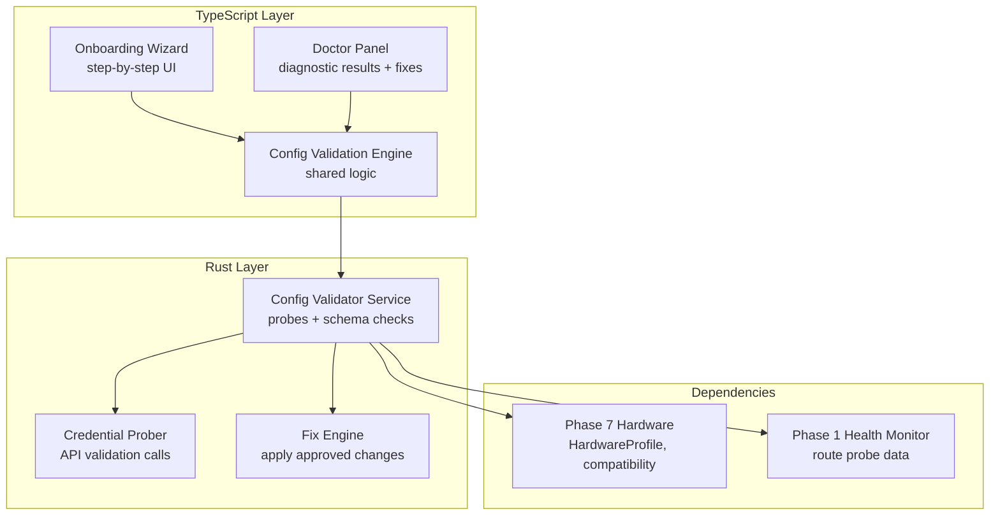

# Design Document: Onboarding Doctor

## Overview

Onboarding Doctor is Phase 8 — two complementary tools sharing a Configuration Validation Engine: an Onboarding Wizard for first-time setup and a Doctor for ongoing health diagnostics and automated fixes.

The system is split across two layers:

- **TypeScript UI and orchestration** (`src/core/onboarding.ts`, `src/core/doctor.ts`, `src/modules/settings/OnboardingWizard.tsx`, `src/modules/settings/DoctorPanel.tsx`): Wizard step flow, diagnostic check orchestration, fix presentation, and UI components.
- **Rust validation and probing** (`src-tauri/src/config_validator_service.rs`): Credential probing, configuration schema validation, cross-component consistency checks, and fix application. Exposes IPC commands.

### Key Design Decisions

1. **Shared validation engine**: Both wizard and doctor use the same `ConfigurationValidationEngine` — the wizard validates before applying, the doctor validates existing config. One codebase, two entry points.
2. **Credential probes are Rust-side**: API calls to validate credentials run in Rust (async, non-blocking) to avoid CORS issues and leverage existing provider infrastructure.
3. **Fixes require confirmation**: The doctor never auto-applies fixes. It presents structured fix proposals that the user explicitly approves.
4. **Startup quick check is lightweight**: Only critical checks (credential reachable, disk space, hardware match) — no full validation on every boot.

## Architecture



## Components and Interfaces

### 1. Configuration Validation Engine

```typescript
// src/core/config-validator.ts

export interface HealthFinding {
  id: string;
  severity: "critical" | "warning" | "info";
  category: string;
  title: string;
  description: string;
  affectedComponent: string;
  suggestedFix: AutoFix | null;
}

export interface AutoFix {
  id: string;
  description: string;
  affectedKeys: string[];
  currentValues: Record<string, unknown>;
  proposedValues: Record<string, unknown>;
  reversible: boolean;
}

export interface DiagnosticReport {
  overallStatus: "healthy" | "warnings" | "critical";
  findings: HealthFinding[];
  checksRun: number;
  checksPasssed: number;
  duration_ms: number;
  timestamp: string;
}

export interface CredentialProbeResult {
  providerId: string;
  valid: boolean;
  error: string | null;
  latencyMs: number;
  modelsAvailable: string[];
}

export const runFullDiagnostic = (): Promise<DiagnosticReport> =>
  invoke("config_run_full_diagnostic");

export const runQuickCheck = (): Promise<DiagnosticReport> =>
  invoke("config_run_quick_check");

export const probeCredential = (providerId: string): Promise<CredentialProbeResult> =>
  invoke("config_probe_credential", { providerId });

export const applyFix = (fixId: string): Promise<{ success: boolean; verificationPassed: boolean }> =>
  invoke("config_apply_fix", { fixId });

export const applyFixBatch = (fixIds: string[]): Promise<Array<{ fixId: string; success: boolean }>> =>
  invoke("config_apply_fix_batch", { fixIds });
```

### 2. Onboarding Wizard

```typescript
// src/core/onboarding.ts

export type SetupStep =
  | "welcome"
  | "hardware-confirm"
  | "credentials"
  | "model-selection"
  | "trust-policies"
  | "channels"
  | "verification"
  | "complete";

export interface WizardState {
  currentStep: SetupStep;
  completedSteps: SetupStep[];
  hardwareProfile: HardwareProfile | null;
  credentials: CredentialEntry[];
  selectedModels: ModelSelection[];
  trustConfig: TrustConfig;
  channelConfig: ChannelConfig;
}

export interface CredentialEntry {
  providerId: string;
  providerType: "openai" | "anthropic" | "ollama" | "custom-openai";
  validated: boolean;
  probeResult: CredentialProbeResult | null;
}

export interface ModelSelection {
  modelId: string;
  workloadType: string;
  compatibilityClass: ModelCompatibilityClass;
  estimatedTokensPerSec: number;
}

export interface ConfigurationProfile {
  hardwareClass: HardwareClass;
  credentials: CredentialEntry[];
  models: ModelSelection[];
  trustPolicies: TrustConfig;
  channels: ChannelConfig;
  appliedAt: string;
}

export const startOnboarding = (): Promise<WizardState> =>
  invoke("onboarding_start");

export const completeStep = (step: SetupStep, data: unknown): Promise<WizardState> =>
  invoke("onboarding_complete_step", { step, data });

export const applyConfiguration = (profile: ConfigurationProfile): Promise<void> =>
  invoke("onboarding_apply_config", { profile });

export const isFirstLaunch = (): Promise<boolean> =>
  invoke("onboarding_is_first_launch");
```

### 3. Rust Validator Service

```rust
// src-tauri/src/config_validator_service.rs

use serde::{Deserialize, Serialize};

#[derive(Debug, Clone, Serialize, Deserialize)]
#[serde(rename_all = "camelCase")]
pub struct DiagnosticCheck {
    pub id: String,
    pub name: String,
    pub category: String,
    pub is_critical: bool,
    pub timeout_ms: u64,
}

#[derive(Debug, Clone, Serialize, Deserialize)]
#[serde(rename_all = "camelCase")]
pub struct FixRecord {
    pub fix_id: String,
    pub applied_at: String,
    pub affected_keys: Vec<String>,
    pub previous_values: serde_json::Value,
    pub new_values: serde_json::Value,
    pub verification_passed: bool,
}

/// Run all diagnostic checks (full mode). Completes within 30s.
pub async fn run_full_diagnostic() -> Result<DiagnosticReport, String> { /* ... */ }

/// Run critical-only checks (startup mode). Completes within 5s.
pub async fn run_quick_check() -> Result<DiagnosticReport, String> { /* ... */ }

/// Probe a single provider credential.
pub async fn probe_credential(provider_id: &str) -> Result<CredentialProbeResult, String> { /* ... */ }

/// Apply a fix with verification.
pub async fn apply_fix(fix_id: &str) -> Result<FixApplicationResult, String> { /* ... */ }

/// IPC commands
#[tauri::command]
pub async fn config_run_full_diagnostic() -> Result<serde_json::Value, String> { /* ... */ }

#[tauri::command]
pub async fn config_run_quick_check() -> Result<serde_json::Value, String> { /* ... */ }

#[tauri::command]
pub async fn config_probe_credential(provider_id: String) -> Result<serde_json::Value, String> { /* ... */ }

#[tauri::command]
pub async fn config_apply_fix(fix_id: String) -> Result<serde_json::Value, String> { /* ... */ }

#[tauri::command]
pub async fn config_apply_fix_batch(fix_ids: Vec<String>) -> Result<Vec<serde_json::Value>, String> { /* ... */ }

#[tauri::command]
pub async fn onboarding_start() -> Result<serde_json::Value, String> { /* ... */ }

#[tauri::command]
pub async fn onboarding_complete_step(step: String, data: serde_json::Value) -> Result<serde_json::Value, String> { /* ... */ }

#[tauri::command]
pub async fn onboarding_apply_config(profile: serde_json::Value) -> Result<(), String> { /* ... */ }

#[tauri::command]
pub async fn onboarding_is_first_launch() -> Result<bool, String> { /* ... */ }
```

## Correctness Properties

### Property 1: Wizard produces valid configuration
*For any* completed wizard flow, the resulting ConfigurationProfile SHALL pass all Configuration_Validation_Engine checks without findings of severity "critical".

### Property 2: Credential probe accuracy
*For any* valid API credential, `probeCredential` SHALL return `valid: true`. For any invalid credential, it SHALL return `valid: false` with a non-empty error string.

### Property 3: Fix safety
*For any* AutoFix application, the system SHALL NOT modify configuration without prior user confirmation. The fix record SHALL be persisted with previous values for rollback.

### Property 4: Quick check speed
*For any* hardware configuration, `runQuickCheck` SHALL complete within 5 seconds.

### Property 5: Diagnostic read-only
*For any* diagnostic check execution (full or quick), the system SHALL NOT modify any configuration value, credential, or system state.

### Property 6: Atomic configuration application
*For any* ConfigurationProfile application, either ALL settings are applied successfully or NONE are (no partial configuration state).
