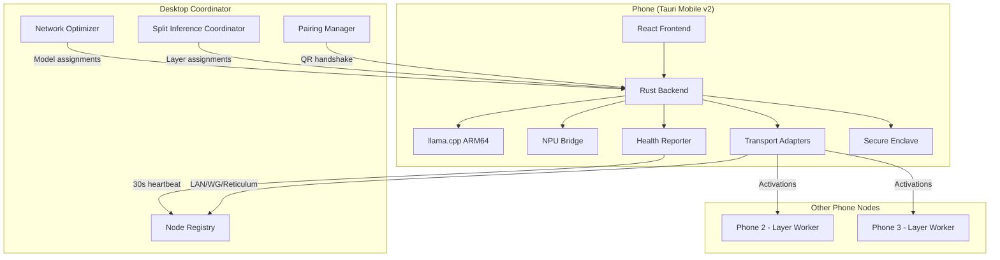
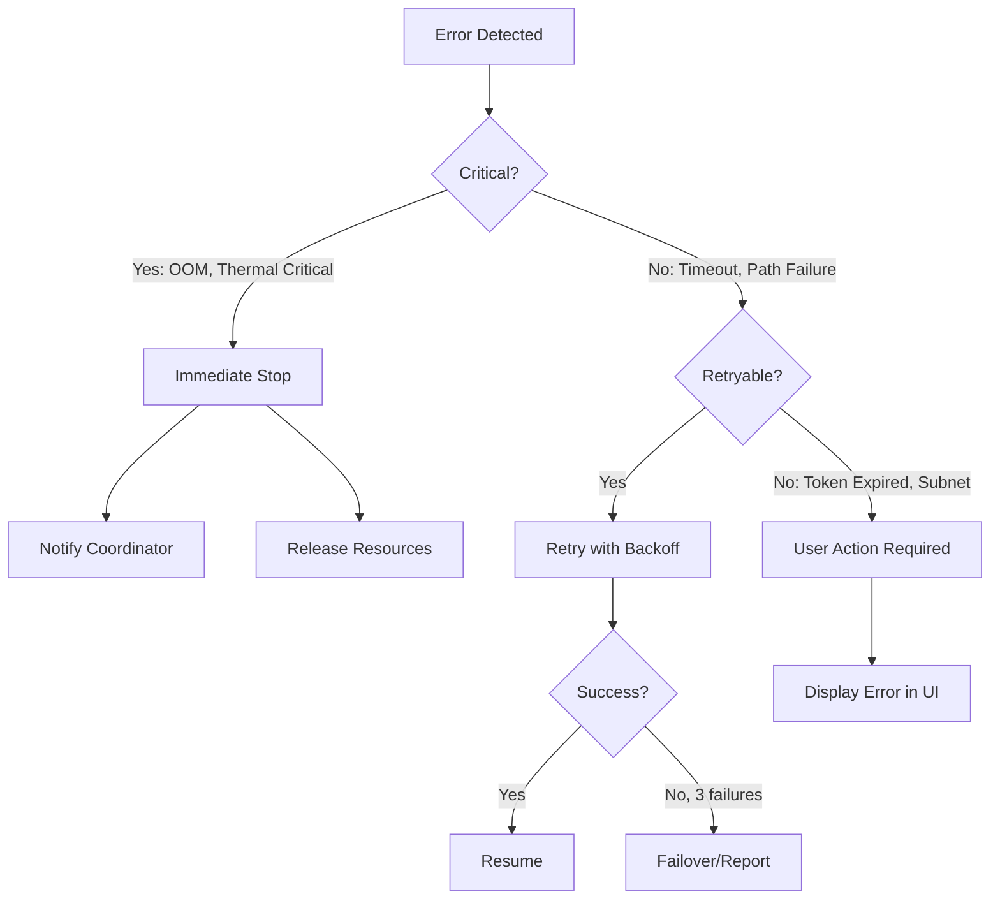

# Design Document: Phone Companion App

## Overview

The Phone Companion App extends ResonantOS to iOS and Android devices, turning phones into active compute nodes in the distributed inference mesh. Built with Tauri Mobile v2, it reuses the existing React frontend and Rust backend, compiled for ARM64 with platform-specific NPU acceleration (Core ML on iOS, NNAPI/QNN on Android).

The critical differentiator is **multi-phone split inference**: since each phone is limited to ~3GB of model weights in memory, the app leverages the existing Phase 11 Split Inference Protocol to partition larger models (7B across 2-3 phones, 13B across 3-4 phones) using pipeline parallel mode. Phones communicate via the Phase 10 transport layer (LAN/WireGuard/Reticulum) and join the mesh through the Phase 9C QR code pairing flow.

### Key Design Goals

1. **Reuse over reinvention** — leverage existing transport, split inference, pairing, and solver infrastructure
2. **Battery-first scheduling** — phones are best-effort nodes; the system gracefully degrades when phones become unavailable
3. **Background resilience** — maintain mesh participation across iOS/Android lifecycle events
4. **Security by default** — Ed25519 identity in platform secure enclave, E2E encryption on all channels

### Deployment Model

```
┌─────────────────────────────────────────────────────────────────┐
│                    DISTRIBUTION (Store-Independent)               │
│                                                                 │
│  iOS: IPA → TestFlight / Enterprise Certificate / AltStore      │
│  Android: APK → Direct sideload / F-Droid                       │
│                                                                 │
│  Build: `cargo tauri android build` / `cargo tauri ios build`   │
│  Target: aarch64-linux-android / aarch64-apple-ios              │
└─────────────────────────────────────────────────────────────────┘
```

## Architecture

### System Context Diagram



### Layered Architecture

```
┌─────────────────────────────────────────────────────────────┐
│                    PRESENTATION LAYER                         │
│  React UI (shared with desktop, responsive mobile layout)    │
│  • Status dashboard, pairing screen, settings                │
└──────────────────────────────┬──────────────────────────────┘
                               │ Tauri Commands/Events
┌──────────────────────────────┴──────────────────────────────┐
│                    APPLICATION LAYER (Rust)                   │
│  • AppLifecycle: foreground/background/terminate handling     │
│  • AssignmentManager: accept/reject/execute model placements │
│  • PairingClient: QR scan → handshake → registration         │
│  • HealthReporter: periodic + event-driven health updates    │
└──────────────────────────────┬──────────────────────────────┘
                               │
┌──────────────────────────────┴──────────────────────────────┐
│                    INFERENCE LAYER                            │
│  • InferenceRuntime: llama.cpp wrapper (load/run/unload)     │
│  • LayerWorker: split inference participant (fwd activations)│
│  • NPUDetector: platform accelerator discovery + fallback    │
│  • ModelStore: weight download, caching, eviction            │
└──────────────────────────────┬──────────────────────────────┘
                               │
┌──────────────────────────────┴──────────────────────────────┐
│                    TRANSPORT LAYER                            │
│  Reuses Phase 10 adapters: LAN (mDNS/TCP), WireGuard,       │
│  Reticulum. Path selector, failover, E2E encryption.         │
└──────────────────────────────┬──────────────────────────────┘
                               │
┌──────────────────────────────┴──────────────────────────────┐
│                    PLATFORM LAYER                             │
│  • iOS: Core ML delegate, Background Processing, Keychain   │
│  • Android: NNAPI/QNN delegate, Foreground Service, Keystore│
│  • Shared: battery/thermal/connectivity OS APIs              │
└─────────────────────────────────────────────────────────────┘
```

## Components and Interfaces

### 1. PairingClient

Handles the phone side of the QR code pairing flow (counterpart to desktop's `wizard/pairing.rs`).

```rust
/// Phone-side pairing client.
pub struct PairingClient {
    identity: MeshIdentity,
    capabilities: PhoneCapabilities,
}

impl PairingClient {
    /// Parse QR code data and initiate pairing handshake.
    pub async fn pair_from_qr(&self, qr_data: &str) -> Result<PairingResult, PairingClientError>;

    /// Re-authenticate with stored identity (no QR needed).
    pub async fn reconnect(&self, coordinator_addr: &str) -> Result<(), PairingClientError>;
}

pub struct PairingResult {
    pub network_id: Uuid,
    pub coordinator_addr: String,
    pub assigned_node_id: Uuid,
    pub trust_level: TrustLevel, // Always Tier1 (LocalOwned) after owner pairing
}

pub enum PairingClientError {
    TokenExpired,
    SubnetMismatch { phone: String, desktop: String },
    NetworkUnreachable,
    InvalidQrData(String),
    HandshakeRejected(String),
}
```

### 2. HealthReporter

Sends periodic heartbeats and immediate alerts to the Coordinator.

```rust
pub struct HealthReporter {
    config: HealthReporterConfig,
    transport: Arc<dyn MeshTransport>,
    coordinator_node: NodeId,
}

pub struct HealthReporterConfig {
    pub heartbeat_interval: Duration,      // 30s
    pub alert_debounce: Duration,          // 5s (prevent alert storms)
    pub battery_threshold: u8,             // 20%
    pub thermal_throttle_threshold: f64,   // 0.8 (80% of max temp)
}

#[derive(Serialize, Deserialize)]
pub struct HealthHeartbeat {
    pub node_id: NodeId,
    pub timestamp_ms: u64,
    pub battery_percent: u8,
    pub is_charging: bool,
    pub thermal_state: ThermalState,
    pub connection_type: ConnectionType,
    pub available_memory_mb: u64,
    pub cpu_utilization: f64,
    pub npu_utilization: f64,
    pub active_sessions: Vec<SessionId>,
    pub tokens_per_second: f64,
}

#[derive(Serialize, Deserialize)]
pub enum HealthAlert {
    LowBattery { percent: u8 },
    ThermalThrottle { state: ThermalState, reduced_capacity: f64 },
    ConnectivityChange { from: ConnectionType, to: ConnectionType },
    AppSuspended { active_sessions: Vec<SessionId> },
    AppTerminating,
}

pub enum ThermalState {
    Normal,
    Warm,       // Reduce workload
    Critical,   // Stop inference immediately
}
```

### 3. InferenceRuntime

Wraps llama.cpp for on-device model execution with NPU acceleration.

```rust
pub struct InferenceRuntime {
    backend: Box<dyn InferenceBackend>,
    loaded_model: Option<LoadedModel>,
    config: RuntimeConfig,
}

pub struct RuntimeConfig {
    pub max_memory_mb: u64,          // 3072 (3GB hard limit)
    pub prefer_npu: bool,            // true
    pub npu_fallback_to_cpu: bool,   // true
    pub thread_count: u32,           // platform-dependent
}

pub trait InferenceBackend: Send + Sync {
    fn load_model(&mut self, path: &Path, npu_delegate: Option<&NpuDelegate>) -> Result<LoadedModel, InferenceError>;
    fn run_forward(&self, model: &LoadedModel, input: &Tensor) -> Result<Tensor, InferenceError>;
    fn unload_model(&mut self) -> Result<(), InferenceError>;
    fn memory_usage_mb(&self) -> u64;
}

pub struct LoadedModel {
    pub model_id: ModelId,
    pub layer_range: Option<(u32, u32)>,  // None = full model, Some = split
    pub memory_mb: u64,
    pub backend_type: BackendType,        // NPU or CPU
}

pub enum InferenceError {
    OutOfMemory { requested_mb: u64, available_mb: u64 },
    ModelLoadFailed(String),
    NpuUnavailable,
    Timeout { elapsed_ms: u64, budget_ms: u64 },
    BackendCrash(String),
}
```

### 4. LayerWorker

Participates in split inference sessions by executing assigned layers and forwarding activations.

```rust
pub struct LayerWorker {
    runtime: Arc<InferenceRuntime>,
    transport: Arc<dyn MeshTransport>,
    active_session: Option<ActiveLayerSession>,
}

pub struct ActiveLayerSession {
    pub session_id: SessionId,
    pub model_id: ModelId,
    pub layer_range: (u32, u32),
    pub next_node: Option<NodeId>,
    pub prev_node: Option<NodeId>,
    pub timeout_ms: f64,
    pub protocol: SplitProtocol,
}

impl LayerWorker {
    /// Accept a layer assignment and load weights.
    pub async fn accept_assignment(&mut self, assignment: LayerAssignment) -> Result<(), LayerWorkerError>;

    /// Process an incoming activation tensor through assigned layers.
    pub async fn process_activation(&self, activation: ActivationPayload) -> Result<ActivationPayload, LayerWorkerError>;

    /// Participate in calibration warmup (5 tokens).
    pub async fn calibrate(&mut self) -> Result<CalibrationResult, LayerWorkerError>;

    /// Release session resources.
    pub async fn release_session(&mut self) -> Result<(), LayerWorkerError>;
}

#[derive(Serialize, Deserialize)]
pub struct ActivationPayload {
    pub session_id: SessionId,
    pub sequence_num: u64,
    pub tensor_data: Vec<u8>,       // Serialized via split/codec (f16, CRC32)
    pub tensor_shape: Vec<u32>,
    pub dtype: TensorDtype,
}

pub struct CalibrationResult {
    pub avg_compute_ms: f64,
    pub avg_forward_ms: f64,        // Time to send activation to next node
    pub tokens_per_second: f64,
}
```

### 5. AssignmentManager

Validates and executes model assignments from the Coordinator.

```rust
pub struct AssignmentManager {
    runtime: Arc<InferenceRuntime>,
    layer_worker: Arc<LayerWorker>,
    health_reporter: Arc<HealthReporter>,
    constraints: PhoneConstraints,
}

impl AssignmentManager {
    /// Validate and accept/reject a model assignment.
    pub async fn handle_assignment(&mut self, assignment: ModelAssignment) -> AssignmentResponse;

    /// Handle an unload command from the Coordinator.
    pub async fn handle_unload(&mut self, model_id: &ModelId) -> Result<(), AssignmentError>;

    /// Check current constraints against a proposed assignment.
    pub fn validate_constraints(&self, assignment: &ModelAssignment) -> Result<(), ConstraintViolation>;
}

#[derive(Serialize, Deserialize)]
pub struct ModelAssignment {
    pub model_id: ModelId,
    pub assignment_type: AssignmentType,
    pub download_url: String,
    pub weight_size_mb: u64,
    pub priority: AssignmentPriority,
}

pub enum AssignmentType {
    FullModel { params_b: f64 },
    SplitLayers { layer_range: (u32, u32), session_id: SessionId },
}

pub enum AssignmentResponse {
    Accepted { estimated_ready_ms: u64 },
    Rejected { reason: ConstraintViolation },
}

pub enum ConstraintViolation {
    InsufficientMemory { required_mb: u64, available_mb: u64 },
    BatteryTooLow { current: u8, threshold: u8 },
    CellularNotAllowed,
    ModelTooLarge { params_b: f64, max_b: f64 },
}
```

### 6. AppLifecycle

Manages platform-specific background execution and graceful shutdown.

```rust
pub struct AppLifecycle {
    platform: PlatformLifecycle,
    health_reporter: Arc<HealthReporter>,
    layer_worker: Arc<LayerWorker>,
    mesh_identity: MeshIdentity,
}

pub enum PlatformLifecycle {
    Ios(IosBackgroundProcessor),
    Android(AndroidForegroundService),
}

pub struct IosBackgroundProcessor {
    /// BGProcessingTask identifier for mesh keepalive.
    pub task_identifier: String,
    /// Maximum background execution time (iOS grants ~30s).
    pub max_background_time: Duration,
}

pub struct AndroidForegroundService {
    /// Notification channel for persistent foreground notification.
    pub notification_channel: String,
    /// Whether the service is currently running.
    pub is_running: bool,
}

impl AppLifecycle {
    /// Called when app moves to background.
    pub async fn on_background(&self);

    /// Called when app is about to be terminated by OS.
    pub async fn on_terminate(&self);

    /// Called when user explicitly stops the app.
    pub async fn on_user_stop(&self);

    /// Called on app launch — restore state and reconnect.
    pub async fn on_launch(&self) -> Result<(), LifecycleError>;
}
```

### 7. NPUDetector

Discovers and benchmarks platform hardware accelerators.

```rust
pub struct NPUDetector;

impl NPUDetector {
    /// Detect available NPU hardware on this device.
    pub fn detect() -> DetectedNPU;

    /// Run a benchmark to measure tokens/second on a reference model.
    pub async fn benchmark(npu: &DetectedNPU) -> BenchmarkResult;
}

pub struct DetectedNPU {
    pub npu_type: NpuType,
    pub available: bool,
    pub delegate: Option<NpuDelegate>,
}

pub enum NpuType {
    AppleNeuralEngine { generation: u8 },
    QualcommHexagon { version: String },
    QualcommQNN { version: String },
    MaliGpu { model: String },
    None,
}

pub enum NpuDelegate {
    CoreML,
    NNAPI,
    QNN,
    OpenCL,  // Mali fallback
}

pub struct BenchmarkResult {
    pub tokens_per_second: f64,
    pub compute_speed_relative: f64,  // Relative to baseline (1.0 = Snapdragon 8 Gen 1)
    pub memory_bandwidth_gbps: f64,
}
```

### 8. MeshIdentity

Manages the Ed25519 keypair stored in the platform secure enclave.

```rust
pub struct MeshIdentity {
    pub node_id: NodeId,
    pub public_key: Ed25519PublicKey,
    store: SecureKeyStore,
}

pub enum SecureKeyStore {
    IosKeychain { service: String, account: String },
    AndroidKeystore { alias: String },
}

impl MeshIdentity {
    /// Generate a new identity (first pairing only).
    pub fn generate() -> Result<Self, IdentityError>;

    /// Load existing identity from secure storage.
    pub fn load() -> Result<Option<Self>, IdentityError>;

    /// Sign a message for authentication.
    pub fn sign(&self, message: &[u8]) -> Result<Ed25519Signature, IdentityError>;

    /// Verify a signature from another node.
    pub fn verify(public_key: &Ed25519PublicKey, message: &[u8], signature: &Ed25519Signature) -> bool;
}
```

## Data Models

### Phone Node State (persisted locally)

```rust
#[derive(Serialize, Deserialize)]
pub struct PhoneNodeState {
    pub node_id: NodeId,
    pub mesh_network_id: Uuid,
    pub coordinator_addr: String,
    pub trust_level: TrustLevel,
    pub paired_at: DateTime<Utc>,
    pub last_connected: DateTime<Utc>,
    pub settings: PhoneSettings,
    pub cached_models: Vec<CachedModel>,
}

#[derive(Serialize, Deserialize)]
pub struct PhoneSettings {
    pub battery_threshold: u8,          // Default: 20
    pub allow_cellular: bool,           // Default: false
    pub max_model_size_mb: u64,         // Default: 3072 (3GB)
    pub background_mode: BackgroundMode,// Default: Balanced
    pub heartbeat_interval_s: u32,      // Default: 30
}

#[derive(Serialize, Deserialize)]
pub struct CachedModel {
    pub model_id: ModelId,
    pub file_path: PathBuf,
    pub size_mb: u64,
    pub layer_range: Option<(u32, u32)>,
    pub last_used: DateTime<Utc>,
}
```

### Messages (over transport)

```rust
/// Messages from Coordinator → Phone
#[derive(Serialize, Deserialize)]
pub enum CoordinatorMessage {
    AssignModel(ModelAssignment),
    UnloadModel { model_id: ModelId },
    StartSplitSession { session_id: SessionId, assignment: LayerAssignment },
    EndSplitSession { session_id: SessionId },
    Ping,
}

/// Messages from Phone → Coordinator
#[derive(Serialize, Deserialize)]
pub enum PhoneMessage {
    Heartbeat(HealthHeartbeat),
    Alert(HealthAlert),
    AssignmentResponse(AssignmentResponse),
    UnloadConfirm { model_id: ModelId },
    SessionReady { session_id: SessionId, calibration: CalibrationResult },
    SessionFailed { session_id: SessionId, reason: String },
    GracefulLeave,
    Pong,
}

/// Messages between Phone nodes (split inference activations)
#[derive(Serialize, Deserialize)]
pub enum PhoneToPhoneMessage {
    Activation(ActivationPayload),
    CalibrationToken(ActivationPayload),
    SessionSync { session_id: SessionId, sequence_num: u64 },
}
```

### Layer Assignment (from Coordinator)

```rust
#[derive(Serialize, Deserialize)]
pub struct LayerAssignment {
    pub session_id: SessionId,
    pub model_id: ModelId,
    pub layer_range: (u32, u32),
    pub layer_count: u32,
    pub weight_download_url: String,
    pub weight_size_mb: u64,
    pub protocol: SplitProtocol,
    pub prev_node: Option<NodeId>,
    pub next_node: Option<NodeId>,
    pub timeout_ms: f64,
}
```

### NPU Capabilities Report

```rust
#[derive(Serialize, Deserialize)]
pub struct NpuCapabilitiesReport {
    pub npu_type: NpuType,
    pub npu_available: bool,
    pub benchmark_tps: f64,              // Tokens per second on reference model
    pub compute_speed_relative: f64,     // Relative to baseline
    pub supported_formats: Vec<String>,  // e.g., ["coreml", "gguf"]
    pub max_batch_size: u32,
}
```


## Correctness Properties

*A property is a characteristic or behavior that should hold true across all valid executions of a system — essentially, a formal statement about what the system should do. Properties serve as the bridge between human-readable specifications and machine-verifiable correctness guarantees.*

### Property 1: Pairing message completeness

*For any* valid QR code data and any phone capabilities, the pairing handshake SHALL contain the pairing token, phone node ID, and all capability fields (OS, NPU, RAM, battery, connection type), and the resulting registration SHALL include device type, NPU capabilities, RAM, battery level, and connection type.

**Validates: Requirements 2.1, 2.2**

### Property 2: Token expiry validation

*For any* pairing token with a creation timestamp, if the current time exceeds the creation time by more than 5 minutes, the pairing attempt SHALL be rejected; if the current time is within 5 minutes of creation, the token SHALL be accepted (assuming all other checks pass).

**Validates: Requirements 2.4**

### Property 3: Subnet mismatch detection

*For any* pair of IP addresses, if the first three octets differ between the phone IP and the desktop subnet, the pairing attempt SHALL be rejected with a subnet mismatch error; if they match, the subnet check SHALL pass.

**Validates: Requirements 2.5**

### Property 4: Per-phone memory limit enforcement

*For any* model assignment (full model or split layer range), the weight size assigned to a single phone SHALL never exceed 3GB. For split inference of a model across N phones, each phone's assigned layer weights SHALL be at most 3GB regardless of total model size.

**Validates: Requirements 3.4, 4.6**

### Property 5: Protocol selection by latency

*For any* measured inter-node latency value, the protocol selector SHALL choose tensor parallel when latency ≤ 5ms, pipeline parallel when latency is between 5ms and 50ms (exclusive/inclusive), and reject split inference when latency > 50ms.

**Validates: Requirements 4.3**

### Property 6: Assignment constraint validation

*For any* combination of phone state (battery level, charging state, connection type, available memory) and model assignment (weight size, parameter count), the assignment SHALL be rejected if: (a) weight size exceeds available memory, (b) battery is below threshold AND phone is not charging, (c) connection is cellular AND cellular is not opted-in, or (d) model parameters exceed the 3B limit for full models. Otherwise the assignment SHALL be accepted.

**Validates: Requirements 5.1, 5.2, 5.3**

### Property 7: Heartbeat field completeness

*For any* phone health state, the constructed heartbeat message SHALL contain all required fields: node_id, timestamp, battery_percent, is_charging, thermal_state, connection_type, available_memory_mb, cpu_utilization, npu_utilization, active_sessions, and tokens_per_second.

**Validates: Requirements 6.1, 6.6**

### Property 8: Battery alert threshold crossing

*For any* battery level transition from above the configured threshold to below it (while not charging), the Health Reporter SHALL emit a LowBattery alert. For transitions that remain above the threshold, or any transition while charging, no LowBattery alert SHALL be emitted.

**Validates: Requirements 6.2**

### Property 9: Connectivity change notification

*For any* connectivity state transition where the connection type changes (e.g., WiFi → Cellular or Cellular → WiFi), the Health Reporter SHALL emit a ConnectivityChange alert containing both the previous and new connection types.

**Validates: Requirements 6.3**

### Property 10: Heartbeat timeout marks node offline

*For any* phone node, if the elapsed time since the last received heartbeat exceeds 90 seconds, the Coordinator SHALL mark that node as offline. If the elapsed time is ≤ 90 seconds, the node SHALL remain marked as online.

**Validates: Requirements 6.5**

### Property 11: State persistence round-trip

*For any* valid PhoneNodeState (containing node_id, mesh_network_id, coordinator_addr, trust_level, settings, and cached models), serializing to persistent storage and then deserializing SHALL produce an equivalent PhoneNodeState.

**Validates: Requirements 7.3**

### Property 12: Path selection minimizes latency

*For any* non-empty set of available transport paths with measured latencies, the path selector SHALL choose the path with the minimum latency value for inference activation forwarding.

**Validates: Requirements 8.2**

### Property 13: Activation messages use Critical priority

*For any* split inference activation payload being forwarded between phone nodes, the transport message SHALL have MessagePriority::Critical and RequestType::InferenceActivation.

**Validates: Requirements 8.5**

### Property 14: Ed25519 identity validity

*For any* generated mesh identity, the Ed25519 keypair SHALL be valid: signing any arbitrary message with the private key and verifying with the corresponding public key SHALL always succeed, and verifying with a different public key SHALL always fail.

**Validates: Requirements 9.1**

### Property 15: NPU backend preference

*For any* model load request where the NPU is available and the model format is NPU-compatible, the Inference Runtime SHALL select the NPU backend. When the NPU is unavailable or the model format is incompatible, the runtime SHALL fall back to CPU.

**Validates: Requirements 10.3**

## Error Handling

### Error Categories and Recovery Strategies

| Error Category | Examples | Recovery Strategy |
|---|---|---|
| **Network Errors** | Transport timeout, path failure, coordinator unreachable | Automatic failover to next transport path (<100ms). Exponential backoff for reconnection (1s, 2s, 4s, 8s). After 3 consecutive failures, mark path as degraded. |
| **Memory Errors** | OOM during model load, insufficient memory for assignment | Abort load immediately, release all allocated memory, report failure to Coordinator. Coordinator reassigns to another node. |
| **Battery/Thermal** | Battery below threshold, thermal throttle | Reject new assignments. For active sessions: complete current token, then notify Coordinator for graceful session migration. |
| **Inference Errors** | NPU crash, timeout during forward pass, corrupted weights | NPU crash → fallback to CPU with degraded capacity report. Timeout → report to session Coordinator, release session. Corrupted weights → re-download. |
| **Pairing Errors** | Token expired, subnet mismatch, invalid QR | Display user-facing error with specific guidance. Token expired → "Request new QR code". Subnet mismatch → "Connect to same WiFi network". |
| **Lifecycle Errors** | OS suspension, termination, background task expiry | Persist state before suspension. Notify Coordinator within 5s of suspension. On relaunch, reconnect with stored identity. |
| **Split Session Errors** | Participant timeout, activation CRC mismatch, session negotiation failure | Report to Coordinator. Coordinator can: retry with same nodes, reassign layers, or fall back to smaller model on fewer nodes. |

### Error Propagation Flow



### Graceful Degradation Hierarchy

1. **Full capacity** — NPU inference, all transports healthy
2. **Degraded NPU** — CPU fallback, reduced tokens/second reported
3. **Degraded network** — single transport path, higher latency tolerated
4. **Battery conservation** — reject new assignments, complete in-progress work
5. **Thermal throttle** — reduce batch size, extend timeouts
6. **Graceful leave** — notify Coordinator, persist state, shut down cleanly
7. **Forced termination** — OS kills app; state already persisted, Coordinator detects via heartbeat timeout (90s)

## Testing Strategy

### Unit Tests (Example-Based)

Unit tests cover specific scenarios, edge cases, and integration points:

- **Pairing flow**: valid QR parse, expired token rejection, subnet mismatch, reconnection with stored identity
- **Assignment handling**: accept valid assignment, reject oversized model, reject on low battery, unload confirmation
- **Lifecycle**: graceful leave sends notification, state persists on terminate, background task registration
- **NPU detection**: fallback to CPU on NPU failure, benchmark result inclusion in pairing
- **Transport**: failover on path failure, Critical priority for activations
- **Split inference**: calibration warmup completion, timeout detection and cleanup

### Property-Based Tests

Property-based tests verify universal correctness properties across randomized inputs. Each property test runs a minimum of **100 iterations** using the `proptest` crate (Rust).

**Configuration:**
- Library: `proptest` (Rust PBT framework)
- Minimum iterations: 100 per property
- Tag format: `Feature: phone-companion-app, Property {N}: {title}`

**Properties to implement:**

| Property | What it tests | Generator strategy |
|---|---|---|
| P1: Pairing message completeness | Handshake/registration field presence | Random PhoneCapabilities + valid QR strings |
| P2: Token expiry validation | 5-minute window enforcement | Random timestamps (past, present, future) |
| P3: Subnet mismatch detection | IP subnet comparison | Random IPv4 address pairs |
| P4: Per-phone memory limit | 3GB cap on any single phone | Random model sizes + phone counts |
| P5: Protocol selection | Latency → protocol mapping | Random f64 latency values [0, 200] |
| P6: Assignment constraint validation | Multi-constraint accept/reject | Random phone states × assignments |
| P7: Heartbeat completeness | All fields present | Random health states |
| P8: Battery alert threshold | Alert on crossing below threshold | Random battery transitions |
| P9: Connectivity change | Alert on type change | Random ConnectionType pairs |
| P10: Heartbeat timeout | 90s gap → offline | Random timestamp gaps |
| P11: State round-trip | Serialize/deserialize identity | Random PhoneNodeState instances |
| P12: Path selection | Minimum latency chosen | Random path sets with latencies |
| P13: Activation priority | Critical priority enforced | Random ActivationPayload instances |
| P14: Ed25519 validity | Sign/verify round-trip | Random message bytes |
| P15: NPU preference | NPU selected when available | Random NPU availability × model format |

### Integration Tests

Integration tests verify cross-component behavior with real (or emulated) infrastructure:

- **End-to-end pairing**: Desktop generates QR → Phone scans → Handshake → Registration
- **Split inference session**: Coordinator assigns layers → Phones load → Calibration → Activation forwarding → Result
- **Health monitoring**: Heartbeat delivery, alert propagation, offline detection
- **Transport failover**: Primary path drops → automatic switch to secondary
- **Background lifecycle**: App backgrounds → maintains connection → app resumes
- **Model download**: Assignment accepted → weights downloaded → readiness reported

### Platform-Specific Tests

- **iOS**: Background Processing task scheduling, Keychain storage, Core ML delegate loading
- **Android**: Foreground service lifecycle, Keystore access, NNAPI/QNN delegate loading
- **Cross-platform**: Tauri command bridge, React ↔ Rust event flow
