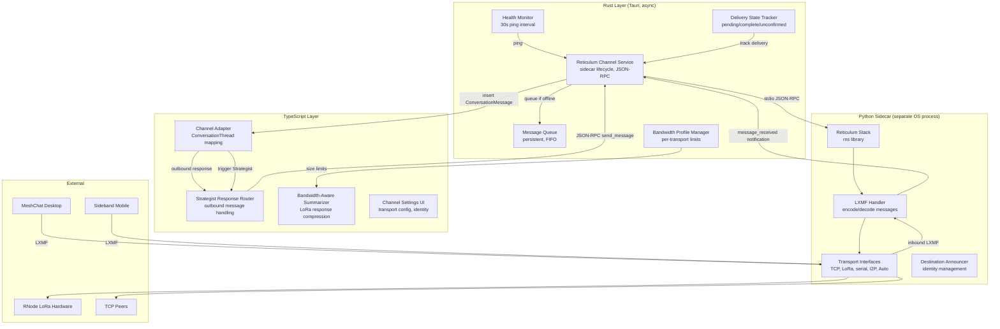

# Design Document: Reticulum Channel

## Overview

The Reticulum Channel is Phase 6 of the ResonantOS vNext improvement plan — a mesh network communication channel add-on that bridges the Reticulum cryptographic networking stack to the ResonantOS conversation system. It enables sending and receiving messages via LoRa, packet radio, WiFi, serial, TCP, or I2P with end-to-end encryption, multi-hop routing, and delay tolerance.

The system is split across three layers:

- **Rust host integration** (`src-tauri/src/reticulum_channel_service.rs`): Manages the Python sidecar lifecycle, JSON-RPC communication, message queue persistence, delivery state tracking, and health monitoring. Runs asynchronously on the Tauri backend without blocking the main thread.
- **Python sidecar** (`addons/reticulum-channel/sidecar/`): Runs the Reticulum networking stack via the `rns` library, announces a destination, handles LXMF message encoding/decoding, manages transport interfaces, and communicates with the host via stdio JSON-RPC.
- **TypeScript channel adapter** (`src/core/reticulum-channel.ts`): Registers the channel with the multi-channel architecture, maps inbound messages to ConversationThreads, routes outbound Strategist responses to the sidecar, and handles bandwidth-aware summarization.

The channel is a **pure add-on** with `runtimeType: "channel-addon"` — it integrates with the existing multi-channel architecture without modifying core shell code. If disabled or removed, the shell operates identically to its current behavior.

### Key Design Decisions

1. **Python sidecar for Reticulum stack**: The Reticulum library (`rns`) is Python-native with no Rust bindings. A sidecar process running the full Reticulum stack is the only viable approach. Communication uses the existing Add-on SDK V0 `stdio-json-rpc` protocol.

2. **LXMF for interoperability**: Using the LXMF standard message format ensures compatibility with MeshChat (desktop) and Sideband (mobile) — the existing Reticulum community applications. This is non-negotiable for mesh community integration.

3. **Persistent message queue for delay tolerance**: Mesh networks have unpredictable connectivity. Outbound messages are persisted to local storage and retried until delivered or expired. This survives sidecar restarts.

4. **Bandwidth profiles per transport**: LoRa links have ~500 byte practical limits while TCP can handle 32KB+. The system adapts response handling per active transport, requesting summarization only when needed for low-bandwidth links.

5. **Health check via JSON-RPC ping**: A 30-second ping interval detects sidecar unresponsiveness. Three consecutive failures transition to "offline" state. This is simpler and more reliable than process monitoring alone.

6. **Exponential backoff for restart**: On crash, the channel attempts restart after 5 seconds with exponential backoff up to 60 seconds. This prevents restart storms while enabling quick recovery from transient failures.

7. **Channel-per-peer threading**: Each active Reticulum peer gets its own ConversationThread, matching the existing multi-channel pattern (telegram, desktop, voice each have their own threads).

8. **Zero cloud dependency**: All communication uses Reticulum's built-in cryptographic layer. No message content, metadata, or keys are transmitted to any cloud service. The channel functions fully offline on LoRa/serial transports.

## Architecture




## Components and Interfaces

### 1. JSON-RPC Protocol Definition

```typescript
// addons/reticulum-channel/protocol/schema.ts
// JSON Schema definitions for the stdio-json-rpc protocol

// --- Host -> Sidecar Requests ---

export interface StartRequest {
  method: "start";
  params: {
    configPath: string;             // path to ~/.reticulum/config
    identityLabel: string;          // display name (default: "ResonantOS")
  };
}

export interface StopRequest {
  method: "stop";
  params: {};
}

export interface SendMessageRequest {
  method: "send_message";
  params: {
    destination_hash: string;       // hex-encoded Reticulum destination hash
    content: string;                // message text
    priority: "normal" | "high";
  };
}

export interface GetStatusRequest {
  method: "get_status";
  params: {};
}

export interface ListPeersRequest {
  method: "list_peers";
  params: {};
}

export interface PingRequest {
  method: "ping";
  params: {};
}

// --- Host -> Sidecar Responses ---

export interface StartResponse {
  result: {
    destination_hash: string;       // our announced destination
    active_interfaces: string[];    // list of active transport interface names
  };
}

export interface SendMessageResponse {
  result: {
    message_id: string;             // LXMF message ID for tracking
    queued: boolean;                // true if no link available, queued for later
  };
}

export interface GetStatusResponse {
  result: {
    state: "running" | "starting" | "offline";
    destination_hash: string;
    active_interfaces: InterfaceStatus[];
    peers_count: number;
    queued_messages: number;
  };
}

export interface InterfaceStatus {
  name: string;
  type: "tcp" | "lora" | "serial" | "i2p" | "auto";
  active: boolean;
  error: string | null;
}

export interface ListPeersResponse {
  result: {
    peers: PeerInfo[];
  };
}

export interface PeerInfo {
  destination_hash: string;
  display_name: string | null;
  last_seen: string;                // ISO-8601
  link_active: boolean;
}

export interface PingResponse {
  result: { pong: true };
}

// --- Sidecar -> Host Notifications ---

export interface MessageReceivedNotification {
  method: "message_received";
  params: {
    source_hash: string;
    source_name: string | null;
    content: string;
    timestamp: string;              // ISO-8601
    lxmf_message_id: string;
  };
}

export interface DeliveryConfirmedNotification {
  method: "delivery_confirmed";
  params: {
    message_id: string;             // matches SendMessageResponse.message_id
    delivered_at: string;
  };
}

export interface LinkEstablishedNotification {
  method: "link_established";
  params: {
    destination_hash: string;
    display_name: string | null;
  };
}

export interface LinkLostNotification {
  method: "link_lost";
  params: {
    destination_hash: string;
    reason: string;
  };
}

export interface ErrorNotification {
  method: "error";
  params: {
    code: string;
    message: string;
    details: string | null;
  };
}
```

### 2. Rust Host Integration (`reticulum_channel_service.rs`)

```rust
// src-tauri/src/reticulum_channel_service.rs

use serde::{Deserialize, Serialize};
use std::sync::Arc;
use tokio::sync::RwLock;

/// Sidecar health state.
#[derive(Debug, Clone, PartialEq, Serialize, Deserialize)]
#[serde(rename_all = "snake_case")]
pub enum SidecarHealthState {
    Running,
    Starting,
    Offline,
    Crashed,
}

/// Configuration for the Reticulum channel.
#[derive(Debug, Clone, Deserialize)]
#[serde(rename_all = "camelCase")]
pub struct ReticulumChannelConfig {
    pub sidecar_command: String,            // Python entrypoint
    pub config_path: String,                // ~/.reticulum/config
    pub identity_label: String,             // default: "ResonantOS"
    pub health_check_interval_secs: u64,    // default: 30
    pub health_check_failures_threshold: u32, // default: 3
    pub restart_initial_delay_secs: u64,    // default: 5
    pub restart_max_delay_secs: u64,        // default: 60
    pub delivery_timeout_lora_secs: u64,    // default: 300
    pub delivery_timeout_tcp_secs: u64,     // default: 30
    pub message_queue_max_age_hours: u64,   // default: 24
    pub message_queue_retry_secs: u64,      // default: 30
}

/// A queued outbound message.
#[derive(Debug, Clone, Serialize, Deserialize)]
#[serde(rename_all = "camelCase")]
pub struct QueuedMessage {
    pub id: String,
    pub destination_hash: String,
    pub content: String,
    pub priority: String,                   // "normal" | "high"
    pub conversation_message_id: String,
    pub queued_at: String,
    pub retry_count: u32,
    pub last_retry_at: Option<String>,
    pub status: String,                     // "pending" | "sent" | "expired"
    pub expires_at: String,
}

/// Delivery state for an outbound message.
#[derive(Debug, Clone, Serialize, Deserialize)]
#[serde(rename_all = "camelCase")]
pub struct DeliveryState {
    pub message_id: String,
    pub lxmf_message_id: String,
    pub conversation_message_id: String,
    pub status: String,                     // "pending" | "complete" | "delivery-unconfirmed" | "failed"
    pub sent_at: String,
    pub confirmed_at: Option<String>,
    pub timeout_at: String,
}

/// Bandwidth profile for a transport type.
#[derive(Debug, Clone, Serialize, Deserialize)]
#[serde(rename_all = "camelCase")]
pub struct BandwidthProfile {
    pub transport_type: String,             // "tcp" | "lora" | "serial" | "i2p" | "auto"
    pub max_message_bytes: u32,             // 500 for LoRa, 32000 for TCP
    pub requires_summarization: bool,
}

/// Shared state for the Reticulum channel service.
pub struct ReticulumChannelState {
    pub config: ReticulumChannelConfig,
    pub health_state: Arc<RwLock<SidecarHealthState>>,
    pub sidecar_process: Arc<RwLock<Option<tokio::process::Child>>>,
    pub message_queue: Arc<RwLock<Vec<QueuedMessage>>>,
    pub delivery_states: Arc<RwLock<Vec<DeliveryState>>>,
    pub active_interfaces: Arc<RwLock<Vec<InterfaceStatus>>>,
    pub bandwidth_profiles: Arc<RwLock<Vec<BandwidthProfile>>>,
    pub restart_delay_secs: Arc<RwLock<u64>>,
    pub consecutive_ping_failures: Arc<RwLock<u32>>,
}

#[derive(Debug, Clone, Serialize, Deserialize)]
#[serde(rename_all = "camelCase")]
pub struct InterfaceStatus {
    pub name: String,
    pub interface_type: String,
    pub active: bool,
    pub error: Option<String>,
}

/// Start the Reticulum channel service.
pub async fn start_reticulum_channel(
    config: ReticulumChannelConfig,
) -> Result<ReticulumChannelState, String> { /* ... */ }

/// Spawn the Python sidecar process.
pub async fn spawn_sidecar(
    state: &ReticulumChannelState,
) -> Result<(), String> { /* ... */ }

/// Stop the sidecar gracefully (send "stop" then terminate after 5s).
pub async fn stop_sidecar(
    state: &ReticulumChannelState,
) -> Result<(), String> { /* ... */ }

/// Send a JSON-RPC request to the sidecar via stdin.
pub async fn send_rpc_request(
    state: &ReticulumChannelState,
    method: &str,
    params: serde_json::Value,
) -> Result<serde_json::Value, String> { /* ... */ }

/// Handle an inbound JSON-RPC notification from the sidecar (via stdout).
pub async fn handle_sidecar_notification(
    state: &ReticulumChannelState,
    notification: serde_json::Value,
) -> Result<(), String> { /* ... */ }

/// Health check: send ping, track failures, transition state.
pub async fn health_check(
    state: &ReticulumChannelState,
) -> SidecarHealthState { /* ... */ }

/// Attempt sidecar restart with exponential backoff.
pub async fn attempt_restart(
    state: &ReticulumChannelState,
) -> Result<(), String> { /* ... */ }

/// Enqueue an outbound message when link unavailable.
pub async fn enqueue_message(
    state: &ReticulumChannelState,
    message: QueuedMessage,
) -> Result<(), String> { /* ... */ }

/// Process message queue: retry pending messages, expire old ones.
pub async fn process_message_queue(
    state: &ReticulumChannelState,
) -> Result<(), String> { /* ... */ }

/// Update delivery state on receipt confirmation.
pub async fn confirm_delivery(
    state: &ReticulumChannelState,
    lxmf_message_id: &str,
) -> Result<(), String> { /* ... */ }

/// Check delivery timeouts and update states.
pub async fn check_delivery_timeouts(
    state: &ReticulumChannelState,
) -> Result<(), String> { /* ... */ }

/// IPC commands
#[tauri::command]
pub async fn reticulum_send_message(
    destination_hash: String,
    content: String,
    priority: String,
    conversation_message_id: String,
) -> Result<String, String> { /* ... */ }

#[tauri::command]
pub async fn reticulum_get_status() -> Result<serde_json::Value, String> { /* ... */ }

#[tauri::command]
pub async fn reticulum_list_peers() -> Result<Vec<serde_json::Value>, String> { /* ... */ }

#[tauri::command]
pub async fn reticulum_get_delivery_state(
    message_id: String,
) -> Result<Option<DeliveryState>, String> { /* ... */ }

#[tauri::command]
pub async fn reticulum_get_queue_status() -> Result<Vec<QueuedMessage>, String> { /* ... */ }
```


### 3. Python Sidecar (`sidecar/main.py`)

```python
# addons/reticulum-channel/sidecar/main.py

import sys
import json
import RNS
import LXMF
from typing import Optional, Dict, List
from dataclasses import dataclass

@dataclass
class SidecarConfig:
    config_path: str                    # ~/.reticulum/config
    identity_label: str                 # display name for LXMF
    storage_path: str                   # persistent queue storage


class ReticulumSidecar:
    """Main sidecar process managing the Reticulum stack and LXMF messaging."""

    def __init__(self, config: SidecarConfig):
        self.config = config
        self.reticulum: Optional[RNS.Reticulum] = None
        self.identity: Optional[RNS.Identity] = None
        self.destination: Optional[RNS.Destination] = None
        self.lxmf_router: Optional[LXMF.LXMRouter] = None
        self.active_links: Dict[str, RNS.Link] = {}
        self.pending_messages: Dict[str, dict] = {}

    def start(self) -> dict:
        """
        Initialize Reticulum, create identity, announce destination.
        Returns: { destination_hash, active_interfaces }
        """
        self.reticulum = RNS.Reticulum(self.config.config_path)
        self.identity = RNS.Identity()  # or load existing
        self.destination = RNS.Destination(
            self.identity, RNS.Destination.IN, "resonantos", "messenger"
        )
        self.lxmf_router = LXMF.LXMRouter(identity=self.identity, storagepath=self.config.storage_path)
        self.lxmf_router.register_delivery_callback(self._on_message_received)
        self.destination.announce()
        ...

    def stop(self):
        """Graceful shutdown: close links, stop Reticulum."""
        ...

    def send_message(self, destination_hash: str, content: str, priority: str) -> dict:
        """
        Encode as LXMF and transmit. Returns { message_id, queued }.
        Chunks if content exceeds transport MTU.
        """
        ...

    def get_status(self) -> dict:
        """Return current state, interfaces, peer count, queue size."""
        ...

    def list_peers(self) -> list:
        """Return known peers with last_seen and link status."""
        ...

    def ping(self) -> dict:
        """Health check response."""
        return {"pong": True}

    def _on_message_received(self, message: LXMF.LXMessage):
        """Callback when LXMF message arrives. Emit notification to host."""
        notification = {
            "jsonrpc": "2.0",
            "method": "message_received",
            "params": {
                "source_hash": RNS.hexrep(message.source_hash, delimit=False),
                "source_name": message.source_name,
                "content": message.content_as_string(),
                "timestamp": message.timestamp_as_iso(),
                "lxmf_message_id": RNS.hexrep(message.hash, delimit=False),
            }
        }
        self._emit_notification(notification)

    def _on_delivery_confirmed(self, message_id: str):
        """Callback when delivery receipt arrives."""
        notification = {
            "jsonrpc": "2.0",
            "method": "delivery_confirmed",
            "params": {
                "message_id": message_id,
                "delivered_at": self._now_iso(),
            }
        }
        self._emit_notification(notification)

    def _emit_notification(self, notification: dict):
        """Write JSON-RPC notification to stdout."""
        sys.stdout.write(json.dumps(notification) + "\n")
        sys.stdout.flush()

    def _process_stdin(self):
        """Read JSON-RPC requests from stdin, dispatch to handlers."""
        for line in sys.stdin:
            request = json.loads(line.strip())
            method = request.get("method")
            params = request.get("params", {})
            request_id = request.get("id")

            handlers = {
                "start": self.start,
                "stop": self.stop,
                "send_message": lambda: self.send_message(**params),
                "get_status": self.get_status,
                "list_peers": self.list_peers,
                "ping": self.ping,
            }

            handler = handlers.get(method)
            if handler:
                try:
                    result = handler()
                    response = {"jsonrpc": "2.0", "id": request_id, "result": result}
                except Exception as e:
                    response = {"jsonrpc": "2.0", "id": request_id, "error": {"code": -1, "message": str(e)}}
            else:
                response = {"jsonrpc": "2.0", "id": request_id, "error": {"code": -32601, "message": f"Unknown method: {method}"}}

            sys.stdout.write(json.dumps(response) + "\n")
            sys.stdout.flush()
```

### 4. TypeScript Channel Adapter (`reticulum-channel.ts`)

```typescript
// src/core/reticulum-channel.ts

import { invoke } from "@tauri-apps/api/core";

// --- Channel Registration ---

export interface ReticulumChannelDefinition {
  type: "reticulum";
  channelId: string;
  owningAgentId: string;            // Strategist
  enabled: boolean;
  config: ReticulumChannelConfig;
}

export interface ReticulumChannelConfig {
  identityLabel: string;
  bandwidthProfiles: BandwidthProfileConfig[];
  deliveryTimeouts: DeliveryTimeoutConfig;
  queueConfig: QueueConfig;
}

export interface BandwidthProfileConfig {
  transportType: "tcp" | "lora" | "serial" | "i2p" | "auto";
  maxMessageBytes: number;
  requiresSummarization: boolean;
}

export interface DeliveryTimeoutConfig {
  loraSecs: number;                 // default: 300
  tcpSecs: number;                  // default: 30
}

export interface QueueConfig {
  maxAgeHours: number;              // default: 24
  retryIntervalSecs: number;        // default: 30
}

// --- Message Types ---

export interface ReticulumInboundMessage {
  sourceHash: string;
  sourceName: string | null;
  content: string;
  timestamp: string;
  lxmfMessageId: string;
}

export interface ReticulumOutboundMessage {
  destinationHash: string;
  content: string;
  priority: "normal" | "high";
  conversationMessageId: string;
}

export type MessageDeliveryStatus =
  | "pending"
  | "complete"
  | "delivery-unconfirmed"
  | "failed"
  | "expired";

// --- Channel Adapter Functions ---

export const registerReticulumChannel = (config: ReticulumChannelConfig): Promise<void> =>
  invoke("addon_register_channel", { channelType: "reticulum", config });

export const sendReticulumMessage = (message: ReticulumOutboundMessage): Promise<string> =>
  invoke("reticulum_send_message", {
    destinationHash: message.destinationHash,
    content: message.content,
    priority: message.priority,
    conversationMessageId: message.conversationMessageId,
  });

export const getReticulumStatus = (): Promise<{
  healthState: "running" | "starting" | "offline" | "crashed";
  destinationHash: string | null;
  activeInterfaces: Array<{ name: string; type: string; active: boolean }>;
  peersCount: number;
  queuedMessages: number;
}> => invoke("reticulum_get_status");

export const getDeliveryStatus = (messageId: string): Promise<MessageDeliveryStatus> =>
  invoke("reticulum_get_delivery_state", { messageId });

// --- Bandwidth-Aware Response Handling ---

export const shouldSummarize = (
  responseLength: number,
  activeTransportType: string,
  profiles: BandwidthProfileConfig[],
): boolean => {
  const profile = profiles.find(p => p.transportType === activeTransportType);
  if (!profile) return false;
  return profile.requiresSummarization && responseLength > profile.maxMessageBytes;
};

export const requestSummarizedResponse = (
  originalResponse: string,
  maxBytes: number,
): Promise<string> =>
  invoke("provider_summarize_for_bandwidth", { originalResponse, maxBytes });
```


## Data Models

### Message Queue Schema (persisted in `reticulum_channel.db`)

```sql
-- Outbound message queue (survives sidecar restarts)
CREATE TABLE IF NOT EXISTS message_queue (
    id TEXT PRIMARY KEY,
    destination_hash TEXT NOT NULL,
    content TEXT NOT NULL,
    priority TEXT NOT NULL DEFAULT 'normal',
    conversation_message_id TEXT NOT NULL,
    queued_at TEXT NOT NULL,
    retry_count INTEGER NOT NULL DEFAULT 0,
    last_retry_at TEXT,
    status TEXT NOT NULL DEFAULT 'pending',  -- "pending" | "sent" | "expired"
    expires_at TEXT NOT NULL
);

-- Delivery state tracking
CREATE TABLE IF NOT EXISTS delivery_states (
    message_id TEXT PRIMARY KEY,
    lxmf_message_id TEXT NOT NULL,
    conversation_message_id TEXT NOT NULL,
    destination_hash TEXT NOT NULL,
    status TEXT NOT NULL DEFAULT 'pending',  -- "pending" | "complete" | "delivery-unconfirmed" | "failed"
    sent_at TEXT NOT NULL,
    confirmed_at TEXT,
    timeout_at TEXT NOT NULL
);

-- Known peers
CREATE TABLE IF NOT EXISTS known_peers (
    destination_hash TEXT PRIMARY KEY,
    display_name TEXT,
    first_seen_at TEXT NOT NULL,
    last_seen_at TEXT NOT NULL,
    conversation_thread_id TEXT,
    link_active INTEGER NOT NULL DEFAULT 0
);

-- Channel configuration (singleton)
CREATE TABLE IF NOT EXISTS channel_config (
    id TEXT PRIMARY KEY DEFAULT 'singleton',
    identity_label TEXT NOT NULL DEFAULT 'ResonantOS',
    enabled INTEGER NOT NULL DEFAULT 1,
    bandwidth_profiles_json TEXT NOT NULL DEFAULT '[]',
    delivery_timeout_lora_secs INTEGER NOT NULL DEFAULT 300,
    delivery_timeout_tcp_secs INTEGER NOT NULL DEFAULT 30,
    queue_max_age_hours INTEGER NOT NULL DEFAULT 24,
    queue_retry_interval_secs INTEGER NOT NULL DEFAULT 30
);

-- Sidecar health state (singleton)
CREATE TABLE IF NOT EXISTS sidecar_state (
    id TEXT PRIMARY KEY DEFAULT 'singleton',
    health_state TEXT NOT NULL DEFAULT 'offline',
    destination_hash TEXT,
    active_interfaces_json TEXT NOT NULL DEFAULT '[]',
    last_ping_at TEXT,
    consecutive_ping_failures INTEGER NOT NULL DEFAULT 0,
    restart_delay_secs INTEGER NOT NULL DEFAULT 5,
    last_crash_at TEXT
);

-- Indexes
CREATE INDEX IF NOT EXISTS idx_queue_status ON message_queue(status);
CREATE INDEX IF NOT EXISTS idx_queue_destination ON message_queue(destination_hash);
CREATE INDEX IF NOT EXISTS idx_queue_expires ON message_queue(expires_at);
CREATE INDEX IF NOT EXISTS idx_delivery_status ON delivery_states(status);
CREATE INDEX IF NOT EXISTS idx_delivery_timeout ON delivery_states(timeout_at);
CREATE INDEX IF NOT EXISTS idx_peers_last_seen ON known_peers(last_seen_at);
```

### Add-on Manifest

```json
{
  "id": "reticulum-channel",
  "name": "Reticulum Mesh Channel",
  "version": "0.1.0",
  "category": "channel",
  "runtimeType": "channel-addon",
  "capabilities": ["chat-interface", "notifications", "device-integration"],
  "localService": {
    "protocol": "stdio-json-rpc",
    "entrypoint": "python3 sidecar/main.py",
    "healthCheck": { "method": "ping", "intervalSecs": 30 }
  },
  "settings": {
    "identityLabel": { "type": "string", "default": "ResonantOS" },
    "bandwidthProfiles": { "type": "object" },
    "transportConfig": { "type": "object" }
  }
}
```

### Behavioral Contract Registration

The Reticulum Channel registers contracts as JSON files in `src/core/backtest-contracts/`:

- `contract-reticulum-lifecycle-states.json` — Sidecar transitions produce valid SidecarHealthState values
- `contract-reticulum-inbound-insertion.json` — Inbound messages correctly inserted into ConversationThreads
- `contract-reticulum-outbound-serialization.json` — Outbound messages correctly serialized to JSON-RPC
- `contract-reticulum-queue-fifo.json` — Message queuing preserves FIFO order
- `contract-reticulum-delivery-ack.json` — Delivery acknowledgements update status correctly
- `contract-reticulum-bandwidth-limit.json` — Summarization produces responses within size limit
- `contract-reticulum-channel-isolation.json` — Channel removal does not affect other channels
- `contract-reticulum-crash-isolation.json` — Sidecar crash does not propagate errors to host
- `contract-reticulum-transport-hotswap.json` — Transport config changes applied without restart

## Correctness Properties

### Property 1: Sidecar health state validity

*For any* sequence of health check results and process events, the `SidecarHealthState` SHALL be exactly one of: "running", "starting", "offline", or "crashed". Transitions SHALL follow: starting -> running (on successful start), running -> crashed (on unexpected exit), running -> offline (on 3 consecutive ping failures), crashed -> starting (on restart attempt), offline -> starting (on restart attempt).

**Validates: Requirements 2.4, 2.5, 11.5**

### Property 2: Inbound message insertion correctness

*For any* valid `message_received` notification from the sidecar, the system SHALL insert exactly one ConversationMessage with role "user", the sender's display name or destination hash as author, and channelId set to the Reticulum channel identifier.

**Validates: Requirements 3.1, 3.2, 3.3**

### Property 3: Outbound message serialization round-trip

*For any* valid outbound message (non-empty destination_hash, non-empty content, valid priority), serializing to a JSON-RPC `send_message` request and parsing in the sidecar SHALL produce a valid LXMF message with identical content.

**Validates: Requirements 4.1, 4.2, 13.6**

### Property 4: Message queue FIFO ordering

*For any* sequence of enqueued messages to the same destination, when a link becomes available, messages SHALL be transmitted in the exact order they were enqueued (FIFO).

**Validates: Requirements 6.3**

### Property 5: Message queue persistence

*For any* message in the queue, if the sidecar process restarts, the message SHALL still be present in the queue after restart (persisted to local storage).

**Validates: Requirements 6.4**

### Property 6: Delivery state machine correctness

*For any* outbound message, the delivery status SHALL transition through exactly one of these paths: pending -> complete (receipt received), pending -> delivery-unconfirmed (timeout elapsed), pending -> failed (transmission error). No other transitions are valid.

**Validates: Requirements 5.1, 5.2, 5.3, 5.4**

### Property 7: Bandwidth-aware summarization trigger

*For any* Strategist response and active transport type, `shouldSummarize` SHALL return true if and only if the response byte length exceeds the `maxMessageBytes` for that transport AND `requiresSummarization` is true for that profile.

**Validates: Requirements 7.1, 7.2, 7.3, 7.4**

### Property 8: Message expiration enforcement

*For any* queued message, when the message age exceeds `maxAgeHours`, the message status SHALL transition to "expired" and the user SHALL be notified.

**Validates: Requirements 6.5**

### Property 9: Health check failure detection

*For any* sequence of ping attempts, when 3 consecutive pings fail (no response within timeout), the `SidecarHealthState` SHALL transition to "offline".

**Validates: Requirements 11.5**

### Property 10: Restart exponential backoff

*For any* sequence of crash events, the restart delay SHALL follow: initial 5s, then 10s, 20s, 40s, 60s (capped). Each successful start SHALL reset the delay to 5s.

**Validates: Requirements 2.5**

### Property 11: Channel isolation guarantee

*For any* state of the Reticulum channel (running, offline, crashed, disabled), the desktop, telegram, and voice channels SHALL continue operating without any degradation or error.

**Validates: Requirements 1.6, 11.1, 11.2**

### Property 12: Zero cloud transmission

*For any* message sent or received through the Reticulum channel, no message content, metadata, or destination identity SHALL be transmitted to any cloud service or internet endpoint (except when using TCP/I2P transport for mesh routing, which is peer-to-peer).

**Validates: Requirements 10.1, 10.2**

### Property 13: LXMF interoperability

*For any* outbound message encoded by the sidecar, MeshChat and Sideband applications SHALL be able to decode and display the message content. *For any* inbound LXMF message from MeshChat or Sideband, the sidecar SHALL decode and deliver the text content to the host.

**Validates: Requirements 8.1, 8.2**

### Property 14: Memory bound

*For any* operational state with up to 10 active peers, the Python sidecar process SHALL consume no more than 50 MB of resident memory.

**Validates: Requirements 14.4**
