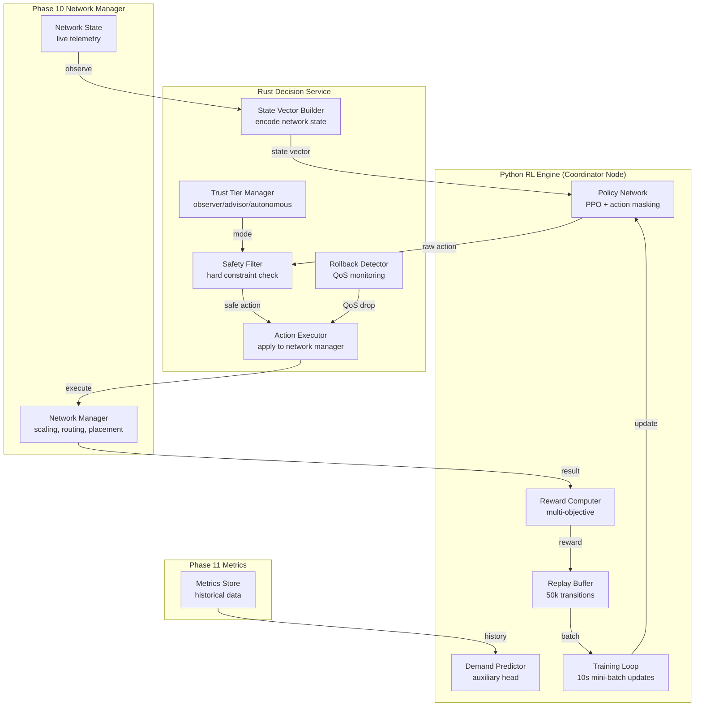

# Design Document: RL Network Orchestrator

## Overview

RL Network Orchestrator is Phase 12 — a deep reinforcement learning agent that manages network-wide model placement, instance scaling, request routing, and resource allocation across the Mesh Compute Network. It replaces Phase 10's rule-based threshold logic with a learned policy that anticipates demand, optimizes quality/latency tradeoffs, and adapts to network-specific patterns.

The system is split across three layers:

- **Python RL Engine** (`training/rl_network_orchestrator/`): The policy network (PPO with action masking), replay buffer, reward computation, demand predictor, and training loop. Runs as a background service on coordinator nodes.
- **Rust Decision Service** (`src-tauri/src/rl_network_decision_service.rs`): Bridges the Python RL engine with the mesh network manager. Handles state vector construction from live telemetry, action execution via the Phase 10 Network Manager, safety filtering, rollback detection, and trust tier management.
- **TypeScript Integration** (`src/core/rl-network.ts`): IPC wrappers for RL status, trust tier display, and manual override controls.

### Key Design Decisions

1. **PPO over DQN for network orchestration**: Unlike Phase 4 (offline DQN on historical data), the network orchestrator learns online from live observations. PPO handles continuous action spaces better and is more stable for online learning with safety constraints.

2. **Action masking for safety**: Rather than a separate safety filter rejecting actions post-hoc, the policy uses action masking — invalid actions (violating hard constraints) are masked to probability zero before sampling. This is more sample-efficient than rejection sampling.

3. **60-second decision interval**: One action per minute gives enough time to observe consequences (model loads take 30-120s, demand shifts over minutes). Faster decisions would cause thrashing.

4. **Hierarchical action decomposition**: The action space is decomposed into: (1) scaling decision (tier change), (2) placement decision (which node for which model), (3) routing bias (traffic weights). The policy outputs all three but they're applied independently, reducing combinatorial explosion.

5. **Demand prediction as auxiliary task**: The policy network has an auxiliary head that predicts demand 5/15/60 minutes ahead. This forces the network to learn temporal patterns (time-of-day, day-of-week) which improves proactive scaling.

6. **Trust tier with shadow mode**: In "observer" mode, the RL computes actions but doesn't execute them — instead it logs what it *would* have done and compares against rule-based outcomes. This provides training data without risk.

## Architecture



## Components and Interfaces

### 1. Python RL Engine

```python
# training/rl_network_orchestrator/policy_network.py

import torch
import torch.nn as nn
import numpy as np
from dataclasses import dataclass
from typing import List, Tuple, Optional

@dataclass
class NetworkRLConfig:
    state_dim: int                          # computed from network size
    scaling_actions: int = 3                # heavy/medium/light
    max_nodes: int = 50
    max_models: int = 20
    hidden_dim: int = 256
    num_hidden_layers: int = 3
    learning_rate: float = 3e-4
    gamma: float = 0.99
    gae_lambda: float = 0.95
    clip_epsilon: float = 0.2
    entropy_coef: float = 0.01
    value_coef: float = 0.5
    demand_pred_coef: float = 0.1          # auxiliary task weight
    max_grad_norm: float = 0.5
    exploration_budget: float = 0.05


class NetworkPolicyNetwork(nn.Module):
    """PPO policy with action masking and demand prediction auxiliary head."""

    def __init__(self, config: NetworkRLConfig):
        super().__init__()
        self.config = config

        # Shared feature extractor
        layers = []
        in_dim = config.state_dim
        for _ in range(config.num_hidden_layers):
            layers.extend([nn.Linear(in_dim, config.hidden_dim), nn.ReLU(), nn.LayerNorm(config.hidden_dim)])
            in_dim = config.hidden_dim
        self.feature_extractor = nn.Sequential(*layers)

        # Policy heads (decomposed actions)
        self.scaling_head = nn.Linear(config.hidden_dim, config.scaling_actions)
        self.placement_head = nn.Linear(config.hidden_dim, config.max_nodes * config.max_models)
        self.routing_head = nn.Linear(config.hidden_dim, config.max_nodes)

        # Value head
        self.value_head = nn.Linear(config.hidden_dim, 1)

        # Demand prediction auxiliary head (5min, 15min, 60min)
        self.demand_head = nn.Linear(config.hidden_dim, 3)

    def forward(self, state: torch.Tensor, action_mask: torch.Tensor) -> dict:
        features = self.feature_extractor(state)

        # Masked scaling logits
        scaling_logits = self.scaling_head(features)
        scaling_logits = scaling_logits.masked_fill(~action_mask[:, :3].bool(), float('-inf'))

        # Routing weights (softmax over nodes)
        routing_logits = self.routing_head(features)

        # Value estimate
        value = self.value_head(features)

        # Demand prediction
        demand_pred = self.demand_head(features)

        return {
            "scaling_logits": scaling_logits,
            "routing_logits": routing_logits,
            "value": value,
            "demand_prediction": demand_pred,
            "features": features,
        }


class PPOTrainer:
    """Proximal Policy Optimization trainer for the network orchestrator."""

    def __init__(self, config: NetworkRLConfig):
        self.config = config
        self.policy = NetworkPolicyNetwork(config)
        self.optimizer = torch.optim.Adam(self.policy.parameters(), lr=config.learning_rate)
        self.replay_buffer: List[dict] = []
        self.max_buffer_size = 50000

    def select_action(self, state: np.ndarray, action_mask: np.ndarray,
                      explore: bool = False) -> dict:
        """Select action using current policy with optional exploration."""
        ...

    def store_transition(self, state, action, reward, next_state, done, action_mask):
        """Store transition in replay buffer."""
        ...

    def train_step(self, batch_size: int = 64) -> dict:
        """PPO update step. Returns loss metrics."""
        ...

    def compute_gae(self, rewards, values, dones) -> Tuple[torch.Tensor, torch.Tensor]:
        """Compute Generalized Advantage Estimation."""
        ...

    def save_checkpoint(self, path: str):
        """Save policy weights and optimizer state."""
        ...

    def load_checkpoint(self, path: str):
        """Load policy weights."""
        ...
```

```python
# training/rl_network_orchestrator/reward_computer.py

from dataclasses import dataclass

@dataclass
class RewardWeights:
    quality: float = 0.3
    latency: float = 0.3
    fairness: float = 0.15
    efficiency: float = 0.15
    transition_penalty: float = 0.1


class NetworkRewardComputer:
    """Computes multi-objective reward for network orchestration."""

    def __init__(self, weights: RewardWeights):
        self.weights = weights

    def compute_reward(self, metrics: dict) -> float:
        """
        Compute: w1*quality + w2*latency + w3*fairness + w4*efficiency - w5*penalty
        All components normalized to [0, 1].
        """
        quality = metrics["avg_tier_served"] / metrics["avg_tier_requested"]  # [0,1]
        latency = metrics["interactive_meeting_target_pct"]                    # [0,1]
        fairness = 1.0 - metrics["gini_coefficient"]                          # [0,1]
        efficiency = metrics["active_compute"] / max(metrics["allocated_compute"], 1)
        penalty = min(metrics["model_transitions_this_interval"] / 3.0, 1.0)  # cap at 3

        reward = (
            self.weights.quality * quality
            + self.weights.latency * latency
            + self.weights.fairness * fairness
            + self.weights.efficiency * efficiency
            - self.weights.transition_penalty * penalty
        )
        return max(-1.0, min(1.0, reward))
```

```python
# training/rl_network_orchestrator/demand_predictor.py

import numpy as np
from typing import List

class DemandPredictor:
    """Time-series demand forecasting using seasonal decomposition."""

    def __init__(self, history_hours: int = 168):
        self.history: List[float] = []
        self.timestamps: List[str] = []

    def record(self, demand_cu: float, timestamp: str):
        """Record demand observation."""
        ...

    def predict(self, horizons_minutes: List[int] = [5, 15, 60]) -> List[float]:
        """Predict demand at given horizons using hour-of-day + day-of-week patterns."""
        ...

    def accuracy(self, horizon_minutes: int) -> float:
        """Compute MAPE for predictions at given horizon over last 24h."""
        ...
```

### 2. Rust Decision Service

```rust
// src-tauri/src/rl_network_decision_service.rs

use serde::{Deserialize, Serialize};
use std::sync::Arc;
use tokio::sync::RwLock;

#[derive(Debug, Clone, Serialize, Deserialize)]
#[serde(rename_all = "camelCase")]
pub struct NetworkRLState {
    pub trust_tier: NetworkTrustTier,
    pub decision_interval_secs: u64,        // default: 60
    pub exploration_budget: f64,            // default: 0.05
    pub last_action: Option<NetworkAction>,
    pub last_reward: Option<f64>,
    pub cumulative_reward_24h: f64,
    pub rule_based_reward_24h: f64,         // baseline comparison
    pub rollback_count_24h: u32,
    pub actions_taken_24h: u32,
    pub actions_vetoed_24h: u32,
}

#[derive(Debug, Clone, Serialize, Deserialize, PartialEq)]
#[serde(rename_all = "kebab-case")]
pub enum NetworkTrustTier {
    Observer,       // first 30 days: watch only
    Advisor,        // 30-90 days: propose with full safety filter
    Autonomous,     // 90+ days: act with minimal safety filter
}

#[derive(Debug, Clone, Serialize, Deserialize)]
#[serde(rename_all = "camelCase")]
pub struct NetworkAction {
    pub action_type: String,                // "scale_tier" | "load_model" | "unload_model" | "adjust_routing" | "hold"
    pub target_tier: Option<String>,
    pub target_node_id: Option<String>,
    pub target_model_id: Option<String>,
    pub routing_weights: Option<Vec<(String, f64)>>,
    pub decided_at: String,
    pub was_exploratory: bool,
    pub safety_vetoed: bool,
    pub veto_reason: Option<String>,
}

#[derive(Debug, Clone, Serialize, Deserialize)]
#[serde(rename_all = "camelCase")]
pub struct SafetyConstraints {
    pub min_reserve_buffer_percent: f64,    // 20%
    pub max_transitions_per_hour: u32,      // 3
    pub min_instances_per_tier: u32,        // 1
    pub max_node_utilization: f64,          // 90%
    pub local_priority_inviolable: bool,    // always true
    pub qos_floor_interactive_ms: u64,     // 5000
}

#[derive(Debug, Clone, Serialize, Deserialize)]
#[serde(rename_all = "camelCase")]
pub struct RollbackEvent {
    pub action: NetworkAction,
    pub reward_before: f64,
    pub reward_after: f64,
    pub drop_percent: f64,
    pub rolled_back_at: String,
    pub reverted_to: String,
}

#[derive(Debug, Clone, Serialize, Deserialize)]
#[serde(rename_all = "camelCase")]
pub struct LocalRoutingDecision {
    pub request_id: String,
    pub decision: String,                   // "local" | "network"
    pub reason: String,
    pub local_model_quality: f64,
    pub network_model_quality: f64,
    pub network_latency_ms: f64,
    pub decided_in_ms: f64,
}

/// Check if an action violates safety constraints.
pub fn check_safety(
    action: &NetworkAction,
    network_state: &NetworkState,
    constraints: &SafetyConstraints,
) -> Result<(), String> { /* returns Err with reason if unsafe */ }

/// Detect if QoS has degraded since last action (rollback trigger).
pub fn detect_qos_degradation(
    reward_before: f64,
    reward_after: f64,
    threshold: f64,                         // 0.20 = 20% drop
) -> bool { /* ... */ }

/// Decide whether a request should stay local or route to network.
pub fn decide_local_vs_network(
    task_complexity: f64,
    local_model_tier: &str,
    best_network_tier: &str,
    network_latency_ms: f64,
    network_load_percent: f64,
    user_qos_preference: &str,
) -> LocalRoutingDecision { /* ... */ }

/// IPC commands
#[tauri::command]
pub async fn rl_network_get_state() -> Result<NetworkRLState, String> { /* ... */ }

#[tauri::command]
pub async fn rl_network_get_last_action() -> Result<Option<NetworkAction>, String> { /* ... */ }

#[tauri::command]
pub async fn rl_network_force_action(action: serde_json::Value) -> Result<(), String> { /* ... */ }

#[tauri::command]
pub async fn rl_network_set_trust_tier(tier: String) -> Result<(), String> { /* ... */ }

#[tauri::command]
pub async fn rl_network_get_rollback_history() -> Result<Vec<RollbackEvent>, String> { /* ... */ }

#[tauri::command]
pub async fn rl_network_route_decision(
    task_complexity: f64,
    local_model_tier: String,
) -> Result<LocalRoutingDecision, String> { /* ... */ }
```

## Correctness Properties

### Property 1: Safety filter completeness
*For any* action proposed by the RL policy, `check_safety` SHALL reject actions that would: reduce reserve below 20%, exceed 3 model transitions per hour, leave zero instances of any tier, overload a node past 90%, or violate local priority.

### Property 2: Exploration budget enforcement
*For any* rolling window of 100 decisions, the number of exploratory actions SHALL NOT exceed `exploration_budget × 100` (default: 5 exploratory per 100 decisions).

### Property 3: Rollback trigger correctness
*For any* action followed by a reward drop > 20% within 2 minutes, `detect_qos_degradation` SHALL return true and the system SHALL revert to the previous configuration.

### Property 4: Trust tier progression
*For any* trust tier state: Observer → Advisor requires 30 days with RL hypothetical reward >= rule-based. Advisor → Autonomous requires 60 cumulative days with RL reward > rule-based + 5%. Demotion triggers on 7-day degradation.

### Property 5: Reward bounds
*For any* set of network metrics, `compute_reward` SHALL return a value in [-1.0, 1.0].

### Property 6: Local routing speed
*For any* local-vs-network routing decision, `decide_local_vs_network` SHALL complete within 10ms.

### Property 7: Demand prediction fallback
*When* demand prediction MAPE exceeds 30% for 24 hours, the system SHALL fall back to reactive-only scaling (Phase 10 rule-based thresholds).

### Property 8: Graceful RL failure
*If* the Python RL engine crashes or becomes unresponsive, the system SHALL immediately use Phase 10's rule-based logic with zero service interruption. The RL failure SHALL NOT affect any inference request in flight.
