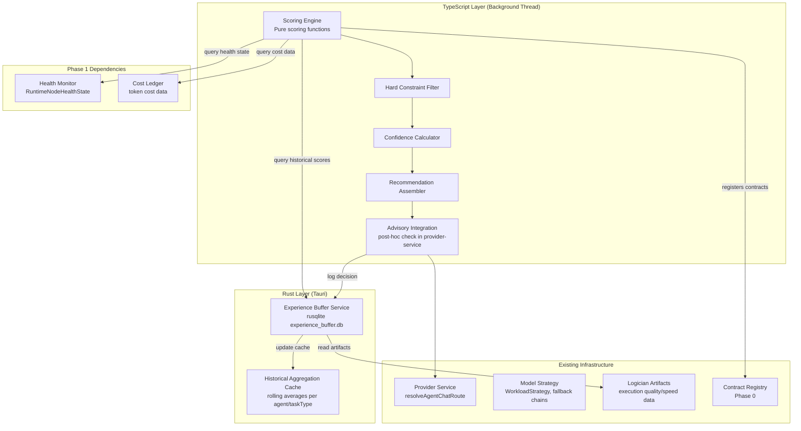

# Design Document: Scoring Engine

## Overview

The Scoring Engine is Phase 2 of the ResonantOS vNext improvement plan — a deterministic, rule-based agent selection advisor that produces ranked recommendations for the existing heuristic routing system. It operates entirely outside the LLM context (zero tokens, zero API calls) as a pure computation on structured data from the Health Monitor, Cost Ledger, and Logician execution artifacts.

The system is split across two layers:
- **TypeScript scoring layer** (`src/core/scoring-engine.ts`): Pure functions for score computation, hard constraint filtering, confidence calculation, and recommendation assembly. Runs synchronously in <20ms on the background thread.
- **Rust persistence layer** (`src-tauri/src/experience_buffer_service.rs`): Owns the Experience Buffer (rusqlite), historical data aggregation, and the rolling average cache. Exposes IPC commands for the TypeScript layer to query historical scores and persist decisions.

The scoring engine is **advisory only** — the heuristic router (`resolveProviderRoute` / `resolveStrategyRoute` in `provider-service.ts`) always runs first and makes the authoritative decision. The scoring engine's recommendation is evaluated post-hoc: if confidence exceeds the threshold and no hard constraints are violated, the heuristic router may accept the recommendation. Otherwise it proceeds with its own selection unchanged.

### Key Design Decisions

1. **TypeScript-first scoring logic**: The scoring computation lives in TypeScript because it needs access to `DelegationPacket`, `WorkloadStrategy`, `CapabilityGrant`, and `ProviderCostPosture` types — all TypeScript-native. The Rust layer only handles persistence and historical aggregation.

2. **Advisory post-hoc integration**: Rather than intercepting the routing pipeline, the scoring engine runs in parallel and the heuristic router evaluates the recommendation after making its own decision. This ensures zero-latency impact on the critical path.

3. **Experience Buffer in Rust/rusqlite**: Matches the Phase 1 pattern (Cost Ledger, Federated Memory) of using rusqlite for structured persistence. The buffer schema is designed for future batch export to Phase 4 RL training.

4. **Circuit breaker pattern**: Protects the heuristic router from scoring engine failures. After 3 consecutive failures, scoring is disabled for a cooldown period. The heuristic router never waits for the scoring engine.

5. **Exponential decay for historical scores**: Recent execution artifacts are weighted more heavily than older ones (14-day half-life), allowing the scoring engine to adapt to changing agent performance without manual intervention.

6. **Trust tier progression**: The scoring engine starts with high confidence threshold (0.80) and earns lower thresholds (0.60) through demonstrated improvement over 30 days. This prevents a new advisory system from disrupting proven routing.

## Architecture



## Components and Interfaces

### 1. Scoring Engine Core (`scoring-engine.ts`)

```typescript
// src/core/scoring-engine.ts

import type {
  DelegationPacket,
  DelegationTaskType,
  WorkloadClass,
  RuntimeNodeHealthState,
  ProviderCostPosture,
  CapabilityGrant,
} from "./contracts";

// --- Scoring Weight Configuration ---

export interface ScoringWeights {
  qualityWeight: number;
  costWeight: number;
  speedWeight: number;
  availabilityWeight: number;
}

export interface ScoringWeightsConfig {
  weights: Record<WorkloadClass, ScoringWeights>;
  updatedAt: string;
}

export const DEFAULT_SCORING_WEIGHTS: Record<WorkloadClass, ScoringWeights> = {
  "primary-chat": { qualityWeight: 0.3, costWeight: 0.1, speedWeight: 0.4, availabilityWeight: 0.2 },
  coding: { qualityWeight: 0.4, costWeight: 0.2, speedWeight: 0.2, availabilityWeight: 0.2 },
  "agentic-coding": { qualityWeight: 0.4, costWeight: 0.2, speedWeight: 0.2, availabilityWeight: 0.2 },
  routine: { qualityWeight: 0.2, costWeight: 0.4, speedWeight: 0.2, availabilityWeight: 0.2 },
  "archive-ingest": { qualityWeight: 0.2, costWeight: 0.4, speedWeight: 0.2, availabilityWeight: 0.2 },
  recovery: { qualityWeight: 0.3, costWeight: 0.1, speedWeight: 0.2, availabilityWeight: 0.4 },
  background: { qualityWeight: 0.2, costWeight: 0.4, speedWeight: 0.2, availabilityWeight: 0.2 },
};

// --- Factor Scores ---

export interface FactorScores {
  quality: number;   // 0.0–1.0
  cost: number;      // 0.0–1.0
  speed: number;     // 0.0–1.0
  availability: number; // 0.0–1.0
}

// --- Candidate Agent ---

export interface CandidateAgent {
  agentId: string;
  providerProfileId: string;
  runtimeNodeId: string;
  model: string;
  costPosture: ProviderCostPosture;
  healthState: RuntimeNodeHealthState;
  capabilities: CapabilityGrant[];
  trustTier: "addon" | "trusted";
}

// --- Historical Data ---

export interface HistoricalAgentStats {
  agentId: string;
  taskType: DelegationTaskType;
  recordCount: number;
  rollingQualityScore: number;    // 0.0–1.0, exponential decay weighted
  rollingSpeedMs: number;         // average duration in ms
  rollingCostTokens: number;      // average total tokens per task
  lastUpdatedAt: string;
}

// --- Scoring Recommendation ---

export interface ScoredAgent {
  agentId: string;
  providerProfileId: string;
  runtimeNodeId: string;
  model: string;
  agentScore: number;             // 0.0–1.0
  factorScores: FactorScores;
  appliedWeights: ScoringWeights;
}

export interface ScoringRecommendation {
  delegationPacketId: string;
  timestamp: string;
  workloadClass: WorkloadClass;
  taskType: DelegationTaskType;
  confidenceScore: number;        // 0.0–1.0
  rankedAgents: ScoredAgent[];
  excludedAgents: ExcludedAgent[];
  scoringDurationMs: number;
}

export interface ExcludedAgent {
  agentId: string;
  reason: HardConstraintViolation;
}

export type HardConstraintViolation =
  | "cost-ceiling-exceeded"
  | "missing-capability"
  | "insufficient-trust-tier"
  | "provider-unavailable"
  | "outside-fallback-chain";

// --- Hard Constraint Filter ---

export interface HardConstraintContext {
  costPolicy: DelegationPacket["costPolicy"];
  capabilityGrants: DelegationPacket["capabilityGrants"];
  humanApprovalRequired: boolean;
  approvalReasons: DelegationPacket["approvalReasons"];
  allowedFallbackChainAgentIds: string[];
}

// --- Circuit Breaker ---

export interface CircuitBreakerState {
  consecutiveFailures: number;
  isOpen: boolean;
  lastFailureAt: string | null;
  cooldownEndsAt: string | null;
  cooldownMs: number;             // default: 60000
  failureThreshold: number;       // default: 3
}

// --- Trust Tier ---

export type ScoringEngineTrustTier = "addon" | "trusted";

export interface TrustTierState {
  currentTier: ScoringEngineTrustTier;
  confidenceThreshold: number;    // 0.80 for addon, 0.60 for trusted
  promotedAt: string | null;
  validationStartedAt: string;
  consecutiveDaysImproved: number;
  consecutiveDaysDegraded: number;
}

// --- Core Functions ---

export const computeAgentScore = (
  factors: FactorScores,
  weights: ScoringWeights,
): number => {
  return (
    weights.qualityWeight * factors.quality +
    weights.costWeight * factors.cost +
    weights.speedWeight * factors.speed +
    weights.availabilityWeight * factors.availability
  );
};

export const normalizeHealthState = (
  healthState: RuntimeNodeHealthState,
): number => {
  switch (healthState) {
    case "ready": return 1.0;
    case "degraded": return 0.5;
    case "deployable": return 0.3;
    case "unavailable": return 0.0;
  }
};

export const computeCostEfficiency = (
  avgTokenCost: number,
  costPolicy: DelegationPacket["costPolicy"],
): number => {
  // Maps cost posture preference to a target token budget
  // Returns 1.0 when agent cost is well within budget, 0.0 when far over
  if (avgTokenCost <= 0) return 1.0;
  const tierMultipliers: Record<string, number> = {
    "free-local": 0,
    subscription: 5000,
    "paid-api": 20000,
    "best-available": 50000,
  };
  const ceiling = tierMultipliers[costPolicy.preferredCostTier] ?? 50000;
  if (ceiling === 0) return avgTokenCost === 0 ? 1.0 : 0.0;
  return Math.max(0, Math.min(1, 1 - (avgTokenCost - ceiling) / ceiling));
};

export const computeSpeedScore = (
  avgDurationMs: number,
  targetMs: number,
): number => {
  if (avgDurationMs <= 0) return 1.0;
  if (avgDurationMs <= targetMs) return 1.0;
  return Math.max(0, Math.min(1, targetMs / avgDurationMs));
};

export const computeConfidenceScore = (
  rankedAgents: ScoredAgent[],
  topAgentRecordCount: number,
): number => {
  if (rankedAgents.length < 2) return 0.0;
  const margin = rankedAgents[0].agentScore - rankedAgents[1].agentScore;
  const dataConfidence = Math.min(1.0, topAgentRecordCount / 5);
  return Math.min(1.0, margin * 2 + dataConfidence * 0.5);
};

export const filterHardConstraints = (
  candidates: CandidateAgent[],
  context: HardConstraintContext,
): { passed: CandidateAgent[]; excluded: ExcludedAgent[] } => { /* ... */ };

export const scoreCandidates = (
  packet: DelegationPacket,
  candidates: CandidateAgent[],
  historicalStats: Map<string, HistoricalAgentStats>,
  weights: ScoringWeights,
  constraintContext: HardConstraintContext,
): ScoringRecommendation => { /* ... */ };

export const validateWeightsSum = (weights: ScoringWeights): boolean => {
  const sum = weights.qualityWeight + weights.costWeight + weights.speedWeight + weights.availabilityWeight;
  return Math.abs(sum - 1.0) < 0.001;
};

export const resolveWeightsForWorkload = (
  workloadClass: WorkloadClass,
  config: ScoringWeightsConfig | null,
): ScoringWeights => {
  if (config?.weights[workloadClass]) return config.weights[workloadClass];
  return DEFAULT_SCORING_WEIGHTS[workloadClass];
};
```

### 2. Advisory Integration (`scoring-advisory.ts`)

```typescript
// src/core/scoring-advisory.ts

import type { ScoringRecommendation, CircuitBreakerState, TrustTierState } from "./scoring-engine";
import type { ProviderRoutingDecision } from "./contracts";

export interface AdvisoryDecision {
  accepted: boolean;
  recommendation: ScoringRecommendation | null;
  heuristicDecision: ProviderRoutingDecision;
  rejectionReason: AdvisoryRejectionReason | null;
  timestamp: string;
}

export type AdvisoryRejectionReason =
  | "confidence-below-threshold"
  | "hard-constraint-violation"
  | "outside-fallback-chain"
  | "scoring-engine-unavailable"
  | "circuit-breaker-open"
  | "timeout-exceeded";

export interface AdvisoryIntegrationConfig {
  timeoutMs: number;              // default: 50
  enabled: boolean;
  trustTierState: TrustTierState;
  circuitBreakerState: CircuitBreakerState;
}

export const evaluateAdvisory = (
  recommendation: ScoringRecommendation | null,
  heuristicDecision: ProviderRoutingDecision,
  config: AdvisoryIntegrationConfig,
): AdvisoryDecision => { /* ... */ };

export const updateCircuitBreaker = (
  state: CircuitBreakerState,
  success: boolean,
  now: string,
): CircuitBreakerState => { /* ... */ };

export const shouldAttemptScoring = (
  circuitBreaker: CircuitBreakerState,
  now: string,
): boolean => { /* ... */ };
```

### 3. Scoring Transparency (`scoring-transparency.ts`)

```typescript
// src/core/scoring-transparency.ts

import type { ScoringRecommendation, ExcludedAgent } from "./scoring-engine";

export interface ScoringBreakdown {
  recommendation: ScoringRecommendation;
  filteringLog: FilteringLogEntry[];
}

export interface FilteringLogEntry {
  agentId: string;
  excluded: boolean;
  reason: string | null;
  constraintDetails: string;
}

export interface ScoringAggregateStats {
  totalRecommendations: number;
  acceptanceRate: number;         // 0.0–1.0
  averageConfidenceScore: number;
  recommendationAccuracy: number; // 0.0–1.0 (accepted recs that led to successful completion)
  periodDays: number;
}

export const buildScoringBreakdown = (
  recommendation: ScoringRecommendation,
): ScoringBreakdown => { /* ... */ };

export const queryRecentRecommendations = (
  limit: number,
): Promise<ScoringBreakdown[]> => { /* ... */ };

export const computeAggregateStats = (
  periodDays: number,
): Promise<ScoringAggregateStats> => { /* ... */ };
```

### 4. Experience Buffer Service (`experience_buffer_service.rs`)

```rust
// src-tauri/src/experience_buffer_service.rs

use rusqlite::{params, Connection};
use serde::{Deserialize, Serialize};

/// A single experience record capturing a scoring decision and its outcome.
#[derive(Debug, Clone, Serialize, Deserialize)]
#[serde(rename_all = "camelCase")]
pub struct ExperienceRecord {
    pub id: String,
    pub delegation_packet_id: String,
    pub timestamp: String,
    pub workload_class: String,
    pub task_type: String,
    pub scoring_recommendation_json: String,  // serialized ScoringRecommendation
    pub heuristic_decision_json: String,      // serialized ProviderRoutingDecision
    pub advisory_accepted: bool,
    pub rejection_reason: Option<String>,
    pub outcome_status: Option<String>,       // "passed" | "failed" | "degraded" | null (pending)
    pub outcome_duration_ms: Option<u64>,
    pub outcome_quality_score: Option<f64>,   // derived from LogicianExecutionArtifact
    pub outcome_recorded_at: Option<String>,
}

/// Rolling historical stats cached per agent per task type.
#[derive(Debug, Clone, Serialize, Deserialize)]
#[serde(rename_all = "camelCase")]
pub struct HistoricalStatsCache {
    pub agent_id: String,
    pub task_type: String,
    pub record_count: u32,
    pub rolling_quality_score: f64,
    pub rolling_speed_ms: f64,
    pub rolling_cost_tokens: f64,
    pub last_updated_at: String,
    pub decay_half_life_days: u32,  // default: 14
}

/// Trust tier transition log entry.
#[derive(Debug, Clone, Serialize, Deserialize)]
#[serde(rename_all = "camelCase")]
pub struct TrustTierTransition {
    pub id: String,
    pub from_tier: String,
    pub to_tier: String,
    pub transitioned_at: String,
    pub validation_period_days: u32,
    pub metrics_json: String,       // serialized validation metrics
    pub promoting_authority: String,
}

/// Query for retrieving experience records.
#[derive(Debug, Deserialize)]
#[serde(rename_all = "camelCase")]
pub struct ExperienceQuery {
    pub from_date: Option<String>,
    pub to_date: Option<String>,
    pub task_type: Option<String>,
    pub advisory_accepted: Option<bool>,
    pub limit: Option<u32>,
}

/// Aggregate stats response.
#[derive(Debug, Serialize)]
#[serde(rename_all = "camelCase")]
pub struct ExperienceAggregateStats {
    pub total_recommendations: u64,
    pub acceptance_rate: f64,
    pub average_confidence_score: f64,
    pub recommendation_accuracy: f64,
    pub period_days: u32,
}

pub fn initialize_experience_buffer_db(connection: &Connection) -> Result<(), String> { /* ... */ }

pub fn record_experience(
    connection: &Connection,
    record: &ExperienceRecord,
) -> Result<(), String> { /* ... */ }

pub fn append_outcome(
    connection: &Connection,
    delegation_packet_id: &str,
    status: &str,
    duration_ms: u64,
    quality_score: f64,
) -> Result<(), String> { /* ... */ }

pub fn query_historical_stats(
    connection: &Connection,
    agent_id: &str,
    task_type: &str,
) -> Result<Option<HistoricalStatsCache>, String> { /* ... */ }

pub fn query_system_wide_stats(
    connection: &Connection,
    task_type: &str,
) -> Result<Option<HistoricalStatsCache>, String> { /* ... */ }

pub fn refresh_historical_cache(
    connection: &Connection,
    agent_id: &str,
    task_type: &str,
    decay_half_life_days: u32,
) -> Result<HistoricalStatsCache, String> { /* ... */ }

pub fn query_experience_records(
    connection: &Connection,
    query: &ExperienceQuery,
) -> Result<Vec<ExperienceRecord>, String> { /* ... */ }

pub fn compute_aggregate_stats(
    connection: &Connection,
    period_days: u32,
) -> Result<ExperienceAggregateStats, String> { /* ... */ }

pub fn evict_expired_records(
    connection: &Connection,
    retention_days: u32,  // default: 90
) -> Result<u32, String> { /* ... */ }

/// IPC commands
#[tauri::command]
pub fn experience_buffer_record(record: ExperienceRecord) -> Result<(), String> { /* ... */ }

#[tauri::command]
pub fn experience_buffer_append_outcome(
    delegation_packet_id: String,
    status: String,
    duration_ms: u64,
    quality_score: f64,
) -> Result<(), String> { /* ... */ }

#[tauri::command]
pub fn experience_buffer_query_stats(
    agent_id: String,
    task_type: String,
) -> Result<Option<HistoricalStatsCache>, String> { /* ... */ }

#[tauri::command]
pub fn experience_buffer_query_system_stats(
    task_type: String,
) -> Result<Option<HistoricalStatsCache>, String> { /* ... */ }

#[tauri::command]
pub fn experience_buffer_query_records(
    query: ExperienceQuery,
) -> Result<Vec<ExperienceRecord>, String> { /* ... */ }

#[tauri::command]
pub fn experience_buffer_aggregate_stats(
    period_days: u32,
) -> Result<ExperienceAggregateStats, String> { /* ... */ }

#[tauri::command]
pub fn experience_buffer_refresh_cache(
    agent_id: String,
    task_type: String,
) -> Result<HistoricalStatsCache, String> { /* ... */ }
```

### 5. TypeScript IPC Client (`scoring-ipc.ts`)

```typescript
// src/core/scoring-ipc.ts

import { invoke } from "@tauri-apps/api/core";
import type { HistoricalAgentStats } from "./scoring-engine";

export interface ExperienceRecordPayload {
  id: string;
  delegationPacketId: string;
  timestamp: string;
  workloadClass: string;
  taskType: string;
  scoringRecommendationJson: string;
  heuristicDecisionJson: string;
  advisoryAccepted: boolean;
  rejectionReason: string | null;
}

export const recordExperience = (record: ExperienceRecordPayload): Promise<void> =>
  invoke("experience_buffer_record", { record });

export const appendOutcome = (
  delegationPacketId: string,
  status: string,
  durationMs: number,
  qualityScore: number,
): Promise<void> =>
  invoke("experience_buffer_append_outcome", {
    delegationPacketId,
    status,
    durationMs,
    qualityScore,
  });

export const queryHistoricalStats = (
  agentId: string,
  taskType: string,
): Promise<HistoricalAgentStats | null> =>
  invoke("experience_buffer_query_stats", { agentId, taskType });

export const querySystemWideStats = (
  taskType: string,
): Promise<HistoricalAgentStats | null> =>
  invoke("experience_buffer_query_system_stats", { taskType });

export const queryExperienceRecords = (query: {
  fromDate?: string;
  toDate?: string;
  taskType?: string;
  advisoryAccepted?: boolean;
  limit?: number;
}): Promise<ExperienceRecordPayload[]> =>
  invoke("experience_buffer_query_records", { query });

export const queryAggregateStats = (periodDays: number): Promise<{
  totalRecommendations: number;
  acceptanceRate: number;
  averageConfidenceScore: number;
  recommendationAccuracy: number;
  periodDays: number;
}> => invoke("experience_buffer_aggregate_stats", { periodDays });

export const refreshHistoricalCache = (
  agentId: string,
  taskType: string,
): Promise<HistoricalAgentStats> =>
  invoke("experience_buffer_refresh_cache", { agentId, taskType });
```

## Data Models

### Experience Buffer Schema (`experience_buffer.db`)

```sql
CREATE TABLE IF NOT EXISTS experience_records (
    id TEXT PRIMARY KEY,
    delegation_packet_id TEXT NOT NULL,
    timestamp TEXT NOT NULL,
    workload_class TEXT NOT NULL,
    task_type TEXT NOT NULL,
    scoring_recommendation_json TEXT NOT NULL,
    heuristic_decision_json TEXT NOT NULL,
    advisory_accepted INTEGER NOT NULL DEFAULT 0,
    rejection_reason TEXT,
    outcome_status TEXT,
    outcome_duration_ms INTEGER,
    outcome_quality_score REAL,
    outcome_recorded_at TEXT,
    confidence_score REAL NOT NULL DEFAULT 0.0
);

CREATE TABLE IF NOT EXISTS historical_stats_cache (
    agent_id TEXT NOT NULL,
    task_type TEXT NOT NULL,
    record_count INTEGER NOT NULL DEFAULT 0,
    rolling_quality_score REAL NOT NULL DEFAULT 0.0,
    rolling_speed_ms REAL NOT NULL DEFAULT 0.0,
    rolling_cost_tokens REAL NOT NULL DEFAULT 0.0,
    last_updated_at TEXT NOT NULL,
    decay_half_life_days INTEGER NOT NULL DEFAULT 14,
    PRIMARY KEY (agent_id, task_type)
);

CREATE TABLE IF NOT EXISTS trust_tier_transitions (
    id TEXT PRIMARY KEY,
    from_tier TEXT NOT NULL,
    to_tier TEXT NOT NULL,
    transitioned_at TEXT NOT NULL,
    validation_period_days INTEGER NOT NULL,
    metrics_json TEXT NOT NULL,
    promoting_authority TEXT NOT NULL
);

CREATE TABLE IF NOT EXISTS scoring_weights_config (
    workload_class TEXT PRIMARY KEY,
    quality_weight REAL NOT NULL,
    cost_weight REAL NOT NULL,
    speed_weight REAL NOT NULL,
    availability_weight REAL NOT NULL,
    updated_at TEXT NOT NULL
);

CREATE TABLE IF NOT EXISTS circuit_breaker_state (
    id TEXT PRIMARY KEY DEFAULT 'singleton',
    consecutive_failures INTEGER NOT NULL DEFAULT 0,
    is_open INTEGER NOT NULL DEFAULT 0,
    last_failure_at TEXT,
    cooldown_ends_at TEXT,
    cooldown_ms INTEGER NOT NULL DEFAULT 60000,
    failure_threshold INTEGER NOT NULL DEFAULT 3
);

-- Indexes for common queries
CREATE INDEX IF NOT EXISTS idx_experience_timestamp
    ON experience_records(timestamp);
CREATE INDEX IF NOT EXISTS idx_experience_task_type
    ON experience_records(task_type);
CREATE INDEX IF NOT EXISTS idx_experience_packet_id
    ON experience_records(delegation_packet_id);
CREATE INDEX IF NOT EXISTS idx_experience_advisory_accepted
    ON experience_records(advisory_accepted);
CREATE INDEX IF NOT EXISTS idx_experience_outcome_status
    ON experience_records(outcome_status);
CREATE INDEX IF NOT EXISTS idx_historical_stats_agent
    ON historical_stats_cache(agent_id);
```

### Scoring Weights Configuration (persisted in `scoring_weights_config` table)

Default weights loaded on startup if no persisted configuration exists:

| WorkloadClass | quality | cost | speed | availability |
|---|---|---|---|---|
| primary-chat | 0.3 | 0.1 | 0.4 | 0.2 |
| coding | 0.4 | 0.2 | 0.2 | 0.2 |
| agentic-coding | 0.4 | 0.2 | 0.2 | 0.2 |
| routine | 0.2 | 0.4 | 0.2 | 0.2 |
| archive-ingest | 0.2 | 0.4 | 0.2 | 0.2 |
| recovery | 0.3 | 0.1 | 0.2 | 0.4 |
| background | 0.2 | 0.4 | 0.2 | 0.2 |

### Historical Stats Computation

The rolling historical scores use exponential decay weighting:

```
weight(record) = exp(-ln(2) × age_days / half_life_days)
rolling_score = Σ(weight_i × score_i) / Σ(weight_i)
```

Where `age_days` is the number of days since the record was created, and `half_life_days` defaults to 14.

The rolling window is capped at the most recent 100 `LogicianExecutionArtifact` records per agent per `DelegationTaskType`.

### Behavioral Contract Registration

The scoring engine registers contracts as JSON files in `src/core/backtest-contracts/`:

- `contract-scoring-agent-score-range.json` — Agent scores always in [0.0, 1.0]
- `contract-scoring-weights-sum-to-one.json` — Weight vectors always sum to 1.0
- `contract-scoring-hard-constraint-exclusion.json` — Violating agents never appear in recommendations
- `contract-scoring-confidence-decreases-low-data.json` — Confidence drops with insufficient history
- `contract-scoring-experience-buffer-persistence.json` — Every decision is logged
- `contract-scoring-heuristic-never-blocked.json` — Heuristic router never waits for scoring
- `contract-scoring-circuit-breaker-activation.json` — Circuit breaker opens after 3 failures
- `contract-scoring-zero-tokens.json` — Zero tokens added to any prompt
- `contract-scoring-20ms-budget.json` — Scoring completes within 20ms
- `contract-scoring-background-thread.json` — Scoring runs off main thread


## Correctness Properties

*A property is a characteristic or behavior that should hold true across all valid executions of a system — essentially, a formal statement about what the system should do. Properties serve as the bridge between human-readable specifications and machine-verifiable correctness guarantees.*

### Property 1: Weighted linear formula correctness

*For any* valid `FactorScores` (each component in [0.0, 1.0]) and *for any* valid `ScoringWeights` (summing to 1.0), `computeAgentScore(factors, weights)` SHALL equal `(qualityWeight × quality) + (costWeight × cost) + (speedWeight × speed) + (availabilityWeight × availability)` and the result SHALL be in [0.0, 1.0].

**Validates: Requirements 1.1**

### Property 2: Factor score normalization bounds

*For any* input to the factor score computation functions (`normalizeHealthState`, `computeCostEfficiency`, `computeSpeedScore`), the output SHALL be in the range [0.0, 1.0] inclusive.

**Validates: Requirements 1.2, 1.5, 1.6, 1.7**

### Property 3: Scoring weights validation

*For any* four non-negative real numbers, `validateWeightsSum` SHALL return `true` if and only if their sum is within 0.001 of 1.0.

**Validates: Requirements 2.2**

### Property 4: Scoring weights persistence round-trip

*For any* valid `ScoringWeightsConfig` (all weight vectors summing to 1.0), persisting to the `scoring_weights_config` table and reloading SHALL produce a config where each weight value equals the original within floating-point precision (±0.0001).

**Validates: Requirements 2.5**

### Property 5: Recommendation ranking invariant

*For any* set of scored candidate agents, the `rankedAgents` array in the produced `ScoringRecommendation` SHALL be sorted in strictly non-increasing order by `agentScore` (i.e., for all consecutive pairs, `rankedAgents[i].agentScore >= rankedAgents[i+1].agentScore`).

**Validates: Requirements 3.1**

### Property 6: Recommendation structural completeness

*For any* `ScoringRecommendation` produced by `scoreCandidates`, every `ScoredAgent` in `rankedAgents` SHALL have: a non-empty `agentId`, an `agentScore` in [0.0, 1.0], `factorScores` with all four components in [0.0, 1.0], and `appliedWeights` summing to 1.0. The recommendation itself SHALL have a non-empty `delegationPacketId`, a valid ISO timestamp, a valid `workloadClass`, and a `confidenceScore` in [0.0, 1.0].

**Validates: Requirements 3.2, 3.4, 12.1**

### Property 7: Confidence score bounded and data-sensitive

*For any* ranked agent list and *for any* top-agent record count, `computeConfidenceScore` SHALL return a value in [0.0, 1.0]. Furthermore, *for any* fixed score margin, the confidence SHALL be monotonically non-decreasing as record count increases from 0 to 5.

**Validates: Requirements 3.3, 3.5**

### Property 8: Advisory evaluation correctness

*For any* `ScoringRecommendation` and `AdvisoryIntegrationConfig`, `evaluateAdvisory` SHALL return `accepted: true` if and only if: (a) the recommendation is non-null, (b) the circuit breaker is closed, (c) the `confidenceScore` is ≥ the trust tier's `confidenceThreshold`, and (d) the top-ranked agent does not violate any hard constraint. In all other cases, `accepted` SHALL be `false` with a non-null `rejectionReason`.

**Validates: Requirements 4.2, 4.3, 4.4, 4.5**

### Property 9: Hard constraint filtering correctness

*For any* set of `CandidateAgent` objects and *for any* `HardConstraintContext`, `filterHardConstraints` SHALL exclude a candidate if and only if at least one of: (a) its health state is "unavailable", (b) it lacks a required capability from `capabilityGrants`, (c) its cost exceeds the ceiling when sensitivity is "high" and `allowPaidEscalation` is false, or (d) its `agentId` is not in `allowedFallbackChainAgentIds`. Every excluded agent SHALL have a non-empty `reason` field.

**Validates: Requirements 5.1, 5.2, 5.3, 5.5, 12.2**

### Property 10: Experience record persistence round-trip

*For any* valid `ExperienceRecord` (non-empty id, valid timestamp, non-empty JSON fields), writing to the Experience Buffer and reading back by `delegation_packet_id` SHALL produce a record where `id`, `delegation_packet_id`, `workload_class`, `task_type`, `advisory_accepted`, and `rejection_reason` are all equal to the original.

**Validates: Requirements 6.1, 6.5, 6.6**

### Property 11: Experience outcome append preserves record and updates outcome fields

*For any* existing `ExperienceRecord` in the buffer and *for any* valid outcome (status in ["passed", "failed", "degraded"], duration_ms ≥ 0, quality_score in [0.0, 1.0]), calling `append_outcome` SHALL update the record's `outcome_status`, `outcome_duration_ms`, `outcome_quality_score`, and `outcome_recorded_at` fields to the provided values while preserving all other fields unchanged.

**Validates: Requirements 6.2**

### Property 12: Experience retention policy

*For any* set of `ExperienceRecord` entries with various timestamps, calling `evict_expired_records` with `retention_days = 90` SHALL never delete a record whose `timestamp` is fewer than 90 days before the current time. Records older than 90 days MAY be deleted.

**Validates: Requirements 6.4**

### Property 13: Circuit breaker state transitions

*For any* sequence of boolean success/failure events applied to `updateCircuitBreaker`: (a) the circuit breaker SHALL open (isOpen = true) after exactly `failureThreshold` (default 3) consecutive failures, (b) any success SHALL reset `consecutiveFailures` to 0 and close the breaker, (c) while open, `shouldAttemptScoring` SHALL return `false` until `cooldownEndsAt` is reached, and (d) after cooldown expires, `shouldAttemptScoring` SHALL return `true` (half-open state).

**Validates: Requirements 7.4**

### Property 14: Trust tier transitions

*For any* sequence of daily improvement/degradation signals: (a) promotion from "addon" to "trusted" SHALL occur if and only if 30 consecutive days show improvement, (b) demotion from "trusted" to "addon" SHALL occur if and only if 7 consecutive days show degradation after promotion, (c) the confidence threshold SHALL be 0.80 when tier is "addon" and 0.60 when tier is "trusted".

**Validates: Requirements 9.3, 9.5, 9.6**

### Property 15: Exponential decay historical scoring

*For any* sequence of up to 100 scored records with timestamps and *for any* half-life in days > 0, the rolling quality score SHALL equal the weighted average `Σ(weight_i × score_i) / Σ(weight_i)` where `weight_i = exp(-ln(2) × age_days_i / half_life)`. Records beyond the 100-record window SHALL be excluded from the computation.

**Validates: Requirements 1.4, 11.3, 11.5**

### Property 16: Cold-start fallback to system-wide averages

*For any* candidate agent with fewer than 3 historical records for the matching `DelegationTaskType`, the scoring engine SHALL use system-wide average scores for that task type as the `Historical_Quality_Score` and `Historical_Speed_Score`. When no system-wide data exists either, the `confidenceScore` SHALL be 0.0.

**Validates: Requirements 11.1, 11.2**

### Property 17: Aggregate statistics correctness

*For any* set of `ExperienceRecord` entries within a given period, `compute_aggregate_stats` SHALL produce: `acceptance_rate` equal to the count of records with `advisory_accepted = true` divided by total count, `average_confidence_score` equal to the arithmetic mean of all `confidence_score` values, and `recommendation_accuracy` equal to the count of accepted records with `outcome_status = "passed"` divided by the count of accepted records.

**Validates: Requirements 12.4**

## Error Handling

### Scoring Engine Errors

- **No candidate agents available**: Return a `ScoringRecommendation` with empty `rankedAgents`, `confidenceScore` of 0.0, and all candidates listed in `excludedAgents`. The heuristic router proceeds with its own selection.
- **Historical stats query failure (IPC error)**: Use zero values for the unavailable factor scores. Reduce `confidenceScore` proportionally. Log the IPC error to the provider audit log. Never block the scoring computation.
- **Invalid weight configuration (sum ≠ 1.0)**: Reject the configuration update, retain the previous valid configuration. Return a structured error to the caller identifying the invalid weights.
- **Scoring computation exceeds 20ms budget**: The advisory integration enforces a 50ms timeout. If scoring is slow, the recommendation is discarded and the heuristic router proceeds. Log the timeout event for performance monitoring.

### Advisory Integration Errors

- **Scoring engine throws/panics**: Catch at the advisory integration boundary. Record the failure in the circuit breaker. Return `AdvisoryDecision` with `accepted: false` and `rejectionReason: "scoring-engine-unavailable"`. The heuristic router is never affected.
- **Circuit breaker open**: `shouldAttemptScoring` returns `false` immediately. Zero computation occurs. The heuristic router operates as if the scoring engine doesn't exist.
- **Recommendation references unknown agent**: Reject the recommendation with `rejectionReason: "hard-constraint-violation"`. Log the inconsistency for debugging.

### Experience Buffer Errors

- **Database open failure**: Return error from IPC command. The scoring engine operates without historical data (cold-start mode with `confidenceScore` of 0.0). Provider routing continues unaffected.
- **Write failure (disk full, corruption)**: Log error, drop the experience record. Never block the advisory decision path. The scoring engine continues producing recommendations without persistence.
- **Outcome append for non-existent record**: Log warning, create a new partial record with the outcome data. Do not error.
- **Cache refresh failure**: Return stale cached values if available, otherwise return null (triggering cold-start fallback). Log the refresh failure.
- **Eviction failure**: Log error, skip eviction cycle. The buffer may temporarily exceed optimal size but this is non-critical.

### Trust Tier Errors

- **Promotion validation data insufficient**: Do not promote. Continue at current tier. Log that promotion was deferred due to insufficient validation data.
- **Demotion detection with missing metrics**: If daily metrics cannot be computed (no experience records for a day), treat that day as neutral (neither improvement nor degradation). Reset the consecutive degradation counter.
- **Tier transition persistence failure**: Retry once. If still failing, keep the in-memory tier state but log that the transition was not persisted. On next startup, re-evaluate from experience buffer data.

## Testing Strategy

### Property-Based Tests (Vitest + fast-check)

The project uses Vitest 3.2. Property-based tests will use `fast-check` (the standard PBT library for TypeScript/Vitest) for the TypeScript scoring layer, and `proptest` for the Rust Experience Buffer layer.

**Configuration**: Each property test runs a minimum of 100 iterations.

**Tag format**: Each test includes a comment referencing the design property:
```typescript
// Feature: scoring-engine, Property 1: Weighted linear formula correctness
```

**TypeScript Properties to implement (fast-check)**:
1. Weighted linear formula correctness (Property 1)
2. Factor score normalization bounds (Property 2)
3. Scoring weights validation (Property 3)
4. Recommendation ranking invariant (Property 5)
5. Recommendation structural completeness (Property 6)
6. Confidence score bounded and data-sensitive (Property 7)
7. Advisory evaluation correctness (Property 8)
8. Hard constraint filtering correctness (Property 9)
9. Circuit breaker state transitions (Property 13)
10. Trust tier transitions (Property 14)
11. Exponential decay historical scoring (Property 15)
12. Cold-start fallback to system-wide averages (Property 16)
13. Aggregate statistics correctness (Property 17)

**Rust Properties to implement (proptest)**:
1. Scoring weights persistence round-trip (Property 4)
2. Experience record persistence round-trip (Property 10)
3. Experience outcome append (Property 11)
4. Experience retention policy (Property 12)

### Unit Tests (Vitest)

- Scoring engine: `computeAgentScore` with known inputs, `normalizeHealthState` for each state value
- Cost efficiency: specific cost/policy combinations with expected outputs
- Speed score: specific duration/target combinations
- Weight resolution: default fallback, explicit config override
- Hard constraint filter: each constraint type in isolation
- Confidence calculator: edge cases (0 candidates, 1 candidate, tied scores)
- Circuit breaker: open/close/half-open transitions with specific sequences
- Trust tier: initial state, promotion boundary (day 29 vs 30), demotion boundary (day 6 vs 7)
- Advisory integration: timeout handling, null recommendation, disabled state

### Unit Tests (Rust: cargo test)

- Experience Buffer: schema initialization, single record insert/read, outcome append
- Historical stats cache: insert/update/query, decay computation with known timestamps
- Eviction: records at exactly 90 days boundary, empty buffer, full buffer
- Aggregate stats: empty period, single record, mixed accepted/rejected
- Trust tier transitions: persistence and retrieval
- Scoring weights config: CRUD operations, validation on insert

### Integration Tests

- End-to-end scoring flow: DelegationPacket → scoring → recommendation → advisory evaluation → experience record
- Historical data bootstrap: insert artifacts → refresh cache → verify scores reflect new data
- Circuit breaker recovery: simulate 3 failures → verify open → wait cooldown → verify half-open → success → verify closed
- Trust tier promotion: simulate 30 days of improvement data → verify promotion occurs
- Advisory integration with provider-service: verify heuristic router is never blocked

### Performance Tests

- Scoring computation: 10 candidates with full historical data completes in <20ms
- Experience Buffer write: single record insert <5ms
- Historical cache refresh: 100 records with decay computation <10ms
- Advisory integration timeout: verify 50ms timeout is enforced
