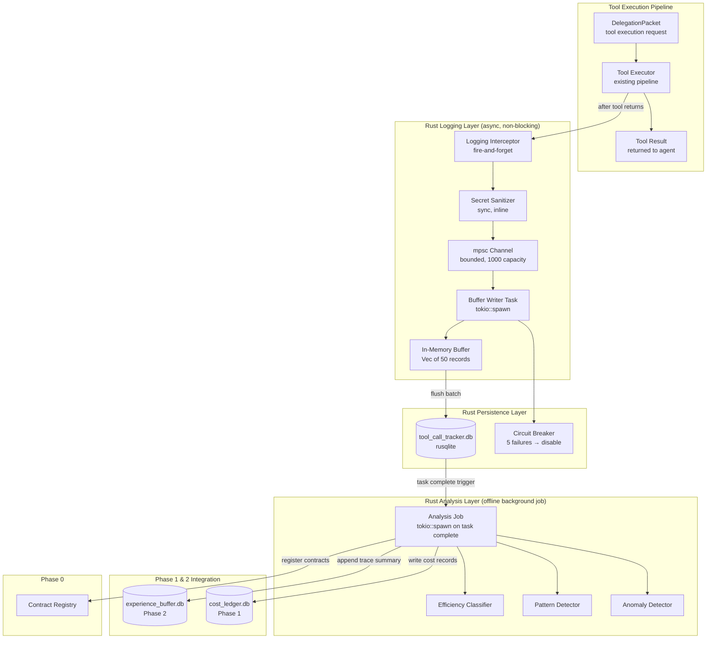

# Design Document: Tool Call Tracker

## Overview

The Tool Call Tracker is Phase 3 of the ResonantOS vNext improvement plan — a passive logging and offline analysis system that records every tool invocation made by delegated agents during task execution, then computes efficiency metrics and detects anti-patterns in a background job after task completion.

The system is split across two layers:
- **Rust service layer** (`src-tauri/src/tool_call_tracker_service.rs`): Owns the async logging interceptor, in-memory write buffer, rusqlite persistence (`tool_call_tracker.db`), background analysis job, and integration with the Experience Buffer and Cost Ledger.
- **Rust analysis layer** (`src-tauri/src/tool_call_analysis.rs`): Pure functions for efficiency ratio computation, sequence pattern detection, anomaly flagging, and secret sanitization. Runs as a `tokio::spawn` background task after task completion.

The tracker is **completely passive** — it never modifies, delays, or blocks tool calls. Logging is asynchronous with buffered writes (50 records or 10 seconds). All analysis (efficiency computation, pattern detection, anomaly flagging) runs as an offline background job triggered by task completion events. The system adds zero tokens to agent prompts, zero latency to tool execution, and zero API calls.

### Key Design Decisions

1. **Rust-only implementation**: Unlike the Scoring Engine (TypeScript scoring + Rust persistence), the Tool Call Tracker is entirely Rust. It operates at the tool execution boundary in the Tauri backend, has no TypeScript computation needs, and benefits from Rust's zero-cost async for the hot logging path.

2. **Async channel-based logging**: Tool call records are sent via a `tokio::sync::mpsc` bounded channel from the interceptor to a background writer task. The interceptor never awaits persistence — it fires-and-forgets into the channel. If the channel is full, records are dropped (graceful degradation).

3. **Buffered batch writes**: The writer task accumulates records in a `Vec` buffer and flushes to rusqlite in a single transaction when either 50 records accumulate or 10 seconds elapse. This minimizes I/O syscalls on the hot path.

4. **Separate analysis database**: Tool call data lives in `tool_call_tracker.db`, separate from `experience_buffer.db` and `cost_ledger.db`. The analysis job reads from `tool_call_tracker.db` and writes summaries to the Experience Buffer and Cost Ledger via their existing interfaces.

5. **Circuit breaker pattern**: Matches the Scoring Engine's pattern. After 5 consecutive persistence failures, logging is disabled for a configurable cooldown (default 30 seconds). Tool execution is never affected.

6. **Agent-agnostic via DelegationPacket**: The interceptor hooks into the tool execution pipeline at the DelegationPacket level. Any agent executing through this pipeline is automatically tracked without agent-specific code.

7. **Secret sanitization before buffering**: The sanitizer runs synchronously in the interceptor (before the record enters the channel), ensuring unsanitized data never reaches the buffer or storage.

## Architecture



## Components and Interfaces

### 1. Logging Interceptor

```rust
// src-tauri/src/tool_call_tracker_service.rs

use std::sync::Arc;
use tokio::sync::mpsc;
use serde::{Deserialize, Serialize};

/// Configuration for the tool call tracker.
#[derive(Debug, Clone, Deserialize)]
#[serde(rename_all = "camelCase")]
pub struct ToolCallTrackerConfig {
    pub buffer_flush_size: usize,           // default: 50
    pub buffer_flush_interval_secs: u64,    // default: 10
    pub channel_capacity: usize,            // default: 1000
    pub circuit_breaker_threshold: u32,     // default: 5
    pub circuit_breaker_cooldown_secs: u64, // default: 30
    pub max_output_summary_tokens: usize,   // default: 500
    pub max_storage_bytes: u64,             // default: 500 * 1024 * 1024 (500 MB)
    pub efficiency_threshold: f64,          // default: 0.5
    pub historical_avg_multiplier: f64,     // default: 3.0
    pub retention_days_traces: u32,         // default: 90
    pub retention_days_metrics: u32,        // default: 180
    pub rolling_avg_window_size: u32,       // default: 100
}

/// Shared state for the tool call tracker, accessible from the interceptor.
pub struct ToolCallTrackerState {
    pub sender: mpsc::Sender<ToolCallRecord>,
    pub circuit_breaker: Arc<tokio::sync::RwLock<CircuitBreakerState>>,
    pub config: ToolCallTrackerConfig,
}

/// The non-blocking logging function called after each tool execution.
/// Returns immediately — never blocks the tool return path.
pub fn log_tool_call(
    state: &ToolCallTrackerState,
    record: ToolCallRecord,
) {
    // Check circuit breaker (non-blocking read)
    // If open, drop silently
    // Otherwise, try_send into channel (non-blocking)
    // If channel full, drop silently (graceful degradation)
}

/// Start the background writer task and analysis trigger.
/// Called once during Tauri app setup.
pub fn start_tool_call_tracker(
    app_handle: tauri::AppHandle,
    config: ToolCallTrackerConfig,
) -> ToolCallTrackerState { /* ... */ }
```

### 2. Secret Sanitizer

```rust
// src-tauri/src/tool_call_analysis.rs (sanitization section)

/// Default deny-list for parameter names that indicate secrets.
pub const SECRET_PARAM_NAMES: &[&str] = &[
    "password", "secret", "token", "api_key", "apiKey",
    "authorization", "private_key", "credentials", "connection_string",
    "apikey", "api_secret", "access_token", "refresh_token",
];

/// Regex patterns for detecting secret values regardless of parameter name.
pub const SECRET_VALUE_PATTERNS: &[&str] = &[
    r"^Bearer\s+.+",                    // Bearer tokens
    r"^sk-[a-zA-Z0-9]{20,}",           // OpenAI-style keys
    r"^pk-[a-zA-Z0-9]{20,}",           // Public keys with pk- prefix
    r"^eyJ[a-zA-Z0-9_-]+\.[a-zA-Z0-9_-]+\.[a-zA-Z0-9_-]+", // JWT tokens
    r"^[A-Za-z0-9+/]{32,}={0,2}$",     // Base64 keys > 32 chars
    r"-----BEGIN\s+(RSA\s+)?PRIVATE\s+KEY-----", // PEM private keys
];

/// Sanitize input parameters, replacing secret values with "[REDACTED]".
/// Runs synchronously in the interceptor before the record enters the channel.
pub fn sanitize_parameters(params: &serde_json::Value) -> serde_json::Value {
    // 1. If params is an object, check each key against SECRET_PARAM_NAMES
    // 2. For each value (regardless of key), check against SECRET_VALUE_PATTERNS
    // 3. Replace matching values with Value::String("[REDACTED]")
    // 4. Recurse into nested objects
    // 5. Default-open: preserve values that don't match any pattern
}
```

### 3. Buffer Writer Task

```rust
// src-tauri/src/tool_call_tracker_service.rs (writer section)

/// The background writer task that receives records from the channel,
/// buffers them, and flushes to rusqlite in batches.
async fn buffer_writer_task(
    mut receiver: mpsc::Receiver<ToolCallRecord>,
    db_path: std::path::PathBuf,
    config: ToolCallTrackerConfig,
    circuit_breaker: Arc<tokio::sync::RwLock<CircuitBreakerState>>,
) {
    // 1. Open rusqlite connection (WAL mode for concurrent reads)
    // 2. Loop:
    //    a. Receive records from channel (with timeout = flush_interval)
    //    b. Push to in-memory Vec buffer
    //    c. If buffer.len() >= flush_size OR timeout elapsed:
    //       - Begin transaction
    //       - INSERT all buffered records
    //       - Commit transaction
    //       - On success: reset circuit breaker failure count
    //       - On failure: increment circuit breaker, if threshold reached → open breaker
    //    d. If circuit breaker open: drain channel but don't persist (drop records)
    //    e. After cooldown: attempt recovery flush
}

/// Circuit breaker state for persistence failures.
#[derive(Debug, Clone, Serialize, Deserialize)]
#[serde(rename_all = "camelCase")]
pub struct CircuitBreakerState {
    pub consecutive_failures: u32,
    pub is_open: bool,
    pub last_failure_at: Option<String>,
    pub cooldown_ends_at: Option<String>,
    pub cooldown_secs: u64,
    pub failure_threshold: u32,
    pub total_records_dropped: u64,
}
```

### 4. Background Analysis Job

```rust
// src-tauri/src/tool_call_analysis.rs

use serde::{Deserialize, Serialize};

/// Trigger analysis for a completed task.
/// Called when a LogicianExecutionArtifact with terminal status arrives.
pub async fn analyze_completed_task(
    db_path: &std::path::Path,
    experience_buffer_db_path: &std::path::Path,
    cost_ledger_db_path: &std::path::Path,
    delegation_packet_id: &str,
    agent_id: &str,
    task_type: &str,
    expected_artifacts: &[String],
    allowed_tools: &[String],
    capability_grants: &[String],
) -> Result<AnalysisResult, String> {
    // 1. Load all ToolCallRecords for this delegation_packet_id
    // 2. Classify each record as Useful or Redundant
    // 3. Compute Efficiency Ratio
    // 4. Detect sequence patterns
    // 5. Check anomaly thresholds
    // 6. Append trace summary to Experience Buffer
    // 7. Write cost attribution records to Cost Ledger
    // 8. Return analysis result
}

/// The complete analysis result for a task.
#[derive(Debug, Clone, Serialize, Deserialize)]
#[serde(rename_all = "camelCase")]
pub struct AnalysisResult {
    pub delegation_packet_id: String,
    pub agent_id: String,
    pub task_type: String,
    pub efficiency_ratio: f64,
    pub total_calls: u32,
    pub useful_calls: u32,
    pub redundant_calls: u32,
    pub detected_patterns: Vec<SequencePattern>,
    pub anomaly_flags: Vec<AnomalyFlag>,
    pub tool_sequence_signature: Vec<String>,
    pub analyzed_at: String,
}
```

### 5. Efficiency Classifier

```rust
// src-tauri/src/tool_call_analysis.rs (efficiency section)

/// Classification of a single tool call.
#[derive(Debug, Clone, PartialEq, Serialize, Deserialize)]
pub enum CallClassification {
    Useful,
    Redundant,
}

/// Classify a tool call record within the context of the full trace.
/// A call is Useful if:
///   - It produced a state change (file modified, data written) — inferred from
///     output containing write/create/modify indicators
///   - It returned information not present in any prior record's output within the trace
///   - It contributed to an artifact listed in expectedArtifacts
/// A call is Redundant if:
///   - Same tool + same parameters as a prior call in the trace AND output matches
///   - It was invoked after the final artifact was produced (post-answer)
///   - Its output is a subset of information already obtained
pub fn classify_tool_call(
    record: &ToolCallRecord,
    prior_records: &[ToolCallRecord],
    expected_artifacts: &[String],
    final_artifact_index: Option<usize>,
) -> CallClassification { /* ... */ }

/// Compute efficiency ratio for a complete trace.
/// Returns 1.0 for empty traces (no tools needed = no waste).
pub fn compute_efficiency_ratio(
    records: &[ToolCallRecord],
    expected_artifacts: &[String],
) -> f64 {
    if records.is_empty() {
        return 1.0;
    }
    let final_artifact_idx = find_final_artifact_index(records, expected_artifacts);
    let useful_count = records.iter().enumerate()
        .filter(|(i, r)| {
            classify_tool_call(r, &records[..*i], expected_artifacts, final_artifact_idx)
                == CallClassification::Useful
        })
        .count();
    useful_count as f64 / records.len() as f64
}

/// Determine the index of the tool call that produced the final expected artifact.
/// Returns None if no artifact production is detected.
fn find_final_artifact_index(
    records: &[ToolCallRecord],
    expected_artifacts: &[String],
) -> Option<usize> { /* ... */ }
```

### 6. Pattern Detector

```rust
// src-tauri/src/tool_call_analysis.rs (pattern detection section)

/// Types of anti-patterns detected in tool call sequences.
#[derive(Debug, Clone, Serialize, Deserialize)]
#[serde(rename_all = "snake_case")]
pub enum PatternType {
    RepeatedIdenticalCalls,
    AlwaysFailingCalls,
    PostAnswerCalls,
    UnnecessaryPermissionChecks,
}

/// A detected sequence pattern with evidence.
#[derive(Debug, Clone, Serialize, Deserialize)]
#[serde(rename_all = "camelCase")]
pub struct SequencePattern {
    pub pattern_type: PatternType,
    pub offending_indices: Vec<usize>,
    pub description: String,
}

/// Detect all anti-patterns in a completed tool call trace.
pub fn detect_patterns(
    records: &[ToolCallRecord],
    expected_artifacts: &[String],
    allowed_tools: &[String],
    capability_grants: &[String],
) -> Vec<SequencePattern> {
    let mut patterns = Vec::new();
    patterns.extend(detect_repeated_identical(records));
    patterns.extend(detect_always_failing(records));
    patterns.extend(detect_post_answer(records, expected_artifacts));
    patterns.extend(detect_unnecessary_permission_checks(records, allowed_tools, capability_grants));
    patterns
}

/// Detect consecutive identical calls (same tool + same params, 2+ times).
fn detect_repeated_identical(records: &[ToolCallRecord]) -> Vec<SequencePattern> { /* ... */ }

/// Detect tools invoked 3+ times in the trace that fail every time.
fn detect_always_failing(records: &[ToolCallRecord]) -> Vec<SequencePattern> { /* ... */ }

/// Detect tool calls after the final artifact was produced.
fn detect_post_answer(
    records: &[ToolCallRecord],
    expected_artifacts: &[String],
) -> Vec<SequencePattern> { /* ... */ }

/// Detect permission/capability queries for things already granted in the DelegationPacket.
fn detect_unnecessary_permission_checks(
    records: &[ToolCallRecord],
    allowed_tools: &[String],
    capability_grants: &[String],
) -> Vec<SequencePattern> { /* ... */ }
```

### 7. Anomaly Detector

```rust
// src-tauri/src/tool_call_analysis.rs (anomaly section)

/// Reason for an anomaly flag.
#[derive(Debug, Clone, Serialize, Deserialize)]
#[serde(rename_all = "snake_case")]
pub enum AnomalyReason {
    LowEfficiency,
    ExcessiveCalls,
    Both,
}

/// An anomaly flag applied to a task.
#[derive(Debug, Clone, Serialize, Deserialize)]
#[serde(rename_all = "camelCase")]
pub struct AnomalyFlag {
    pub reason: AnomalyReason,
    pub efficiency_ratio: f64,
    pub efficiency_threshold: f64,
    pub total_calls: u32,
    pub historical_avg_calls: f64,
    pub historical_avg_multiplier: f64,
    pub flagged_at: String,
}

/// Check if a task should be flagged as anomalous.
pub fn check_anomaly(
    efficiency_ratio: f64,
    total_calls: u32,
    historical_avg_calls: f64,
    config: &ToolCallTrackerConfig,
) -> Option<AnomalyFlag> {
    let low_efficiency = efficiency_ratio < config.efficiency_threshold;
    let excessive_calls = (total_calls as f64) > historical_avg_calls * config.historical_avg_multiplier;
    
    match (low_efficiency, excessive_calls) {
        (true, true) => Some(AnomalyFlag { reason: AnomalyReason::Both, /* ... */ }),
        (true, false) => Some(AnomalyFlag { reason: AnomalyReason::LowEfficiency, /* ... */ }),
        (false, true) => Some(AnomalyFlag { reason: AnomalyReason::ExcessiveCalls, /* ... */ }),
        (false, false) => None,
    }
}
```

### 8. Experience Buffer Integration

```rust
// src-tauri/src/tool_call_analysis.rs (integration section)

/// The trace summary appended to an ExperienceRecord.
/// Matches the Phase 4 RL training pipeline schema.
#[derive(Debug, Clone, Serialize, Deserialize)]
#[serde(rename_all = "camelCase")]
pub struct ToolCallTraceSummary {
    pub delegation_packet_id: String,
    pub efficiency_ratio: f64,
    pub total_calls: u32,
    pub useful_calls: u32,
    pub redundant_calls: u32,
    pub detected_patterns: Vec<SequencePattern>,
    pub tool_sequence_signature: Vec<String>,
    pub analyzed_at: String,
}

/// Append tool call trace summary to the corresponding ExperienceRecord.
/// If no ExperienceRecord exists, creates a standalone record for retroactive linking.
pub fn append_to_experience_buffer(
    experience_db: &rusqlite::Connection,
    summary: &ToolCallTraceSummary,
) -> Result<(), String> { /* ... */ }
```

### 9. Cost Attribution Integration

```rust
// src-tauri/src/tool_call_analysis.rs (cost section)

/// A cost attribution record for a single tool call.
#[derive(Debug, Clone, Serialize, Deserialize)]
#[serde(rename_all = "camelCase")]
pub struct ToolCallCostAttribution {
    pub id: String,
    pub delegation_packet_id: String,
    pub agent_id: String,
    pub task_type: String,
    pub tool_name: String,
    pub prompt_tokens: Option<u32>,
    pub completion_tokens: Option<u32>,
    pub total_tokens: Option<u32>,
    pub is_llm_backed: bool,
    pub cost_unavailable: bool,
    pub recorded_at: String,
}

/// Write cost attribution records to the Cost Ledger for token-consuming tool calls.
pub fn write_cost_attributions(
    cost_ledger_db: &rusqlite::Connection,
    records: &[ToolCallRecord],
    agent_id: &str,
    delegation_packet_id: &str,
    task_type: &str,
) -> Result<u32, String> { /* ... */ }
```

## Data Models

### Tool Call Tracker Schema (`tool_call_tracker.db`)

```sql
-- Core tool call records
CREATE TABLE IF NOT EXISTS tool_call_records (
    id TEXT PRIMARY KEY,
    delegation_packet_id TEXT NOT NULL,
    agent_id TEXT NOT NULL,
    task_type TEXT NOT NULL,
    tool_name TEXT NOT NULL,
    input_params_json TEXT NOT NULL,       -- sanitized parameters as JSON
    output_summary TEXT,                   -- truncated to 500 tokens
    duration_ms INTEGER NOT NULL,
    success INTEGER NOT NULL,              -- 0 = failure, 1 = success
    timestamp TEXT NOT NULL,               -- ISO-8601
    sequence_position INTEGER NOT NULL,    -- monotonically increasing per task
    prompt_tokens INTEGER,                 -- null for non-LLM tools
    completion_tokens INTEGER,             -- null for non-LLM tools
    is_llm_backed INTEGER NOT NULL DEFAULT 0
);

-- Analysis results per task
CREATE TABLE IF NOT EXISTS task_analysis_results (
    delegation_packet_id TEXT PRIMARY KEY,
    agent_id TEXT NOT NULL,
    task_type TEXT NOT NULL,
    efficiency_ratio REAL NOT NULL,
    total_calls INTEGER NOT NULL,
    useful_calls INTEGER NOT NULL,
    redundant_calls INTEGER NOT NULL,
    detected_patterns_json TEXT NOT NULL,  -- serialized Vec<SequencePattern>
    anomaly_flags_json TEXT,               -- serialized Vec<AnomalyFlag> or null
    tool_sequence_signature_json TEXT NOT NULL, -- serialized Vec<String>
    analyzed_at TEXT NOT NULL,
    experience_buffer_linked INTEGER NOT NULL DEFAULT 0
);

-- Rolling historical averages per task type
CREATE TABLE IF NOT EXISTS task_type_averages (
    task_type TEXT PRIMARY KEY,
    avg_tool_call_count REAL NOT NULL,
    avg_efficiency_ratio REAL NOT NULL,
    sample_count INTEGER NOT NULL,
    last_updated_at TEXT NOT NULL
);

-- Standalone trace records (when Experience Buffer unavailable)
CREATE TABLE IF NOT EXISTS standalone_trace_summaries (
    delegation_packet_id TEXT PRIMARY KEY,
    summary_json TEXT NOT NULL,            -- serialized ToolCallTraceSummary
    created_at TEXT NOT NULL,
    linked INTEGER NOT NULL DEFAULT 0      -- set to 1 when retroactively linked
);

-- Aggregate statistics retained indefinitely
CREATE TABLE IF NOT EXISTS aggregate_stats (
    agent_id TEXT NOT NULL,
    task_type TEXT NOT NULL,
    avg_efficiency_ratio REAL NOT NULL,
    avg_tool_call_count REAL NOT NULL,
    total_tasks_analyzed INTEGER NOT NULL,
    last_updated_at TEXT NOT NULL,
    PRIMARY KEY (agent_id, task_type)
);

-- Circuit breaker state (singleton)
CREATE TABLE IF NOT EXISTS circuit_breaker_state (
    id TEXT PRIMARY KEY DEFAULT 'singleton',
    consecutive_failures INTEGER NOT NULL DEFAULT 0,
    is_open INTEGER NOT NULL DEFAULT 0,
    last_failure_at TEXT,
    cooldown_ends_at TEXT,
    cooldown_secs INTEGER NOT NULL DEFAULT 30,
    failure_threshold INTEGER NOT NULL DEFAULT 5,
    total_records_dropped INTEGER NOT NULL DEFAULT 0
);

-- Configuration (singleton)
CREATE TABLE IF NOT EXISTS tracker_config (
    id TEXT PRIMARY KEY DEFAULT 'singleton',
    efficiency_threshold REAL NOT NULL DEFAULT 0.5,
    historical_avg_multiplier REAL NOT NULL DEFAULT 3.0,
    max_storage_bytes INTEGER NOT NULL DEFAULT 524288000,
    retention_days_traces INTEGER NOT NULL DEFAULT 90,
    retention_days_metrics INTEGER NOT NULL DEFAULT 180,
    rolling_avg_window_size INTEGER NOT NULL DEFAULT 100
);

-- Indexes for common queries
CREATE INDEX IF NOT EXISTS idx_tcr_delegation_packet
    ON tool_call_records(delegation_packet_id);
CREATE INDEX IF NOT EXISTS idx_tcr_agent_id
    ON tool_call_records(agent_id);
CREATE INDEX IF NOT EXISTS idx_tcr_timestamp
    ON tool_call_records(timestamp);
CREATE INDEX IF NOT EXISTS idx_tcr_task_type
    ON tool_call_records(task_type);
CREATE INDEX IF NOT EXISTS idx_tcr_sequence
    ON tool_call_records(delegation_packet_id, sequence_position);
CREATE INDEX IF NOT EXISTS idx_tar_agent_task
    ON task_analysis_results(agent_id, task_type);
CREATE INDEX IF NOT EXISTS idx_tar_analyzed_at
    ON task_analysis_results(analyzed_at);
CREATE INDEX IF NOT EXISTS idx_tar_anomaly
    ON task_analysis_results(anomaly_flags_json)
    WHERE anomaly_flags_json IS NOT NULL;
```

### Tool Call Record Struct

```rust
/// A single tool call record — the core data unit.
#[derive(Debug, Clone, Serialize, Deserialize)]
#[serde(rename_all = "camelCase")]
pub struct ToolCallRecord {
    pub id: String,                       // UUID v4
    pub delegation_packet_id: String,
    pub agent_id: String,
    pub task_type: String,
    pub tool_name: String,
    pub input_params_json: String,        // sanitized JSON string
    pub output_summary: Option<String>,   // truncated to 500 tokens
    pub duration_ms: u64,
    pub success: bool,
    pub timestamp: String,                // ISO-8601
    pub sequence_position: u32,           // starts at 1 per task
    pub prompt_tokens: Option<u32>,
    pub completion_tokens: Option<u32>,
    pub is_llm_backed: bool,
}
```

### Experience Buffer Appendage Schema

The tool call trace summary is stored as a JSON column appended to the existing `experience_records` table via an ALTER TABLE migration:

```sql
-- Migration: add tool_call_trace_json column to experience_records
ALTER TABLE experience_records
    ADD COLUMN tool_call_trace_json TEXT;
```

The JSON structure matches `ToolCallTraceSummary`:
```json
{
  "delegationPacketId": "...",
  "efficiencyRatio": 0.75,
  "totalCalls": 12,
  "usefulCalls": 9,
  "redundantCalls": 3,
  "detectedPatterns": [...],
  "toolSequenceSignature": ["read_file", "grep_search", "write_file", ...],
  "analyzedAt": "2026-07-15T10:30:00Z"
}
```


## Correctness Properties

*A property is a characteristic or behavior that should hold true across all valid executions of a system — essentially, a formal statement about what the system should do. Properties serve as the bridge between human-readable specifications and machine-verifiable correctness guarantees.*

### Property 1: Tool Call Record structural completeness

*For any* valid tool call input (arbitrary tool name, arbitrary sanitized parameters, arbitrary duration ≥ 0, arbitrary success/failure status, and arbitrary agent_id), the resulting `ToolCallRecord` SHALL contain: a non-empty `id`, a non-empty `delegation_packet_id`, a non-empty `agent_id`, a non-empty `task_type`, a non-empty `tool_name`, a valid JSON string in `input_params_json`, an `output_summary` of at most 500 tokens (or None), a `duration_ms` ≥ 0, a boolean `success`, a valid ISO-8601 `timestamp`, and a `sequence_position` ≥ 1.

**Validates: Requirements 1.1, 1.2, 1.4, 12.1, 12.2**

### Property 2: Persistence round-trip with sanitization

*For any* valid `ToolCallRecord` (including records whose original input contained secret values), persisting to the `tool_call_records` table and reading back by `id` SHALL produce a record where all fields equal the original, AND the stored `input_params_json` SHALL contain no values matching the secret deny-list names or secret value regex patterns (only `[REDACTED]` placeholders where secrets existed).

**Validates: Requirements 1.3, 2.4, 12.3**

### Property 3: Secret sanitization completeness

*For any* JSON object containing values that match either (a) a parameter name in the secret deny-list or (b) a value matching any secret regex pattern (JWT, sk-/pk- prefixed, Bearer tokens, base64 keys > 32 chars, PEM private keys), `sanitize_parameters` SHALL replace every such value with the string `"[REDACTED]"` and SHALL not modify the JSON structure (keys, nesting, array positions remain unchanged).

**Validates: Requirements 2.1, 2.2, 2.3**

### Property 4: Sanitizer preserves non-secret values

*For any* JSON object where no parameter name matches the secret deny-list AND no value matches any secret regex pattern, `sanitize_parameters` SHALL return a JSON object identical to the input (identity function for non-secret data).

**Validates: Requirements 2.5**

### Property 5: Classification mutual exclusivity and exhaustiveness

*For any* `ToolCallRecord` within a trace and *for any* prior records context, `classify_tool_call` SHALL return exactly one of `Useful` or `Redundant`. Furthermore, the sum of useful classifications plus redundant classifications SHALL equal the total number of records in the trace.

**Validates: Requirements 3.2, 3.3, 3.4**

### Property 6: Efficiency ratio bounds and formula

*For any* `Tool_Call_Trace` (including empty traces), `compute_efficiency_ratio` SHALL return a value in [0.0, 1.0]. For non-empty traces, the value SHALL equal the count of `Useful` classifications divided by the total record count. For empty traces (zero records), the value SHALL be exactly 1.0.

**Validates: Requirements 3.5, 3.6**

### Property 7: Pattern detection correctness

*For any* tool call trace containing at least one instance of: (a) two or more consecutive calls with identical tool name and identical parameters → `RepeatedIdenticalCalls` detected, (b) a tool invoked 3+ times with all invocations failing → `AlwaysFailingCalls` detected, (c) tool calls after the final artifact production index → `PostAnswerCalls` detected, (d) permission/capability queries for items already in `allowedTools` or `capabilityGrants` → `UnnecessaryPermissionChecks` detected. Each detected pattern SHALL include the correct `pattern_type`, non-empty `offending_indices` pointing to valid record positions, and a non-empty `description`.

**Validates: Requirements 4.1, 4.2, 4.3, 4.4, 4.5**

### Property 8: Anomaly detection correctness

*For any* efficiency ratio, total call count, and historical average call count, `check_anomaly` SHALL return `Some(AnomalyFlag)` if and only if at least one of: (a) `efficiency_ratio < efficiency_threshold`, or (b) `total_calls > historical_avg_calls × historical_avg_multiplier`. The `AnomalyReason` SHALL be `LowEfficiency` when only (a) holds, `ExcessiveCalls` when only (b) holds, and `Both` when both hold. When neither holds, the function SHALL return `None`.

**Validates: Requirements 5.1, 5.2, 5.5**

### Property 9: Circuit breaker state transitions

*For any* sequence of boolean success/failure events applied to the circuit breaker: (a) the breaker SHALL open (`is_open = true`) after exactly `failure_threshold` (default 5) consecutive failures, (b) any success SHALL reset `consecutive_failures` to 0 and close the breaker, (c) while open, logging SHALL be disabled until `cooldown_ends_at` is reached, (d) after cooldown expires, the breaker SHALL transition to half-open (attempt one flush), and (e) `total_records_dropped` SHALL monotonically increase when records are dropped during open state.

**Validates: Requirements 10.4, 10.5**

### Property 10: Retention policy enforcement

*For any* set of `tool_call_records` with various timestamps, the eviction function SHALL never delete a record whose `timestamp` is fewer than 90 days before the current time. When the storage cap is reached, eviction SHALL remove records in oldest-first order, and only records that have exceeded the 90-day retention period. Similarly, `task_analysis_results` SHALL not be evicted before 180 days.

**Validates: Requirements 13.1, 13.2, 13.3**

### Property 11: Aggregate statistics invariance under eviction

*For any* eviction operation (regardless of how many records are removed), the `aggregate_stats` table SHALL remain unchanged — no rows deleted, no values modified. Aggregate statistics are retained indefinitely.

**Validates: Requirements 13.5**

### Property 12: Sequence position monotonicity

*For any* task (identified by `delegation_packet_id`) with N tool calls logged, the `sequence_position` values in the stored records SHALL form the sequence 1, 2, 3, ..., N with no gaps and no duplicates.

**Validates: Requirements 1.6**

### Property 13: Trace summary structural completeness

*For any* completed task analysis, the `ToolCallTraceSummary` SHALL contain: a non-empty `delegation_packet_id`, an `efficiency_ratio` in [0.0, 1.0], `total_calls` ≥ 0, `useful_calls` + `redundant_calls` = `total_calls`, a (possibly empty) list of `detected_patterns` each with valid structure, a `tool_sequence_signature` whose length equals `total_calls` and whose elements are the tool names in invocation order, and a valid ISO-8601 `analyzed_at` timestamp.

**Validates: Requirements 6.2, 6.3, 6.5**

### Property 14: Bulk export produces valid structured JSON

*For any* set of `tool_call_records` and `task_analysis_results` in the database, the bulk export function SHALL produce valid JSON where each exported record deserializes back to the original struct without data loss (round-trip property).

**Validates: Requirements 13.4**

## Error Handling

### Logging Interceptor Errors

- **Channel full (buffer backpressure)**: Drop the record silently. Increment `total_records_dropped` counter. Never block the tool execution return path. Log a warning to the system log at most once per minute.
- **Circuit breaker open**: Skip all logging immediately. The `log_tool_call` function checks the breaker state via a non-blocking `try_read()` and returns instantly if open.
- **Serialization failure (malformed params)**: Store the record with `input_params_json` set to `"{\"error\": \"serialization_failed\"}"`. Never propagate the error to the tool execution pipeline.

### Buffer Writer Errors

- **Database open failure**: Activate circuit breaker immediately. Buffer records in memory up to channel capacity. When channel fills, oldest records are dropped by the sender side.
- **Transaction commit failure (disk full, corruption)**: Increment circuit breaker failure count. Retain records in buffer for retry on next flush cycle. After `failure_threshold` consecutive failures, open circuit breaker and begin dropping records.
- **WAL checkpoint failure**: Log warning, continue operating. WAL will grow but this is non-critical.

### Analysis Job Errors

- **Missing tool call records for delegation_packet_id**: Return `AnalysisResult` with `efficiency_ratio = 1.0`, zero counts, empty patterns. Log warning.
- **Experience Buffer write failure**: Create a standalone trace summary in `standalone_trace_summaries` table for retroactive linking. Never fail the analysis job.
- **Cost Ledger write failure**: Log error, skip cost attribution for this task. The analysis result is still valid and persisted locally.
- **Malformed output_summary (can't determine artifact production)**: Classify all calls as `Useful` (conservative — never penalize when uncertain). Set `final_artifact_index` to None.

### Integration Errors

- **Experience Buffer database unavailable**: Store trace summary in `standalone_trace_summaries`. A background reconciliation job periodically attempts to link standalone records when the Experience Buffer becomes available.
- **Cost Ledger database unavailable**: Skip cost attribution. Log the failure. Cost data for this task will be missing from the dashboard but tool call tracking continues.
- **Schema migration failure (ALTER TABLE on experience_records)**: Fall back to standalone storage mode. The tracker operates independently until the migration succeeds.

### Recovery Behavior

- **After circuit breaker cooldown**: Attempt a single test write. On success, close breaker and resume normal operation. On failure, extend cooldown by 2× (exponential backoff, capped at 5 minutes).
- **After crash recovery**: On startup, check for any `standalone_trace_summaries` with `linked = 0`. Attempt to link them to Experience Buffer records. Resume normal logging without user intervention.
- **Storage cap reached during analysis**: Trigger eviction before writing new analysis results. If eviction cannot free enough space (all records within retention period), log error and skip persistence of the analysis result (it can be recomputed).

## Testing Strategy

### Property-Based Tests (proptest)

The Rust implementation uses `proptest` for property-based testing, matching the Phase 2 Scoring Engine pattern for Rust-layer tests.

**Configuration**: Each property test runs a minimum of 100 iterations.

**Tag format**: Each test includes a comment referencing the design property:
```rust
// Feature: tool-call-tracker, Property 1: Tool Call Record structural completeness
```

**Properties to implement (proptest)**:
1. Tool Call Record structural completeness (Property 1)
2. Persistence round-trip with sanitization (Property 2)
3. Secret sanitization completeness (Property 3)
4. Sanitizer preserves non-secret values (Property 4)
5. Classification mutual exclusivity and exhaustiveness (Property 5)
6. Efficiency ratio bounds and formula (Property 6)
7. Pattern detection correctness (Property 7)
8. Anomaly detection correctness (Property 8)
9. Circuit breaker state transitions (Property 9)
10. Retention policy enforcement (Property 10)
11. Aggregate statistics invariance under eviction (Property 11)
12. Sequence position monotonicity (Property 12)
13. Trace summary structural completeness (Property 13)
14. Bulk export round-trip (Property 14)

### Unit Tests

Unit tests complement property tests for specific examples and edge cases:

- Empty trace → efficiency 1.0
- Single useful call → efficiency 1.0
- All redundant calls → efficiency 0.0
- Exactly at threshold boundaries (efficiency = 0.5, calls = 3× average)
- Secret sanitizer with nested JSON objects (3 levels deep)
- Secret sanitizer with arrays containing mixed secret/non-secret values
- Pattern detection with overlapping patterns (repeated + always-failing)
- Circuit breaker exact threshold (4 failures = still closed, 5 = open)
- Retention boundary (record at exactly 90 days — not evicted)
- Output summary truncation at exactly 500 tokens

### Integration Tests

- End-to-end flow: tool call → log → buffer → flush → analyze → experience buffer append
- Circuit breaker recovery cycle: 5 failures → open → cooldown → half-open → success → closed
- Standalone record creation when Experience Buffer unavailable, then retroactive linking
- Cost attribution write to Cost Ledger for mixed LLM/non-LLM tool calls
- Storage cap eviction with mixed-age records respecting retention periods
- Concurrent tool calls from multiple tasks (verify no cross-contamination of sequence positions)

### Performance Tests

- `log_tool_call` returns in < 5ms for records up to 10KB
- Buffer flush of 50 records completes in < 50ms
- Analysis of a 100-call trace completes in < 200ms
- Channel throughput: 1000 records/second sustained without drops
- Storage cap check + eviction completes in < 1 second for 100K records
