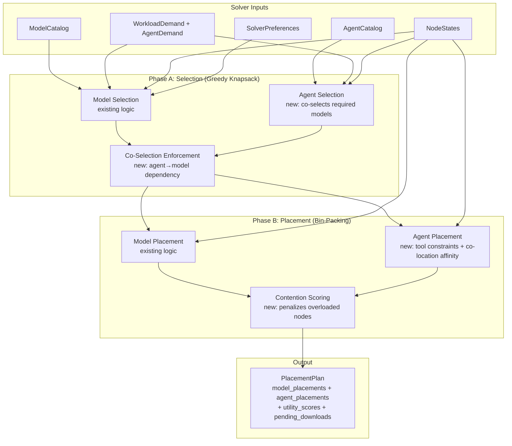

# Design Document: Unified Resource Scheduler

## Overview

The Unified Resource Scheduler extends the existing two-phase solver in `src/resonantos-vnext/src-tauri/src/network/solver.rs` to handle agents alongside models as a single optimization problem. The current solver performs:

- **Phase A** (greedy knapsack): Selects which models to load based on utility scores and capacity constraints.
- **Phase B** (bin-packing with affinity clustering): Assigns selected models to specific nodes.

This design adds agent selection, instance count determination, and agent placement into the same pipeline — producing a unified `PlacementPlan` that covers models, agents, and their resource interactions. The extension is strictly additive: when `agent_catalog` is empty, the solver produces byte-for-byte identical output to the current implementation.

### Design Principles

1. **Same pipeline, extended**: No new solver entry point. The existing `solve()` function gains agent awareness.
2. **Device-agnostic**: All scheduling decisions use per-node constraints (RAM, CPU, tools, battery, thermal). No `if device_type == X` branching.
3. **Co-selection**: Selecting an agent forces its required model into the plan. Rejecting a model cascades to reject dependent agents.
4. **Anytime algorithm**: The solver returns the best solution found within its time budget. Larger networks get more time but always produce a valid (possibly suboptimal) plan.
5. **Contention-aware**: The objective function penalizes resource contention so the solver naturally avoids overloading nodes.

## Architecture

### High-Level Architecture



### Extension Strategy

The solver is extended at three points:

1. **`SolverInputs`** — gains `agent_catalog` and `agent_demand` fields (both default-empty for backwards compatibility).
2. **`select_models()` → `select_resources()`** — the Phase A function is renamed internally but keeps the same signature for model-only callers. Agent selection runs after model selection, with co-selection enforcement as a post-pass.
3. **`assign_models()` → `assign_resources()`** — Phase B gains an agent placement loop that runs after model placement, using the same remaining-capacity tracking.

### Solver Pipeline (Extended)

```
solve(inputs, config, current_time_ms) → PlacementPlan
│
├─ Phase A: Selection
│   ├─ select_models(inputs)                    [EXISTING - unchanged]
│   ├─ select_agents(inputs, model_selection)   [NEW]
│   └─ enforce_co_selection(models, agents)     [NEW - adds missing models]
│
├─ Phase B: Placement
│   ├─ assign_models(selection, nodes, ...)     [EXISTING - unchanged]
│   ├─ assign_agents(agent_selection, nodes, model_placements, ...) [NEW]
│   └─ compute_contention(model_placements, agent_placements, nodes) [NEW]
│
├─ Scoring
│   ├─ compute_utility_scores(...)              [EXISTING - extended]
│   ├─ compute_agent_utility(...)               [NEW]
│   └─ compute_unified_objective(...)           [NEW]
│
└─ Assemble PlacementPlan
```

## Components and Interfaces

### New Public Functions

```rust
/// Phase A extension: Select which agents to run.
/// Runs AFTER select_models. Uses model selection to validate co-selection.
pub fn select_agents(
    inputs: &SolverInputs,
    model_selection: &SelectionResult,
) -> AgentSelectionResult;

/// Co-selection enforcement: ensure every selected agent's required_model
/// is in the model selection. Adds missing models if capacity allows.
pub fn enforce_co_selection(
    model_selection: &mut SelectionResult,
    agent_selection: &mut AgentSelectionResult,
    inputs: &SolverInputs,
) -> Vec<CoSelectionAction>;

/// Phase B extension: Assign agent instances to nodes.
/// Runs AFTER assign_models so model placements are known.
pub fn assign_agents(
    agent_selection: &AgentSelectionResult,
    nodes: &[NodeState],
    model_placements: &[ModelPlacement],
    catalog: &[AgentEntry],
    config: &SolverConfig,
) -> Vec<AgentPlacement>;

/// Compute contention cost across all nodes.
pub fn compute_contention(
    model_placements: &[ModelPlacement],
    agent_placements: &[AgentPlacement],
    nodes: &[NodeState],
    config: &SolverConfig,
) -> ContentionResult;

/// Compute agent utility for the objective function.
pub fn compute_agent_utility(
    agent_placements: &[AgentPlacement],
    nodes: &[NodeState],
    config: &SolverConfig,
) -> f64;

/// Compute the unified objective: U_model + U_agent - C_contention.
pub fn compute_unified_objective(
    model_utility: &UtilityScores,
    agent_utility: f64,
    contention_cost: f64,
) -> f64;
```

### Extended Existing Functions

```rust
/// solve() — extended to call agent selection and placement.
/// Signature unchanged. Behavior unchanged when agent_catalog is empty.
pub fn solve(inputs: &SolverInputs, config: &SolverConfig, current_time_ms: u64) -> PlacementPlan;
```

### Agent Selection Algorithm (Phase A Extension)

```rust
pub fn select_agents(inputs: &SolverInputs, model_selection: &SelectionResult) -> AgentSelectionResult {
    // 1. Filter agents whose required_model is selected (or can be added)
    // 2. Score each agent: agent_utility = demand_share × throughput_estimate
    // 3. Sort by utility descending
    // 4. Greedy knapsack: add agents while combined (agent_ram + required_model_ram) fits
    // 5. Compute desired instance counts per agent (analogous to compute_desired_instances)
    // 6. Cap at max_instances_per_agent (default: 8)
}
```

### Agent Placement Algorithm (Phase B Extension)

```rust
pub fn assign_agents(
    agent_selection: &AgentSelectionResult,
    nodes: &[NodeState],
    model_placements: &[ModelPlacement],
    catalog: &[AgentEntry],
    config: &SolverConfig,
) -> Vec<AgentPlacement> {
    // 1. Sort agents by RAM descending (largest first, same as models)
    // 2. For each agent instance:
    //    a. Filter candidate nodes:
    //       - agent.tool_declarations ⊆ node.available_tools
    //       - remaining_ram >= agent.runtime_requirements.ram_mb
    //       - remaining_cpu_cores >= agent.runtime_requirements.cpu_cores
    //       - node passes battery/thermal constraints
    //    b. Score candidates:
    //       - Co-location bonus: +0.4 if required_model is on this node
    //       - Latency bonus: +0.2 if required_model is on a low-latency peer
    //       - Headroom bonus: +0.2 for spare capacity
    //       - Queue penalty: -0.2 for high queue depth
    //    c. Place on best-scoring node
    //    d. Update remaining capacity (RAM, CPU cores)
    // 3. If no node fits, skip this instance (capacity exhausted)
}
```

### Contention Computation

```rust
pub fn compute_contention(
    model_placements: &[ModelPlacement],
    agent_placements: &[AgentPlacement],
    nodes: &[NodeState],
    config: &SolverConfig,
) -> ContentionResult {
    // For each node with both models and agents:
    //   cpu_penalty = max(0, (agent_cpu_usage - 0.5 * total_cores) / total_cores)
    //   memory_penalty = max(0, (total_ram_used - 0.8 * node_ram) / (0.1 * node_ram))
    //   queue_penalty = max(0, (queue_depth - 5) / 10)
    //   speed_penalty = if node_speed < 0.33 * max_speed { 1.0 } else { 0.0 }
    //   latency_penalty = max(0, (latency - step_compute_time) / step_compute_time)
    //
    // contention_cost(node) = w_cpu * cpu + w_mem * memory + w_queue * queue
    //                       + w_speed * speed + w_latency * latency
    //
    // C_total = Σ contention_cost(node)
}
```

### Priority Enforcement

Priority is enforced during Phase B placement by processing resources in priority order:

1. **Active inference models** (priority 1) — placed first, get best nodes
2. **Agent instances** (priority 2) — placed second, from remaining capacity
3. **Background maintenance** (priority 3) — placed third
4. **Speculative preloads** (priority 4) — placed last, evicted first

When capacity is tight, lower-priority items are skipped. The solver never evicts a higher-priority placement to make room for a lower-priority one.

### Anytime Algorithm Behavior

```rust
pub fn solve(inputs: &SolverInputs, config: &SolverConfig, current_time_ms: u64) -> PlacementPlan {
    let start = Instant::now();
    let time_budget = compute_time_budget(inputs); // 500ms for ≤10 nodes, 2000ms for ≤50

    // Phase A: Selection (fast — O(n log n) sort + linear scan)
    let mut model_selection = select_models(inputs);
    let mut agent_selection = select_agents(inputs, &model_selection);
    enforce_co_selection(&mut model_selection, &mut agent_selection, inputs);

    // Phase B: Placement (potentially slow for large networks)
    let model_placements = assign_models(&model_selection, ...);

    if start.elapsed() < time_budget {
        let agent_placements = assign_agents(&agent_selection, ...);
        // ... compute contention, assemble plan
    } else {
        // Time budget exceeded — return model-only plan (best so far)
        // Agent placements are empty but plan is valid
    }
}
```

## Data Models

### New Structures

```rust
/// Agent catalog entry — analogous to ModelEntry.
#[derive(Debug, Clone, Serialize, Deserialize)]
pub struct AgentEntry {
    pub agent_id: AgentId,
    pub agent_name: String,
    pub version: String,
    pub required_model: ModelId,
    pub tool_declarations: Vec<String>,  // tool_ids the agent needs
    pub runtime_requirements: AgentRequirements,
    pub download_sources: Vec<DownloadSource>,  // reuses existing DownloadSource
    pub checksum_sha256: String,
}

pub type AgentId = String;

/// Resource requirements for an agent runtime.
#[derive(Debug, Clone, Serialize, Deserialize)]
pub struct AgentRequirements {
    pub ram_mb: u64,
    pub cpu_cores: u32,
    pub disk_mb: u64,
}

/// A selected agent with instance count (Phase A output).
#[derive(Debug, Clone, Serialize, Deserialize)]
pub struct SelectedAgent {
    pub agent_id: AgentId,
    pub instance_count: u32,
    pub utility_score: f64,
    pub required_model: ModelId,
}

/// Result of Phase A agent selection.
#[derive(Debug, Clone, Serialize, Deserialize)]
pub struct AgentSelectionResult {
    pub selected: Vec<SelectedAgent>,
    pub total_ram_allocated_mb: u64,
    pub total_cpu_cores_allocated: u32,
}

/// A single agent placement decision (Phase B output).
#[derive(Debug, Clone, Serialize, Deserialize)]
pub struct AgentPlacement {
    pub agent_id: AgentId,
    pub instance_id: uuid::Uuid,
    pub assigned_node: NodeId,
    pub required_model_instance_id: uuid::Uuid,  // references ModelPlacement.instance_id
    pub estimated_throughput: f64,  // steps/minute
    pub resource_allocation: AgentRequirements,
}

/// Contention analysis result.
#[derive(Debug, Clone, Serialize, Deserialize)]
pub struct ContentionResult {
    pub total_cost: f64,
    pub per_node: HashMap<NodeId, NodeContentionDetail>,
}

#[derive(Debug, Clone, Serialize, Deserialize)]
pub struct NodeContentionDetail {
    pub cpu_penalty: f64,
    pub memory_penalty: f64,
    pub queue_penalty: f64,
    pub speed_penalty: f64,
    pub latency_penalty: f64,
    pub total: f64,
}

/// Co-selection action log entry.
#[derive(Debug, Clone, Serialize, Deserialize)]
pub enum CoSelectionAction {
    ModelAdded { model_id: ModelId, reason: AgentId },
    AgentRejected { agent_id: AgentId, reason: String },
}

/// Contention penalty weights (configurable).
#[derive(Debug, Clone, Serialize, Deserialize)]
pub struct ContentionWeights {
    pub cpu: f64,      // default: 1.0
    pub memory: f64,   // default: 1.5
    pub queue: f64,    // default: 0.8
    pub speed: f64,    // default: 1.2
    pub latency: f64,  // default: 1.0
}

impl Default for ContentionWeights {
    fn default() -> Self {
        Self { cpu: 1.0, memory: 1.5, queue: 0.8, speed: 1.2, latency: 1.0 }
    }
}
```

### Extended Existing Structures

```rust
/// SolverInputs — extended with optional agent fields.
pub struct SolverInputs {
    // Existing fields (unchanged):
    pub node_states: Vec<NodeState>,
    pub model_catalog: Vec<ModelEntry>,
    pub workload_demand: WorkloadDemand,
    pub preferences: SolverPreferences,
    pub max_network_params_b: f64,

    // New fields (default empty for backwards compatibility):
    pub agent_catalog: Vec<AgentEntry>,
    pub agent_demand: AgentWorkloadDemand,
}

/// Agent workload demand — analogous to WorkloadDemand for models.
#[derive(Debug, Clone, Serialize, Deserialize, Default)]
pub struct AgentWorkloadDemand {
    pub agent_shares: HashMap<AgentId, f64>,
    pub total_agent_requests: u64,
    pub time_window_hours: u32,
}

/// PlacementPlan — extended with agent placements.
#[derive(Debug, Clone, Serialize, Deserialize)]
pub struct PlacementPlan {
    // Existing fields (unchanged):
    pub plan_id: uuid::Uuid,
    pub created_at_ms: u64,
    pub solver_duration_ms: u64,
    pub utility_scores: UtilityScores,
    pub placements: Vec<ModelPlacement>,

    // New fields:
    pub agent_placements: Vec<AgentPlacement>,
    pub pending_downloads: Vec<PendingDownload>,
    pub diagnostics: Vec<SolverDiagnostic>,
}

/// UtilityScores — extended with agent and contention components.
#[derive(Debug, Clone, Serialize, Deserialize)]
pub struct UtilityScores {
    // Existing fields:
    pub quality: f64,
    pub speed: f64,
    pub mass: f64,
    pub total: f64,

    // New fields:
    pub agent_utility: f64,
    pub contention_cost: f64,
    pub unified_total: f64,  // U_model + U_agent - C_contention
}

/// SolverConfig — extended with agent-related thresholds.
pub struct SolverConfig {
    // Existing fields (unchanged):
    pub tensor_parallel_max_latency_ms: f64,
    pub pipeline_parallel_max_latency_ms: f64,
    pub memory_headroom_max_percent: f64,
    pub hardware_speed_variance_max: f64,
    pub stability_threshold_desktop: f64,
    pub stability_threshold_phone: f64,
    pub parsimony_penalty: f64,
    pub phone_max_model_params_b: f64,

    // New fields:
    pub max_instances_per_agent: u32,           // default: 8
    pub cpu_headroom_percent: f64,              // default: 0.80
    pub ram_headroom_percent: f64,              // default: 0.10 (reserved for OS)
    pub contention_weights: ContentionWeights,
    pub speed_ratio_threshold: f64,            // default: 3.0
    pub max_queue_depth_threshold: u32,        // default: 5
    pub co_location_affinity_bonus: f64,       // default: 0.4
    pub time_budget_small_ms: u64,             // default: 500 (≤10 nodes)
    pub time_budget_large_ms: u64,             // default: 2000 (≤50 nodes)
}

/// Download action for models or agents.
#[derive(Debug, Clone, Serialize, Deserialize)]
pub struct PendingDownload {
    pub resource_type: ResourceType,
    pub resource_id: String,
    pub target_node: NodeId,
    pub source: DownloadSource,
    pub size_mb: u64,
    pub priority: DownloadPriority,
    pub depends_on: Vec<String>,  // resource_ids that must complete first
}

#[derive(Debug, Clone, Serialize, Deserialize, PartialEq)]
pub enum ResourceType {
    Model,
    Agent,
}

#[derive(Debug, Clone, Serialize, Deserialize, PartialEq, Eq, PartialOrd, Ord)]
pub enum DownloadPriority {
    Critical,   // active inference model needed now
    High,       // agent's required model
    Normal,     // agent runtime
    Low,        // speculative preload
}

/// Solver diagnostic output for rejected resources.
#[derive(Debug, Clone, Serialize, Deserialize)]
pub struct SolverDiagnostic {
    pub resource_type: ResourceType,
    pub resource_id: String,
    pub reason: String,
}
```

### Backwards Compatibility Guarantee

When `agent_catalog` is empty and `agent_demand` is default:
- `select_agents()` returns an empty `AgentSelectionResult`
- `enforce_co_selection()` is a no-op
- `assign_agents()` returns an empty `Vec<AgentPlacement>`
- `compute_contention()` returns `ContentionResult { total_cost: 0.0, per_node: {} }`
- `agent_utility = 0.0`, `contention_cost = 0.0`
- `unified_total = total` (existing model utility)
- `PlacementPlan.agent_placements` is empty
- `PlacementPlan.pending_downloads` is empty
- The existing `placements` field is populated identically to the current solver

This means existing callers that only read `placements` and `utility_scores.total` see no behavioral change.


## Correctness Properties

*A property is a characteristic or behavior that should hold true across all valid executions of a system — essentially, a formal statement about what the system should do. Properties serve as the bridge between human-readable specifications and machine-verifiable correctness guarantees.*

### Property 1: Backwards Compatibility

*For any* valid `SolverInputs` where `agent_catalog` is empty and `agent_demand` is default, the unified solver SHALL produce a `PlacementPlan` where `placements` and `utility_scores.total` are identical to the output of the current (pre-extension) solver given the same inputs and random seed.

**Validates: Requirements 1.2, 5.2, 5.7, 10.1, 10.2, 10.5**

### Property 2: Co-Selection Invariant

*For any* `PlacementPlan` produced by the solver, every agent in `agent_placements` SHALL have its `required_model` present in the model `placements` (i.e., there exists a `ModelPlacement` with matching `model_id`).

**Validates: Requirements 1.5, 11.1**

### Property 3: Instance Count Monotonicity

*For any* agent type and two `AgentWorkloadDemand` inputs where `demand_A.agent_shares[agent] <= demand_B.agent_shares[agent]` and all other inputs are equal, the computed instance count for that agent under demand_B SHALL be greater than or equal to the instance count under demand_A.

**Validates: Requirements 2.2, 2.3**

### Property 4: Instance Count Bounded

*For any* agent type and any valid input, the computed instance count SHALL satisfy `1 <= instance_count <= max_instances_per_agent` (where `max_instances_per_agent` defaults to 8).

**Validates: Requirements 2.4**

### Property 5: Placement Capacity Invariant

*For any* `PlacementPlan` and any node in the network, the sum of all model RAM allocations plus all agent RAM allocations on that node SHALL not exceed `available_ram(node) × memory_headroom_max_percent`, and the sum of all agent CPU core allocations on that node SHALL not exceed `available_cpu_cores(node) × cpu_headroom_percent`. Additionally, at least `ram_headroom_percent` (default 10%) of total RAM SHALL remain unallocated on every node.

**Validates: Requirements 3.1, 3.4, 3.5, 8.4, 8.5**

### Property 6: Tool Subset Constraint

*For any* agent placement in the plan, the agent's `tool_declarations` SHALL be a subset of the assigned node's `available_tools` (i.e., `agent.tool_declarations ⊆ node.available_tools`).

**Validates: Requirements 3.2, 13.1**

### Property 7: Model Proximity Constraint

*For any* agent placement in the plan, the agent's `required_model_instance_id` SHALL reference a `ModelPlacement` that is either on the same node as the agent OR on a node with measured latency below `pipeline_parallel_max_latency_ms` to the agent's node.

**Validates: Requirements 3.3**

### Property 8: Co-Location Preference

*For any* agent placement where the agent's required model is placed on a node that has sufficient remaining capacity and satisfies all constraints, the solver SHALL place the agent on that co-located node (i.e., co-location is preferred over non-co-located nodes when feasible).

**Validates: Requirements 3.6**

### Property 9: Download Plan Correctness

*For any* agent placed on a node where the agent runtime is not already installed, the `pending_downloads` SHALL contain a download entry for that agent. Furthermore, if the agent's required model is also not present on the target node, the model download SHALL appear in `pending_downloads` with the agent download listing the model's `resource_id` in its `depends_on` field.

**Validates: Requirements 4.1, 4.4, 12.3, 12.5**

### Property 10: Unified Objective Formula

*For any* `PlacementPlan`, the `utility_scores.unified_total` SHALL equal `utility_scores.total + utility_scores.agent_utility - utility_scores.contention_cost` (within floating-point epsilon).

**Validates: Requirements 5.1**

### Property 11: Parallelism Factor Bounded

*For any* valid inputs to the parallelism factor computation (independent_steps, total_steps, avg_network_latency, step_compute_time, min_node_speed, max_node_speed where all values are non-negative and total_steps > 0 and max_node_speed > 0), the computed `parallelism_factor` SHALL be in the range [0.0, 1.0].

**Validates: Requirements 5.5, 6.1**

### Property 12: Speed Ratio Rejection

*For any* set of nodes assigned to parallel steps of the same agent, if `min_node_speed / max_node_speed < 1.0 / speed_ratio_threshold` (default threshold: 3.0), the solver SHALL not parallelize across those nodes (effective parallelism factor = 0, execution stays sequential on the fastest node).

**Validates: Requirements 6.2**

### Property 13: Contention Penalties Non-Negative

*For any* node and any valid utilization state, each individual contention penalty (cpu_penalty, memory_penalty, queue_penalty, speed_penalty, latency_penalty) SHALL be >= 0.0, and the total contention cost SHALL equal the weighted sum using the configured `ContentionWeights`.

**Validates: Requirements 7.1, 7.2, 7.3, 7.4, 7.5, 7.6**

### Property 14: Priority Invariant

*For any* `PlacementPlan` produced under resource contention (where not all requested resources can be placed), active inference model placements SHALL never be evicted or omitted to make room for agent placements, background maintenance, or speculative preloads. Agent placements SHALL never be evicted for maintenance or preloads.

**Validates: Requirements 8.1, 8.2, 8.3**

### Property 15: Node Eligibility Constraints

*For any* agent or model placement in the plan, the assigned node SHALL satisfy: (a) if the node has a battery, then `battery_percent >= battery_threshold OR is_charging`, and (b) the node's thermal state SHALL NOT be Critical.

**Validates: Requirements 9.3, 9.4**

### Property 16: Cascading Rejection

*For any* agent whose `required_model` cannot be placed (rejected due to insufficient capacity across all nodes), that agent SHALL also be rejected from the plan, and a `SolverDiagnostic` entry SHALL be present explaining the rejection.

**Validates: Requirements 11.2**

### Property 17: Shared Model Single-Counting

*For any* set of selected agents that share the same `required_model`, the model's RAM cost SHALL be counted exactly once in the total capacity accounting (not multiplied by the number of agents depending on it).

**Validates: Requirements 11.4**

### Property 18: Tool Unavailability Rejection

*For any* agent whose `tool_declarations` contains a tool_id that is not available on ANY online node in the network, that agent SHALL be rejected from the plan, and a `SolverDiagnostic` SHALL report the missing tool.

**Validates: Requirements 13.2**

### Property 19: Anytime Validity

*For any* valid `SolverInputs` (regardless of network size), the solver SHALL always return a valid `PlacementPlan` — even if the time budget is exceeded. The plan may be incomplete (fewer agents placed) but all placements present SHALL satisfy all constraints (capacity, tools, proximity, eligibility).

**Validates: Requirements 14.3**

## Error Handling

### Solver Errors

| Error Condition | Handling Strategy |
|---|---|
| Agent references non-existent model_id | Reject agent, emit `SolverDiagnostic` with reason "required_model not found in catalog" |
| Agent's required tools unavailable on all nodes | Reject agent, emit diagnostic with missing tool_ids |
| Agent's required model rejected (capacity) | Cascade-reject agent, emit diagnostic |
| No nodes online | Return empty plan with `solver_duration_ms = 0` |
| All nodes at Critical thermal | Return empty plan, emit diagnostics for each rejected resource |
| Time budget exceeded during Phase B | Return partial plan (models placed, agents may be incomplete) |
| Agent RAM exceeds largest node capacity | Reject agent, emit diagnostic "agent too large for any node" |
| Circular model dependencies (agent A needs model X which needs agent B) | Not possible by design — agents depend on models, models don't depend on agents |

### Graceful Degradation

The solver degrades gracefully under pressure:

1. **Time pressure**: Returns best-so-far plan (models always placed first, agents may be partial).
2. **Capacity pressure**: Lower-priority items are skipped. Diagnostics explain what was dropped and why.
3. **Network instability**: Nodes with `stability_score < threshold` are excluded from placement candidates. If all nodes are unstable, the solver returns an empty plan.

### Diagnostic Output

Every rejected resource produces a `SolverDiagnostic`:

```rust
SolverDiagnostic {
    resource_type: ResourceType::Agent,
    resource_id: "openClaw-v2.1".to_string(),
    reason: "required tool 'web-browser' not available on any online node".to_string(),
}
```

Diagnostics are included in the `PlacementPlan` so the executor/UI can surface them to the operator.

## Testing Strategy

### Property-Based Testing

This feature is well-suited for property-based testing because:
- The solver is a pure function (inputs → outputs, no side effects)
- There are many universal invariants that must hold across all valid inputs
- The input space is large (combinations of nodes, models, agents, demands)
- Edge cases in capacity constraints and priority ordering are best found through randomized testing

**Library**: `proptest` (Rust PBT library)
**Minimum iterations**: 100 per property test
**Tag format**: `// Feature: unified-resource-scheduler, Property {N}: {title}`

### Test Categories

#### Property-Based Tests (19 properties)

Each correctness property above maps to one `proptest` test function. Generators will produce:
- Random `Vec<NodeState>` (1–50 nodes with varying capabilities)
- Random `Vec<ModelEntry>` (1–200 models with varying sizes)
- Random `Vec<AgentEntry>` (0–100 agents with model dependencies and tool requirements)
- Random `AgentWorkloadDemand` (varying shares and request counts)
- Random `SolverPreferences` (varying weights and vetoes)

Key generator constraints:
- At least one node must be online
- Model RAM must be <= largest node RAM (otherwise nothing can be placed)
- Agent tool_declarations reference tools that exist in at least some nodes' available_tools (for positive-path tests)
- required_model references must point to valid model_ids in the catalog

#### Unit Tests (Example-Based)

- Verify specific scenarios: single node + single agent + single model
- Verify edge cases: agent with 0 tool_declarations, agent with max instances
- Verify formula outputs with known inputs (parallelism_factor, contention penalties)
- Verify backwards compatibility with a fixed golden-file input/output pair

#### Integration Tests

- Performance benchmarks: 10-node/50-model/20-agent solve < 500ms
- Performance benchmarks: 50-node/200-model/100-agent solve < 2000ms
- Re-solve trigger on tool status change (requires integration with NodeRegistry)

#### Smoke Tests

- Compilation: all new structs have required fields
- Default construction: `SolverInputs` with empty agent fields compiles and runs
- Serialization round-trip: all new structs serialize/deserialize correctly via serde

### Test Organization

```
src/resonantos-vnext/src-tauri/src/network/
├── solver.rs                    # Extended solver (existing file)
├── solver_agents.rs             # New: agent selection + placement logic
├── solver_contention.rs         # New: contention computation
├── solver_tests.rs              # Existing unit tests (unchanged)
├── solver_agent_tests.rs        # New: agent-specific unit tests
└── solver_property_tests.rs     # New: all 19 property-based tests
```
