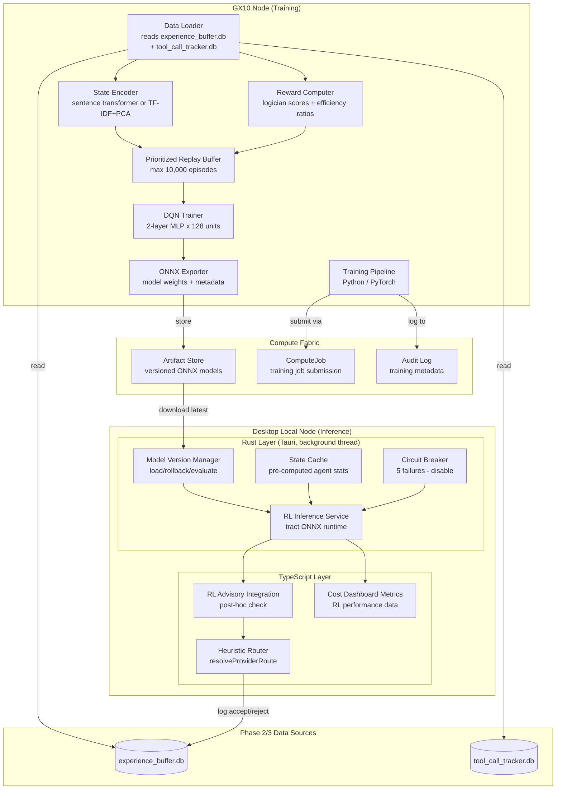

# Design Document: Unified RL Policy

## Overview

The Unified RL Policy is Phase 4 of the ResonantOS vNext improvement plan — a Deep Reinforcement Learning system that learns to optimize agent selection and tool call efficiency evaluation from historical data accumulated by the Phase 2 Scoring Engine and Phase 3 Tool Call Tracker.

The system is split across three layers:

- **Python training pipeline** (`training/unified_rl_policy/`): Runs on the GX10 node as a ComputeJob. Reads from `experience_buffer.db` and `tool_call_tracker.db`, constructs state vectors, computes rewards, trains a hierarchical MLP policy (DQN), and exports model weights as ONNX artifacts to the Compute Fabric artifact store.
- **Rust inference service** (`src-tauri/src/rl_inference_service.rs`): Loads ONNX model weights via the `tract` crate, constructs state vectors from cached statistics, runs forward passes in <5ms on the Desktop local node (no GPU), and produces advisory RL_Recommendations.
- **TypeScript integration layer** (`src/core/rl-advisory.ts`): Bridges the Rust inference service with the existing heuristic router in `provider-service.ts`. Implements the advisory post-hoc pattern: the heuristic router runs first, then evaluates the RL recommendation against confidence thresholds and hard constraints.

The system is **advisory only** — the heuristic router (`resolveProviderRoute` / `resolveAgentChatRoute`) always makes the authoritative decision. The RL recommendation is evaluated post-hoc and accepted only when confidence exceeds the threshold AND no hard constraints are violated. If the RL system is offline, untrained, or low-confidence, the heuristic runs alone with zero degradation.

### Key Design Decisions

1. **Python for training, Rust for inference**: Training requires PyTorch/stable-baselines3 ecosystem (GPU acceleration, replay buffers, optimizers). Inference requires only a forward pass through a small MLP — `tract` (pure Rust ONNX runtime) provides sub-millisecond inference without Python overhead or GPU dependency.

2. **ONNX as the bridge format**: The trained PyTorch model is exported to ONNX format, which `tract` loads natively. This decouples the training environment (Python/CUDA on GX10) from the inference environment (Rust on Desktop). ONNX is well-supported by both ecosystems and provides a stable serialization format for model versioning.

3. **Hierarchical MDP as coupled MLPs**: Rather than a single monolithic policy, the system uses two small MLPs (pi_H for agent selection, pi_L for tool efficiency scoring) that share information through feature coupling. pi_L's expected efficiency estimate feeds into pi_H's state vector, and pi_H's selected agent conditions pi_L's evaluation. Both are trained jointly via a combined loss function.

4. **DQN over PPO for offline training**: DQN is better suited to offline batch training from a fixed replay buffer (off-policy). PPO is on-policy and requires environment interaction. Since we train exclusively on historical data, DQN with prioritized experience replay is the natural choice.

5. **Advisory post-hoc integration (matching Phase 2 pattern)**: The RL system runs in parallel on a background thread. The heuristic router never waits for it — if inference exceeds 10ms, the recommendation is discarded. This matches the Scoring Engine's integration pattern and ensures zero-latency impact.

6. **Circuit breaker pattern (matching Phase 2/3)**: After 5 consecutive inference failures, the RL service disables itself for a cooldown period. The heuristic router operates identically to a system without the RL policy installed.

7. **Trust tier progression (matching Phase 2)**: Starts at "addon" trust (0.80 confidence threshold), earnable to "trusted" (0.60 threshold) after 30 days of demonstrated improvement. Automatic demotion on 7-day degradation.

8. **TF-IDF+PCA fallback for cold start**: The sentence transformer (all-MiniLM-L6-v2) provides rich 384-dim task embeddings but requires the model to be available. TF-IDF with PCA to 64 dimensions provides a lightweight fallback computed from the existing corpus, ensuring the system can train even without the transformer model.

## Architecture




## Components and Interfaces

### 1. Python Training Pipeline

```python
# training/unified_rl_policy/data_loader.py

from dataclasses import dataclass
from typing import List, Optional
import sqlite3

@dataclass
class TrainingEpisode:
    """A combined record from ExperienceRecord + ToolCallTrace for RL training."""
    delegation_packet_id: str
    timestamp: str
    task_type: str
    workload_class: str
    task_description: str
    # Agent selection outcome
    selected_agent_id: str
    candidate_agent_ids: List[str]
    logician_score: float          # 0.0-1.0
    outcome_status: str            # "passed" | "failed" | "degraded"
    outcome_duration_ms: int
    # Cost data
    selected_agent_cost_tokens: int
    max_candidate_cost_tokens: int
    # Tool call trace (may be None if trace unavailable)
    efficiency_ratio: Optional[float]
    total_tool_calls: Optional[int]
    useful_tool_calls: Optional[int]
    redundant_tool_calls: Optional[int]
    pattern_count: Optional[int]
    tool_sequence_signature: Optional[List[str]]
    # Agent historical stats
    agent_quality_scores: dict      # agent_id -> rolling_quality_score
    agent_speed_scores: dict        # agent_id -> rolling_speed_ms
    agent_cost_scores: dict         # agent_id -> rolling_cost_tokens
    agent_availability: dict        # agent_id -> availability (0.0-1.0)
    agent_efficiency_ratios: dict   # agent_id -> avg_efficiency_ratio


class DataLoader:
    """Loads and joins ExperienceRecords with ToolCallTraces into TrainingEpisodes."""

    def __init__(self, experience_db_path: str, tracker_db_path: str):
        self.experience_db = sqlite3.connect(experience_db_path, uri=True)
        self.tracker_db = sqlite3.connect(tracker_db_path, uri=True)

    def load_episodes(self, since_timestamp: Optional[str] = None) -> List[TrainingEpisode]:
        """Load all valid training episodes, joining experience records with tool traces."""
        ...

    def validate_episode(self, episode: TrainingEpisode) -> bool:
        """Validate required fields are present and within expected ranges."""
        ...

    def count_available_episodes(self) -> int:
        """Count total experience records available for training."""
        ...

    def close(self):
        self.experience_db.close()
        self.tracker_db.close()
```

```python
# training/unified_rl_policy/state_encoder.py

import numpy as np
from typing import List, Optional
from dataclasses import dataclass

@dataclass
class StateEncoderConfig:
    """Configuration for the state encoder."""
    use_sentence_transformer: bool = True
    transformer_model: str = "all-MiniLM-L6-v2"
    transformer_dim: int = 384
    tfidf_pca_dim: int = 64
    agent_stats_dim: int = 5       # quality, speed, cost, availability, percentile
    tool_history_dim: int = 4      # avg_efficiency, pattern_rate, avg_calls, cost_per_call
    max_candidates: int = 10


class StateEncoder:
    """Encodes task descriptions and agent statistics into fixed-size state vectors."""

    def __init__(self, config: StateEncoderConfig):
        self.config = config
        self._transformer = None
        self._tfidf = None
        self._pca = None
        self._running_mean: Optional[np.ndarray] = None
        self._running_var: Optional[np.ndarray] = None
        self._sample_count: int = 0

    def encode_task(self, task_description: str) -> np.ndarray:
        """Encode task description to embedding vector (384-dim or 64-dim fallback)."""
        ...

    def encode_agent_stats(self, quality: float, speed_ms: float, cost_tokens: float,
                           availability: float, percentile: float) -> np.ndarray:
        """Encode agent statistics to fixed 5-dim vector, all normalized to [0,1]."""
        ...

    def encode_tool_history(self, avg_efficiency: float, pattern_rate: float,
                            avg_calls: float, cost_per_call: float) -> np.ndarray:
        """Encode tool usage history to fixed 4-dim vector."""
        ...

    def build_high_level_state(self, task_embedding: np.ndarray,
                                agent_stats: List[np.ndarray],
                                tool_histories: List[np.ndarray],
                                low_level_efficiency_estimate: float) -> np.ndarray:
        """Concatenate all features into the high-level policy state vector."""
        ...

    def build_low_level_state(self, task_embedding: np.ndarray,
                               tool_sequence_so_far: List[str],
                               selected_agent_tool_history: np.ndarray) -> np.ndarray:
        """Build the low-level policy state vector."""
        ...

    def normalize(self, state: np.ndarray) -> np.ndarray:
        """Apply running z-score normalization."""
        ...

    def update_running_stats(self, batch: np.ndarray):
        """Update running mean and variance from a training batch."""
        ...

    def fit_tfidf_pca(self, corpus: List[str]):
        """Fit TF-IDF + PCA fallback from existing experience buffer corpus."""
        ...

    @property
    def high_level_state_dim(self) -> int:
        """Total dimension of the high-level state vector."""
        task_dim = self.config.transformer_dim if self.config.use_sentence_transformer else self.config.tfidf_pca_dim
        per_agent = self.config.agent_stats_dim + self.config.tool_history_dim
        return task_dim + (per_agent * self.config.max_candidates) + 1  # +1 for low-level estimate

    @property
    def low_level_state_dim(self) -> int:
        """Total dimension of the low-level state vector."""
        task_dim = self.config.transformer_dim if self.config.use_sentence_transformer else self.config.tfidf_pca_dim
        return task_dim + 64 + self.config.tool_history_dim  # 64 for tool sequence encoding
```

```python
# training/unified_rl_policy/reward_computer.py

from dataclasses import dataclass
from typing import Optional

@dataclass
class RewardConfig:
    """Configurable reward function parameters."""
    cost_bonus_cap: float = 0.3
    pattern_penalty: float = 0.05
    failure_penalty: float = -0.5
    reward_clip_min: float = -1.0
    reward_clip_max: float = 1.0


class RewardComputer:
    """Computes shaped rewards for both policy levels."""

    def __init__(self, config: RewardConfig):
        self.config = config

    def compute_high_level_reward(self, logician_score: float, outcome_status: str,
                                   selected_cost: int, max_candidate_cost: int) -> float:
        """
        High-level reward: logician_score * (1.0 + cost_bonus)
        Failed tasks get failure_penalty regardless of cost.
        """
        if outcome_status == "failed":
            return self.config.failure_penalty

        cost_savings_ratio = 0.0
        if max_candidate_cost > 0:
            cost_savings_ratio = (max_candidate_cost - selected_cost) / max_candidate_cost
        cost_bonus = min(cost_savings_ratio, self.config.cost_bonus_cap)

        reward = logician_score * (1.0 + cost_bonus)
        return max(self.config.reward_clip_min, min(self.config.reward_clip_max, reward))

    def compute_low_level_reward(self, efficiency_ratio: float,
                                  pattern_count: int) -> float:
        """
        Low-level reward: efficiency_ratio - (pattern_penalty * pattern_count)
        """
        reward = efficiency_ratio - (self.config.pattern_penalty * pattern_count)
        return max(self.config.reward_clip_min, min(self.config.reward_clip_max, reward))

    def compute_combined_reward(self, high_level: float, low_level: float,
                                 high_weight: float = 0.7, low_weight: float = 0.3) -> float:
        """Weighted combination of both rewards for joint training."""
        combined = high_weight * high_level + low_weight * low_level
        return max(self.config.reward_clip_min, min(self.config.reward_clip_max, combined))
```


```python
# training/unified_rl_policy/replay_buffer.py

import numpy as np
from dataclasses import dataclass
from typing import List, Tuple

@dataclass
class ReplayBufferConfig:
    max_size: int = 10000
    decay_half_life_days: float = 30.0
    alpha: float = 0.6              # priority exponent
    beta_start: float = 0.4         # importance sampling start
    beta_end: float = 1.0           # importance sampling end
    beta_anneal_steps: int = 100000


@dataclass
class BufferEntry:
    state: np.ndarray
    action: int
    reward: float
    next_state: np.ndarray
    done: bool
    td_error: float
    timestamp: str                  # ISO-8601 for decay weighting
    episode_id: str


class PrioritizedReplayBuffer:
    """Experience replay with priority based on TD-error and temporal recency."""

    def __init__(self, config: ReplayBufferConfig):
        self.config = config
        self._buffer: List[BufferEntry] = []
        self._priorities: np.ndarray = np.zeros(config.max_size)
        self._position: int = 0
        self._size: int = 0

    def add(self, entry: BufferEntry):
        """Add entry with max priority. Evicts lowest-priority if at capacity."""
        ...

    def sample(self, batch_size: int, current_timestamp: str) -> Tuple[List[BufferEntry], np.ndarray, np.ndarray]:
        """Sample batch with probability proportional to priority * temporal_weight."""
        ...

    def update_priorities(self, indices: np.ndarray, td_errors: np.ndarray):
        """Update priorities after training step."""
        ...

    def compute_temporal_weight(self, entry_timestamp: str, current_timestamp: str) -> float:
        """Exponential decay weight: exp(-ln(2) * age_days / half_life_days)."""
        ...

    @property
    def size(self) -> int:
        return self._size

    @property
    def is_full(self) -> bool:
        return self._size >= self.config.max_size
```

```python
# training/unified_rl_policy/dqn_trainer.py

import torch
import torch.nn as nn
from dataclasses import dataclass
from typing import Optional, Tuple

@dataclass
class DQNConfig:
    high_level_state_dim: int
    low_level_state_dim: int
    num_actions: int               # max number of candidate agents
    hidden_dim: int = 128
    num_hidden_layers: int = 2
    learning_rate: float = 1e-4
    gamma: float = 0.99
    tau: float = 0.005             # soft target update
    batch_size: int = 64
    target_update_freq: int = 100
    gradient_clip: float = 1.0


class HierarchicalDQN(nn.Module):
    """Two coupled MLP networks for hierarchical agent selection."""

    def __init__(self, config: DQNConfig):
        super().__init__()
        self.config = config

        # High-level policy network (pi_H): state -> Q-values per agent
        layers_h = []
        in_dim = config.high_level_state_dim
        for _ in range(config.num_hidden_layers):
            layers_h.extend([nn.Linear(in_dim, config.hidden_dim), nn.ReLU()])
            in_dim = config.hidden_dim
        layers_h.append(nn.Linear(in_dim, config.num_actions))
        self.high_level_net = nn.Sequential(*layers_h)

        # Low-level policy network (pi_L): state -> scalar quality score
        layers_l = []
        in_dim = config.low_level_state_dim
        for _ in range(config.num_hidden_layers):
            layers_l.extend([nn.Linear(in_dim, config.hidden_dim), nn.ReLU()])
            in_dim = config.hidden_dim
        layers_l.append(nn.Linear(in_dim, 1))
        layers_l.append(nn.Sigmoid())  # output in [0, 1]
        self.low_level_net = nn.Sequential(*layers_l)

    def forward_high_level(self, state: torch.Tensor) -> torch.Tensor:
        """Forward pass for agent selection Q-values."""
        return self.high_level_net(state)

    def forward_low_level(self, state: torch.Tensor) -> torch.Tensor:
        """Forward pass for tool efficiency quality score."""
        return self.low_level_net(state)


class DQNTrainer:
    """Trains the hierarchical DQN on the prioritized replay buffer."""

    def __init__(self, config: DQNConfig):
        self.config = config
        self.policy_net = HierarchicalDQN(config)
        self.target_net = HierarchicalDQN(config)
        self.target_net.load_state_dict(self.policy_net.state_dict())
        self.optimizer = torch.optim.Adam(self.policy_net.parameters(), lr=config.learning_rate)
        self.step_count = 0

    def train_step(self, batch: list) -> Tuple[float, float]:
        """Single training step. Returns (high_level_loss, low_level_loss)."""
        ...

    def soft_update_target(self):
        """Soft update target network: target = tau*policy + (1-tau)*target."""
        ...

    def get_training_metrics(self) -> dict:
        """Return current training metrics (losses, step count, etc.)."""
        ...
```

```python
# training/unified_rl_policy/onnx_exporter.py

from dataclasses import dataclass
from typing import Optional
import torch

@dataclass
class ModelVersionMetadata:
    version_id: str
    training_timestamp: str
    data_window_start: str
    data_window_end: str
    episode_count: int
    final_high_level_loss: float
    final_low_level_loss: float
    validation_metrics: dict
    state_encoder_config: dict
    reward_config: dict
    normalization_stats: dict       # running mean/var for inference


class ONNXExporter:
    """Exports trained PyTorch model to ONNX format for tract inference."""

    def __init__(self, artifact_store_path: str):
        self.artifact_store_path = artifact_store_path

    def export_model(self, trainer: 'DQNTrainer', metadata: ModelVersionMetadata,
                     high_level_state_dim: int, low_level_state_dim: int) -> str:
        """
        Export both policy networks to ONNX.
        Returns the artifact path.
        """
        ...

    def export_high_level(self, net: torch.nn.Module, state_dim: int, path: str):
        """Export high-level network to ONNX with dynamic batch size."""
        dummy_input = torch.randn(1, state_dim)
        torch.onnx.export(net, dummy_input, path,
                          input_names=["state"],
                          output_names=["q_values"],
                          dynamic_axes={"state": {0: "batch"}, "q_values": {0: "batch"}})

    def export_low_level(self, net: torch.nn.Module, state_dim: int, path: str):
        """Export low-level network to ONNX."""
        dummy_input = torch.randn(1, state_dim)
        torch.onnx.export(net, dummy_input, path,
                          input_names=["state"],
                          output_names=["quality_score"],
                          dynamic_axes={"state": {0: "batch"}, "quality_score": {0: "batch"}})

    def save_metadata(self, metadata: ModelVersionMetadata, path: str):
        """Save model version metadata as JSON alongside ONNX files."""
        ...
```

```python
# training/unified_rl_policy/training_job.py

from dataclasses import dataclass
from typing import Optional

@dataclass
class TrainingJobConfig:
    experience_db_path: str
    tracker_db_path: str
    artifact_store_path: str
    cold_start_threshold: int = 200
    min_new_episodes_trigger: int = 50
    max_epochs: int = 100
    early_stop_patience: int = 10
    validation_split: float = 0.1
    non_stationarity_threshold: float = 0.20
    non_stationarity_window: int = 50


class TrainingJob:
    """Orchestrates a complete training run as a ComputeJob on GX10."""

    def __init__(self, config: TrainingJobConfig):
        self.config = config

    def should_train(self) -> bool:
        """Check if training should be triggered (cold start met, enough new data)."""
        ...

    def run(self) -> Optional[str]:
        """
        Execute full training pipeline:
        1. Load episodes from data sources
        2. Validate and filter episodes
        3. Encode states
        4. Compute rewards
        5. Fill prioritized replay buffer
        6. Train DQN for max_epochs with early stopping
        7. Export ONNX model
        8. Return model version ID
        """
        ...

    def detect_non_stationarity(self, recent_rewards: list) -> bool:
        """Check if rolling reward has dropped >20% from training average."""
        ...

    def log_training_metadata(self, job_id: str, start_time: str, end_time: str,
                               episode_count: int, losses: dict, model_version: str):
        """Log to Compute Fabric audit log."""
        ...
```


### 2. Rust Inference Service (`rl_inference_service.rs`)

```rust
// src-tauri/src/rl_inference_service.rs

use serde::{Deserialize, Serialize};
use std::sync::Arc;
use tokio::sync::RwLock;

/// Configuration for the RL inference service.
#[derive(Debug, Clone, Deserialize)]
#[serde(rename_all = "camelCase")]
pub struct RLInferenceConfig {
    pub model_artifact_path: String,
    pub inference_timeout_ms: u64,          // default: 10
    pub circuit_breaker_threshold: u32,     // default: 5
    pub circuit_breaker_cooldown_secs: u64, // default: 60
    pub cold_start_threshold: u32,          // default: 200
    pub confidence_ramp_episodes: u32,      // default: 100
    pub evaluation_window_size: u32,        // default: 50
    pub min_model_versions_retained: u32,   // default: 5
}

/// The RL recommendation produced by inference.
#[derive(Debug, Clone, Serialize, Deserialize)]
#[serde(rename_all = "camelCase")]
pub struct RLRecommendation {
    pub recommended_agent_id: String,
    pub confidence_score: f64,              // 0.0-1.0
    pub expected_reward: f64,
    pub q_values: Vec<(String, f64)>,       // agent_id -> Q-value pairs
    pub model_version_id: String,
    pub inference_duration_ms: f64,
    pub timestamp: String,
}

/// Model version metadata loaded alongside ONNX weights.
#[derive(Debug, Clone, Serialize, Deserialize)]
#[serde(rename_all = "camelCase")]
pub struct ModelVersion {
    pub version_id: String,
    pub training_timestamp: String,
    pub data_window_start: String,
    pub data_window_end: String,
    pub episode_count: u32,
    pub final_high_level_loss: f64,
    pub final_low_level_loss: f64,
    pub validation_metrics: serde_json::Value,
    pub normalization_mean: Vec<f64>,
    pub normalization_var: Vec<f64>,
    pub is_last_known_good: bool,
}

/// Circuit breaker state for inference failures.
#[derive(Debug, Clone, Serialize, Deserialize)]
#[serde(rename_all = "camelCase")]
pub struct RLCircuitBreakerState {
    pub consecutive_failures: u32,
    pub is_open: bool,
    pub last_failure_at: Option<String>,
    pub cooldown_ends_at: Option<String>,
    pub cooldown_secs: u64,
    pub failure_threshold: u32,
}

/// Trust tier state for the RL policy.
#[derive(Debug, Clone, Serialize, Deserialize)]
#[serde(rename_all = "camelCase")]
pub struct RLTrustTierState {
    pub current_tier: String,               // "addon" | "trusted"
    pub confidence_threshold: f64,          // 0.80 for addon, 0.60 for trusted
    pub promoted_at: Option<String>,
    pub validation_started_at: String,
    pub consecutive_days_improved: u32,
    pub consecutive_days_degraded: u32,
}

/// Cold start state tracking.
#[derive(Debug, Clone, Serialize, Deserialize)]
#[serde(rename_all = "camelCase")]
pub struct ColdStartState {
    pub experience_count: u32,
    pub cold_start_threshold: u32,
    pub has_graduated: bool,
    pub graduated_at: Option<String>,
    pub episodes_since_graduation: u32,
}

/// Pre-computed agent statistics cache for fast state vector construction.
#[derive(Debug, Clone, Serialize, Deserialize)]
#[serde(rename_all = "camelCase")]
pub struct AgentStatsCache {
    pub agent_id: String,
    pub quality_score: f64,
    pub speed_score: f64,
    pub cost_score: f64,
    pub availability: f64,
    pub task_type_percentile: f64,
    pub avg_efficiency_ratio: f64,
    pub pattern_rate_per_100: f64,
    pub avg_tool_calls: f64,
    pub cost_per_tool_call: f64,
    pub last_updated_at: String,
}

/// Shared state for the RL inference service.
pub struct RLInferenceState {
    pub config: RLInferenceConfig,
    pub circuit_breaker: Arc<RwLock<RLCircuitBreakerState>>,
    pub trust_tier: Arc<RwLock<RLTrustTierState>>,
    pub cold_start: Arc<RwLock<ColdStartState>>,
    pub current_model: Arc<RwLock<Option<LoadedModel>>>,
    pub agent_stats_cache: Arc<RwLock<Vec<AgentStatsCache>>>,
    pub model_versions: Arc<RwLock<Vec<ModelVersion>>>,
}

/// A loaded ONNX model ready for inference.
pub struct LoadedModel {
    pub high_level_model: tract_onnx::prelude::SimplePlan<
        tract_onnx::prelude::TypedFact,
        Box<dyn tract_onnx::prelude::TypedOp>,
        tract_onnx::prelude::Graph<
            tract_onnx::prelude::TypedFact,
            Box<dyn tract_onnx::prelude::TypedOp>,
        >,
    >,
    pub low_level_model: tract_onnx::prelude::SimplePlan<
        tract_onnx::prelude::TypedFact,
        Box<dyn tract_onnx::prelude::TypedOp>,
        tract_onnx::prelude::Graph<
            tract_onnx::prelude::TypedFact,
            Box<dyn tract_onnx::prelude::TypedOp>,
        >,
    >,
    pub version: ModelVersion,
}

/// Initialize the RL inference service. Called once during Tauri app setup.
pub fn start_rl_inference_service(
    config: RLInferenceConfig,
) -> RLInferenceState { /* ... */ }

/// Produce an RL recommendation for a given task and candidate set.
/// Returns None if cold start, circuit breaker open, or inference fails.
/// Must complete within inference_timeout_ms (default 10ms).
pub async fn infer_recommendation(
    state: &RLInferenceState,
    task_description: &str,
    task_type: &str,
    candidate_agent_ids: &[String],
) -> Option<RLRecommendation> { /* ... */ }

/// Load a new model version from the artifact store.
pub async fn load_model_version(
    state: &RLInferenceState,
    version_id: &str,
) -> Result<(), String> { /* ... */ }

/// Rollback to a previous model version.
pub async fn rollback_model(
    state: &RLInferenceState,
    target_version_id: &str,
) -> Result<(), String> { /* ... */ }

/// Evaluate a new model version against the previous one.
/// Returns true if the new version should be kept.
pub async fn evaluate_model_version(
    state: &RLInferenceState,
    evaluation_window: u32,
) -> bool { /* ... */ }

/// Update the circuit breaker after an inference attempt.
pub fn update_circuit_breaker(
    state: &RLCircuitBreakerState,
    success: bool,
    now: &str,
) -> RLCircuitBreakerState { /* ... */ }

/// Check if inference should be attempted (circuit breaker check).
pub fn should_attempt_inference(
    circuit_breaker: &RLCircuitBreakerState,
    now: &str,
) -> bool { /* ... */ }

/// Compute confidence score with cold-start ramp-up scaling.
pub fn compute_confidence_with_ramp(
    raw_confidence: f64,
    cold_start: &ColdStartState,
) -> f64 { /* ... */ }

/// IPC commands
#[tauri::command]
pub async fn rl_infer(
    task_description: String,
    task_type: String,
    candidate_agent_ids: Vec<String>,
) -> Result<Option<RLRecommendation>, String> { /* ... */ }

#[tauri::command]
pub async fn rl_get_status() -> Result<RLServiceStatus, String> { /* ... */ }

#[tauri::command]
pub async fn rl_load_model(version_id: String) -> Result<(), String> { /* ... */ }

#[tauri::command]
pub async fn rl_rollback(version_id: String) -> Result<(), String> { /* ... */ }

#[tauri::command]
pub async fn rl_get_model_versions() -> Result<Vec<ModelVersion>, String> { /* ... */ }

#[tauri::command]
pub async fn rl_get_trust_tier() -> Result<RLTrustTierState, String> { /* ... */ }

#[tauri::command]
pub async fn rl_query_performance_metrics(period_days: u32) -> Result<serde_json::Value, String> { /* ... */ }

#[tauri::command]
pub async fn rl_query_cold_start_progress() -> Result<serde_json::Value, String> { /* ... */ }

#[tauri::command]
pub async fn rl_query_confidence_trend(period_days: u32) -> Result<Vec<serde_json::Value>, String> { /* ... */ }

/// Service status response.
#[derive(Debug, Serialize)]
#[serde(rename_all = "camelCase")]
pub struct RLServiceStatus {
    pub status: String,                     // "active" | "cold_start" | "untrained" | "circuit_breaker_open"
    pub current_model_version: Option<String>,
    pub cold_start_state: ColdStartState,
    pub circuit_breaker: RLCircuitBreakerState,
    pub trust_tier: RLTrustTierState,
    pub total_inferences: u64,
    pub acceptance_rate: f64,
}
```


### 3. TypeScript Integration Layer (`rl-advisory.ts`)

```typescript
// src/core/rl-advisory.ts

import { invoke } from "@tauri-apps/api/core";

// --- Types ---

export interface RLRecommendation {
  recommendedAgentId: string;
  confidenceScore: number;          // 0.0-1.0
  expectedReward: number;
  qValues: Array<[string, number]>; // [agentId, qValue] pairs
  modelVersionId: string;
  inferenceDurationMs: number;
  timestamp: string;
}

export interface RLAdvisoryDecision {
  accepted: boolean;
  recommendation: RLRecommendation | null;
  heuristicDecision: string;        // agentId chosen by heuristic
  rejectionReason: RLRejectionReason | null;
  confidenceScore: number;
  timestamp: string;
}

export type RLRejectionReason =
  | "confidence-below-threshold"
  | "hard-constraint-violation"
  | "outside-fallback-chain"
  | "rl-unavailable"
  | "circuit-breaker-open"
  | "cold-start"
  | "timeout-exceeded";

export interface RLAdvisoryConfig {
  enabled: boolean;
  timeoutMs: number;                // default: 10
  confidenceThreshold: number;      // from trust tier: 0.80 or 0.60
}

export interface RLServiceStatus {
  status: "active" | "cold_start" | "untrained" | "circuit_breaker_open";
  currentModelVersion: string | null;
  coldStartState: {
    experienceCount: number;
    coldStartThreshold: number;
    hasGraduated: boolean;
    graduatedAt: string | null;
    episodesSinceGraduation: number;
  };
  circuitBreaker: {
    consecutiveFailures: number;
    isOpen: boolean;
    lastFailureAt: string | null;
    cooldownEndAt: string | null;
  };
  trustTier: {
    currentTier: "addon" | "trusted";
    confidenceThreshold: number;
    promotedAt: string | null;
    consecutiveDaysImproved: number;
    consecutiveDaysDegraded: number;
  };
  totalInferences: number;
  acceptanceRate: number;
}

// --- IPC Wrappers ---

export const requestRLRecommendation = (
  taskDescription: string,
  taskType: string,
  candidateAgentIds: string[],
): Promise<RLRecommendation | null> =>
  invoke("rl_infer", { taskDescription, taskType, candidateAgentIds });

export const getRLStatus = (): Promise<RLServiceStatus> =>
  invoke("rl_get_status");

export const getRLModelVersions = (): Promise<Array<{
  versionId: string;
  trainingTimestamp: string;
  episodeCount: number;
  isLastKnownGood: boolean;
}>> => invoke("rl_get_model_versions");

export const rollbackRLModel = (versionId: string): Promise<void> =>
  invoke("rl_rollback", { versionId });

// --- Advisory Evaluation ---

export const evaluateRLAdvisory = (
  recommendation: RLRecommendation | null,
  heuristicAgentId: string,
  config: RLAdvisoryConfig,
  allowedAgentIds: string[],
  hardConstraintViolatingIds: string[],
): RLAdvisoryDecision => {
  const timestamp = new Date().toISOString();

  if (!recommendation) {
    return {
      accepted: false,
      recommendation: null,
      heuristicDecision: heuristicAgentId,
      rejectionReason: "rl-unavailable",
      confidenceScore: 0.0,
      timestamp,
    };
  }

  if (recommendation.confidenceScore < config.confidenceThreshold) {
    return {
      accepted: false,
      recommendation,
      heuristicDecision: heuristicAgentId,
      rejectionReason: "confidence-below-threshold",
      confidenceScore: recommendation.confidenceScore,
      timestamp,
    };
  }

  if (hardConstraintViolatingIds.includes(recommendation.recommendedAgentId)) {
    return {
      accepted: false,
      recommendation,
      heuristicDecision: heuristicAgentId,
      rejectionReason: "hard-constraint-violation",
      confidenceScore: recommendation.confidenceScore,
      timestamp,
    };
  }

  if (!allowedAgentIds.includes(recommendation.recommendedAgentId)) {
    return {
      accepted: false,
      recommendation,
      heuristicDecision: heuristicAgentId,
      rejectionReason: "outside-fallback-chain",
      confidenceScore: recommendation.confidenceScore,
      timestamp,
    };
  }

  return {
    accepted: true,
    recommendation,
    heuristicDecision: heuristicAgentId,
    rejectionReason: null,
    confidenceScore: recommendation.confidenceScore,
    timestamp,
  };
};
```

### 4. Cost Dashboard Metrics (`rl-dashboard-metrics.ts`)

```typescript
// src/core/rl-dashboard-metrics.ts

export interface RLPerformanceMetrics {
  totalRecommendations: number;
  acceptanceRate: number;
  averageConfidenceScore: number;
  rlAcceptedAvgLogicianScore: number;
  heuristicOnlyAvgLogicianScore: number;
  estimatedCostSavings: number;
  trainingCosts: TrainingCostEntry[];
  confidenceTrend: Array<{ timestamp: string; confidence: number }>;
}

export interface TrainingCostEntry {
  jobId: string;
  timestamp: string;
  computeTimeSeconds: number;
  gpuUtilizationPercent: number;
  episodeCount: number;
  modelVersionId: string;
}

export interface ColdStartProgress {
  currentCount: number;
  threshold: number;
  progressPercent: number;
  estimatedDaysToThreshold: number | null;
}

export const queryRLPerformanceMetrics = (
  periodDays: number,
): Promise<RLPerformanceMetrics> =>
  invoke("rl_query_performance_metrics", { periodDays });

export const queryRLColdStartProgress = (): Promise<ColdStartProgress> =>
  invoke("rl_query_cold_start_progress");

export const queryRLConfidenceTrend = (
  periodDays: number,
): Promise<Array<{ timestamp: string; confidence: number }>> =>
  invoke("rl_query_confidence_trend", { periodDays });
```


## Data Models

### RL Policy State Schema (persisted in `rl_policy_state.db`)

```sql
-- Model versions registry
CREATE TABLE IF NOT EXISTS model_versions (
    version_id TEXT PRIMARY KEY,
    training_timestamp TEXT NOT NULL,
    data_window_start TEXT NOT NULL,
    data_window_end TEXT NOT NULL,
    episode_count INTEGER NOT NULL,
    final_high_level_loss REAL NOT NULL,
    final_low_level_loss REAL NOT NULL,
    validation_metrics_json TEXT NOT NULL,
    normalization_mean_json TEXT NOT NULL,
    normalization_var_json TEXT NOT NULL,
    artifact_path TEXT NOT NULL,
    is_active INTEGER NOT NULL DEFAULT 0,
    is_last_known_good INTEGER NOT NULL DEFAULT 0,
    created_at TEXT NOT NULL
);

-- Inference decision log
CREATE TABLE IF NOT EXISTS inference_log (
    id TEXT PRIMARY KEY,
    delegation_packet_id TEXT NOT NULL,
    timestamp TEXT NOT NULL,
    task_type TEXT NOT NULL,
    recommended_agent_id TEXT NOT NULL,
    confidence_score REAL NOT NULL,
    expected_reward REAL NOT NULL,
    q_values_json TEXT NOT NULL,
    model_version_id TEXT NOT NULL,
    inference_duration_ms REAL NOT NULL,
    advisory_accepted INTEGER NOT NULL DEFAULT 0,
    rejection_reason TEXT,
    heuristic_agent_id TEXT NOT NULL,
    outcome_logician_score REAL,
    outcome_recorded_at TEXT
);

-- Trust tier state (singleton)
CREATE TABLE IF NOT EXISTS trust_tier_state (
    id TEXT PRIMARY KEY DEFAULT 'singleton',
    current_tier TEXT NOT NULL DEFAULT 'addon',
    confidence_threshold REAL NOT NULL DEFAULT 0.80,
    promoted_at TEXT,
    validation_started_at TEXT NOT NULL,
    consecutive_days_improved INTEGER NOT NULL DEFAULT 0,
    consecutive_days_degraded INTEGER NOT NULL DEFAULT 0
);

-- Trust tier transitions log
CREATE TABLE IF NOT EXISTS trust_tier_transitions (
    id TEXT PRIMARY KEY,
    from_tier TEXT NOT NULL,
    to_tier TEXT NOT NULL,
    transitioned_at TEXT NOT NULL,
    validation_period_days INTEGER NOT NULL,
    metrics_json TEXT NOT NULL,
    direction TEXT NOT NULL          -- "promotion" | "demotion"
);

-- Cold start state (singleton)
CREATE TABLE IF NOT EXISTS cold_start_state (
    id TEXT PRIMARY KEY DEFAULT 'singleton',
    experience_count INTEGER NOT NULL DEFAULT 0,
    cold_start_threshold INTEGER NOT NULL DEFAULT 200,
    has_graduated INTEGER NOT NULL DEFAULT 0,
    graduated_at TEXT,
    episodes_since_graduation INTEGER NOT NULL DEFAULT 0
);

-- Circuit breaker state (singleton)
CREATE TABLE IF NOT EXISTS circuit_breaker_state (
    id TEXT PRIMARY KEY DEFAULT 'singleton',
    consecutive_failures INTEGER NOT NULL DEFAULT 0,
    is_open INTEGER NOT NULL DEFAULT 0,
    last_failure_at TEXT,
    cooldown_ends_at TEXT,
    cooldown_secs INTEGER NOT NULL DEFAULT 60,
    failure_threshold INTEGER NOT NULL DEFAULT 5
);

-- Agent stats cache (refreshed periodically from experience buffer)
CREATE TABLE IF NOT EXISTS agent_stats_cache (
    agent_id TEXT NOT NULL,
    task_type TEXT NOT NULL,
    quality_score REAL NOT NULL DEFAULT 0.0,
    speed_score REAL NOT NULL DEFAULT 0.0,
    cost_score REAL NOT NULL DEFAULT 0.0,
    availability REAL NOT NULL DEFAULT 0.0,
    task_type_percentile REAL NOT NULL DEFAULT 0.0,
    avg_efficiency_ratio REAL NOT NULL DEFAULT 0.5,
    pattern_rate_per_100 REAL NOT NULL DEFAULT 0.0,
    avg_tool_calls REAL NOT NULL DEFAULT 0.0,
    cost_per_tool_call REAL NOT NULL DEFAULT 0.0,
    last_updated_at TEXT NOT NULL,
    PRIMARY KEY (agent_id, task_type)
);

-- Model evaluation window tracking
CREATE TABLE IF NOT EXISTS model_evaluation (
    id TEXT PRIMARY KEY,
    new_version_id TEXT NOT NULL,
    previous_version_id TEXT NOT NULL,
    started_at TEXT NOT NULL,
    decisions_evaluated INTEGER NOT NULL DEFAULT 0,
    evaluation_window_size INTEGER NOT NULL DEFAULT 50,
    new_version_acceptance_rate REAL,
    new_version_avg_logician_score REAL,
    previous_version_acceptance_rate REAL,
    previous_version_avg_logician_score REAL,
    result TEXT,                     -- "keep" | "rollback" | "pending"
    completed_at TEXT
);

-- Training job history
CREATE TABLE IF NOT EXISTS training_jobs (
    job_id TEXT PRIMARY KEY,
    started_at TEXT NOT NULL,
    completed_at TEXT,
    status TEXT NOT NULL DEFAULT 'running',  -- "running" | "completed" | "failed"
    episode_count INTEGER,
    final_high_level_loss REAL,
    final_low_level_loss REAL,
    model_version_id TEXT,
    trigger_reason TEXT NOT NULL,    -- "scheduled" | "data_threshold" | "non_stationarity"
    error_message TEXT
);

-- Indexes
CREATE INDEX IF NOT EXISTS idx_inference_log_timestamp
    ON inference_log(timestamp);
CREATE INDEX IF NOT EXISTS idx_inference_log_packet
    ON inference_log(delegation_packet_id);
CREATE INDEX IF NOT EXISTS idx_inference_log_accepted
    ON inference_log(advisory_accepted);
CREATE INDEX IF NOT EXISTS idx_inference_log_model
    ON inference_log(model_version_id);
CREATE INDEX IF NOT EXISTS idx_model_versions_active
    ON model_versions(is_active);
CREATE INDEX IF NOT EXISTS idx_training_jobs_status
    ON training_jobs(status);
```

### Behavioral Contract Registration

The RL policy registers contracts as JSON files in `src/core/backtest-contracts/`:

- `contract-rl-inference-5ms.json` — Inference completes within 5 milliseconds
- `contract-rl-zero-tokens.json` — Zero tokens added to any agent prompt
- `contract-rl-circuit-breaker-5-failures.json` — Circuit breaker activates after 5 consecutive failures
- `contract-rl-confidence-range.json` — RL_Confidence_Score always in [0.0, 1.0]
- `contract-rl-cold-start-zero-confidence.json` — Cold start produces confidence 0.0
- `contract-rl-heuristic-never-blocked.json` — Heuristic router never blocked by RL unavailability
- `contract-rl-model-versioned.json` — Model versions persisted after each training job
- `contract-rl-rollback-on-degradation.json` — Rollback triggers when new version underperforms
- `contract-rl-last-known-good-maintained.json` — "last_known_good" tag maintained correctly
- `contract-rl-training-gx10-only.json` — Training jobs execute only on GX10 node
- `contract-rl-no-live-training.json` — Training never occurs during live task execution
- `contract-rl-replay-buffer-capped.json` — Prioritized replay buffer does not exceed max size
- `contract-rl-background-thread.json` — Inference runs on background thread

## Correctness Properties

### Property 1: Inference latency bound

*For any* valid state vector and loaded ONNX model, `infer_recommendation` SHALL complete the forward pass within 5 milliseconds on the Desktop local node without GPU.

**Validates: Requirements 4.1**

### Property 2: Confidence score bounds

*For any* output of the inference service, the `confidence_score` field SHALL be in the range [0.0, 1.0] inclusive.

**Validates: Requirements 3.2, 9.2, 14.2**

### Property 3: Cold start zero confidence

*While* the `ColdStartState.has_graduated` is false, *for any* inference request, the returned `confidence_score` SHALL be exactly 0.0.

**Validates: Requirements 9.2, 9.5**

### Property 4: Confidence ramp-up monotonicity

*For any* fixed raw confidence value and *for any* two cold start states where `episodes_since_graduation_A < episodes_since_graduation_B` (both < 100), the scaled confidence from state A SHALL be less than or equal to the scaled confidence from state B.

**Validates: Requirements 9.4**

### Property 5: Circuit breaker activation threshold

*For any* sequence of inference outcomes, the circuit breaker SHALL transition to `is_open = true` after exactly `failure_threshold` (default 5) consecutive failures, and *any* success SHALL reset `consecutive_failures` to 0.

**Validates: Requirements 13.5, 14.1**

### Property 6: Advisory evaluation correctness

*For any* `RLRecommendation` and advisory config, `evaluateRLAdvisory` SHALL return `accepted: true` if and only if: (a) recommendation is non-null, (b) `confidenceScore >= confidenceThreshold`, (c) `recommendedAgentId` is not in `hardConstraintViolatingIds`, and (d) `recommendedAgentId` is in `allowedAgentIds`. All other cases SHALL return `accepted: false` with a non-null `rejectionReason`.

**Validates: Requirements 3.2, 3.3, 3.4, 3.5**

### Property 7: High-level reward formula correctness

*For any* logician_score in [0.0, 1.0], *for any* non-failed outcome, and *for any* cost values where selected_cost <= max_candidate_cost, `compute_high_level_reward` SHALL equal `logician_score * (1.0 + min(cost_savings_ratio, 0.3))` where `cost_savings_ratio = (max_cost - selected_cost) / max_cost`. The result SHALL be in [-1.0, 1.0].

**Validates: Requirements 7.1, 7.3**

### Property 8: Failure penalty override

*For any* task with `outcome_status == "failed"`, `compute_high_level_reward` SHALL return exactly `failure_penalty` (default -0.5) regardless of cost efficiency values.

**Validates: Requirements 7.4**

### Property 9: Low-level reward formula correctness

*For any* efficiency_ratio in [0.0, 1.0] and *for any* non-negative pattern_count, `compute_low_level_reward` SHALL equal `efficiency_ratio - (pattern_penalty * pattern_count)` clipped to [-1.0, 1.0].

**Validates: Requirements 7.2, 7.3**

### Property 10: Replay buffer capacity enforcement

*For any* sequence of `add` operations on the `PrioritizedReplayBuffer`, the buffer size SHALL never exceed `max_size`. When at capacity, the lowest-priority entry SHALL be evicted.

**Validates: Requirements 8.3, 14.4**

### Property 11: Temporal decay weight correctness

*For any* entry timestamp and current timestamp, `compute_temporal_weight` SHALL return `exp(-ln(2) * age_days / half_life_days)`. The result SHALL be in (0.0, 1.0] where entries at age 0 receive weight 1.0 and entries at age == half_life receive weight 0.5.

**Validates: Requirements 8.1**

### Property 12: Model version persistence

*For any* successful training job completion, a new `ModelVersion` record SHALL be inserted into the `model_versions` table with all required fields populated and `is_active = true`.

**Validates: Requirements 12.1, 14.3**

### Property 13: Rollback trigger correctness

*For any* model evaluation window where the new version's acceptance rate OR average logician score is lower than the previous version's, `evaluate_model_version` SHALL return false (triggering rollback).

**Validates: Requirements 12.4**

### Property 14: Last known good invariant

*At any point in time*, exactly zero or one `ModelVersion` records SHALL have `is_last_known_good = true`. The tagged version SHALL only change when a new version passes the evaluation window without rollback.

**Validates: Requirements 12.6**

### Property 15: Trust tier threshold mapping

*For any* `RLTrustTierState`, the `confidence_threshold` SHALL be exactly 0.80 when `current_tier == "addon"` and exactly 0.60 when `current_tier == "trusted"`.

**Validates: Requirements 11.2, 11.4**

### Property 16: Trust tier promotion criteria

*For any* trust tier state, promotion from "addon" to "trusted" SHALL occur if and only if `consecutive_days_improved >= 30`. Demotion from "trusted" to "addon" SHALL occur if and only if `consecutive_days_degraded >= 7`.

**Validates: Requirements 11.3, 11.5**

### Property 17: Non-stationarity detection

*For any* rolling reward window of size 50, `detect_non_stationarity` SHALL return true if and only if the rolling average has dropped by more than 20% from the training-time average.

**Validates: Requirements 8.5**

### Property 18: Training episode validation

*For any* `TrainingEpisode` with missing required fields (empty delegation_packet_id, null logician_score, or invalid timestamp), `validate_episode` SHALL return false and the episode SHALL be excluded from training.

**Validates: Requirements 5.5**

### Property 19: Missing trace handling

*For any* `ExperienceRecord` without a corresponding `ToolCallTrace`, the training pipeline SHALL use a neutral efficiency estimate of 0.5 for the low-level reward computation.

**Validates: Requirements 5.4**

### Property 20: Zero token guarantee

*For any* inference request or training job execution, the system SHALL not add any tokens to any agent prompt, context window, or conversation thread. The system SHALL not trigger any LLM API calls.

**Validates: Requirements 4.2, 4.3, 15.1, 15.2, 15.5**
