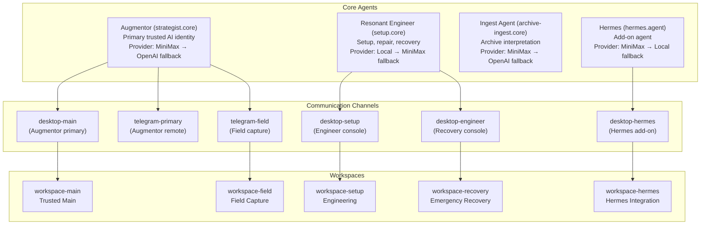
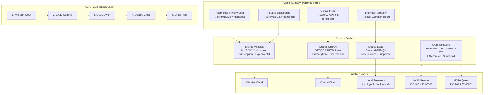
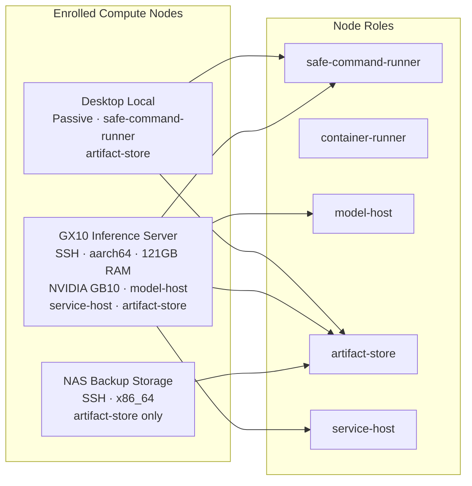
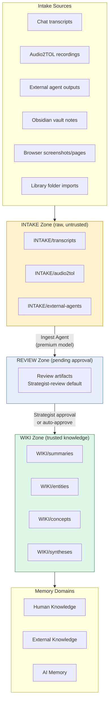
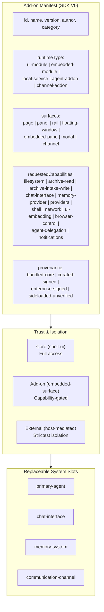
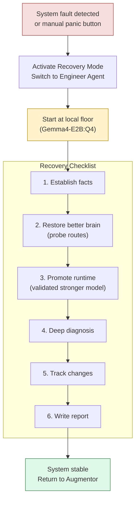

# ResonantOS vNext — Architecture Overview

Generated from source code analysis on 2026-05-24.

---

## 1. High-Level System Architecture

```mermaid
flowchart TB
  subgraph User["👤 Human Operator"]
    Desktop["Desktop UI"]
    Telegram["Telegram Client"]
  end

  subgraph Shell["ResonantOS Shell (Tauri v2 + React 19)"]
    direction TB
    subgraph Frontend["Frontend Layer (TypeScript/React)"]
      AppRoot["App.tsx — Shell Composition Root"]
      ChatRail["Chat Rail (right sidebar)"]
      Workspaces["Center Workspaces (lazy-loaded)"]
      NavDock["Left Navigation Dock"]
    end

    subgraph CoreTS["Core TypeScript Layer"]
      Contracts["contracts.ts — 2750 lines of typed interfaces"]
      Runtime["runtime.ts — Tauri IPC bridge"]
      Policies["policies.ts — Archive/provider guards"]
      ProviderSvc["provider-service.ts — Route resolution"]
      ContextMem["context-memory.ts — Budget & compaction"]
      Delegation["delegation.ts — Packet validation"]
      ModelStrategy["model-strategy.ts — Workload routing"]
      MemoryProvider["memory-provider.ts — Broker"]
    end

    subgraph SDK["Add-on SDK"]
      Validation["validation.ts — Manifest schema"]
      Registry["registry.ts — Catalog helpers"]
      AddonContracts["contracts.ts — SDK types"]
    end
  end

  subgraph TauriHost["Rust/Tauri Host Services (Privileged Boundary)"]
    HostState["host_state.rs — State, secrets, manifests"]
    ProviderRust["provider_service.rs — Chat completion, streaming, diagnostics"]
    ArchiveRust["archive_service.rs — Living Archive host ops"]
    BrowserRust["browser_service.rs — Chromium CDP"]
    BrowserNative["browser_native_service.rs — CEF/WebView"]
    BrowserHost["browser_host_service.rs — Host commands"]
    DelegationRust["delegation_service.rs — Task workspaces"]
    RecoveryRust["recovery_service.rs — Engineer tool loop"]
    ComputeRust["compute_service.rs — Safe commands, probes"]
    ObsidianRust["obsidian_service.rs — Vault bridge"]
    HermesRust["hermes_service.rs — Agent bridge"]
    OpenCodeRust["opencode_service.rs — Coding agent"]
    PaperclipRust["paperclip_service.rs — Project mgmt"]
    TelegramRust["telegram_service.rs — Channel service"]
    TerminalRust["terminal_service.rs — PTY sessions"]
    MemoryRust["memory_service.rs — MCP bridge"]
  end

  subgraph External["External Dependencies"]
    MiniMax["MiniMax Cloud API"]
    OpenAI["OpenAI API"]
    GX10["GX10 LAN Server\n(llama.cpp)"]
    LocalOllama["Local Ollama"]
    Chromium["Chromium Engine"]
    ObsidianApp["Obsidian App"]
    NAS["NAS Backup"]
    ArchiveFS["Living Archive\nFilesystem"]
    SQLite["SQLite DB"]
  end

  Desktop --> Shell
  Telegram --> TelegramRust

  AppRoot --> ChatRail
  AppRoot --> Workspaces
  AppRoot --> NavDock
  ChatRail --> ContextMem
  ChatRail --> ProviderSvc
  Workspaces --> Runtime
  Runtime --> TauriHost

  ProviderRust --> MiniMax
  ProviderRust --> OpenAI
  ProviderRust --> GX10
  ProviderRust --> LocalOllama
  ArchiveRust --> ArchiveFS
  ArchiveRust --> SQLite
  BrowserRust --> Chromium
  ObsidianRust --> ObsidianApp
  ComputeRust --> GX10
  ComputeRust --> NAS
```

---

## 2. Frontend Module Map

```mermaid
flowchart LR
  subgraph Modules["src/modules/ — Feature Modules"]
    direction TB
    Chat["chat/\n• controller.ts\n• thread-controller.ts\n• composer-controller.ts\n• StrategistChatRail.tsx\n• archive-context.ts\n• run-guard.ts"]
    Archive["archive/\n• controller.ts\n• ArchiveWorkspace.tsx\n• archive-action-center.ts\n• archive-ai-memory-jobs.ts\n• ArchiveSearchPanel.tsx\n• ArchiveReviewDesk.tsx"]
    Addons["addons/\n• controller.ts\n• AddOnsWorkspace.tsx\n• HermesAddonPanel.tsx\n• ObsidianAddonPanel.tsx"]
    Settings["settings/\n• controller.ts\n• SettingsWorkspace.tsx\n• provider-templates.ts"]
    Compute["compute/\n• controller.ts\n• ComputeFabricWorkspace.tsx"]
    Delegation2["delegation/\n• DelegationWorkspace.tsx"]
    Browser["browser/\n• BrowserWorkspace.tsx"]
    Recovery["recovery/\n• controller.ts\n• RecoveryWorkspace.tsx"]
    Shell["shell/\n• controller.ts\n• selectors.ts\n• system-slots.ts"]
    Strategist["strategist/\n• controller.ts\n• StrategistWorkspace.tsx"]
    Hermes["hermes/\n• HermesWorkspace.tsx"]
    Obsidian["obsidian/\n• ObsidianWorkspace.tsx\n• ObsidianEditor.tsx\n• ObsidianVaultTree.tsx"]
    OpenCode["opencode/\n• OpenCodeWorkspace.tsx"]
    Paperclip["paperclip/\n• PaperclipWorkspace.tsx"]
    Terminal["terminal/\n• TerminalWorkspace.tsx"]
    Overview["overview/\n• OverviewWorkspace.tsx"]
  end
```

---

## 3. Agent & Channel Architecture

---

## 4. Provider Fabric & Model Strategy

---

## 5. Compute Fabric

---

## 6. Living Archive Data Flow

---

## 7. Add-on SDK & Capability Model

---

## 8. Recovery Mode Architecture

---

## 9. Technology Stack Summary

| Layer | Technology | Purpose |
|-------|-----------|---------|
| Desktop Shell | **Tauri v2** (Rust) | Native window, IPC, privileged ops |
| Frontend | **React 19** + TypeScript | UI rendering, state management |
| Build | **Vite 6.4** | Dev server, bundling |
| Editor | **CodeMirror 6** | Markdown editing (Obsidian) |
| Terminal | **xterm.js 6** | Embedded terminal |
| Markdown | **react-markdown 10** + remark-gfm | Chat message rendering |
| Testing | **Vitest 3.2** + Testing Library | Unit/integration tests |
| E2E | **Playwright 1.59** | Browser automation tests |
| Backend DB | **rusqlite** (SQLite) | Archive metadata |
| HTTP Client | **reqwest** (Rust) | Provider API calls |
| WebSocket | **tungstenite** | Real-time connections |
| PTY | **portable-pty** | Terminal sessions |
| Crypto | **sha2** | Artifact hashing |
| Native Browser | **libloading** + CEF | Embedded Chromium |

---

## 10. Key Architectural Principles

1. **Privileged boundary**: Secrets, provider execution, filesystem writes, browser control, and archive promotion stay in Rust host services. The React layer renders state and collects intent only.

2. **Capability-gated add-ons**: Every add-on declares required capabilities. The host enforces grants at the IPC boundary before executing any privileged operation.

3. **Replaceable defaults**: Core system slots (chat, memory, agent, channel) have default providers but are designed to be swappable via the add-on manifest system.

4. **Cost-aware routing**: The model strategy routes each workload class to the cheapest acceptable model first, escalating through fallback chains rather than always using the strongest model.

5. **Recovery-first design**: The system always maintains a local inference floor (Gemma4-E2B) that can operate without network access, enabling bounded self-repair.

6. **Intake-only add-on writes**: Add-ons can write raw intake artifacts but never trusted knowledge pages directly. Promotion requires Strategist review.

7. **Audited delegation**: Task delegation uses canonical packets with explicit approval gates for destructive, financial, or identity-sensitive operations.
